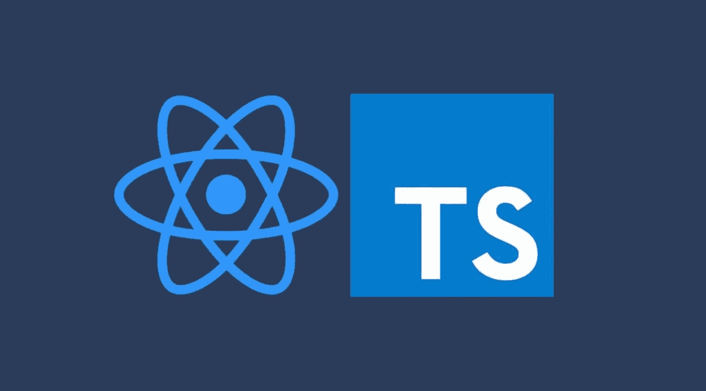

# React 状态符合 Typescript 的联合类型

> 原文：<https://levelup.gitconnected.com/react-state-meets-typescripts-union-type-7071f9451c61>

## 充分利用 Typescript 最被低估的特性



如果您不熟悉它，联合类型是我们用来描述“几种不同类型之一”的值的基本类型脚本工具。

```
type CarOrBus = Bus | Car
```

事实证明，这个工具对于反应状态有一些特别有用的应用。**知道如何以及何时使用联合类型来描述你的组件状态将使你写更少的代码，更少的错误。**那么我的确切意思是什么？

让我们先来看看我们正在构建的电影应用程序中搜索组件的一些示例源代码。在任何给定的时间点，该组件应该是:

1.  ⏳装载-显示装载指示器
2.  ✅完成-显示搜索结果
3.  🚨错误-显示搜索错误

让我们看一下代码。👇

当用户在之前遇到错误后返回成功的搜索结果时会发生什么？

```
{searchResults && <MovieList movies={searchResults} />}{isLoading && <LoadingIndicator />}{error && <ErrorMessageUI message={error.message} />}
```

我们的应用程序在这里可能会遇到很多不好的视图状态。你可以在错误信息上方显示加载信息，也可以在错误信息上方显示搜索结果。从技术上讲，你可以同时展示这三个元素。**我们如何确保一次只显示这些视图状态中的一个？**

一种方法是改变我们的渲染逻辑，强制一次只渲染其中一个元素。

```
let content: *ReactElement* = null**if** (errorMessage) {
  content = <*MovieList* *movies*={searchResults} />
} **else if** (isLoading) {
  content = <*LoadingIndicator* />
} **else if** (searchResults != null) {
  content = <*ErrorMessageUI* *message*={error.message} *onClose*={() =>   setError(undefined)} />
}return (
  <div>
    <input
      *value*={searchTerm}
      *onChange*={*e* => setSearchTerm(*e*.target.value)}
    />
    {content}
  </div>
)
```

虽然添加这种呈现逻辑可以保证我们一次只显示这些元素中的一个，但是它也有自己的问题。这个逻辑为我们的状态变量提供了一个严格的层次结构，当我们在`useEffect`钩子中更新状态设置逻辑时，我们必须牢记这一点。我们本质上是把“什么时候显示”的逻辑分成两个独立的部分，相信我——这很快就会让人毛骨悚然。此外，我们失去了很多可读性。

那么还有什么选择呢？如果我们尽可能简单地保持渲染逻辑，而是小心地更新我们的`useEffect`钩子以确保⏳装载，✅完成，和🚨错误视图状态是互斥的。

```
useEffect(() => { // 1\. Loading state
  setIsLoading(true)
  setError(undefined)
  setSearchResults(undefined) searchForMovies(searchTerm).then(data => { // Success results state
    setSearchResults(data)
    setError(undefined)
    setIsLoading(false)
  })
  .catch((error: Error) => { // Error state
    setError(error)
    setSearchResults(undefined)
    setIsLoading(false)
  })
}, [searchTerm])
```

我们走吧。现在我们显式地设置所有那些同时影响视图状态的状态值。通过查看这里的代码，我们可以手动验证所有这些状态值的组合将为我们提供有效的视图状态。

*但是*对于一堆总是同时变化的状态值来说，这是一大堆样板文件。在我们的应用程序中有网络请求的地方添加这一点会很麻烦。

好吧，如果他们都在同一时间改变，为什么我们不把他们放在一个单一的状态？💡

```
type **ViewState** = {
  loading: boolean,
  error?: Error,
  searchResults?: Movie[],
}const [viewState, setViewState] = useState<**ViewState**>({ loading: true })
```

这是所有这些看起来的样子:

状态为带有可选键的字典

嗯，这是一个进步，更容易阅读！此外，由于视图状态的整体被封装在这个`ViewState`类型中，我们可以省略想要“取消设置”的键，这很方便。

所以这要干净得多，但是我们仍然在自己的校对中随心所欲，如果我们不小心，我们仍然可以用无效的值组合来更新我们的视图状态。

```
setViewState({ isLoading: false, searchResults: movies })// 👆 Bad view state, should not be loading and showing results
// at the same time
```

如果我们可以利用 typescript 编译器向我们的 typescript `ViewState`类型添加约束，并防止我们设置无效的视图状态组合，会怎么样？？

## **输入联合类型**

所以我前面提到过，联合类型允许我们定义一个“几种不同类型之一”的类型。

这里有一个非常简单的例子来说明我们如何定义类型`string`或`undefined`。

```
let a: **string | undefined** = undefined
```

但是不仅仅是像`string`和`number`这样的基本类型，你可以从任何其他类型创建一个联合类型:

```
type Foo = { a: string } | { b: string }declare function acceptFoo(foo: Foo): void;acceptFoo({ a: '' }) ✅ acceptFoo({ b: '' }) ✅
```

那么，我们如何使用联合类型来更具体地了解我们的 3 种不同组合(⏳, ✅ ,🚨)我们的`ViewState`属性？让我们回到上一个例子中的 3 个`setState`调用，并为它们创建单独的类型。然后我们可以用一个联合类型将它们组合起来。

```
type *ViewState* = ( *//* ⏳ '*Loading'* *state
  { loading: true, searchResults?: undefined, error?: undefined } |* // ✅ '*Done'* *state
*  { loading: false, searchResults: Movie[], error?: undefined } | *//* 🚨 '*Error'* *state
*  { loading: false, searchResults?: undefined, error: Error }
)
```

我们的新`ViewState`定义现在说我们的`viewState`变量必须匹配这些特定类型之一。看看现在会发生什么，当我们像以前一样试图用无效的属性组合调用`setViewState`时:

```
// 👇 Attempting to set bad view state 👇setViewState({ loading: true, error: error })// ❌ TS Error: Type 'true' is not assignable to type 'false'
```

我们的`setViewState`函数需要一个类型为`ViewState`的参数——我们新的联合类型。我们传递的对象文字的类型`{ loading: true, error: Error }`与联合类型的任何成员都不匹配，所以 **Typescript 引发了一个错误，并阻止我们编写会使我们进入那些糟糕的视图状态的代码！**

非常漂亮——我们成功地防止了组件状态的错误，让 TypeScript 而不是我们的用户来捕捉这些潜在的错误！但是我们可以做更多的事情。

## 类型缩小👉 👈

为了说明下一个 Typescript 特性，让我们介绍另一个产品需求。我们需要向我们的`LoadingIndicator`组件传递一个`loadingSince`属性，以显示搜索已经加载了多长时间。下面是该组件的更新函数签名:

```
declare function *LoadingIndicator(
  props: { loadingSince: Date }
): JSX.Element*
```

因此，让我们将`loadingSince`属性添加到我们的`ViewState`类型中。但是，嗯——我们真的只需要当我们在⏳加载状态。那么，如果我们只把那个键添加到⏳在我们的联合中加载状态类型？

```
type *ViewState* = ( *//* ⏳ '*Loading'* *state
  {
    loading: true,
    searchResults?: undefined,
    error?: undefined,* **loadingSince?: Date**
  *} |* // ✅ '*Done'* *state
*  { loading: false, searchResults: Movie[], error?: undefined } | *//* 🚨 '*Error'* *state
*  { loading: false, searchResults?: undefined, error: Error }
)
```

现在我们又遇到了一个打字错误。怎么回事？

```
{viewState.loading && viewState.loadingSince != null && (
  <*LoadingIndicator loadingSince={*viewState.loadingSince*}* />
  👆 ❌ Property 'loadingSince' does not exist on type 'ViewState'
)}
```

Typescript 似乎根本不认为这个属性`loadingSince`存在于我们的变量`viewState`上。为什么？

我们已经告诉 Typescript，`loadingSince`属性只存在于我们的联合类型的一个成员上。假设 typescript 编译器不知道我们的`viewState`变量是否匹配我们的⏳装载，✅成功或🚨错误类型，Typescript 只能让我们访问保证存在于该类型上的属性，这些属性存在于联合中的每个类型上。

那么我们如何访问 union 类型的单个成员的属性呢？

我们所要做的就是告诉 Typescript 哪个特定的联合成员类型(⏳、✅或🚨)我们正在处理。我们可以通过编写“缩小”类型的条件代码路径(控制流)来做到这一点。下面是一些简单的例子来说明“类型收缩”在 Typescript 中是如何工作的。

```
function multiplyByTwo(*value*: *number* | *undefined*) {
  if (*value* != null) {
    // ️️❗️ *value* has been narrowed to type `number` here
    return *value* * 2.0 
  } else {
    // ❗️ *value* has been narrowed to type `*undefined*` here
    return null
  }
}function callFunctionIfPossible(*func*: (() => void) | *undefined*) {
  return *func* && (
    // ❗️ *value* has been narrowed to type `() => void` here
    *func()*
  )
}
```

我们如何缩小自定义类型的列表，就像我们的例子中的`ViewState` union？

有许多不同的方法可以做到这一点，但是在我们的例子中，我建议最好的选择是通过在一个共享键下给类型成员一个唯一的标识符来区分它们。那会是什么样子？

```
type *ViewState* = (
  *//* ⏳ '*Loading'* *state* { **status**: 'loading', loadingSince: Date } | // ✅ '*Done'* *state*
  { **status**: 'done', searchResults: Movie[] } | *//* 🚨 '*Error'* *state*
  { **status**: 'error', error: Error }
)
```

这里需要注意一些其他的变化:

1.  我们从视图状态的类型定义中去掉了所有不必要的键。例如，我们不再需要添加`error?: undefined`到✅的‘完成’状态。只要我们计划在访问键之前缩小类型，我们就不需要在我们的标识符“status”之外有任何共享键。
2.  “正在加载”属性已从所有状态中删除，因为“状态”字段使其变得多余。这在下一个代码示例中更有意义。

现在，如果我们想要访问这些属性，我们只需确保通过事先检查状态字段来缩小类型。这也很好，因为`status`字段也作为类型的标签，使代码更具可读性。

```
{viewState.status === 'loading' && (
  ❗️ viewState type narrowed to ⏳ *Loading* *state here*
  <Loading loadingSince={viewState.loadingSince} />
)}{viewState.status === *'done'* && (
  ❗️ viewState type narrowed to ✅ *Done* *state here* <*MovieList* *movies*={viewState.searchResults} />
)}{viewState.status === *'error'* && (
  ❗️ viewState type narrowed to 🚨 *Error* *state here*
  <*ErrorMessageUI* *error*={viewState.error} />
)}
```

你可能已经注意到，在缩小类型后，我们不再需要检查`viewState.searchResults`和`viewState.error`上的`null`。这可以为我们节省许多不必要的检查，当我们在 union 类型的给定成员上有许多关联值时尤其有用！🎉

这是它的整体外观:

状态为联合类型，带有用于类型缩小的标识键

对于 Typescript 联合，还有很多需要探索的地方。实际上你会注意到很多库使用了联合类型和类型收缩，包括 [react-async](https://github.com/async-library/react-async) 和 [redux](https://github.com/reduxjs/redux) 。

目前就这些。希望这有所帮助！👋