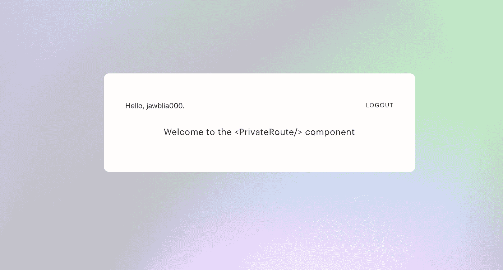
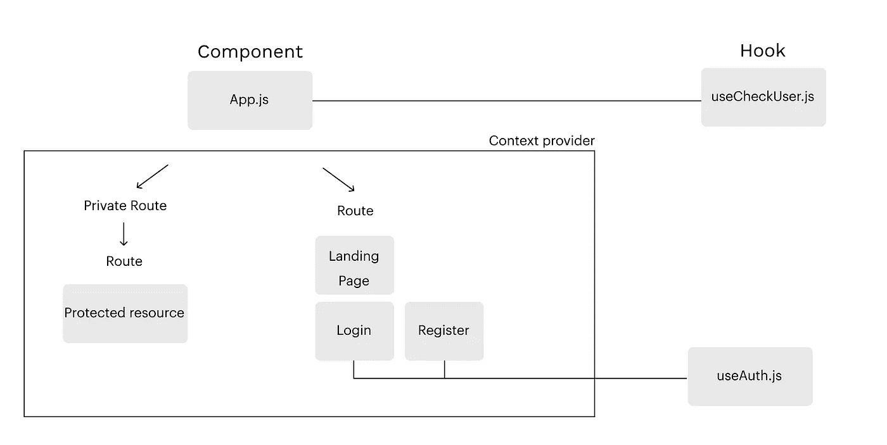
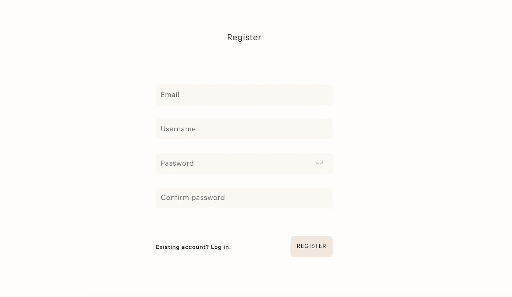
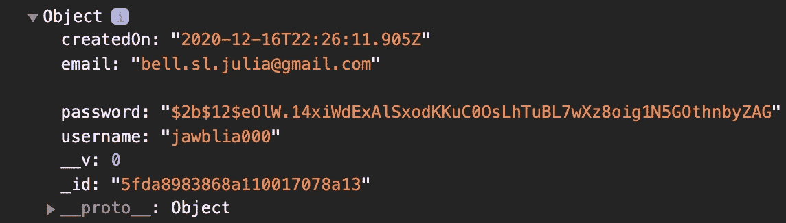
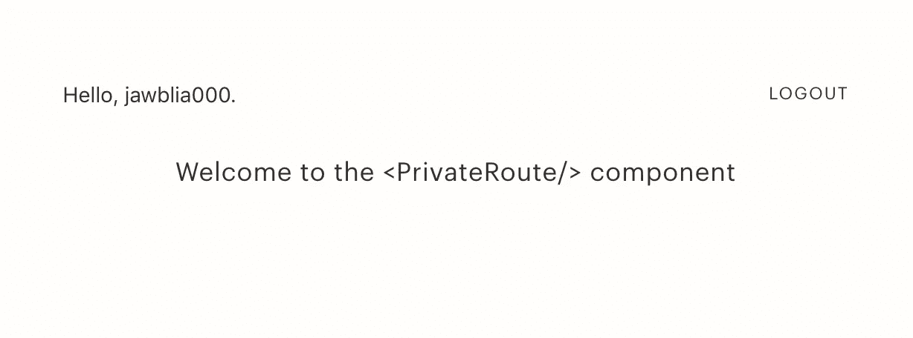

# 使用私有路由和重定向进行 JWT 身份验证的 React 模板

> 原文：<https://levelup.gitconnected.com/react-template-for-jwt-authentication-with-private-routes-and-redirects-f77c488bfb85>



本指南是在 React 与 MERN 应用程序中使用 JWT 身份验证的模板。此代码可以用作模板，并根据需要进行调整，以用于具有 JWT 身份验证的 React 应用程序。完整的代码库是[这里是](https://github.com/jawblia/auth)。

该模板用于将用户数据存储在仅 HTTP 的 cookie(非 localStorage)中，并通过该 cookie 访问用户的 JWT 令牌。我们不能在浏览器中直接读取 cookie，所以我们必须从后端获取 JWT 信息，使用这个配方和 **React 定制钩子、React 前端组件、**和一个**服务器** **调用:**

*   **React 自定义钩子:**前端(客户端)向后端(服务器)发出读取 cookie 的请求。
*   **服务器调用:**后端通过 API 调用读取 cookie，解码 JWT(如果有的话)，并将结果发送给前端。
*   **React frontend 组件:**如果用户被返回，它们被存储在 frontend 的全局上下文中。该上下文允许应用程序引用用户并允许他们访问受保护的路线。如果用户未返回，他们将无法访问受保护的路由。

下图解释了我的 FE 组件如何与我的定制钩子交互:



这个应用程序的后端是一个 **Express 服务器**，数据库是 **MongoDB** 。自定义钩子将处理我的状态(没有状态管理库)。路由由 **React 路由器处理。由 **Axios** 处理的 API 调用。本指南将主要关注前端的 React 部分，不会深入到后端。但是，我将展示我为身份验证制作的 API。如果您只对前端感兴趣，请跳过**认证 API** 部分，转到**步骤 1。****

所有步骤:

1.  **创建上下文来存储用户，**这样他们就可以在整个应用程序中被访问。

2a。 **Cookie 一个用户，并在登录或注册时将他们存储在上下文中**，这样他们的会话将会持续。

2b。创建一个**定制钩子，检查用户到达站点时是否有会话 cookie** 。

3.将用户存储在**全局上下文中。**

4.为认证用户创建**私有路由**。

5.**重定向用户并根据验证状态有条件地呈现组件**。

## **先决条件:认证 API**

我必须使用不同的路由器: **viewRouter** ，用于页面视图上的调用(检查用户是否登录)，以及 **authRouter** ，用于注册、登录和注销。这个在我的 app.js 里。

```
app.use('/', viewRouter);app.use('/auth/', authRouter);
```

**auth router . js**

```
const express = require('express');
const authController = require('./../controllers/authController');
const router = express.Router();router.post('/register', authController.registerUser);
router.post('/login', authController.loginUser);
router.get('/logout', authController.logoutUser);module.exports = router;
```

**> viewRouter.js**

```
const express = require('express');
const authController = require('../controllers/authController');
const router = express.Router();router.get('/user', authController.checkUser);module.exports = router;
```

所有这些逻辑都在我的 authController 组件中处理，它有不同的功能用于**登录、注册、注销、设置令牌和签名令牌。我将把这段代码留在下面，但是其余的样板文件，比如用户模式和错误处理，将放在[代码库中](https://github.com/jawblia/auth)。**

**> authController.js**

```
const User = require('./../models/userModel');
const AppError = require('./../utils/AppError');
const catchAsync = require('./../utils/catchAsync');
const jwt = require('jsonwebtoken');
const { promisify } = require('util');**//sign JWT token for authenticated user** const signToken = id => {
   return jwt.sign({ id }, process.env.JWT_SECRET, {
          expiresIn: process.env.JWT_EXPIRES_IN
   });
} **//create JWT token for authenticated user**
const createUserToken = async(user, code, req, res) => {
    const token = signToken(user._id);
    //set expiry to 1 month
    let d = new Date();
    d.setDate(d.getDate() + 30);

     //first-party cookie settings
    res.cookie('jwt', token, {
       expires: d,
       httpOnly: true,
       secure: req.secure || req.headers['x-forwarded-proto'] ===   'https',
       sameSite: 'none'
    }); //remove user password from output for security
    user.password = undefined;
    res.status(code).json({
       status: 'success',
       token,
       data: {
          user
        }
      });
    }; **//create new user** exports.registerUser = async(req, res, next) => {
     //pass in request data here to create user from user schema
     try {
       const newUser = await User.create({
           username: req.body.username,
           email: req.body.email,
           password: req.body.password,
           passwordConfirm: req.body.passwordConfirm
      }); createUserToken(newUser, 201, req, res); //if user can't be created, throw an error
     } catch(err) {
         next(err);
     }
   };**//log user in**exports.loginUser = catchAsync(async(req, res, next) => {
     const { username, password } = req.body;

     //check if email & password exist
     if (!username || !password) {
     return next(new AppError('Please provide a username and password!', 400));
} //check if user & password are correct
    const user = await User.findOne({ username }).select('+password');
     if (!user || !(await user.correctPassword(password, user.password))) {
     return next(new AppError('Incorrect username or password', 401));
    } createUserToken(user, 200, req, res);});**//check if user is logged in**exports.checkUser = catchAsync(async(req, res, next) => {
    let currentUser; if (req.cookies.jwt) {
       const token = req.cookies.jwt;
       const decoded = await promisify(jwt.verify)(token, process.env.JWT_SECRET);
       currentUser = await User.findById(decoded.id);
   } else {
     currentUser =  null;
  }
   res.status(200).send({ currentUser });
});**//log user out**exports.logoutUser = catchAsync(async (req, res) => {
    res.cookie('jwt', 'loggedout', {
    expires: new Date(Date.now() + 10 * 1000),
    httpOnly: true
}); res.status(200).send('user is logged out');
});
```

这是足够的样板文件——同样，整个服务器可以在[代码库中找到。本指南并没有涵盖*JWT 是如何工作的，但是在底部会有更多的资源。*](https://github.com/jawblia/auth)

# 步骤 1:创建存储用户的上下文。

将用户存储在上下文中允许在整个应用程序中访问他们的数据。

我们需要使用 React 的 createContext 和 useContext 挂钩将该用户存储在应用程序的全局上下文中。首先，我们必须使用 createContext 创建一个上下文实例:

**src >钩子> UserContext.js**

```
import { createContext } from 'react';export const UserContext = createContext(null);
```

这是我们的整个用户上下文。将 UserContext 的初始值设置为 **null** ，因为最初没有用户。*注意:上下文实例是用大写字母命名的(像一个组件)，而不是小写字母(像一个钩子)。我将上下文实例存储在我的 hooks 文件夹中，因为它们的功能类似于钩子。*

# 步骤 2a: Cookie 一个用户，并在登录或注册时将它们存储在上下文中。

当用户登录或注册时，会发生四件事:

1.  他们的浏览器中设置了一个带有 JWT 令牌和一个月预期寿命的 cookie。
2.  浏览器读取用户的 JWT 令牌。
3.  解码的用户是在应用程序的全局上下文中设置的。
4.  新认证的用户被推送到他们的主页。

我们已经有两个不同的组件来处理登录和注册。每个人将使用两个自定义挂钩:1。useForm，它处理表单输入和状态，以及 2。useAuth，它处理身份验证。我们将专注于使用授权。作为一个例子，我将显示注册，但登录的工作方式相同。



这是我的登记表

这是上面页面的代码:

**src >页面> Register.js**

```
import React from 'react';
import { Link } from 'react-router-dom';
import FormInput from './../components/FormInput';
import CTA from './../components/CTA';
import Prompt from './../components/Prompt';
import ConfirmPasswordInput from './../components/ConfirmPasswordInput';
import Error from './../components/Error';
import useForm from './../hooks/useForm';
**import useAuth from './../hooks/useAuth';**export default function Register() {
   const { values, handleChange} = useForm({
        initialValues: {
          email: '',
          username: '',
          password: '',
          passwordConfirm: ''
        }
      });**const { registerUser, error } = useAuth();****const handleRegister = async (e) => {
   e.preventDefault();
   await registerUser(values);
}**return(
   <div className="page" style={{justifyContent:'center'}}>
     <div className="inlineForm">
     <h3>Register</h3>
        <div className="inlineForm__notif">
           {error && <Error error={error.messages}/>}
        </div>
 **<form onSubmit={handleRegister}>** <FormInput type={"text"} 
                    placeholder={"Email"}
                    name={"email"}
                    value={values.email}
                    handleChange={handleChange} />
<FormInput type={"text"} 
                    placeholder={"Username"}
                    name={"username"}
                    value={values.username}
                    handleChange={handleChange} />
         <ConfirmPasswordInput type={"password"} 
                    placeholder={"Password"}
                    name={"password"}
                    value={values.username}
                    handleChange={handleChange} />
       <div className="inlineForm__submit">
         <Link to='/login'>
           <Prompt prompt={"Existing account? Log in."}/>
         </Link>
         <CTA name={"register"} type={"submit"}/>
      </div>
    </form>
   </div>
 </div>
  )
}
```

在提交表单时，在页面中调用一个异步函数来防止默认行为发生(提交时页面刷新),并调用 useAuth 自定义钩子中的两个函数。到目前为止，该挂钩具有以下功能:

**src >挂钩>使用权限**

```
import { useState, useContext } from 'react';
import { useHistory } from 'react-router-dom';
import axios from 'axios';
import { UserContext } from './UserContext';export default function useAuth() {
   let history = useHistory();
   const { setUser } = useContext(UserContext);
   const [error, setError] = useState(null); **//set user in context and push them home**
   const setUserContext = async () => {
   return await axios.get('/user').then(res => {
       setUser(res.data.currentUser);
       history.push('/home');
     }).catch((err) => {
       setError(err.response.data);
   })
  }**//register user
**  const registerUser = async (data) => {
     const { username, email, password, passwordConfirm } = data;
     return axios.post(`auth/register`, {
        username, email, password, passwordConfirm
     }).then(async () => {
         await setUserContext();
     }).catch((err) => {
         setError(err.response.data);
      })
    };return { registerUser,
   error }
}
```

这个钩子用这两个函数做几件事。

*   **register user:**POST 请求由`/auth/register`端点发出，请求体中包含用户数据。用户在用户数据库中创建。他们还用第一方的曲奇饼干烹制，保质期为 30 天。(参见后端功能的先决条件步骤中的 API 代码。)
*   setUserContext :发出 GET 请求，检查是否有会话 cookie。如果存在，从 JWT 返回的用户将存储在上下文中，并使用 React 路由器的 useHistory 钩子将用户推送到`/home`。
*   **错误处理**:如果这些功能无法执行，`catch`模块会设置一条错误信息。有关错误处理的更多信息，请参见[这里的](http://Handling errors in Mongoose/Express for display in React)。

**注意:**可以**将 POST 请求返回的用户设置为存储在上下文中的用户。将它分成两个调用似乎是不必要的:一个是创建用户的 POST，另一个是获取相同用户并存储它们的 GET。然而，当用户通过认证后到达站点时，我们将总是存储来自 GET 请求的用户。**为了获得一致的用户体验，始终存储相同的用户对象很重要，这可以通过这里的 GET 请求来实现。****

**登录过程与登录组件上的注册相同，我们将登录函数添加到 useAuth 钩子中。**

****src >挂钩>使用权限****

```
import { useState, useContext } from 'react';
import { useHistory } from 'react-router-dom';
import axios from 'axios';
import { UserContext } from './UserContext';export default function useAuth() {
   let history = useHistory();
   const { setUser } = useContext(UserContext);
   const [error, setError] = useState(null);//set user in context and push them home
   const setUserContext = async () => {
   return await axios.get('/user').then(res => {
       setUser(res.data.currentUser);
       history.push('/home');
     }).catch((err) => {
       setError(err.response.data);
   })
  }//register user  const registerUser = async (data) => {
     const { username, email, password, passwordConfirm } = data;
     return axios.post(`auth/register`, {
        username, email, password, passwordConfirm
     }).catch((err) => {
         setError(err.response.data);
      })
    };**//login user**
const loginUser = async (data) => {
const { username, password } = data;
     return axios.post(`auth/login`, {
        username, password
     }).then(async () => {
         await setUserContext();
     }).catch((err) => {
         setError(err.response.data);
}return { registerUser,
   **loginUser,**   
   error}
}
```

# **步骤 2b:创建一个**定制钩子来检查用户到达站点时是否有会话 cookie** 。**

**当用户到达一个网站时，他们并不总是登录或注册。大多数情况下，用户的身份验证状态是由他们通过身份验证后创建的*cookie 读取的。如果不能读取用户的 cookie，他们将在每次硬刷新时被注销。因此，应用程序必须*总是*在用户到达站点时检查他们是否已经被认证。这可以通过在首次呈现应用程序时运行 useFindUser()自定义钩子来实现。***

****src >钩子> useFindUser.js****

```
import { useState, useEffect } from 'react';
import axios from 'axios';export default function useFindUser() {
   const [user, setUser] = useState(null);
   const [isLoading, setLoading] = useState(true);useEffect(() => {
   async function findUser() {
     await axios.get('/user')
        .then(res => {
        setUser(res.data.currentUser);
        setLoading(false);
     }). catch(err => {
        setLoading(false);
    });
  } findUser();
}, []);return {
   user,
   isLoading
   }
}
```

**这个调用使用两种状态:当没有用户时，**用户**，设置为空**，在检查用户的调用完成之前，**正在加载，**为真**。这个函数对于认证是最重要的。用户一到达站点， **useEffect** 钩子就会运行它。如果有用户，承诺将被解析，用户将被设置为**用户**状态。如果没有用户，承诺将被拒绝，用户将正确地保持为空。无论哪种方式，isLoading 都将为**假。********

****当进行这个 axios 调用时，后端将在`/user`路由上使用 checkUser()函数来解码并从用户浏览器的 cookie 中读取 JWT 令牌，就像它在登录和注册时所做的那样。****

****现在，让我们调用 useFindUser()自定义钩子，并将返回值存储在应用程序顶层的全局上下文中。在这种情况下(以及大多数情况下)，这是 **App.js** 文件。****

****src > App.js****

```
**const { user, setUser, isLoading } = useFindUser();**
```

****这一行被添加到 App.js 的 return 语句之前。完整的 App.js 代码如下。****

# ****步骤 3:将返回的用户存储在应用程序的全局上下文中。****

****无论用户以何种方式存储在上下文中 useAuth 挂钩或 useFindUser 挂钩——他们的数据都需要在整个应用程序中可访问。我们将整个应用程序包装在上下文**提供者**中，这使得数据对其中的任何组件都可用:****

******src > App.js******

```
**import './App.css';
import { BrowserRouter as Router, Route, Switch } from 'react-router-dom';
**import { UserContext } from './hooks/UserContext';** import Register from './pages/Register';
import Login from './pages/Login';
import Landing from './pages/Landing';
import NotFound from './pages/NotFound';
import useFindUser from './hooks/useFindUser';function App() {const { user, setUser, isLoading } = useFindUser();return (
 <Router>
 **<UserContext.Provider value={{ user, setUser, isLoading }}>**   <Switch>
     <Route exact path="/" component={Landing}/>
     <Route path="/register" component={Register}/>
     <Route path="/login" component={Login}/>
     <Route component={NotFound}/>
  </Switch>
 **</UserContext.Provider>** </Router>
);
}export default App;**
```

****现在可以在上面的任何组件中访问作为 value 属性的数据集。****

****如果是 console.log(用户)，我会在控制台中看到这个对象:****

********

****现在可以像任何典型的对象一样访问它，我可以返回`user.username`或`user.email`来获得单独的属性。****

******注意:**切勿在上下文中存储原始用户密码。散列密码(如我上面所做的)或删除密码字段！****

# ****步骤 4:为经过身份验证的用户创建私有路由组件。****

****在有身份验证的应用程序中，有一些“受保护的路由”，只有那些登录的用户才能访问。为了防止未经身份验证的用户访问某些路由，我们可以创建一个 PrivateRoute 组件来“筛选”用户的身份验证状态并做出相应的响应。****

****如果用户通过了身份验证，他们就可以继续前进到路由，该路由位于 PrivateRoute 组件内部。如果用户没有通过身份验证，我们会通过将他们定向到一个通用的公共路由来处理他们。****

******src>pages>private route . js******

```
**import React, { useContext } from 'react';
import { Route, Redirect } from 'react-router-dom';
import { UserContext } from './../hooks/UserContext';
import Loading from './../components/Loading';export default function PrivateRoute(props) { const { user, isLoading } = useContext(UserContext);
   const { component: Component, ...rest } = props; if(isLoading) {
      return <Loading/>
   } if(user){
      return ( <Route {...rest} render={(props) => 
           (<Component {...props}/>)
            }
         />
       )} //redirect if there is no user 
   return <Redirect to='/login' />
}**
```

****这是 PrivateRoute 组件，当用户试图访问受保护的路由时，用户将被定向到该组件。通过身份验证的用户将看到的 React 组件作为一个属性传递给这个组件。所以如果`Home`组件被保护，它将作为这里的`<Component/>`被传递。****

******注意:**渲染`<Route/>`中的组件很重要，而不仅仅是`return <Component/>`。如果只返回组件，用户将被正确引导，但他们将无法从 React Router 访问属性，如 useHistory、useParams 或 Link 组件的 state。****

****私人路线有三种可能的结果:1 .加载，在这种情况下会显示一个加载屏幕(或者你可以返回`null`如果你不想显示一个加载屏幕)，2。未加载并且找到了用户，在这种情况下，它们被路由到组件，以及 3 .未加载且找不到用户，在这种情况下，他们将被定向到登录页面。****

****向我们的 App.js 添加 PrivateRoute 组件很简单:****

******src > App.js******

```
**import './App.css';
import { BrowserRouter as Router, Route, Switch } from 'react-router-dom';
import { UserContext } from './hooks/UserContext'; **import PrivateRoute from './pages/PrivateRoute';** import Register from './pages/Register';
import Login from './pages/Login';
import Landing from './pages/Landing';
import Home from './pages/Home';
import NotFound from './pages/NotFound';
import useFindUser from './hooks/useFindUser';function App() {const { user, setUser, isLoading } = useFindUser();return (
 <Router>
 <UserContext.Provider value={{ user, setUser, isLoading }}>   <Switch>
     <Route exact path="/" component={Landing}/>
     <Route path="/register" component={Register}/>
     <Route path="/login" component={Login}/>
 **<PrivateRoute path="/home" component={Home}/>**     <Route component={NotFound}/>
  </Switch>
 </UserContext.Provider></Router>
);
}export default App;**
```

****现在，当我向新用户注册时，他们会立即被带到这里:****

********

****只有登录的用户才能访问****

****这个组件是从私人路线返回的家。****

# ****步骤 5:重定向用户并根据身份验证状态有条件地呈现组件。****

*****有些组件是所有用户都可以访问的*、*，但是应该根据认证状态而改变。*这可以通过重定向和条件渲染来处理。****

## ****重定向经过身份验证的用户****

****如果我们有一个未认证用户的公共登录页面，我们可能不希望认证用户看到它。经过身份验证的用户应该被重定向到他们的个性化的私人主页。****

```
**import React, { useContext } from 'react';
import Header from '../sections/Header';
import { Redirect } from 'react-router-dom';
import { UserContext } from '../hooks/UserContext';export default function Landing() {
   const { user } = useContext(UserContext);

 **  if(user) {
      <Redirect to='/home'/>
   }** return (
    <div className="page">
      <Header/>
      <h3>This is the public landing page</h3>
    </div>
  )
}**
```

****如果有用户，他们将立即被重定向到私有的`/home`路径，然后 return 语句会向他们显示通用的公共登录页面。****

## ****条件渲染****

****公共路由和私有路由可能需要相同组件的不同版本。条件呈现的典型用例是一个动作调用按钮:未知用户应该看到一个登录按钮，而已知用户应该看到一个注销按钮。然而，在许多情况下，对于已知用户和未知用户，相同的组件会发生变化。****

****我的应用程序中的一个例子是 Header 组件。如果存储了一个用户，那么标题反映出我已经登录:显示注销按钮而不是登录按钮，并且动态填充我的用户名(从上下文中检索)。****

******src >节> Header.js******

```
**import React, { useContext } from 'react';
import InlineButton from './../components/InlineButton';
import { UserContext } from '../hooks/UserContext';
import useLogout from './../hooks/useLogout';export default function Header() {
   **const { user } = useContext(UserContext);** const { logoutUser } = useLogout();return(
<header>
{**user 
    ?** 
    <>
       Hello, {user.username}
       <InlineButton name={'logout'} handleClick={logoutUser} />
    </>
    **:** 
     <div className='btnGroup'>
        <Link to = "/login">
            <InlineButton name={"login"}/>
       </Link>
       <Link to = "/register">
            <InlineButton name={"register"}/>
       </Link>
    </div>
}
</header>
    )
 }**
```

****这是我的基本 header 组件，它使用一个三元运算符来有条件地呈现两个不同版本的 Header，无论是否有用户。如你所见，当有用户时，我使用`user.username`用我的用户名个性化页面。****

********

# ****结论****

****基本模板就这么多了！认证还有更多的内容，但是我希望这个模板提供一个相当大的基础。如果有人有更优雅的模式，我会感谢任何相关资源。我发现很难找到许多全面的认证指南。总的来说，这里涵盖的内容有:****

*   ****在全局上下文中存储已验证的用户。****
*   ****根据用户的纯 HTTP cookie/JWT 令牌检查用户是否登录。****
*   ****仅为经过身份验证的用户保护路由。****
*   ****根据用户的身份验证状态重定向用户和条件呈现。****

****[项目回购](https://github.com/jawblia/auth)****

******我使用的一些资源&发现很有帮助:******

*   ****[基于令牌的认证及其工作原理。](https://darutk.medium.com/understanding-id-token-5f83f50fa02e)****
*   ****将 JWT 储存在饼干里。****
*   ****[使用上下文挂钩和上下文提供者](https://reactjs.org/docs/hooks-reference.html#usecontext) [文档](https://reactjs.org/docs/hooks-reference.html#usecontext)。****
*   ****Ben Awad 关于从 JWT 检索用户的视频教程。****
*   ****Ben Awad 的[视频教程](https://www.youtube.com/watch?v=lhMKvyLRWo0)关于在全球背景下存储用户。****
*   ****[建立一个私人路线](https://ui.dev/react-router-v5-protected-routes-authentication/)——目前为止我找到的最好的指南，其他的不包括<路线/ >部分。****