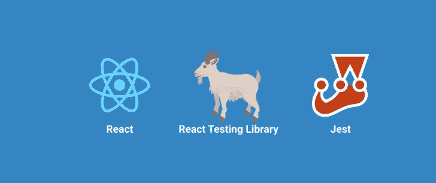

# React 中单元测试的注意事项

> 原文：<https://levelup.gitconnected.com/react-testing-68e64eb9bc87>



单元测试是 React 应用程序开发过程中必不可少的部分。通过为 React 组件编写单元测试，您可以确保组件按预期工作，并在开发过程的早期发现错误。

但并不是 React 组件的所有部分都应该被测试。重要的是将单元测试集中在组件的核心功能上，并避免测试可能随时间而改变的实现细节。

以下是为 React 组件编写单元测试时需要考虑的一些关键事项，以及代码示例:

# 测试组件的核心功能:

这包括测试组件的属性和状态，以及呈现给 DOM 的输出。例如，您可以测试您的组件是否根据其属性和状态呈现了正确的 HTML 元素，以及当属性或状态改变时是否正确地更新了 DOM。

```
// This is an example of a unit test that tests the core
// functionality of a React component using the
// `react-testing-library`

import React from 'react';
import { render, fireEvent } from 'react-testing-library';
import MyComponent from './MyComponent';

describe('MyComponent', () => {
  it('should update the DOM when the props or state change', () => {
    // Render the component
    const { getByTestId } = render(
      <MyComponent
        title="Hello World"
        showTitle={true}
      />
    );

    // Check if the component renders the correct HTML elements
    expect(getByTestId('title')).toHaveTextContent('Hello World');
    expect(getByTestId('title')).toBeVisible();

    // Change the props or state of the component
    render(
      <MyComponent
        title="Goodbye World"
        showTitle={false}
      />
    );

    // Check if the component updates the DOM correctly
    expect(getByTestId('title')).toHaveTextContent('Goodbye World');
    expect(getByTestId('title')).not.toBeVisible();
  });
});
```

# 避免测试实现细节:

重要的是要避免测试可能随时间而改变的实现细节。例如，您不应该测试应用于组件的确切 CSS 样式，或者呈现的 DOM 元素的确切顺序。相反，集中测试组件的整体结构和行为。

```
// This is an example of a unit test that the developer
// should avoid writing, because it tests implementation
// details that are likely to change over time

import React from 'react';
import MyComponent from './MyComponent';

describe('MyComponent', () => {
  it('should apply the correct CSS styles', () => {
    // Create a shallow wrapper for the component
    const wrapper = shallow(
      <MyComponent
        title="Hello World"
        showTitle={true}
      />
    );

    // Check if the component applies the correct CSS styles
    expect(wrapper.find('h1').props().style).toEqual({
      color: 'red',
      fontSize: '24px'
    });
    expect(wrapper.find('p').props().style).toEqual({
      color: 'black',
      fontSize: '18px'
    });
  });
});
```

在这个例子中，单元测试检查应用于组件中的`h1`和`p`元素的 CSS 样式。这是一个可能随时间而改变的实现细节，所以开发人员应该避免编写这个测试。相反，开发人员可以专注于测试组件的整体结构和行为，例如通过使用`toMatchSnapshot`工具或者通过测试组件的属性和状态。

# 为边缘情况和错误条件编写测试

除了测试组件的核心功能，您还应该编写针对边缘情况和错误条件的测试。这可以帮助您捕捉错误，并确保您的组件在异常或意外的情况下正确运行。

```
import React from 'react';
import { render, fireEvent } from '@testing-library/react';
import MyComponent from './MyComponent';

// test that an error is shown when the input is empty
test('shows an error when input is empty', () => {
  const { getByLabelText, getByText } = render(<MyComponent />);
  const input = getByLabelText('Enter your name:');
  fireEvent.change(input, { target: { value: '' } });
  expect(getByText('Please enter a name')).toBeInTheDocument();
});

// test that the component handles special characters in the input
test('handles special characters in the input', () => {
  const { getByLabelText, getByText } = render(<MyComponent />);
  const input = getByLabelText('Enter your name:');
  fireEvent.change(input, { target: { value: 'John Doe!' } });
  expect(getByText('Your name is: John Doe!')).toBeInTheDocument();
});
```

在本例中，第一个测试是检查当输入为空时，是否向用户显示一条错误消息。第二个测试是检查组件能否处理输入中的特殊字符(例如感叹号)并正确显示输入。

# 使用模拟测试您的请求

在 React 测试库中，模拟请求是一个模拟的请求，允许您测试组件如何响应外部 API 调用，而无需实际发出请求。这是很有用的，原因有很多，包括隔离测试中的组件，避免发出真实网络请求的开销。

为了在 React 测试库中创建一个模拟请求，您可以使用一个类似于`jest.mock`的模拟库来创建一个您在组件中使用的 API 客户端的模拟版本。例如，如果您的组件向`fetch` API 发出一个请求，您可以使用`jest.mock`创建一个`fetch`的模拟版本，在被调用时返回一个预先确定的响应。

下面是这种情况的一个例子:

```
import React from 'react';
import { fetchData } from './apiClient';
import { MyComponent } from './MyComponent';

// Mock the `fetchData` function to return a pre-determined response
jest.mock('./apiClient', () => {
  return {
    fetchData: jest.fn().mockResolvedValue('mock response'),
  };
});

it('makes a request to the API and displays the response', async () => {
  // Render the component
  const { getByTestId } = render(<MyComponent />);

  // Wait for the mocked API response to be returned
  await waitForElement(() => getByTestId('api-response'));

  // Assert that the component renders the mocked API response
  expect(getByTestId('api-response')).toHaveTextContent('mock response');
});
```

在这个例子中，我们使用`jest.mock`来创建一个被`MyComponent`使用的`fetchData`函数的模拟版本。这允许我们测试组件的行为，而不需要真正的网络请求。然后我们渲染组件并使用 React 测试库中的`waitForElement`来等待被模仿的 API 响应被返回。最后，我们断言组件正确地显示了模拟的响应。

# 处理时间戳和日期

当测试包含时间戳的组件时，为了确保测试的一致性和可靠性，模拟当前时间是很有用的。在 React 测试库中，您可以使用`jest.spyOn`函数来模拟`Date`构造函数，并控制测试中的当前时间。

下面是这种情况的一个例子:

```
import { MyTimestampComponent } from './MyTimestampComponent';

it('renders the current time', () => {
  // Mock the current time to be a fixed value
  const fixedDate = new Date('2022-12-08T11:01:58.135Z');
  jest.spyOn(global, 'Date').mockImplementation(() => fixedDate);

  // Render the component and assert that it renders the mocked time
  const { getByText } = render(<MyTimestampComponent />);
  expect(getByText('11:01:58')).toBeInTheDocument();
});
```

在这个例子中，我们使用`jest.spyOn`来模拟`Date`构造函数，这允许我们在测试中控制当前时间。然后我们渲染`MyTimestampComponent`并断言它渲染了被嘲笑的时间。这种方法允许我们以一致和可靠的方式测试组件相对于时间戳的行为。