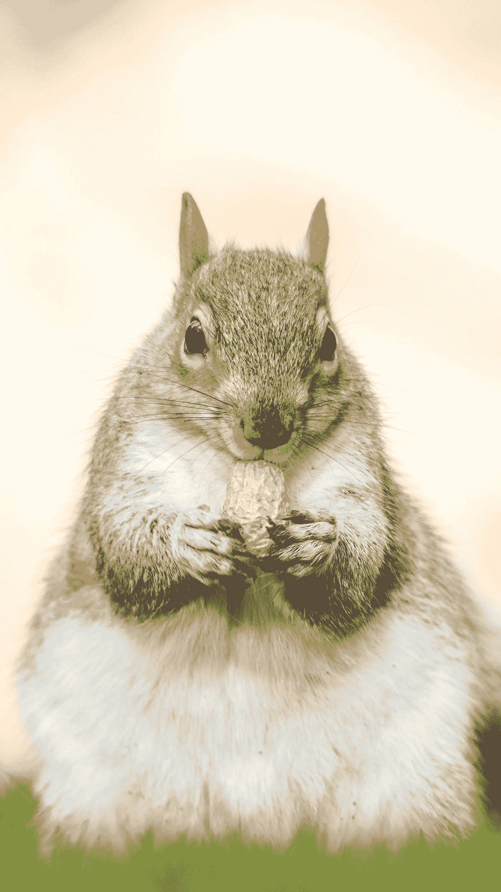

# 反应提示—上下文、悬停和输入字段

> 原文：<https://levelup.gitconnected.com/react-tips-context-hover-and-input-fields-d055534826ab>


Ernesto Bruschi 在 Unsplash[上拍摄的照片](https://unsplash.com?utm_source=medium&utm_medium=referral)

React 是一个用于创建 web 应用程序和移动应用程序的流行库。

在本文中，我们将了解一些编写更好的 React 应用程序的技巧。

# 使用 React 获取输入字段的值

为了用 React 获取输入字段的值，首先，我们将输入值设置为一个状态。

然后我们从状态得到最新的值。

例如，我们可以写:

```
class InputForm extends React.Component {
  constructor(props) {
    super(props);
    this.state = {
      val: ''
    };
  } render() {
    return (
      //...
      <input value={this.state.val} onChange={evt => this.updateInputValue(evt)}/>
      //...
    );
  }, updateInputValue(evt) {
    this.setState({
      val: evt.target.value
    });
  }
});
```

我们创建了`updateInputValue`方法，该方法调用`setState`将输入字段的值设置为`val`状态的值。

然后我们将它传递给`onChange` prop。

`value`道具有我们设定的`this.state.val`。

对于函数组件，我们使用`useState`钩子来设置值并检索它。

例如，我们可以写:

```
import { useState } from 'react';function InputForm() {
  const [val, setVal] = useState('');   return (
    <div>
      <input value={val} onInput={e => setVal(e.target.value)}/>
    </div>
  );
}
```

我们用输入的初始值调用了`useState`函数。

然后我们向`onInput` prop 传递一个函数来运行它，以便在输入内容时将值设置为`val`状态。

然后我们用`val`变量得到最新的输入值。

# 将表单元素状态传递给同级或父元素

对我们来说，在元素之间传递数据的最通用的方法是上下文 APU。

例如，我们可以写:

```
import React, { useState, useContext } from "react";
import ReactDOM from "react-dom";

const Context = React.createContext(null);const initialAppState = {};function App() {
  const [appState, updateAppState] = useState(initialAppState);return (
    <div>
      <Context.Provider value={{ appState, updateAppState }}>
        <Comment />
      </Context.Provider>
    </div>
  );
}function Comment() {
  const { appState, updateAppState } = useContext(Context); function handleCommentChange(e) {
    updateAppState({ ...appState, comment: e.target.value });
  } return (
    <div className="book">
      <input
        type="text"
        value={appState.comment}
        onChange={handleCommentChange}
      />
      <br />
      <div>
        <pre>{JSON.stringify(appState, null, 2)}</pre>
      </div>
    </div>
  );
}
```

我们使用`React.createContext`方法来创建上下文。

然后在`App`中，我们添加了`Context.Provider`，这样所有的子元素都可以访问上下文。

然后我们创建了`Comment`组件，它调用`useContext`钩子来使用我们的`Context`上下文。在组件中，我们有一个输入来改变我们输入的东西的`appState`。这将反映在使用该上下文的所有组件中。

我们可以在输入下面的字符串化 JSON 中看到我们输入的内容。

# 如何在 React 中用内联 CSS 样式实现 a:hover

我们可以监听`mouseenter` 和`mouseleave` 事件来为悬停创建一个效果。

例如，我们可以写:

```
class Foo extends React.Component {
  constructor() {
    this.state = { hover: false };
  } toggleHover(){
    this.setState({ hover: !this.state.hover })
  }, render() {
    let linkStyle;
    if (this.state.hover) {
      linkStyle = { backgroundColor: 'red' }
    } else {
      linkStyle = { backgroundColor: 'green' }
    }
    return(
      <div>
        <a style={linkStyle} onMouseEnter={this.toggleHover} onMouseLeave={this.toggleHover}>Link</a>
      </div>
    )
  }
}
```

我们通过添加一个`a`元素来创建组件，该元素通过向`onMpuseEnter`和`onMouseLeave`道具传递方法来监听`mouseenter`和`mouseleave`事件。

`toggleHover`方法在`true`和`false`之间切换`hover`状态。

然后在`render`方法中，我们根据`hover`状态的真值设置`backgroundColor`属性。

此外，我们可以使用 style-it 库，它允许我们将带有伪类的 CSS 嵌入到 React 组件中。

我们通过运行以下命令来安装它:

```
npm install style-it --save
```

然后我们可以写:

```
import React from 'react';
import Style from 'style-it';class Foo  extends React.Component {
  render() {
    return Style.it(`
      p:hover {
        color: red;
      }
    `,
      <p>hover me</p>
    );
  }
}
```

然后我们使用 style-it 库中的`Style.it`标签来设置元素的悬停状态。

我们也可以使用`Style`组件来做同样的事情。

例如，我们可以写:

```
import React from 'react';
import Style from 'style-it';class Foo extends React.Component {
  render() {
    return (
      <Style>
        {`
          p:hover {
            color: red;
          }
        `}
        <p>hover me</p>
      </Style>
    );
  }
}
```

我们使用`Style`组件并在字符串中嵌入带有 hover 伪类的 CSS。

然后，当我们将鼠标悬停在 p 元素上时，我们会看到颜色发生变化。



[瓦伦丁·彼得科夫](https://unsplash.com/@thefreak1337?utm_source=medium&utm_medium=referral)在 [Unsplash](https://unsplash.com?utm_source=medium&utm_medium=referral) 上拍摄的照片

# 结论

我们可以使用库或普通 JavaScript 来创建悬停效果。

有多种方法可以获取输入字段值并在多个组件之间传递数据。