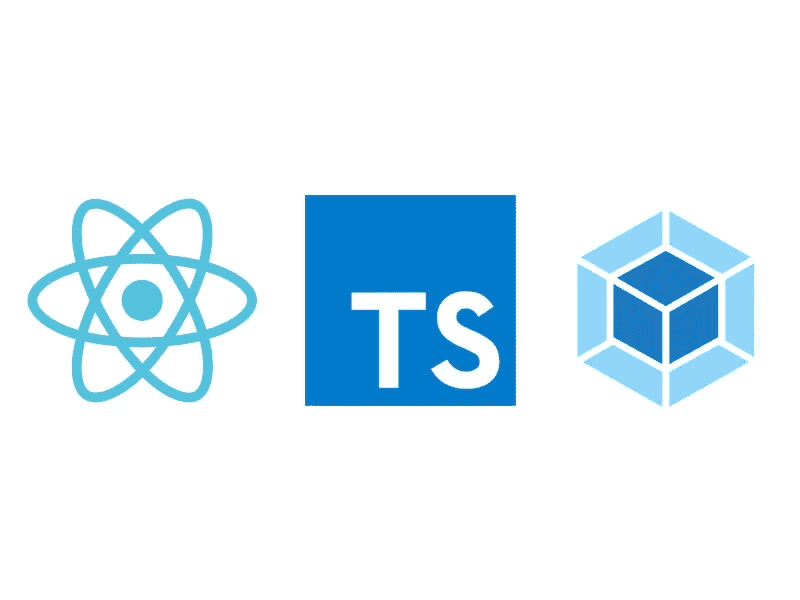

# 用 Webpack 反应和键入脚本

> 原文：<https://levelup.gitconnected.com/react-typescript-with-webpack-2fceebb8faf>



我花了很多时间在 Angular 2 上，喜欢用 Typescirpt。因此，自从我决定学习 React 以来，我发现在没有类型定义、接口、枚举和 Typescript 附带的所有其他好东西的情况下编写“普通”Javascript 很奇怪。我做了一些研究，想出了如何从零开始将 Typescript 合并到 React 项目中，并想在这篇文章中与其他想这样做的人分享我的发现。

我已经写了一篇关于[从 Gulp 到 Webpack](https://medium.com/stratajet-tech/moving-from-gulp-to-webpack-9064b6cf2e08) 的文章，如果你已经读过，你会在这里看到一些东西。如果你还没有读过它，并且想更好地理解 webpack 是如何工作的，我强烈建议你这样做。

# 我们开始吧

下面是这篇文章的视频版本，适合那些喜欢以这种方式学习的人。

> 本教程假设您的机器上安装了 Node 版本 8 或更高版本，您对 React 的工作原理有所了解，并且对终端有所了解。

在你的终端上输入，创建一个名为 **react-typescript** 的文件夹。

```
$ mkdir react-typescript
```

在 react-typescript 中创建一个名为 **src 的文件夹。**然后在你的终端键入；

```
$ touch webpack.config.js index.html$ npm init -y
```

最后一个命令使用默认设置创建了一个 **package.json** 文件/如果需要，欢迎您更改该文件。项目的基本设置到此结束，现在让我们开始编辑文件。

打开您创建的 **webpack.config.js** 文件，并在其中放置一些简单的 webpack 启动代码。

我已经在本文的[中谈到了每件事的作用，但是其中很多都是不言自明的。](https://medium.com/stratajet-tech/moving-from-gulp-to-webpack-9064b6cf2e08)

让我们将一个名为 **index.tsx** 的文件从 **src** 文件夹添加到**条目**中，就像 so’**一样。/src/index.tsx** '。我们还没有创建这个文件，但我们稍后会创建。**。tsx** 扩展是**的打字稿版本。jsx** 同理**。使用 ts** 代替**。但是在本教程中我们不会用到这些。同样在**输出中，**让我们将所有内容放在一个名为 **build** 的文件夹中，该文件夹将使用**路径**导出到项目的根目录，并将所有合并的 js 文件收集到一个 **bundle.js.** 中**

不是让我们在 src 文件夹中创建一个 **index.tsx** 文件并添加这段代码。

你可能习惯于像这样在常规 js 文件中导入 react

```
import React from "react";
```

但是对于 Typescript，您必须将所有(*)作为 React 导入。您粘贴的代码片段是一个非常简单的 React 文件，它只是将单词“Hello”放在一个带有类“**容器”**的 DOM 节点中。让我们在项目根目录下的一个名为【index.html】的文件中创建这个节点。

现在我们需要安装我们引用的所有 NPM。首先让我们安装 react 模块。

```
$ npm i react react-dom
```

然后是作为开发依赖的 webpack 库。

```
$ npm i webpack webpack-dev-server@2.9.7 -D
```

你会注意到我们已经安装了一个特定版本的 webpack-dev-server，因为在 2.10.0 版本中有一个[突破错误](https://github.com/webpack/webpack-dev-server/issues/1259)。如果你正经历着这种情况，当有一个新的版本出现时，我们非常欢迎你去尝试。

好的——我们有一个类型脚本文件，但是 webpack 不知道如何读取它。让我们赋予它这样做的能力。安装**awesome-typescript-loader**作为开发依赖项。

```
$ npm i typescript awesome-typescript-loader -D
```

你可以在这里阅读为什么比使用 [**ts-loader**](https://github.com/TypeStrong/ts-loader) 。通过向模块部分添加规则，相应地编辑 **webpack.config** 文件。

我们快到了。在根目录下创建一个名为 **tsconfig.json** 的文件，它告诉 webpack 在哪里搜索 typescript 文件。

现在我们只需要再安装一些开发依赖项。默认情况下，我们的 React 安装没有关于包中方法类型的信息。我们可以安装包来生成 React 和 React DOM 的类型。

```
$ npm i [@types/react](http://twitter.com/types/react) [@types/react-dom](http://twitter.com/types/react-dom) -D
```

最后需要的编辑是通过用下面这行代码替换脚本中的 test 来更新 **package.json** 文件；

```
"start": "webpack-dev-server"
```

现在，如果你在终端中点击 **npm start** (或者 **yarn start** 如果你有 [Yarn](https://yarnpkg.com/en/) )来启动服务器。导航到 **localhost:8080** ，瞧，你应该在一个 **h1** 标签中看到“Hello”。

就是这样！您有一个基本的 Typescirpt、webpack 和 React 设置。对于一般的 react 项目，您可能希望拥有多个组件文件、用于调试的源代码映射、样式，并且可能希望能够不在索引中硬编码 bundle.js 文件。我们将在本教程的下一部分[中处理这个问题。](https://medium.com/@richbray/react-typescript-with-webpack-part-2-aa02d150c59b)