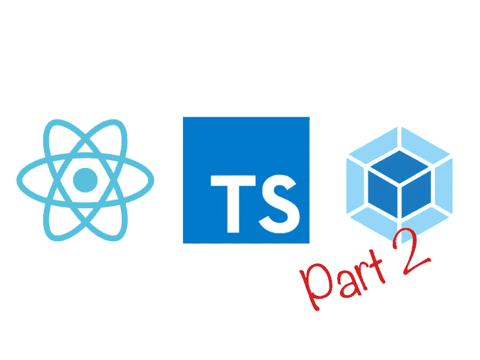
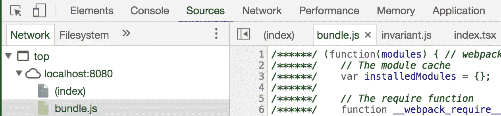
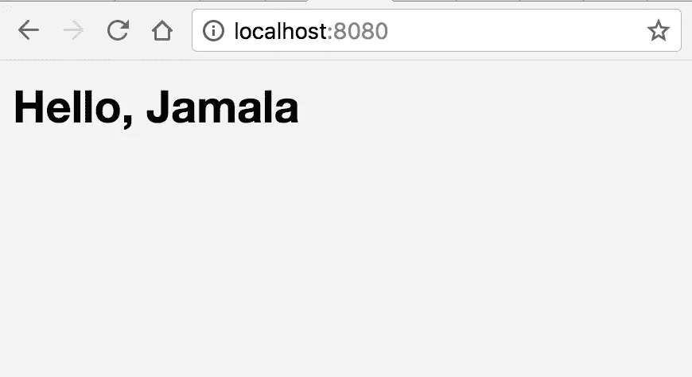

# 使用 Webpack 进行反应和键入脚本(第 2 部分)

> 原文：<https://levelup.gitconnected.com/react-typescript-with-webpack-part-2-aa02d150c59b>



> 正如你从标题中猜到的，这是已经存在的[帖子](https://medium.com/@richbray/react-typescript-with-webpack-2fceebb8faf)的第二部分，我强烈建议你在跳到这里之前先从那篇开始。

这是这篇文章的视频版本。

在上一篇文章中，我们用 React、Typescript 和 Webpack 构建了一个工作项目，但是这里还有一些我们想要改进的地方:

*   从**index.htm**l 文件中移除硬编码的 **bundle.js**
*   为调试代码添加源映射
*   添加多个文件的能力
*   向我们的项目添加 scss 样式的能力。

我们将在这篇文章中逐一解决这些问题。

# 1.移除 bundle.js

在我们的`index.html`文件中硬编码`bundle.js`并不是一件坏事，但是如果你想从`webpack-dev-server`提供的热重新加载中受益或者如果你想改变文件名，你不需要在两个地方这样做。Webpack 可以很容易地解决这个问题。

让我们进入我们的**index.html**文件并删除这一行

```
<script src="/bundle.js"></script>
```

让我们安装一个名为[**html-web pack-plugin**](https://github.com/jantimon/html-webpack-plugin)的 npm 作为开发依赖项。

```
$ npm i html-webpack-plugin -D
```

现在，我们对 webpack 配置文件进行一些更改。在顶部我们有一个`path`的`const`，让我们在它下面添加这一行来使用这个插件。

```
const HtmlWebpackPlugin = require("html-webpack-plugin");
```

现在让我们调用这个插件，把它放在我们文件的**插件**部分。

我们想修改我们的 index.html**文件，所以我们把它作为模板。您的项目应该正常工作，并且您已经清除了一行。**

# 2.源地图

如果你在 Chrome 中打开你的项目，打开开发者控制台，点击“source”标签。您会注意到您不会看到您的`bundle.js`文件，只会看到对调试 Javascript 没有帮助的索引。为了解决这个问题，我们将安装另一个 npm 作为开发依赖项，[**source-map-loader**](https://github.com/webpack-contrib/source-map-loader)。

```
$ npm i source-map-loader -D
```

我们再次需要对我们的 webpack 配置进行一些修改，这次是在我们的`tsx`规则下面的**模块**部分。

这里的**enforce:【pre】**强制该加载程序生效。js 文件放在任何其他加载程序之前。对于这个特定的项目，这并不是真正必要的，因为我们只有一个 js 文件的加载器，但为了以防万一，保留它是一件好事。

我们快到了。现在让我们在插件部分下面添加这一行，让 devtools 知道源代码图。

```
devtool: "source-map"
```

我们在这里使用了**“source-map”**，因为它有利于生产，但是欢迎您在这里查看一下[，看看哪个选项最适合您的需求。](https://webpack.js.org/configuration/devtool/#devtool)

我敢肯定，对于代码行应该放在哪里，这已经开始变得有点混乱了。我有一个[完成的回购](https://github.com/RichardBray/react-webpack-typescript)，这里的[应该是什么样子的](https://github.com/RichardBray/react-webpack-typescript)。如果你陷入困境，把它作为一种资源。

完成后，你应该会在检查器的源代码部分看到更多的文件可以浏览，不仅仅是在左侧，在顶部你会注意到更多不同文件的标签。



# 3.添加组件

到目前为止，这个项目看起来不错，但是它并不能代表一个普通的 react 项目。首先，没有组件。所以让我们继续创建一个。

在`src`中创建一个**组件**文件夹，并创建一个名为 **App.tsx 的文件。**将下面的代码添加到这个文件中。

我们被强烈建议不要使用`any`作为在 Stratajet 中工作的类型，因为它违背了使用 Typescript 的目的，因为它与使用普通的 Javascript 是一样的，所以让我们来解决这个问题。`React.Component`里的第一种是给`props`的，第二种是给`state`的。因为我们将名称作为`props`传递，所以让我们在文件的底部为它创建一个接口。

```
interface IProps { name: string; }
```

以大写的 **I** 开始一个接口名称是一个常见的约定，因此得名`IProps` **。我们可以用`IProps`代替第一个`any`。至于第二个`any`，我们没有从状态中传递任何东西，所以我们可以用一个空对象创建另一个接口，**

```
interface IState {}
```

然而，也没有必要，因为 Typescript 只允许我们在适当的位置放置一个空的对象，所以您为 **App.tsx** 创建的第 3 行应该是这样的。

```
export class App extends React.Component<IProps, {}> {
```

完美！现在让我们更新我们的 **index.tsx** 文件，以导入 App 组件并将其包含在我们的 DOM 节点中。

你会注意到在第 4 行我们导入了包装在`{}`中的`App`,因为它不是文件的默认导出类或函数。我们可以通过在 **App.tsx** 文件的第 3 行的 export 后添加单词 default 来改变这一点，从而得到类似这样的导入；

```
import App from "./components/App";
```

然而，这不是必须的。另外，我们是从`App`而不是`App.tsx`进口的。我们需要告诉 webpack 我们忽略了那个文件扩展名。因此，让我们将这一行添加到我们的 **webpack config** 文件中，位于我们在 source maps 部分添加的 **devtools** 行下面。

现在，webpack 将假设任何没有扩展名的导入都是**。js** ，**。ts** 或**。tsx** 。运行服务器应该显示 **Hello，Jamala** 。

# 4.添加样式

这一步与其他步骤相似，只是多了几个 npm 模块作为开发依赖项进行安装。

```
$ npm i extract-text-webpack-plugin css-loader sass-loader node-sass -D
```

我将解释我们将使用它们中的每一个做什么。

*   [**extract-text-web pack-plugin**](https://github.com/webpack-contrib/extract-text-webpack-plugin)会把我们所有编译好的 SCSS 拿到 CSS 里，放在一个新文件里，而不是内联。
*   css-loader 将通过解析任何导入和 URL 来加载我们的 css
*   [**sass-loader**](https://github.com/webpack-contrib/sass-loader) 加载我们的 sass 或 SCSS
*   [**node-sass**](https://github.com/sass/node-sass) 编译我们的 SCSS 到 CSS

现在让我们添加一些简单的样式。在 src 中创建一个名为 **styles** 的文件夹，在 styles 中创建一个名为 **style.scss** 的文件(不是我知道的很有创意的名字，但是简单有效)。

现在将以下代码添加到 style.scss 中

太棒了。让我们更新我们的 webpack 配置文件，以便它可以加载样式。将新样式规则添加到源地图加载器下方的**模块**部分。

我添加了一个选项来最小化应该在生产中使用的输出，以获得更好的性能。现在让我们把**extract-text-web pack-plugin**插件添加到我们文件的顶部，就像这样；

```
const ExtractTextPlugin = require("extract-text-webpack-plugin");
```

将这一行添加到`HtmlWebpackPlugin`行下面的插件部分。

```
new ExtractTextPlugin("style.css")
```

同样，如果你迷路了或者发现这令人困惑，检查一下[这个 github repo](https://github.com/RichardBray/react-webpack-typescript/blob/master/webpack.config.js) 中完整项目的 webpack.config.js 文件。

最后，让我们打开 **index.tsx** 文件，将我们的 SCSS 导入到我们的应用程序导入的正下方。

```
import "./styles/style.scss";
```

因为`./src/index.tsx`是我们的 webpack 的主要入口点，所有需要的文件都通过这里被发现以便被读取，所以图像和样式需要通过 js。

让我们停止并启动服务器，然后导航到 **localhost:8080** 。如果一切顺利，您应该会在浏览器中看到这个。



如果不是，谷歌就是你的朋友。或者在这篇文章中添加评论，我会尽快回复。希望这有所帮助。我计划做第 3 部分，包括测试和其他内容，敬请关注。

[](https://levelup.gitconnected.com)[](https://gitconnected.com/learn/typescript) [## 学习 TypeScript -最佳 TypeScript 教程(2019) | gitconnected

### 18 大 TypeScript 教程-免费学习 TypeScript。课程由开发人员提交并投票，从而实现…

gitconnected.com](https://gitconnected.com/learn/typescript) [](https://gitconnected.com/learn/react) [## 学习 React -最佳 React 教程(2019) | gitconnected

### 前 48 名 React 教程。课程由开发人员提交并投票，使您能够找到最佳反应…

gitconnected.com](https://gitconnected.com/learn/react)