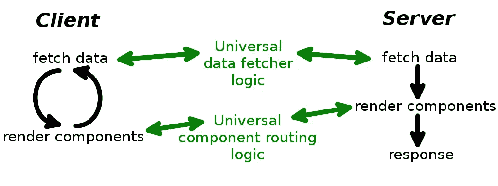

# 反应通用路由

> 原文：<https://levelup.gitconnected.com/react-universal-routing-94215253d9>

## 如何为服务器和客户端设计应用程序路由

## 渲染或不渲染(服务器端)

近年来，JavaScript 世界经历了一场巨大的革命，从在静态站点中实现简单的动态元素，到创建可以在我们的浏览器中运行的大型、引人入胜的应用程序。这一重大变化之所以成为可能，要归功于这些库，它们使得单页面应用程序(SPA)开发在比以前大得多的规模上成为可能。其中一个顶级库是 React，它附带了许多辅助库和实用程序，使 SPA 开发变得轻而易举。

当然，对于用户和开发人员来说，SPAs 比传统的静态方法有很多优势。然而，我们不得不提到一些整个社区都在努力解决的大缺点。容易察觉的两个主要问题是潜在的搜索引擎优化(SEO)劣势和首次在用户浏览器中绘图的时间。这两者结合在一起是因为经典的 SPA 概念假设在获取 JS 文件后，初始 HTML 为空，内容动态初始化。这种最初的内容缺乏让一些机器人(和用户)感到愤怒，并影响我们网站的可见性和最终的满意度。

总而言之，我们同意 SPA 为前端设计和用户体验带来了新的质量，但为了解决缺点并更进一步，我们引入了一个升级的想法— **服务器端呈现(SSR)单页应用程序，它将经典的服务器准备内容与更好的 SPA 用户体验相结合。**SSR 为什么这么重要？让我们说，它给了我们最快的应用程序的第一次打印，然后可以通过获取的 JS 文件一步一步或一次投入使用。它还为 SEO 繁重的项目提供了更可靠的可见性，因为甚至一些搜索供应商可能会正确地索引经典 SPA，但与服务器端呈现的内容相比，它总是有一个缺点，因为它是同步的、无状态的，并且位于 HTTP 的根上。

## 如何构建 SSR/SPA 路线—我们的目标

现在我们知道 SPA 很好，SSR 使它更好，但即使整个想法很简单，我们有正确的工具，也有许多不同的方法来应对一些挑战。**SPA 的关键组件之一是路由，它应该指定我们获取什么数据以及如何呈现它们。**路由的这两个方面对每个前端应用都至关重要。

首先，我们的代码应该是高效的，这样当应用程序增长时，客户机和服务器的实现都不会给我们带来麻烦。我们的实现应该将逻辑放入适当的顺序，并且不参与任何不必要的计算。此外，我们应该尝试创建一个在两种环境下都能很好工作的通用代码。这种解决方案为我们带来了许多优势，包括应用程序逻辑的复杂性更低、一致性更好。

这些都是具体的目标，使得创建新元素和将它们合并到我们的应用程序中变得非常容易和简单。因此，今天的问题是这样的:"**我们应该如何设计应用程序路由，使它对服务器端和客户端都简单明了？**”。

## 经典 SPA —获取数据客户端

首先，让我们回顾一下为组件提供数据的最自然的方式。假设我们有一些 REST API——提供数据的端点。我们可以呈现组件，在它的生命周期方法中(通常在挂载之后)，我们可以调用获取数据的动作，并将其保存在全局存储或组件的状态中，无论我们喜欢什么。

对于我们是应该在每个需要数据的组件中检索数据，还是在某个视图组件中获取数据，以获得其子组件所需的一切，有不同的看法。无论我们选择什么，**在组件中获取数据是一种自然而直接的方式，尤其是对于较小的项目，这种方式非常有效。**

当我们决定在组件中获取数据时，剩下的唯一事情就是使用表示路由，这是一种将请求的路径名转换成我们应该显示的视图(组件)的映射。这可以使用 ReactRouter 或任何其他允许我们基于组件结构创建路由的实现来轻松实现。然后，每个组件可以为自己或其子组件获取所需的数据，这正是许多经典 SPA 项目的操作方式。

## SSR 应用程序—获取服务器端数据

有可能使用基于组件的抓取来获取服务器端的数据吗？事情是这样的，获得这一切需要等待异步操作，然后以最终状态呈现组件。当我们想象组件树中的每个组件都可以在任何时间点获取某些东西时，我们看到不可能找到一个等待的事件，在此之后我们可以开始最终的渲染。我们可以尝试不同的方法来限制我们的组件的行为，例如，只在安装或准备特定的动作后获取，静态方法或其他函数只适合获取数据。尽管这可能行得通，但它极大地降低了我们从组件内部获取数据的自由度。

关于效率的另一件事是，我们应该只渲染组件树一次，以确保我们花时间明智地准备响应，而不是浪费时间试图模拟浏览器环境。结论很简单— **我们的数据应该在接触组件树之前就准备好了。**

试图在服务器环境中以客户端方式获取数据是一条死路，所以让我们回到服务器端渲染的基础上来。我们有许多例子，从简单的库开始，到为 HTTP 响应提供完全呈现的页面的整体框架结束。这些解决方案遍布编程世界，有许多不同的语言版本。这些解决方案的共同点是处理路由、获取数据和将整个页面发送回浏览器的顺序。该序列是等待异步位的同步逻辑。它从分析路由开始—映射路径名。然后，它负责准备所有需要的数据，一些是从数据库请求的，另一些是计算的。然后，将准备好的数据提供给响应模板，该模板用提供的数据填充每个变量和每个缺口。最后，浏览器接收 HTML 作为这个过程的结果。



应用流程(黑色箭头)和实施(绿色箭头)

## 双路由的服务器实现

服务器方法非常简单，许多程序员都熟悉它，所以让我们试着在等式中加入一些反应，看看我们最终会得到什么。我们使用 ReactRouter 和 Redux 库来帮助我们实现。这个想法很简单。首先，我们应用定义请求路径的路由(视图)。然后根据这个路径，我们应该触发动作并获取视图需要的所有东西。最后，我们收集数据并把它们提供给我们的组件树，渲染成字符串并准备最终的响应。

为了实现这一点并保持灵活性，我们需要两个路由，所以下面是一个服务器实现的例子。**请注意这里有两个基于路径的动作:第一个是数据获取，第二个是组件渲染。**我们的逻辑表现出每个高效服务器应有的行为。

```
**import** * **as** express **from** "express";
**import** * **as** React **from** "react";
**import** * **as** ReactDOM **from** "react-dom/server";
**import** {createStore, applyMiddleware} **from** "redux";
**import** {Provider} **from** "react-redux";
**import** thunk **from** "redux-thunk";
**import** {StaticRouter} **from** "react-router";**import** reducer **from** "./reducer";
**import** appPathDataFetcher **from** "./data-fetcher";
**import** AppLayout **from** "./components/AppLayout";
**import** renderFullHtml **from** "./utils/render-full-html";**const** app = express();
app.use(routeServerApp);
app.listen(3000);**async function** routeServerApp(req, res) {

    // prepare store before fetching data
    **const** store = createStore(reducer, applyMiddleware(thunk));

    // fetch data logic - first routing
    **const** currentRoute = {pathname: req.path, query: req.query};
    **await** appPathDataFetcher(store.dispatch, currentRoute, **null**);

    // render components with provided data - second routing
    **const** componentHtml = ReactDOM.renderToString(
        <Provider store={store}>
            <StaticRouter location={req.url}>
                <AppLayout/>
            </StaticRouter>
        </Provider>
    ); // prepare and send HTTP response with HTML text
    **const** initialState = store.getState();
    **const** html = renderFullHtml(componentHtml, initialState);
    res.setHeader("Content-Type", "text/html");
    res.status(200).send(html);
}
```

在这段代码中，有两个导入需要特别解释，都是关于我们的双路由方法。第一个实现是`appPathDataFetcher`，它是一个异步动作，为特定的路由(路径)获取数据。第二部分在`AppLayout`中，包含表示路由。我们将在后面看到这两种方法的实现。现在，理解它们是通用的是至关重要的，因此我们可以在这里和下面的客户端示例中使用它们。

## 双向路由的客户端实现

我们知道在组件中获取数据在服务器上是行不通的，此外，让我们想一想为什么我们还要费心将组件呈现与获取数据绑定在一起。这种方法可能会带来一些问题，特别是当我们考虑一个大型应用程序，其中不同的组件获取和使用相同的数据。在本文的开始，我们说明了基于组件的获取是一种简单明了的方法，但是**当我们的目标是通用代码时，我们应该考虑将数据获取从组件中分离出来，就像服务器所做的那样，并提供两个独立的路由，而不是耦合在一起，可能会相互补充。**也许基于服务器的解决方案可以在客户端上很好地工作，并且不会对我们造成不良影响。

目标是使用预先准备好的路由逻辑:首先获取某个视图所需的所有数据，其次使用提供的数据呈现视图。这样，我们将数据逻辑与表示逻辑分离开来，这对我们的解决方案至关重要。让我们从表示逻辑的客户端实现开始。

```
**import** * **as** React **from** "react";
**import** * **as** ReactDOM **from** "react-dom";
**import** {createStore, applyMiddleware} **from** "redux";
**import** {Provider} **from** "react-redux";
**import** thunk **from** "redux-thunk";
**import** {BrowserRouter} **from** "react-router-dom";**import** reducer **from** "./reducer";
**import** AppLayout **from** "./components/AppLayout";**const** store = createStore(reducer, applyMiddleware(thunk));// we hydrate already rendered server-side content
ReactDOM.hydrate(
    <Provider store={store}>
        <BrowserRouter>
            <AppLayout/>
        </BrowserRouter>
    </Provider>,
    document.getElementById("root")
);
```

包含表示路由的组件与我们在服务器实现中使用的组件相同。这很好，因为每当我们需要对主要的表示逻辑进行更改时，我们只需要在一个地方进行。请注意，我们在这里使用 ReactRouter，并将`AppLayout`包装在`BrowserRouter`中，因为这是客户端实现，所以我们相应地在服务器实现中使用了`StaticRouter`。

现在是时候在客户机环境中使用我们的数据获取逻辑了。

```
**import** * **as** React **from** "react";
**import** {connect} **from** "react-redux";
**import** {withRouter} **from** "react-router";
**import** * **as** qs **from** "query-string";
**import** * **as** *hoistStatics* **from** "hoist-non-react-statics";**import** appPathDataFetcher **from** "./data-fetcher";**export const** routeHandler = InnerComponent => { **class** RouteHandlerC **extends** React.Component { **async** componentDidUpdate(prevProps) {
            const {location, dispatch} = this.props;
            **if** (prevProps.location.key !== location.key) {
                **const** currentRoute = {
                    pathname: location.pathname,
                    query: qs.parse(location.search)
                };
                **const** prevRoute = {
                    pathname: prevProps.location.pathname,
                    query: qs.parse(prevProps.location.search)
                };
                **await** appPathDataFetcher(
                    dispatch,
                    currentRoute,
                    prevRoute
                );
            }
        } render() {
            **return** <InnerComponent {...**this**.props} />;
        }
    } const RouteHandler = withRouter(connect()(RouteHandlerC)); // opinionated HOC return - copy all non-React static methods
    **return** *hoistStatics*(RouteHandler, InnerComponent);
};
```

**装饰器功能** `**routeHandler**` **监视路由中的每一个变化，并相应地使用** `**appPathDataFetcher**` **(与服务器相同)获取数据。**传递当前和以前的路线有助于为操作提供上下文。装饰器应该包装主要的应用程序组件，所以在我们的例子中，我们按照`AppLayout`的定义使用它。

现在是时候展示我们的两个元素的实现了，它们非常适合客户机和服务器。

## 通用表示逻辑

基于组件的路由根据当前路径名呈现正确的视图。**我们只关心应该显示的组件，因为数据获取是一个独立的逻辑。**这种方法使我们能够灵活地为相同的数据定义不同的表示，或者为不同的数据路径使用一种通用的表示。

服务器端是静态的，对于每个请求都是一样的，所以它总是获取一次数据，呈现一次。相反，客户端必须准备好改变路由，多次获取数据并相应地呈现它们。因此，我们需要`routeHandler` decorator 来包装我们的最高应用程序组件，并在每次路由更改时获取数据。这个逻辑对服务器没有任何影响(所以你可以跳过它)，但是对客户机来说是必须的。

这是简化的路由，呈现不同的视图。

```
**import** * **as** React **from** "react";
**import** {Route, Switch} **from** "react-router";**import** {routeHandler} **from** "./route-handler";
**import** {Homepage, ArticleList, ArticleDetail} **from** "./components";const componentRoutes = [
    {path: "/", component: Homepage},
    {path: "/articles/, component: ArticleList},
    {path: "/articles/:articleId(\\d+)/", component: ArticleDetail}
];// we decorate main component with independent data-fetching logic
// routeHandler is crucial for client and has no effect for server**export const** AppLayout = routeHandler(() => {
    **return** (
        <Switch>
            {componentRoutes.map(route => <Route
                key={route.path}
                path={route.path}
                component={route.component}
                exact={route.exact !== **false**}
                strict
            />)}
        </Switch>
    );
});
```

## 通用数据逻辑

让我们回到为我们的应用程序检索数据时的核心`appPathDataFetcher`。**数据提取器最重要的是** `**fetchRoutes**` **—定义地图，定义根据给定的路线触发哪些动作。**该图与我们在表示路由中的图非常相似，不同之处在于，我们在这里寻找要调用的动作，而不是要呈现的组件。

另一个关键区别是，基于组件的路由在单个组件渲染中是平面的，但是我们可以在树的深处组件中嵌入其他路由。因此，我们最终可能会有许多独立的路由，这对表示逻辑来说是一件好事。另一方面，获取逻辑应该只有一个真实的来源，这就是为什么我们的结构应该是嵌套的，这样我们就可以轻松地获取全局应用程序数据以及特定视图的本地数据。

这就是我们的例子`fetchRoutes`可能的样子。

```
import {fetchGlobalAppData} from "./app-actions";
import {fetchHomepageData} from "./homepage-actions";
import {fetchArticleList, fetchArticleDetail} from "./article-actions";
import {mapActions} from "./util-actions"**export const** fetchRoutes = [
    {
        path: "/", exact: **false**,
        fetch: fetchGlobalAppData,
        routes: [
            {
                path: "/",
                fetch: fetchHomepageData
            },
            {
                path: "/articles/",
                fetch: fetchArticleList
            },
            {
                path: "/articles/:articleId(\\d+)/",
                fetch: fetchArticleDetail
            }
        ]
    }
];
```

`appPathDataFetcher`是一种通用的异步逻辑，它将路由路径映射成我们需要调用的动作。具体的实现对于我们的情况并不重要，因为您可以自己实现它，甚至可以根据需要更改路由映射定义。然而，为了示例的完整性，我们在下面给出了建议的实现。

```
**import** {matchPath} **from** "react-router";
import {fetchRoutes} from "./fetch-routes";// main data-fetcher logic based on `fetchRoutes`
**export async function** appPathDataFetcher(
    dispatch, currentRoute, prevRoute) {
    **const** matches = matchFetches(fetchRoutes, current.pathname);
    **let** idx = 0;
    **let** result = **true**;
    **while** (result && idx < matches.length) {
        **const** match = matches[idx++];
        **const** matchRoute = {...current, params: match.params};

        // each action has to be dispatched
        result = **await** dispatch(match.fetch(
            matchRoute, prevRoute, result
        ));
    }
}// finds array of matches, searching deep into routing tree
function matchFetches = (routes, pathname) {
    **let** matches = [];
    **for** (**const** route **of** routes) {
        **const** match = matchPath(pathname, {
            exact: route.exact !== **false**,
            strict: **true**,
            path: route.path
        });
        **if** (match == **null**) { // path does not match
            **continue**;
        }
        // update matches with matched params and actions
        const current = {params: match.params, fetch: route.fetch};
        const deeper = route.routes ?
            matchFetches(route.routes, pathname) : [];
        matches = [current, ...deeper];
        **break**;
    }
    **return** matches;
}
```

## 结论

当我们思考这个问题时，获取数据和呈现视图没有任何共同之处，除了协调它们的行为的更高层次的控制器逻辑。正因为如此，**双路由和分离关注点的想法可能是非常有益的。提供只做一件事却做得很好的逻辑肯定会提高可读性，并且有助于团队中不同成员的合作。当我们和我们的团队一起在更大的项目中工作时，重要的因素是容易推理应用程序逻辑。**

如何构建应用程序路由？这个问题总是有许多不同的和非常合适的答案，但是当我们创建越来越多的前端应用程序，并将它们迁移到服务器环境中时，我们通常需要三思而行，考虑我们面前出现的新需求。最后，当前状态下的 frontend 非常年轻，标准解决方案并不总是设计良好。我们应该明智地选择，评估来自不同语言的固执己见的建议，并在我们的代码中采纳它们。

[](https://gitconnected.com/learn/react) [## 学习 React -最佳 React 教程(2019) | gitconnected

### 排名前 49 的 React 教程-免费学习 React。课程由开发人员提交并投票，使您能够…

gitconnected.com](https://gitconnected.com/learn/react)