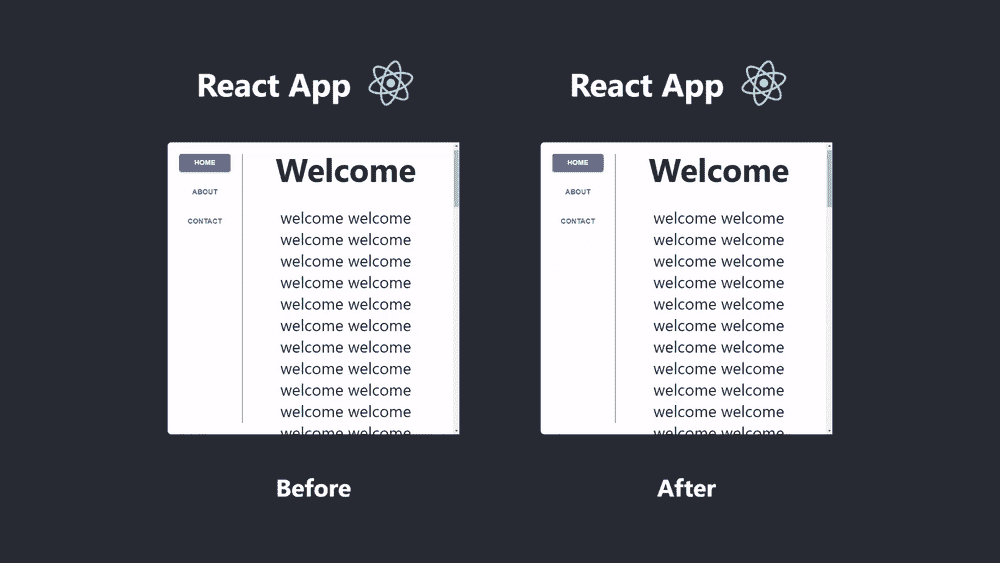
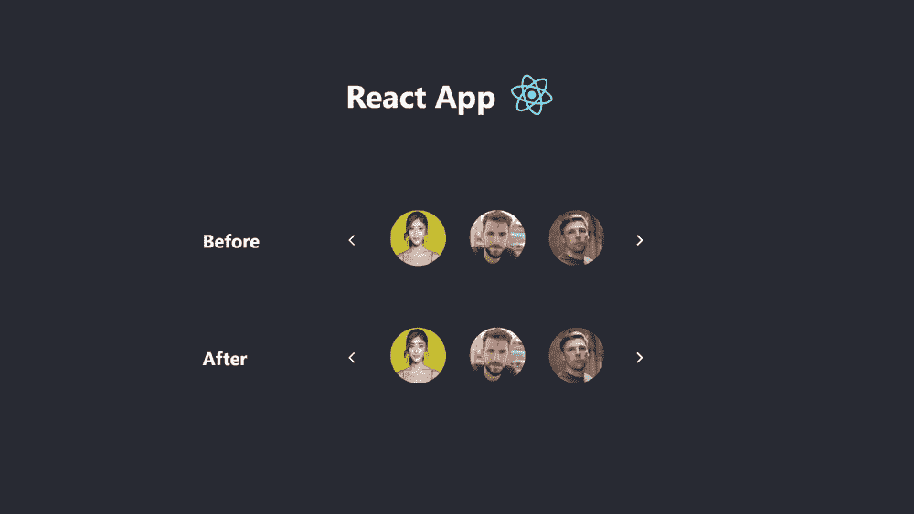
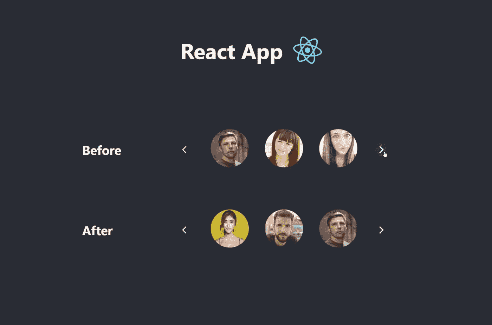
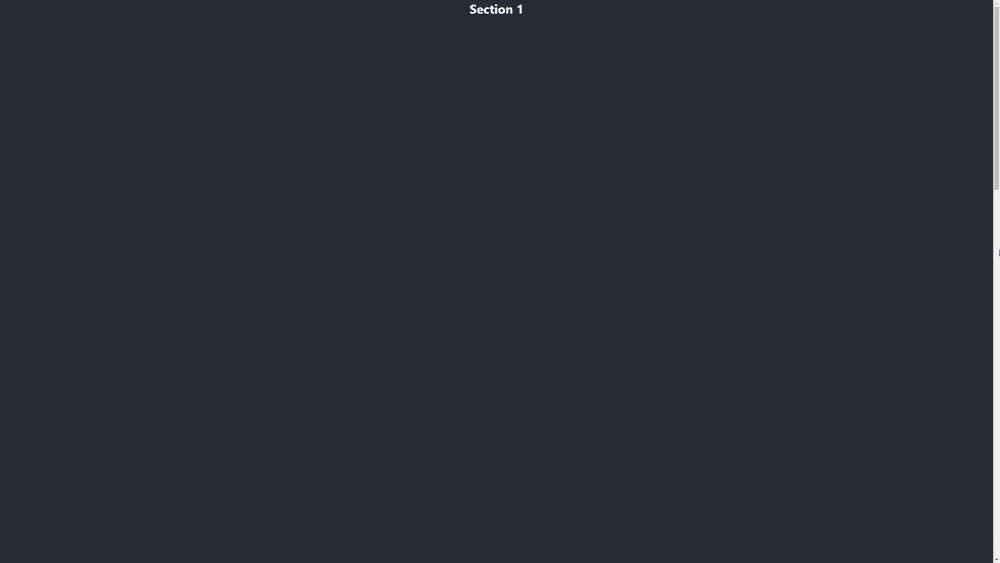
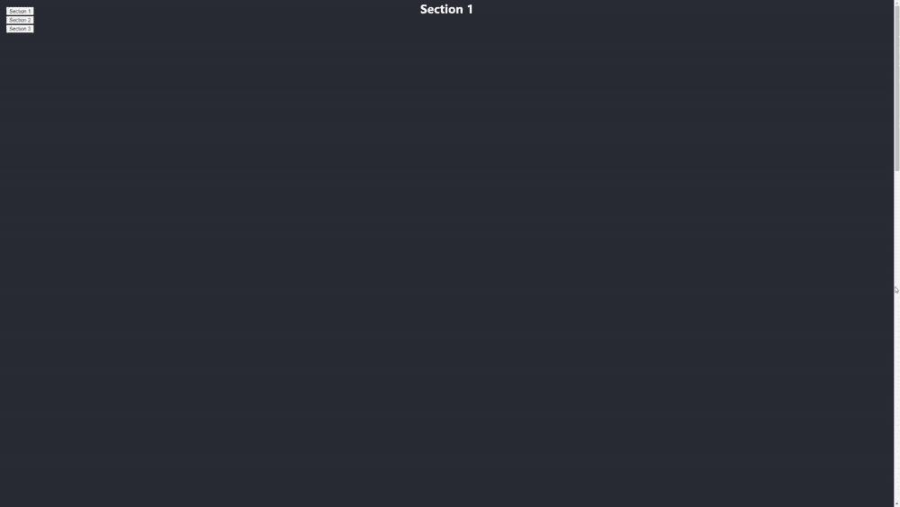

# 反应 UX:掌握卷轴

> 原文：<https://levelup.gitconnected.com/react-ux-master-the-scroll-1bb636995ae4>

## 用 React 钩子漂亮地滚动



## **滚动，这是一个在改善我们的应用程序用户体验时经常被忽视的领域。**

看一下上面的前后。“Before”示例是滚动到一个部分的经典`<a href="#______">`方法。当用户选择侧边栏上的链接时，屏幕会快速跳到所选的部分。我们已经完全失去了我们在页面上的位置，就好像我们在看一个全新的页面。部分之间的任何上下文都会丢失，从而影响用户的体验和控制感。

为了保持该部分的上下文公开，我们可以平滑地从一个部分滚动到另一个部分(我们将很快学会如何做)。看一下“之后”的例子。在这里，我们使用 React 钩子优雅地从一部分滑到另一部分。现在，如果用户点击“联系”，他们将在途中瞥见“关于”部分。通过这样做，用户可以知道他们在页面上的位置，并确保他们在导航时不会错过潜在的有趣的“关于”部分。



看一下上面的例子。两个旋转木马做着完全相同的动作，但是底部的感觉好多了。这是为什么呢？

在“之前”传送带上，用户按下“下一步”按钮，传送带跳转。看起来他有了一套全新的面孔，但我们实际上只移动了一张面孔。这是由于快速直接跳转到下一个项目，这使得我们看起来像是移动到了人脸的“下一页”。这种旋转木马看起来和感觉都很丑，最终会迷惑用户。

在“After”carousel 上，通过简单地动画化容器上的 scroll 属性，我们可以在选择之间得到一个清晰的过渡。一个真正的旋转木马。



## 我怎样才能跳过转到更友好的钩子滚动方式呢？

让我们一步一步地看看，我们如何在我们的 React 应用程序中实现这项技能(不需要库🎉)

首先，让我们创建一个 react 应用程序:

`npx create-react-app scrolling`

现在导航到`src/App.js`，删除返回函数中的所有内容。App.js 现在应该是这样的:

现在让我们给 div 一些样式并创建三个部分。每个部分将只是一个高度为`100vh`的`<h1>`。

以下是 App.js 目前的样子:

这是我们的应用程序目前的样子:



现在我们必须给每个部分一个标识符。在 React 中，用`ref`标识组件比给 div 一个 id 更合适。然后可以引用这个`ref`来获得关于 div 的细节，在我们的例子中，我们将检索每个`<h1>`的`offsetTop`。

为此，我们将使用`useRef`钩子。很直白。在文件顶部，更改以下导入内容:

`import React from “react”`

收件人:

`import React, { useRef } from “react”`

现在，我们将在 App()函数体中启动三个 refs。

```
function App() {
  const section1Ref = useRef(null)
  const section2Ref = useRef(null)
  const section3Ref = useRef(null)

  return (
  ...
```

然后，我们将 ref 分配给它们对应的部分，这非常简单:

```
<h1 ref={section1Ref}>
```

App.js 现在应该是这样的:

太好了，现在我们已经拥有了滚动功能的一切。在 App()函数的主体中，我们将创建一个滚动函数。它会以一个`ref`为参数，将窗口滚动到当前`ref`的`offsetTop`。
引用的顶部偏移量是指它与其父容器顶部的距离。

```
function App() {
  const section1Ref = useRef(null)
  const section2Ref = useRef(null)
  const section3Ref = useRef(null) const scrollTo = (ref) => {
    window.scroll({
      top: ref.current.offsetTop,
      behavior: "smooth",
    });
  } return (
  ...
```

我们将`behavior`属性设置为`smooth`来获得漂亮的动画过渡。

现在剩下要做的就是触发这个函数并传递给它一个 ref。因此，让我们创建一个有三个按钮的固定 div，当我们单击它时，它会将我们滚动到一个部分。这是一个示例按钮的外观:

```
<button onClick={() => scrollTo(section1Ref)}>Section 1</button>
```

单击时，我们调用 scrollTo 函数并传递给它我们之前声明的`section1Ref`。

就是这样！App.js 现在应该是这样的:

44 行代码之后，您现在已经学会了如何在 React 应用程序中优雅地滚动！

这个应用程序现在看起来像这样:



你可以在我的 Github 上找到最终代码[🎉](https://github.com/deeayeen/medium-scrolling)

# 滚动只是 React UX 技能中的一个工具，如果你想了解更多的策略，这里有一篇很棒的文章可供参考:

[](/master-ux-with-react-in-2020-four-ways-to-upgrade-your-react-app-user-experience-a053b3ffbf59) [## 2020 年 React 掌握 UX:升级 React 应用用户体验的四种方式

### 如果你的应用程序给用户良好的感觉，他们更有可能继续使用它。

levelup.gitconnected.com](/master-ux-with-react-in-2020-four-ways-to-upgrade-your-react-app-user-experience-a053b3ffbf59)