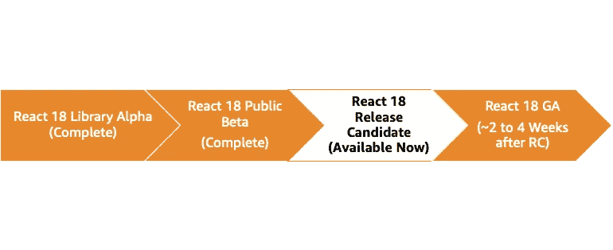
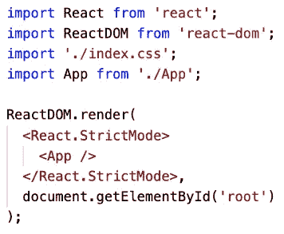
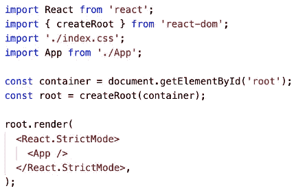

# 反应 v18:你需要知道的

> 原文：<https://levelup.gitconnected.com/react-v18-what-you-need-to-know-fb2079183eac>


照片由[劳塔罗·安德烈亚尼](https://unsplash.com/@lautaroandreani?utm_source=medium&utm_medium=referral)在 [Unsplash](https://unsplash.com?utm_source=medium&utm_medium=referral) 上拍摄

自 2013 年首次开源以来，React.js 已经迅速成为业内[最受欢迎的前端框架](https://insights.stackoverflow.com/survey/2021#section-most-popular-technologies-web-frameworks)。我很幸运在这个时候开始了我的网络开发生涯。任何从一开始就参与其中的人都会知道，它已经有了很大的改进，并继续集成以前需要额外库的功能。在 React.js 最新发布的前夕，我们可以快速看一下会发生什么。

# 时间表

截至 2022 年 2 月，React.js v18 还没有*具体的*发布日期。围绕此次发布的所有交流目前都可以在 [React.js 网站](https://reactjs.org/blog/2021/06/08/the-plan-for-react-18.html)和 Github 工作组上找到。然而，我们知道，与过去的版本相比，我们可以期待组件行为的最小突破性变化。工作组的一句直接引语甚至说:

> *“我们预计许多用户将能够在一个下午内完成升级”*

版本 18 遵循标准软件发布周期模式(*从 Alpha 开始，到正式发布(GA)* 结束)，我们目前正在等待第一个候选发布版本(RC):



React v18 发布时间表

# 新功能

## 数据提取暂停

这个功能，以及服务器端的流/选择性水合，在我看来是 React.js 这个新版本的最大特点，悬念在这个版本之前就已经是 React 的一部分了。它是一个高阶组件，允许你在应用等待异步 API 调用来获取数据时显示一些东西。数据获取的暂挂是一个新特性，允许您使用暂挂来声明性地“等待”其他任何事情，包括延迟加载另一个组件:

```
const ChildComponent = React.lazy(() => import('./Child'));

<Suspense fallback={<Skeleton />}>
  <ChildComponent />
</Suspense>
```

数据获取库可以利用新的 API 来支持数据获取的暂停。预计 Relay，[脸书的 GraphQL 数据提取库](https://relay.dev/)，将是 React v18 上市当天唯一一个完全支持这一功能的。然而，许多数据提取库中都有实验性的支持，尽管实验性的语法可能会改变。

## 服务器端流/选择性水合

术语*“服务器端流”*可能有点令人困惑，因为它与服务器在客户端加载时向客户端发送新的标记块无关。以前，React 会一次水合整个页面。如果一个组件需要更长的时间来加载它的数据，那将会阻塞所有的东西。对于服务器端流，如果您对组件使用暂停，React 将等待合并组件，直到满足加载条件，但可以合并页面的其余部分。

## 过渡

这是 React 18 的另一大特色。有了它，开发人员可以轻松解决频繁更新的问题。 *useTransition* 钩子帮助开发人员轻松识别哪个动作阻塞了主线程。例如，如果您有一个 *<输入/ >* 元素，您可以同时更新输入的值和搜索结果。如果更关键的更新到来，传递到 *useTransition* 的更新将被标记为非紧急。这将有助于您的应用保持响应，即使在大屏幕更新时也是如此:

```
...const [resource, setResource] = useState(0);const [startTransition, isPending] = useTransition({
  timeoutMs: 3000
});return (
  <>
    <input
      onChange={(e) => {

       /**
        * Wrapping the state update in `startTransition`
        * which is a function returned by `useTransition` 
        */ startTransition(() => {
          const nextUserId = getNextId(e.target.value);
          setResource(fetchProfileData(nextUserId));
        });
      }} /**
       * `isPending` is a boolean returned by the useTransition hook 
       * indicating whether we are waiting for the transition to 
       * finish or not
       */ disabled={isPending}
    />
    <ProfilePage resource={resource} />
  </>
);...
```

## 自动配料

这是当你有几个*使用状态*钩子在一个事件处理程序中更新的时候。在 React v18 中，当进行这种被称为自动批处理的即用型操作时，性能会有所提高。这将消除“半成品”组件的渲染。

```
...const [count, setCount] = useState(0);
const [flag, setFlag] = useState(false);
const handleClick = () => {
  fetchSomething().then(() => {
    setCount(c => c + 1);
    setFlag(f => !f);
  });
};return (
  <div>
    <button onClick={handleClick}>Next</button>
    <h1 style={{ color: flag ? "blue" : "black" }}>
      Count: {count}
    </h1>      
    <h1 style={{ color: flag ? "blue" : "black" }}>
      Flag: {`${flag}`}
    </h1>
  </div>
);...
```

## 根 API

在 React 18 中，将从 *react-dom* 包中部署两个不同的根 API。将会有一个遗留的根 API ( *ReactDOM.render* )和新的 *ReactDOM.createRoot* 。旧的 API 最终会被弃用，它会触发警告。

改变这一点:



传统 API

对此:



新 API

## 新挂钩

*   *useSyncExternalStore* —将替换现有的 useMutableSource (Redux 用户可能永远不会直接使用 useMutableSource 钩子。他们将使用 Redux 提供的钩子，该钩子在内部使用 useMutableSource)
*   *useId* —有助于避免水合不匹配(想想那个关于给数组中的每个组件添加一个键属性的烦人警告)。通常，我会使用像 [uuid](https://www.npmjs.com/package/uuid) 这样的库，但是 React 18 现在已经内置了
*   *useInsertionEffect* —工作方式大致类似于 CSS 库的 useLayoutEffect，它动态生成新规则，并使用 *< style >* 标签将它们插入 DOM。这可能是目前大多数专门为 React 设计的 CSS-in-JS 库。

# 如何立即尝试这些新功能

上面的列表不是所有新特性的完整列表，但这是一个好的开始。要立即开始使用这些功能，您可以看看这个自动批处理演示:

[](https://github.com/beatleboy501/react-18-autobatching-demo) [## GitHub-Beatle boy 501/React-18-自动修补-演示:React v18 自动修补演示

### 示例用例是当您在单个事件处理程序中有几个 useState 挂钩要更新时。在 React 18 中将会有…

github.com](https://github.com/beatleboy501/react-18-autobatching-demo) 

要使用新的 [create-react-app](https://create-react-app.dev/docs/getting-started) 安装并试用 Beta 发布包，请使用以下命令:

```
$ npm install react@18.0.0-beta-24dd07bd2-20211208 react-dom@18.0.0-beta-24dd07bd2-20211208
```

# 分级编码

感谢您成为我们社区的一员！更多内容请参见[升级编码出版物](https://levelup.gitconnected.com/)。
跟随:[推特](https://twitter.com/gitconnected)，[领英](https://www.linkedin.com/company/gitconnected)，[通迅](https://newsletter.levelup.dev/)
**升一级正在改造理工大招聘➡️** [**加入我们的人才集体**](https://jobs.levelup.dev/talent/welcome?referral=true)