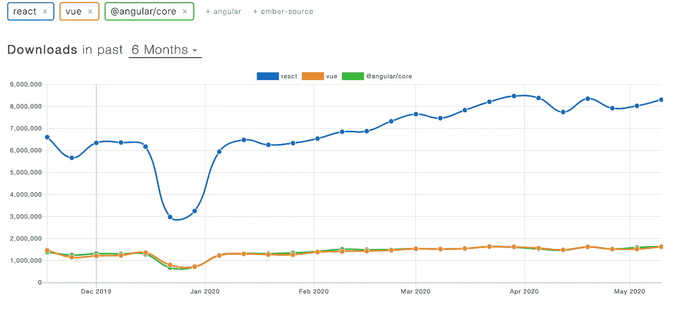

# 对竞争做出反应

> 原文：<https://levelup.gitconnected.com/react-vs-the-competition-d8cbb09baf9a>

React 是一个流行的 Javascript 库，但是它有什么独特之处呢？它与其他常用框架有什么不同？

费伦茨·阿尔马西在 [Unsplash](https://unsplash.com?utm_source=medium&utm_medium=referral) 上的照片

React 是一个流行的、广泛使用的 javascript 库，它可以让您快速原型化 web 布局和单页面应用程序。但是它与其他框架的区别是什么呢？本文将深入探究 React 与其他顶级框架的不同之处。如果你想查看其他顶级框架进行比较，请查看 [Vue](https://medium.com/@aptricou/vue-vs-the-competition-bea57a45a117) 和 [Angular](https://medium.com/@aptricou/angular-vs-the-competition-e02410b4014a) 。

1.  **React 的起源**
2.  **MVC 布局**
3.  **独特的代码结构(JSX)**
4.  **组件生命周期**
5.  **功能性与面向对象的结构**

# **React 的起源**

React 由脸书创建和维护，作为构建用户界面和单页面应用程序的 Javascript 替代方案。React 是 HTML 和 CSS 的独立 javascript 扩展，但是有更多的扩展库可以用来扩展功能和改变您自己的体验。React 还拥有不断扩展的变体，如 React-Native，React 作为桌面应用程序框架，能够与其他前端开发库一起使用，尽管它不能很好地处理直接的 DOM 操作，如 JQuery 或 vanilla Javascript。

React 由 Jason Falke 于 2011 年初创建，并于 2013 年发布。从那时起，驱动其模型-视图-控制器框架的引擎已经升级和扩展，以适应现代前端工具的需求，允许 ECMAscript 更改随时可用，并支持错误处理和测试。

脸书为 React 提供持续的支持，因此您可以确信，在可预见的未来，它仍将是有价值的和广泛可用的。脸书也对普通大众的需求做出了非常积极的响应，产生了 Redux、功能组件、钩子以及新开发人员更容易访问的特性。React 文档让您轻松掌握 React 系统的语法、设计和整体结构。

# **React 的 MVC 布局**

React 有一个模型-视图-控制器设置或 MVC。MVC 是一种方法，通过这种方法，框架可以基于有状态数据和用户交互来构建和更新视图。React 的 MVC 是单向的，这使得更新更快，并防止双向流可能触发的级联更新。

React 的基本状态管理工具被称为 Flux。它将其状态存储在向下流动的树中，这允许它只更新已经改变的树的分支。Flux 为 Redux 铺平了道路，Redux 是 React 的一个扩展包，它是为 React 构建的，但也扩展到了其他框架中。

Redux 允许将数据简化到一个位置，并利用 reducers 将数据存储在不可变对象中。不可变状态的想法对于排除故障和理解模型如何工作非常有用。本文不会深入讨论不可变状态，但是知道 React 使用后台进程来更新状态，并根据这些变化来决定更新哪些组件。

# **React 独特的代码结构**

React 的主要优点之一是它利用 JSX，一种用 Javascript 编写的可扩展标记语言来表示 HTML 的布局。因为它是用 Javascript 编写的，所以您还可以使用 JS 的所有功能来直接构建您的视图。

JSX 需要一些时间来适应，但它也有好处。您可以直接映射组件，使用逻辑运算符，并通过 props 将变量传递给子元素，本质上是直接在 HTML 中使用 Javascript 的强大功能。

React 中的类组件和功能组件

React 使用 babel 将 JSX 编译成原始的 React“创建元素”函数调用。这种允许编写代码的方式导致了对基础代码的一些抽象，但有助于快速原型化和保持简单，使 React 易于掌握。

React 被设计成用 JSX 编写，但这不是必需的。没有编译器的 React 仍然可读，但是更加冗长。见下文。

没有 JSX 的反应

# **React 组件生命周期**

React 使用组件来表示 Javascript 中不同的 HTML 元素。每个组件在创建、更新和销毁的不同阶段都有不同的挂钩。对于其中的每一个，运行特定的函数来定义元素在每个方面如何表现的逻辑。

React 组件生命周期可视化。图片信用特雷赫芬表格级别上升饭桶连接。

与大多数框架一样，React 跟踪其影子 [DOM](https://en.wikipedia.org/wiki/Document_Object_Model) 中的每个组件，并在新数据或动作改变应用结构时相应地更新它们。

组件的安装、更新和卸载是其生命周期的主要部分。挂载通常是从外部资源或应用程序本身调用数据的地方。

当道具改变或状态改变时，更新发生。React 运行一个不同的算法，询问组件是否应该更新。然后，如果通过，更新循环发生，重新呈现组件。

卸载允许取消组件可能拥有的任何订阅，并允许可能需要发生的任何其他数据或状态的清除。

通过在类组件中主动定义这些方法，或者在功能组件中使用钩子，所采取的动作都是可定义和可定制的，这将在下面讨论。

# **功能性与面向对象的结构**

如果让您用 Javascript 创建一个大树，数据自上而下流动，组件根据不同的状态发生变化，您可能会将其建模为一个对象或一系列嵌套的对象。React 提供了另一种选择:功能组件。

React 的开发者是函数式和声明式编程的大力支持者。React 的结构:单向 MVC 流程，自顶向下的状态管理，从一开始就允许功能组件声明，但直到最近才允许状态管理。随着钩子的出现，React 应用程序现在可以完全用功能组件编写。

钩子，比如 useState、useEffect，以及构建在它们之上的定制钩子，有助于涵盖组件生命周期方法、状态管理的情况，也有助于以声明的方式分离关注点。

如上所示，react 组件可以在类语法和函数语法中声明。如果您计划使用 React，您可能希望在整个项目中同时使用这两种类型，所以

由[萨法尔萨法罗夫](https://unsplash.com/@codestorm?utm_source=medium&utm_medium=referral)在 [Unsplash](https://unsplash.com?utm_source=medium&utm_medium=referral) 上拍摄的照片

React 是构建 Web 应用程序的强大框架。虽然它确实有像语法和函数式编程的 JSX 那样的怪癖，但它是一个很好的学习工具，并将在未来几年广泛使用。

NPM 下载只是许多 JS 包指标中的一个，但是它显示了 React 和其他两个主要 JS 库之间的明显差异。React 在开发者和雇主中很受欢迎，并且很容易上手。查看他们的[文档](https://reactjs.org/docs/getting-started.html)以了解更多信息。

[棱角分明的文章](https://medium.com/@aptricou/angular-vs-the-competition-e02410b4014a)

[Vue 文章](https://medium.com/@aptricou/vue-vs-the-competition-bea57a45a117)