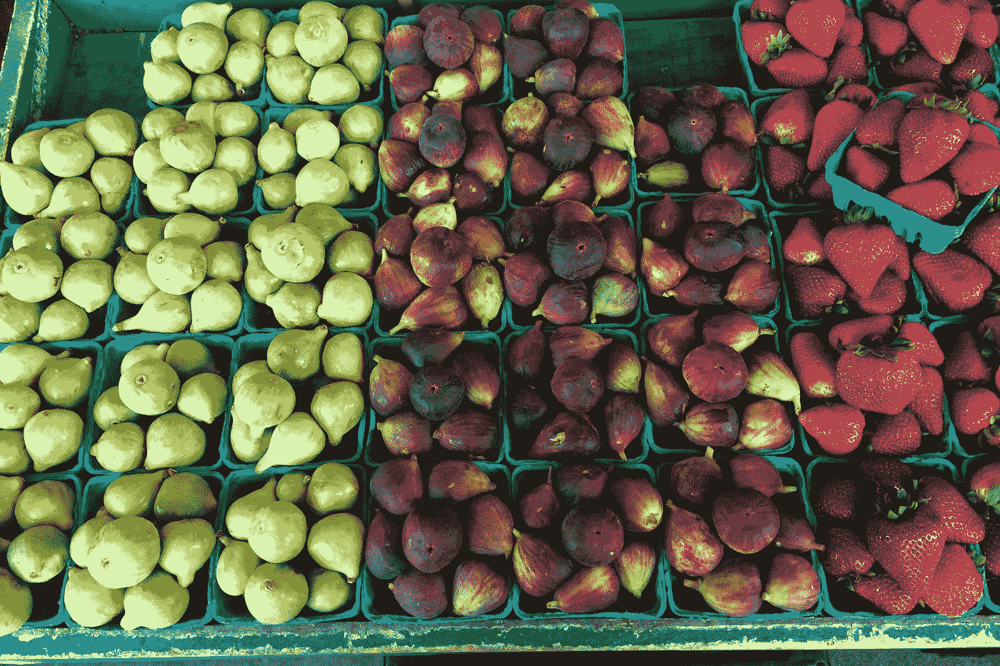

# 反应与 Vue —处理选择

> 原文：<https://levelup.gitconnected.com/react-vs-vue-handling-selections-73d70e7e327b>



由[博迪·皮恩多斯](https://unsplash.com/@bpyndus?utm_source=medium&utm_medium=referral)在 [Unsplash](https://unsplash.com?utm_source=medium&utm_medium=referral) 上拍摄的照片

React 是最近几年最流行的前端库。Vue 是一个前端框架，正在快速追赶。

很难在这两种框架之间做出选择，因为它们各有利弊。

在本文中，我们将比较 React 和 Vue 框架如何处理表单单选按钮和下拉选择，以及哪一个对开发人员来说更容易。

# 单选按钮

使用 Vue，我们可以使用`v-model`指令将单选按钮选项直接绑定到组件的模型。

例如，使用 Vue，我们编写以下代码来添加一组单选按钮，并在屏幕上显示所选的选项:

`index.html`:

```
<!DOCTYPE html>
<html lang="en">
  <head>
    <title>App</title>
    <script src="https://cdn.jsdelivr.net/npm/vue/dist/vue.js"></script>
  </head>
  <body>
    <div id="app">
      <input type="radio" value="One" v-model="picked" />
      <label>One</label>
      <br />
      <input type="radio" value="Two" v-model="picked" />
      <label>Two</label>
      <br />
      <span>Picked: {{ picked }}</span>
    </div>
    <script src="index.js"></script>
  </body>
</html>
```

`index.js`:

```
const app = new Vue({
  el: "#app",
  data: {
    picked: ""
  }
});
```

在上面的代码中，我们只是将两个单选按钮的`v-model`值设置为同一个`picked`型号。

然后，当我们单击任一单选按钮时，我们将看到所选选项显示在 span 中。

使用 React，我们必须为每个单选按钮添加`checked`属性，以便只检查选中的值。

例如，我们编写以下代码，用 React 重写上面的示例:

```
import React, { useState } from "react";export default function App() {
  const [picked, setPicked] = useState("");
  const handleClick = e => setPicked(e.target.value); return (
    <div className="App">
      <input
        type="radio"
        value="One"
        checked={picked === "One"}
        onClick={handleClick}
      />
      <label>One</label>
      <br />
      <input
        type="radio"
        value="Two"
        checked={picked === "Two"}
        onClick={handleClick}
      />
      <label>Two</label>
      <br />
      <span>Picked: {picked}</span>
    </div>
  );
}
```

在上面的代码中，我们有与 Vue 示例中相同的 2 个单选按钮，但是我们添加了一个`onClick`处理程序来设置`picked`状态，并且我们还有一个`checked`属性来指示何时应该检查它们。

我们指出，我们只希望在选取给定值时选择它们。

这是额外的工作，我们不必用 Vue。

# 处理下拉选择

我们可以使用`v-model`用 Vue 直接绑定到下拉列表的选定值。

因此，我们可以编写以下代码来创建一个下拉菜单，然后显示选中的选项:

`index.html`:

```
<!DOCTYPE html>
<html lang="en">
  <head>
    <title>App</title>
    <script src="https://cdn.jsdelivr.net/npm/vue/dist/vue.js"></script>
  </head>
  <body>
    <div id="app">
      <select v-model="picked">
        <option>One</option>
        <option>Two</option>
      </select>
      <br />
      <span>Picked: {{ picked }}</span>
    </div>
    <script src="index.js"></script>
  </body>
</html>
```

`index.js`:

```
const app = new Vue({
  el: "#app",
  data: {
    picked: ""
  }
});
```

在上面的代码中，我们创建了一个下拉菜单，然后将选择的值绑定到 Vue 组件中的`picked`模型。

然后我们引用`picked`来显示在 span 中选择的选项。

如果值和显示的文本相同，我们不必指定值。

使用 React，我们编写以下代码来处理设置下拉列表中的选定值:

```
import React, { useState } from "react";export default function App() {
  const [picked, setPicked] = useState(""); return (
    <div className="App">
      <select onChange={e => setPicked(e.target.value)}>
        <option>One</option>
        <option>Two</option>
      </select>
      <br />
      <span>Picked: {picked}</span>
    </div>
  );
}
```

为了处理 dropdown 值的变化，我们传入一个事件处理程序来将选择的值设置为`picked`状态。

然后我们将它显示在下拉列表下方的 span 中。

在处理下拉列表方面，Vue 和 React 示例非常接近。


照片由 [Jen Theodore](https://unsplash.com/@jentheodore?utm_source=medium&utm_medium=referral) 在 [Unsplash](https://unsplash.com?utm_source=medium&utm_medium=referral) 上拍摄

# 多重选择

使用 Vue，很容易处理 select 元素的值，让用户选择多个值。

我们可以编写以下代码来实现这一点:

`index.html`:

```
<!DOCTYPE html>
<html lang="en">
  <head>
    <title>App</title>
    <script src="https://cdn.jsdelivr.net/npm/vue/dist/vue.js"></script>
  </head>
  <body>
    <div id="app">
      <select v-model="picked" multiple>
        <option>One</option>
        <option>Two</option>
        <option>Three</option>
      </select>
      <br />
      <span>Picked: {{ picked }}</span>
    </div>
    <script src="index.js"></script>
  </body>
</html>
```

`index.js`:

```
const app = new Vue({
  el: "#app",
  data: {
    picked: []
  }
});
```

在上面的代码中，我们有一个带有`multiple` 属性的选择元素来支持多重选择。

然后我们只需用`v-model`绑定到`picked`数组，并直接在模板中引用`picked`数组来显示选中的选项。

使用 React，我们必须编写以下代码来获取所选的选项并显示它们:

```
import React, { useState } from "react";export default function App() {
  const [picked, setPicked] = useState([]); return (
    <div className="App">
      <select
        multiple
        onChange={e =>
          setPicked([...e.target.selectedOptions].map(o => o.value))
        }
      >
        <option>One</option>
        <option>Two</option>
        <option>Three</option>
      </select>
      <br />
      <span>Picked: {picked.join(", ")}</span>
    </div>
  );
}
```

在《准则》中，我们引用了:

```
[...e.target.selectedOptions].map(o => o.value)
```

从 select 元素中获取选中的选项，然后获取每个条目的`value`属性，并将它们放入`picked`数组中。

然后我们通过调用`join`将选项组合成一个字符串来显示`picked`条目。

正如我们所见，为了获得同等的功能，我们必须做很多在 Vue 示例中不需要做的事情。

仅仅是从一个 select 元素中获取选项，让用户选择多个选项，就需要更多的逻辑。

此外，我们必须扩展`e.target.selectedOptions`对象，以便将它转换为一个数组。`e.target.selectedOptions`是类似数组的对象，不是数组。

# 裁决

Vue 在处理单选按钮和让我们选择多个选项的选择元素方面无疑做得更好。

`v-model`指令负责提取所选选项和显示数据的大部分艰苦工作。

使用 React，我们必须编写自己的代码来提取所选的选项并显示它们，这也需要一些工作。