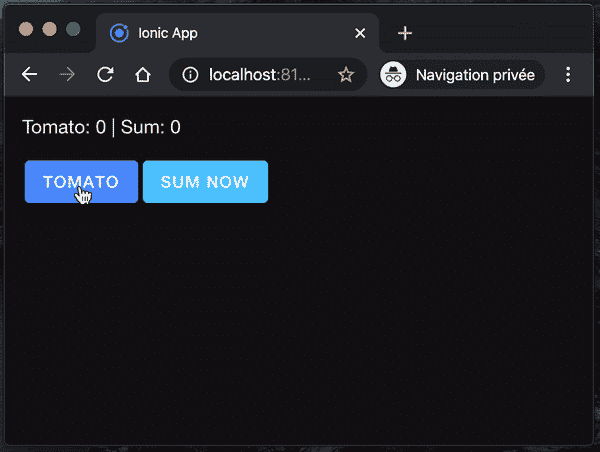
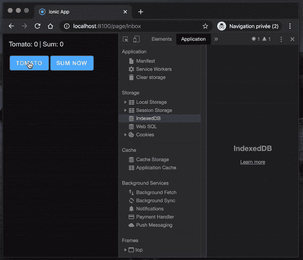
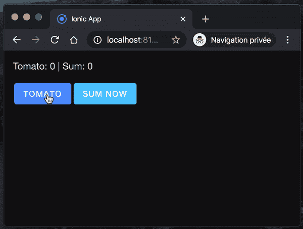

# React、Web Workers 和 IndexedDB

> 原文：<https://levelup.gitconnected.com/react-web-workers-and-indexeddb-a973797e771b>

## 如何在带有 Web Workers 的 React 应用程序中使用 IndexedDB


[帕万·卡万](https://unsplash.com/@pawankawan?utm_source=unsplash&utm_medium=referral&utm_content=creditCopyText)在 [Unsplash](https://unsplash.com/s/photos/free?utm_source=unsplash&utm_medium=referral&utm_content=creditCopyText) 上的照片

我分享[一天一招](https://medium.com/@david.dalbusco/one-trick-a-day-d-34-469a0336a07e)直到原定的 2020 年 4 月 19 日瑞士新冠肺炎隔离期结束。离第一个里程碑还有 10 天。希望更好的日子就在前面。

在本系列的前一篇博文[中，我分享了我让](/react-and-web-workers-c9b60b4b6ae8) [React](https://reactjs.org) 和 [Web Workers](https://developer.mozilla.org/en-US/docs/Web/API/Web_Workers_API/Using_web_workers) 交互的解决方案。这是我在开发[领带追踪器](https://tietracker.app.link/)时尝试的一个小技巧，这是一个简单、开源、免费的时间追踪应用程序⏱。

我希望这种结构和这个应用程序的另一个有趣的特性是使用 [IndexedDB](https://developer.mozilla.org/en-US/docs/Web/API/IndexedDB_API) 在线程中处理数据的想法。

想法很简单:让用户在应用程序端(JavaScript 单线程)输入和修改数据库中的数据，因为这样的操作花费的时间更少，但是为了不阻塞用户界面和交互，要将每一个计算或统计交给 Web 工作者。

这就是为什么我在这篇后续文章中与你分享这个食谱😁。

# idb-keyval

当涉及到第三方库时，我有点挑剔，因为我有点“捆绑恐惧症”，但是当涉及到与索引数据库交互时，我毫不犹豫，来自杰克·阿奇博尔德的 [idb-keyval](https://github.com/jakearchibald/idb-keyval) 是我的首选库。

少于 600 字节，树摇友好，承诺为基础…停在那里，我都在！

因此，在这个解决方案中，我们当然要使用它😉。

```
npm i idb-keyval --save
```

# 用户界面

在之前的帖子中，我们有一个“Tomate 和 Apple 计数器”。我建议我们现在把自己的注意力集中在“番茄”上，并把计数器的总和的计算工作交给网络工作者。

在与 IndexedDB 进行任何交互之前，我们修改后的组件代码如下所示。

```
import {
    IonContent,
    IonPage,
    IonLabel,
    IonButton} from '@ionic/react';
import React, {useEffect, useState} from 'react';
import {RouteComponentProps} from 'react-router';

import './Page.css';

const Page: React.FC<RouteComponentProps<{ name: string; }>> = ({match}) => {

    const [countTomato, setCountTomato] = useState<number>(0);
    const [sumTomato, setSumApple] = useState<number>(0);

    const tomatoWorker: Worker = new Worker('./workers/tomato.js');

    useEffect(() => {
        tomatoWorker.onmessage = ($event: MessageEvent) => {
            if ($event && $event.data) {
                setSumApple($event.data);
            }
        };
    }, [tomatoWorker]);

    function doSumTomato() {
        tomatoWorker
         .postMessage({msg: 'sumTomato'});
    }

    return (
        <IonPage>
            <IonContent className="ion-padding">
                <IonLabel>
                   Tomato: {countTomato} | Sum: {sumTomato}
                </IonLabel>

                <div className="ion-padding-top">
                    <IonButton
                        onClick={() => 
                          setCountTomato(countTomato + 1)}
                        color="primary">Tomato</IonButton>

                    <IonButton
                        onClick={() => doSumTomato()}
                        color="secondary">Sum now!</IonButton>
                </div>
            </IonContent>
        </IonPage>
    );
};

export default Page;
```

当然，由于我们还没有实现 sum 部分，即 Web Worker，它没有做太多工作。



# 用户交互

我们的目标是在 IndexDB 中写一个关于用户交互的数据，这就是为什么为了演示和好玩，我建议我们在每次番茄计数器递增时在数据库中生成一个新条目。为此，我们注册一个新的`useEffect`到`set`条目。

```
import {set} from 'idb-keyval';useEffect(() => {
    incTomato();
}, [countTomato]);

async function incTomato() {
    if (countTomato > 0) {
        await set(`tomato${countTomato}`, countTomato);
    }
}
```

就这样了。每当计数器递增时，效果被触发，并且在扩展中，我们使用 idb-keyval 在数据库中添加一个值。



# 网络工作者

对于本教程，我创建了一个新的工人文件`./public/workers/tomato.js`，它在任何 IndexDB 交互之前看起来如下。

```
self.onmessage = async ($event) => {
    if ($event && $event.data && $event.data.msg === 'sumTomato') {
        const sum = await sumTomato();
        self.postMessage(sum);
    }
};

async function sumTomato() {
    // *TODO sum tomato* return 0;
}
```

我们现在必须访问 IndexedDB 中的数据。为了解决这个问题，我们有两个选择，要么编码一切，要么使用一个库。作为 idb-keyval 的忠实粉丝，我也想在这里使用它。

不幸的是，我们的 Web Workers 是作为资产交付的，因此无法访问我们的包及其依赖项。这就是为什么我们必须在`importScripts`的帮助下在我们的 workers 中执行设置和导入脚本。

我猜一个很好的方法是用 Rollup 或 Webpack 来处理这种依赖性，可能是通过插件，但我不得不说我没有遵循那条路。

这就是为什么我们还有两个选择。链接一个外部脚本或下载它，放在同一个文件夹中并在本地引用它。

如果您希望遵循“本地方式”，您的导入将如下所示:

```
importScripts('./idb-keyval-iife.min.js');
```

或者，正如我们将要做的，下面是我们如何使用 [Unpkg](https://unpkg.com/) 导入它。

```
importScripts('https://unpkg.com/idb-keyval@latest/dist/idb-keyval-iife.min.js');
```

所有设置，我们现在可以享受 idb-keyval，并从我们的 Web Worker 访问 IndexedDB 中的数据。例如，我们可以列出数据库中的`keys()`，迭代这些到`get(key)`它们的值，并计算一个伪和。

```
importScripts('https://unpkg.com/idb-keyval@latest/dist/idb-keyval-iife.min.js');

self.onmessage = async ($event) => {
    if ($event && $event.data && $event.data.msg === 'sumTomato') {
        const sum = await sumTomato();
        self.postMessage(sum);
    }
};

async function sumTomato() {
    const keys = await idbKeyval.keys();

    let sum = 0;
    for (const key of keys) {
        const value = await idbKeyval.get(key);
        sum += value;
    }

    return sum;
}
```

瞧🎉。我们在所有线程中都使用了 IndexedDB😃。



# 摘要

网络太有趣了。

呆在家里，注意安全。

大卫