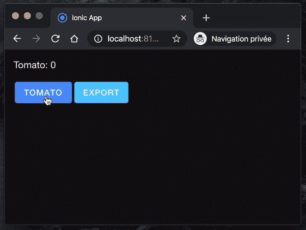

# React，Web Workers，IndexedDB 和 ExcelJS

> 原文：<https://levelup.gitconnected.com/react-web-workers-indexeddb-and-exceljs-2439ff1341ff>

## 如何在 React 应用程序中使用 IndexedDB 数据和 Web Worker 生成 Excel 电子表格


照片由[丹金](https://unsplash.com/@danielcgold?utm_source=unsplash&utm_medium=referral&utm_content=creditCopyText)在 [Unsplash](https://unsplash.com/s/photos/free?utm_source=unsplash&utm_medium=referral&utm_content=creditCopyText) 上拍摄

我每天分享[一招](https://medium.com/@david.dalbusco/one-trick-a-day-d-34-469a0336a07e)直到原定的瑞士新冠肺炎隔离期结束日，2020 年 4 月 19 日。离第一个里程碑还有九天。希望更好的日子就在前面。

在之前的博客文章中，我分享了[如何反应以及 Web 工作者如何交互](/react-and-web-workers-c9b60b4b6ae8)以及他们如何[使用存储在 IndexedDB](https://medium.com/@david.dalbusco/react-web-workers-and-indexeddb-a973797e771b) 中的数据。

我在开发[领带追踪器](https://tietracker.app.link/)时学会了这些技巧，这是一个简单、开源、免费的时间追踪应用程序⏱。

在这个应用程序中，我使用这些特性来生成包含用户条目的 Excel 电子表格。

# 用户界面

关于之前我们在系列中开发的用户界面，我们仍然坚持使用“番茄计数器”。我们在用户交互方面应用的唯一变化是，我们将调用我们的 Web Worker 来生成 Excel 电子表格，而不是调用“sum 函数”。

```
import {
    IonContent,
    IonPage,
    IonLabel,
    IonButton} from '@ionic/react';
import React, {useEffect, useState} from 'react';
import {RouteComponentProps} from 'react-router';

import './Page.css';

import {set} from 'idb-keyval';

const Page: React.FC<RouteComponentProps<{ name: string; }>> = ({match}) => {

    const [countTomato, setCountTomato] = useState<number>(0);

    const exportWorker: Worker = new Worker('./workers/export.js');

    useEffect(() => {
        exportWorker.onmessage = ($event: MessageEvent) => {
            if ($event && $event.data) {
                download($event.data);
            }
        };
    }, [exportWorker]);

    useEffect(() => {
        incTomato();
    }, [countTomato]);

    async function incTomato() {
        if (countTomato > 0) {
            await set(`tomato${countTomato}`, countTomato);
        }
    }

    function doExportToExcel() {
        exportWorker
            .postMessage({msg: 'export'});
    }

    function download(blob: Blob) {
        // TODO: See last chapter
    }

    return (
        <IonPage>
            <IonContent className="ion-padding">
                <IonLabel>Tomato: {countTomato}</IonLabel>

                <div className="ion-padding-top">
                    <IonButton
                     onClick={() => setCountTomato(countTomato + 1)}
                     color="primary">Tomato</IonButton>

                    <IonButton
                     onClick={() => doExportToExcel()}
                     color="secondary">Export</IonButton>
                </div>
            </IonContent>
        </IonPage>
    );
};

export default Page;
```

在这一点上，它没有做太多，因为处理“导出”操作的 Web Worker 还没有准备好，我们也还没有使用它的潜在结果，但是，它应该看起来像下面这样。



# 网络工作者

在实现任何东西之前，我们创建一个新的几乎为空的 Web Worker `./public/workers/export.js`,它只负责处理消息“export ”,我们传递这个消息来启动这个单独线程中的进程。

```
self.onmessage = async ($event) => {
    if ($event && $event.data && $event.data.msg === 'export') {
        const data = await generateExcel();
        self.postMessage(data);
    }
};

async function generateExcel() {
    return null;
}
```

之后，我们添加 [idb-keyval](https://github.com/jakearchibald/idb-keyval) ，我最喜欢的库来与 IndexedDB 交互，并且每次用户增加“番茄计数器”时，只调用函数来列出数据库中存在的`keys()`，即我们上面的用户交互组件分别生成的密钥。

```
importScripts('https://unpkg.com/idb-keyval@latest/dist/idb-keyval-iife.min.js');

self.onmessage = async ($event) => {
    if ($event && $event.data && $event.data.msg === 'export') {
        const data = await generateExcel();
        self.postMessage(data);
    }
};

async function generateExcel() {
    const keys = await idbKeyval.keys();

    return null;
}
```

# ExcelJS

有几个库可以帮助读取、写入和操作电子表格数据。我选择了 [ExcelJS](https://github.com/exceljs/exceljs) ，我认为它做得很好，这就是为什么我们在本教程中也使用它。

和前面的 idb-keyval 一样，我们可以从 [Unpkg](https://unpkg.com) 导入 worker 中的依赖项。

在生成电子表格的函数中，我们创建了一个新的`ExcelJS.Workbook`对象并定义了一些属性。

一个 Excel 文件可以包含多个工作表，这就是为什么我们要创建这样的工作页面。

我们跳过数据本身的准备，直到下一步，我们正在实现电子表格的生成。为此，ExcelJS 公开了一个函数`writeToBuffer`来将数据生成到一个缓冲区，我们用它来最终生成一个`blob`(最终包含我们的电子表格)。

```
importScripts('https://unpkg.com/idb-keyval@latest/dist/idb-keyval-iife.min.js');
importScripts('https://unpkg.com/exceljs@latest/dist/exceljs.min.js');

self.onmessage = async ($event) => {
    if ($event && $event.data && $event.data.msg === 'export') {
        const data = await generateExcel();
        self.postMessage(data);
    }
};

async function generateExcel() {
    const workbook = new ExcelJS.Workbook();

    workbook.creator = 'Tomato';
    workbook.lastModifiedBy = 'Tomato';
    workbook.created = new Date();
    workbook.modified = new Date();

    // Force workbook calculation on load
    workbook.calcProperties.fullCalcOnLoad = true;

    const worksheet = workbook.addWorksheet('Tomato page 1', {
      properties: {tabColor: {argb: '#FF0000'}},
      pageSetup: {paperSize: 9, orientation: 'landscape'}
    }); // *TODO Prepare the data table*const buf = await workbook.xlsx.writeBuffer();

    return new Blob([buf], {type: 'application/vnd.openxmlformats-officedocument.spreadsheetml.sheet'});
}
```

我们将在电子表格中添加一个表格。

为此，我们必须提供一个数组，该数组应该包含要打印的每一行的数组🤔。

比方说，我们要显示的数据显示为五行两列，这意味着整个数组应该包含五个元素，每个元素应该包含两个元素。

还在迷茫？我猜代码会自己说话😅。

```
const keys = await idbKeyval.keys();const data = [];
for (const key of keys) {
    const value = await idbKeyval.get(key);
    data.push([`Counter ${value}`, value]);
}
```

数据准备好了，我们终于可以添加表了。它包含一个名称、一个页面引用、一些选项、列及其选项的定义，最后是我们刚刚在上面准备的数据。

```
worksheet.addTable({
    name: 'Tomatoes',
    ref: 'A1',
    headerRow: true,
    totalsRow: true,
    style: {
        theme: 'TableStyleLight1',
        showRowStripes: true
    },
    columns: [
        {name: 'Label', filterButton: true, totalsRowLabel: ''},
        {name: 'Count', totalsRowFunction: 'sum'}
    ],
    rows: data,
});
```

就这样，我们的工人准备好了。总的来说，它看起来如下:

```
importScripts('https://unpkg.com/idb-keyval@latest/dist/idb-keyval-iife.min.js');
importScripts('https://unpkg.com/exceljs@latest/dist/exceljs.min.js');

self.onmessage = async ($event) => {
    if ($event && $event.data && $event.data.msg === 'export') {
        const data = await generateExcel();
        self.postMessage(data);
    }
};

async function generateExcel() {
    const workbook = new ExcelJS.Workbook();

    workbook.creator = 'Tomato';
    workbook.lastModifiedBy = 'Tomato';
    workbook.created = new Date();
    workbook.modified = new Date();

    // Force workbook calculation on load
    workbook.calcProperties.fullCalcOnLoad = true;

    const worksheet = workbook.addWorksheet('Tomato page 1', {
        properties: {tabColor: {argb: '#FF0000'}},
        pageSetup: {paperSize: 9, orientation: 'landscape'}
    });

    const keys = await idbKeyval.keys();

    const data = [];
    for (const key of keys) {
        const value = await idbKeyval.get(key);
        data.push([`Counter ${value}`, value]);
    }

    worksheet.addTable({
        name: 'Tomatoes',
        ref: 'A1',
        headerRow: true,
        totalsRow: true,
        style: {
            theme: 'TableStyleLight1',
            showRowStripes: true
        },
        columns: [
            {name: 'Label', filterButton: true, totalsRowLabel: ''},
            {name: 'Count', totalsRowFunction: 'sum'}
        ],
        rows: data,
    });

    const buf = await workbook.xlsx.writeBuffer();

    return new Blob([buf], {type: 'application/vnd.openxmlformats-officedocument.spreadsheetml.sheet'});
}
```

# [计] 下载

如果您尝试我们的解决方案，您可能会注意到此时什么也没有发生，您是对的，从用户的角度来看什么也没有发生。

即使我们已经实现了用户交互，链接了 Web Worker 和电子表格生成，我们还没有解释结果，我们已经将缓冲区转换为 blob。

这就是为什么这个实现的最后一部分是函数`download()`，到目前为止我们还没有在组件中实现它。

下面的鸣谢归于 [kol](https://stackoverflow.com/users/600135/kol) 和他在 [Stackoverflow](https://stackoverflow.com/questions/19327749/javascript-blob-filename-without-link/19328891#19328891) 上的回答。不是所有的英雄都穿斗篷🙏。

该函数将一个隐藏链接添加到包含我们的 blob，我们的电子表格的 DOM，作为目标。在同一个函数中，我们调用它来触发下载，然后从 DOM 中移除元素。

请注意，浏览器会注意到它必须以这样的方式处理 URL，因为我们已经创建了一个具有特定类型`application/vnd.openxmlformats-officedocument.spreadsheetml.sheet`的 blob。

```
function download(blob: Blob) {
    const a: HTMLAnchorElement = document.createElement('a');
    a.style.display = 'none';
    document.body.appendChild(a);

    const url: string = window.URL.createObjectURL(blob);

    a.href = url;
    a.download = 'tomato.xlsx';

    a.click();

    window.URL.revokeObjectURL(url);

    if (a && a.parentElement) {
        a.parentElement.removeChild(a);
    }
}
```

瞧，我们的 Excel 电子表格是由网络工作者使用 ExcelJS 生成的，下载完毕🎉。


如果您需要的话，这里是用`download`函数增强的组件。

```
import {
    IonContent,
    IonPage,
    IonLabel,
    IonButton} from '@ionic/react';
import React, {useEffect, useState} from 'react';
import {RouteComponentProps} from 'react-router';

import './Page.css';

import {set} from 'idb-keyval';

const Page: React.FC<RouteComponentProps<{ name: string; }>> = ({match}) => {

    const [countTomato, setCountTomato] = useState<number>(0);

    const exportWorker: Worker = new Worker('./workers/export.js');

    useEffect(() => {
        exportWorker.onmessage = ($event: MessageEvent) => {
            if ($event && $event.data) {
                download($event.data);
            }
        };
    }, [exportWorker]);

    useEffect(() => {
        incTomato();
    }, [countTomato]);

    async function incTomato() {
        if (countTomato > 0) {
            await set(`tomato${countTomato}`, countTomato);
        }
    }

    function doExportToExcel() {
        exportWorker
            .postMessage({msg: 'export'});
    }

    function download(blob: Blob) {
        const a: HTMLAnchorElement = document.createElement('a');
        a.style.display = 'none';
        document.body.appendChild(a);

        const url: string = window.URL.createObjectURL(blob);

        a.href = url;
        a.download = 'tomato.xlsx';

        a.click();

        window.URL.revokeObjectURL(url);

        if (a && a.parentElement) {
            a.parentElement.removeChild(a);
        }
    }

    return (
        <IonPage>
            <IonContent className="ion-padding">
                <IonLabel>Tomato: {countTomato}</IonLabel>

                <div className="ion-padding-top">
                    <IonButton
                     onClick={() => setCountTomato(countTomato + 1)}
                     color="primary">Tomato</IonButton>

                    <IonButton
                     onClick={() => doExportToExcel()}
                     color="secondary">Export</IonButton>
                </div>
            </IonContent>
        </IonPage>
    );
};

export default Page;
```

# 摘要

谁会想到生成 Excel 电子表格会如此有趣😉？

呆在家里，注意安全！

大卫