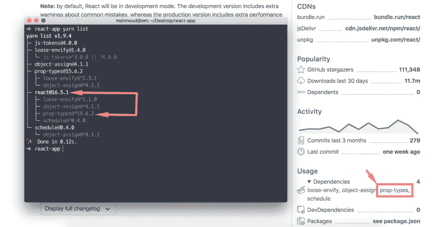
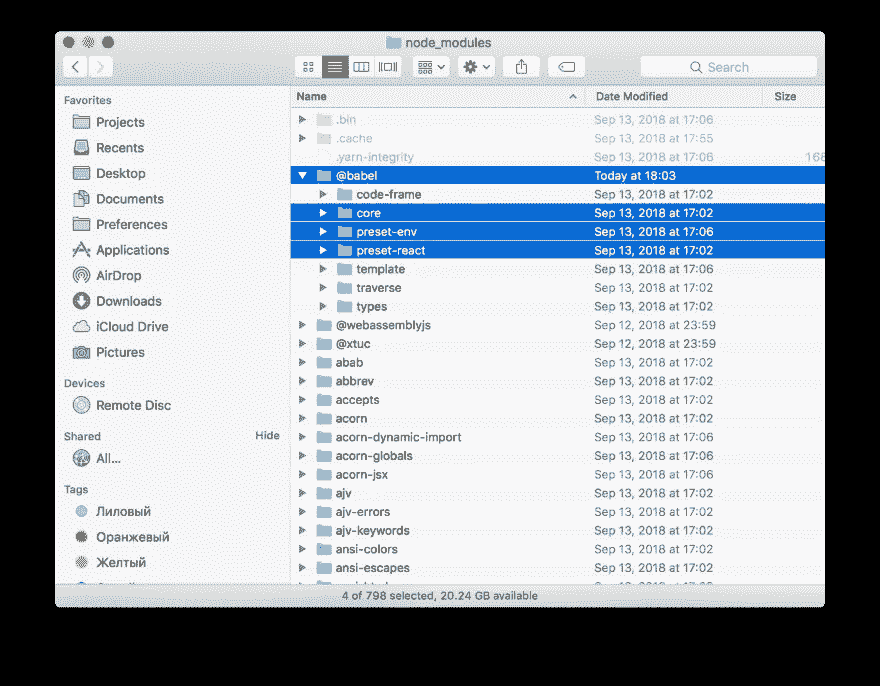
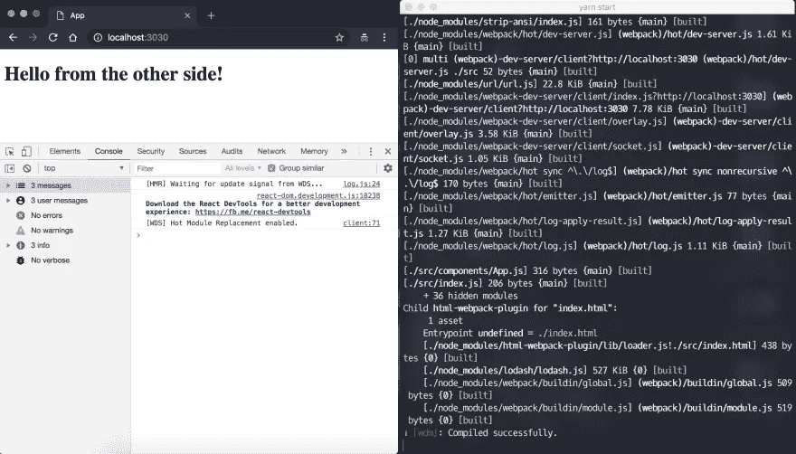

# 从头开始建立反应工具链

> 原文：<https://levelup.gitconnected.com/react-webpack-babel-b76545c6e353>

最后更新于 2019 年 6 月 6 日


本指南旨在帮助那些希望在没有预先配置的环境、没有幕后隐藏的魔法的情况下从头开始使用 React 应用程序的人，或者至少对其有所了解的人。为了充分利用本指南，我强烈建议你一步一步地去做。

# 谜题

React 应用构建通常是一套用于执行复杂任务的工具，它由三个主要部分组成:**包管理器** [Yarn](https://yarnpkg.com/en/) 或 [Npm](https://www.npmjs.com/) ，**Bundler**[web pack](https://webpack.js.org/)或[Package](https://parceljs.org/)，以及**编译器**如 [Babel](https://babeljs.io/) (新的 JavaScript 特性)。

# 先决条件

节点版本:> = 8.0.0
包管理器[纱](https://yarnpkg.com/en/docs/install)

> *📌下面的代码片段使用* `*$*` *来表示类 UNIX 操作系统中的 shell 提示符，尽管它可能被定制为不同的外观。*

# 创建项目目录

```
$ mkdir app && cd $_
$ yarn init -y
```

如您所见，上面的命令非常简单；它做三件事:

*   在当前目录中创建新的“app”文件夹
*   将当前工作目录更改为我们最近创建的项目(第二个语句执行)
*   将 yarn 初始化为我们的包管理器(交互地创建一个 package.json 文件)。标志`-y`(或`--yes`)根据你的[默认值](https://yarnpkg.com/en/docs/cli/init#toc-setting-defaults-for-yarn-init)生成一个 package.json

# 项目目录结构

在我们进入安装、配置和所有令人讨厌的事情之前，让我们首先计划我们的项目目录结构，以看到我们的起点和终点的全貌。

> *📌对于 Windows OS 用户，你必须使用* `*type null >> file*` *而不是* `*touch*` *命令。* `*mkdir -p src/{...}*` *命令也不起作用，您可能会发现这个* [*等效解决方案*](https://stackoverflow.com/questions/905226/what-is-equivalent-to-linux-mkdir-p-in-windows) *很有帮助，或者单独创建这些子目录。*

```
$ mkdir -p src/components tests
$ touch src/index.html src/index.js
$ touch .babelrc .eslintrc.yml jest.config.js webpack.config.js
```

上面我们执行的命令将产生以下文件夹结构:

```
app/
├── src/
│ + components/
│ └── index.html
└── index.js
├── tests/
├── .babelrc
├── .eslintrc.yml
├── jest.config.js
└── webpack.config.js
```

> *💡提示:对于 Linux 和 Macintosh 用户，使用* `*ls -R*` *命令行列出所有文件和子目录内容*

# 属国

我更喜欢使用括号扩展(下面的*片段)来安装名称相似的包。它是可修改的，更漂亮，更省时。*

**反应** : [反应](https://yarnpkg.com/en/package/react)，[反应-dom](https://yarnpkg.com/en/package/react-dom) ，[反应-热加载器](https://yarnpkg.com/en/package/react-hot-loader)

```
$ yarn add react react-{dom,hot-loader}
```

# 反应道具的类型检查

从 React v15.5 开始，如[官方文档](https://reactjs.org/docs/typechecking-with-proptypes.html)所述，不推荐使用`React.PropTypes`，建议安装并使用独立的`prop-types`库(**强烈推荐**)。

**一石二鸟**；截至今天，React v16+使用道具类型作为其依赖项之一( ***可能会在未来的版本*** 中删除)，通过安装 [react](https://yarnpkg.com/en/package/react) ，您应该可以获得开箱即用的[道具类型](https://yarnpkg.com/en/package/prop-types)。



**Babel**:[@ Babel/core](https://yarnpkg.com/en/package/@babel/core)， [@babel/preset-env](https://yarnpkg.com/en/package/@babel/preset-env) ， [@babel/preset-react](https://yarnpkg.com/en/package/@babel/preset-react) ， [babel-eslint](https://yarnpkg.com/en/package/babel-eslint) ， [babel-jest](https://yarnpkg.com/en/package/babel-jest) ， [babel-loader](https://yarnpkg.com/en/package/babel-loader)

```
$ yarn add @babel/{core,preset-env,preset-react} -D
$ yarn add babel-{loader,eslint,jest} -D
```

节点模块上的(@)前缀称为“作用域包”。作用域是将相关包组合在一起的一种方式。



**web pack**:[web pack](https://yarnpkg.com/en/package/webpack)， [webpack-cli](https://yarnpkg.com/en/package/webpack-cli) ， [webpack-dev-server](https://yarnpkg.com/en/package/webpack-dev-server) ， [html-webpack-plugin](https://yarnpkg.com/en/package/html-webpack-plugin)

```
$ yarn add webpack webpack-{cli,dev-server} -D
$ yarn add html-webpack-plugin -D
```

**代码质量— Lint** (推荐): [eslint](https://yarnpkg.com/en/package/eslint) ， [eslint-plugin-react](https://yarnpkg.com/en/package/eslint-plugin-react)

```
$ yarn add eslint eslint-plugin-react -D
```

**测试**(可选): [jest](https://yarnpkg.com/en/package/jest) ， [react-test-renderer](https://yarnpkg.com/en/package/react-test-renderer)

```
$ yarn add jest react-test-renderer -D
$ yarn add babel-core@7.0.0-bridge.0 -D
```

# 设置和配置

**网络包** : `webpack.config.js`

```
const HtmlWebPackPlugin = require('html-webpack-plugin');const HtmlWebpackPluginConfig = new HtmlWebPackPlugin({
  template: './src/index.html',
  filename: './index.html'
});module.exports = {
  module: {
   rules: [
      {
        test: /\.js|jsx$/,
        exclude: /node_modules/,
        use: { loader: 'babel-loader' }
      }
    ]
  },
  mode: 'development',
  devServer: {
    historyApiFallback: true,
    compress: true,
    port: 3030,
    open: true
  },
  plugins: [
    HtmlWebpackPluginConfig
  ]
};
```

分解 webpack 配置:

*   **规则**:我们附加了 babel 作为我们的加载器，当模块被创建时，规则与请求相匹配
*   **模式** : webpack 4 引入了生产和开发模式，用于定义 webpack 开发服务器和其他东西。我们稍后在 package.json 脚本中内联设置生产模式
*   **devServer** :一组基本的[选项](https://webpack.js.org/configuration/dev-server/#devserver)
*   **插件**:用于服务我们的 webpack 包，从`./src`下的模板文件生成`./dist/index.html`
*   **入口**:正如你可能注意到的，我们的配置中没有入口点，幸运的是 webpack 4 为我们提供了现成的默认入口点`./src/index.js` ( *你可以覆盖它*)

**巴别塔** : `.babelrc`

```
{
  "presets": [
    "@babel/preset-env",
    "@babel/preset-react"
  ]
}
```

**笑话** : `jest.config.js`

```
module.exports = {
  verbose: true,
  moduleDirectories: ['node_modules', 'src/components', 'tests']
};
```

出于本教程的目的，我指定了`src/components`作为我的模块目录，但是随着你的应用程序的增长，你将不得不根据你的需要覆盖这个设置。

**Eslint** : `.eslintrc.yml`

```
parser: "babel-eslint"
env:
  browser: true
  node: true
  jest: true
  es6: true
extends:
  - eslint:recommended
  - plugin:react/recommended
settings:
  react:
    version: "16.0"
```

*   解析器:指定我们需要支持的 JavaScript 语法，在我们的例子中，我们设置了 Babel(用于现代 JavaScript 语言)
*   **env** :一个[环境](https://eslint.org/docs/user-guide/configuring#specifying-environments)定义预定义的全局变量
*   **扩展**:一组从基础配置中启用的规则
*   **设置**:共享[设置](https://eslint.org/docs/user-guide/configuring#adding-shared-settings)它将被提供给每个将要执行的规则。

我在这里对配置文件使用 YAML 扩展来指定整个目录配置信息，但是您完全可以随意使用，比如 JavaScript 或 JSON。

**脚本** : `package.json`

```
"scripts": {
  "start": "webpack-dev-server --hot",
  "lint": "eslint ./src",
  "test": "jest --colors -b -e --logHeapUsage",
  "build": "webpack --mode production"
},
```

**反应** : `src/index.html`渲染容器

```
<!DOCTYPE html>
<html lang="en">
  <head>
    <meta charset="UTF-8”>
    <meta name="viewport" content="width=device-width">
    <title>App</title>
  </head>
  <body>
    <div id="root"></div>
  </body>
</html>
```

**反应**:创建`src/components/App.js`作为我们的初始组件

```
import React from 'react'
import PropTypes from 'prop-types';
import { hot } from 'react-hot-loader';const App = ({message}) =><h1>Hello from {message}</h1>; App.propTypes = { 
  message: PropTypes.string 
}; export default hot(module)(App);
```

App 组件是一个无状态组件，代表我们的应用程序，由一个实时调整的热加载器包装。

**反应**:打开并编辑我们的入口点`src/index.js`

```
import React from 'react';
import ReactDOM from 'react-dom';
import App from './components/App';ReactDOM.render(
  <App />,
  document.getElementById('root')
);
```

# 快跑男孩快跑

在我们继续前进之前，我们需要确保一切工作正常(scripts — package.json:)

```
$ yarn start
```

**预期行为**:

应在默认浏览器中打开一个新标签，显示 localhost:3030 地址
dev tools 验证我们的热模块替换已启用
web pack，编译成功



# 测试

我们不打算用 Jest 深入测试细节。我们将创建一个最小的快照测试，以确保我们的测试配置工作正常。在`tests/`目录下创建`App.test.js`文件。

**笑话**:创造`tests/components/App.spec.js`

```
import React from 'react';
import renderer from 'react-test-renderer';
import App from 'App';describe('App Component Test Suite', () => {
  it('Should render properly to DOM', () => {
    const wrapper = renderer.create();
    expect(wrapper.toJSON()).toMatchSnapshot();
  });
});
```

…然后运行测试脚本:

```
$ yarn test
```

第一次运行这个测试时，Jest 会创建一个快照文件。

# 最后但并不是最不重要的

我们现在准备在生产模式下捆绑 React 应用程序，并优化构建以获得最佳性能，我们只需运行以下命令:

```
$ yarn build
```

这将把生产应用程序构建到`dist/build`文件夹中。

# 好运🙌

一旦您完成了，并且一切都如预期的那样工作，那么您现在已经掌握了从零开始建立自己的 React 应用程序的基本技术。您可以通过以下方式更进一步:

*   扩展 webpack 加载器，例如:[样式加载器](https://github.com/webpack-contrib/style-loader)、 [CSS 加载器](https://github.com/webpack-contrib/css-loader)或 [Sass 加载器](https://github.com/webpack-contrib/sass-loader)到您的 webpack 配置中
*   [代码分割](https://webpack.js.org/guides/code-splitting/)
*   用 Yarn/Npm 脚本添加 Git 钩子:`precommit`，`prepush`。例如，在进行新的提交之前运行 linter
*   …还有很多你可以玩的东西