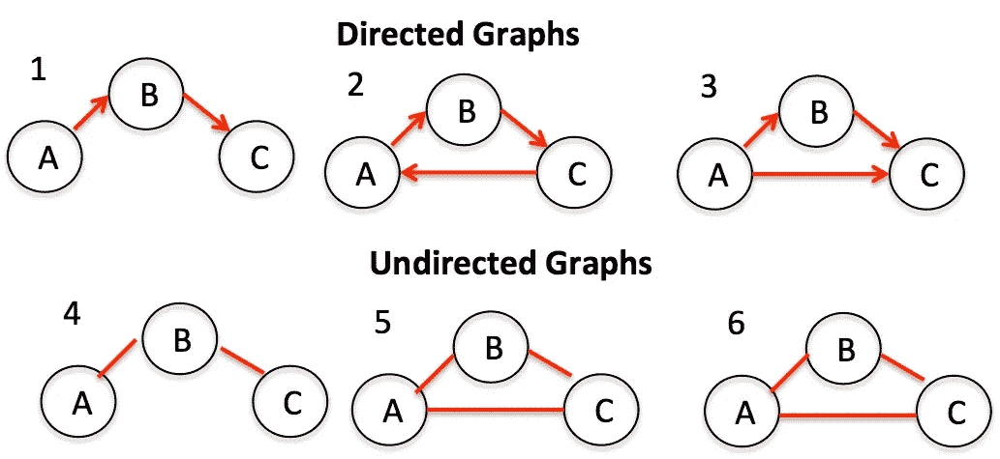
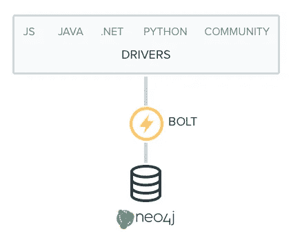
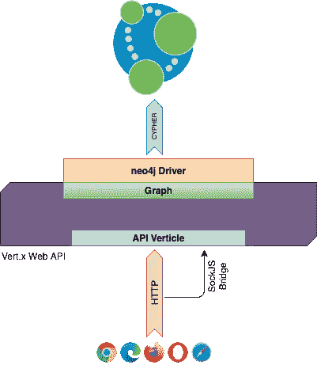
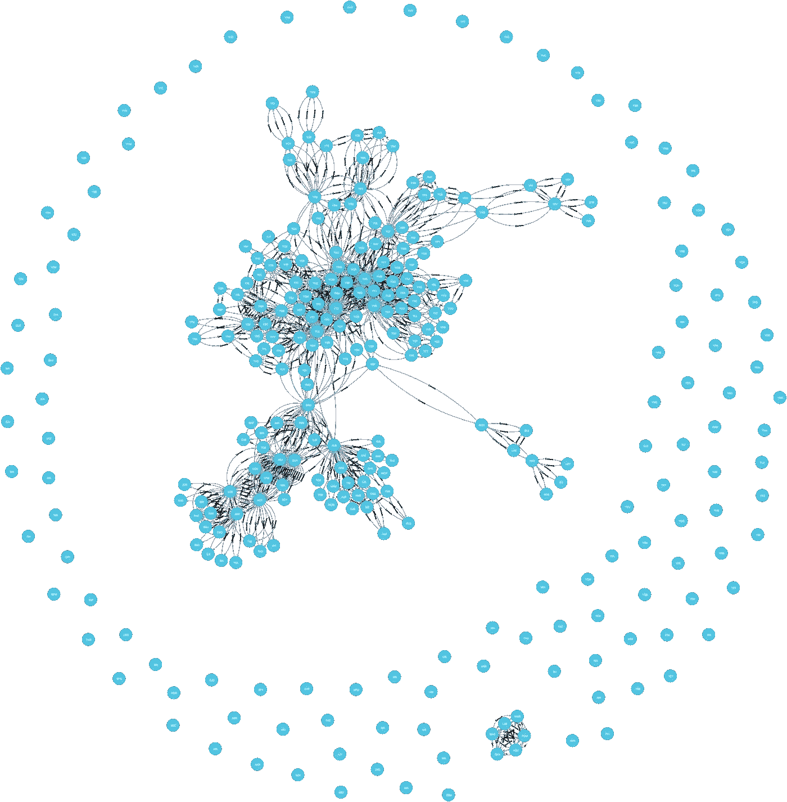
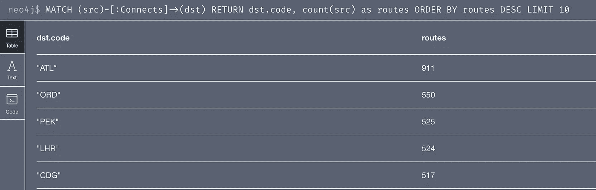
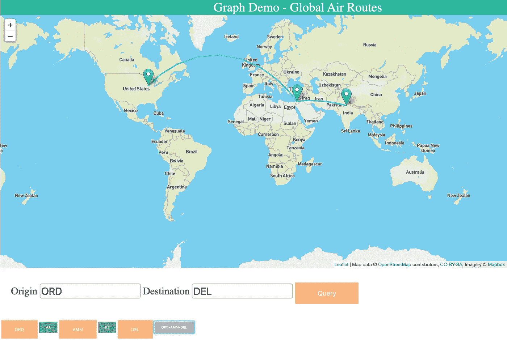

# 使用图形数据-vert . x 和 Neo4j

> 原文：<https://levelup.gitconnected.com/reactive-apis-for-graph-data-vert-x-neo4j-335521321fa3>


图形是一种强大而通用的数据结构，可以轻松地表示不同类型的数据(节点)之间的真实关系。图表有两个主要部分:


*   存储数据的顶点(节点)*，即图像中的字母*
*   连接节点*的边(连接)，即图像*中节点之间的线

图形可以是**无向**或**有向**。



**无向图:**两个方向都存在关系。

**有向图:**关系是基于边的方向。它可以是单向关系，也可以是双向关系，但必须明确说明。

与任何其他数据存储一样，可以对图表执行的一些常见操作包括:

**新增内容**

*   `addNode` **:** 给你的图形添加顶点
*   `addEdge` **:** 创建图形中两个给定顶点之间的边

**移除**

*   `removeNode` **:** 从你的图形中删除顶点
*   `removeEdge` **:** 删除图形中两个给定顶点之间的边

**搜索**

*   `contains` **:** 检查你的图形是否包含给定值
*   `hasEdge` **:** 检查图中两个给定节点之间是否存在连接
*   `getNode` **:** 查找符合条件的节点
*   `getEdges` **:** 查找符合标准的关系
*   `getConnectedNodes` **:** 给定一个条件，找出由一条路径连接的节点

**算法**

*   `shortestPath` **:** 最短路径算法计算一对节点之间的最短(加权)路径

# Neo4j 简介

Neo4j 是一个图形数据库，旨在与高度相关的数据进行交互，例如您可能在社交图中找到的关系。如果您的数据被设计成可以用相关节点的图形来表示，那么查询该数据会非常有效。Neo4j 的响应时间随着结果集中节点数量的增加而增加。

对于本文，我们将使用 Neo4j 社区版 4.0.2。人们可以从 Neo4j [网站](https://neo4j.com/download-center/#community)下载服务器。下载完成后，解压 tar 文件，运行`neo4j start`即可启动服务器。一旦服务器启动并运行，用户就可以使用默认情况下 localhost:7474 上的 neo4j 浏览器。

# 二进制 Bolt 协议

从 Neo4j 3.0 开始，服务器支持名为 Bolt 的二进制协议。它基于 PackStream 序列化，并通过证书支持密码类型系统、协议版本、认证和 TLS。对于 Neo4j 集群，Bolt 提供了带有负载平衡和故障转移的智能客户端路由。

Neo4j 默认启用二进制协议，因此您可以使用任何支持它的语言驱动程序。



Neo4j 官方为[提供驱动。Net](https://neo4j.com/developer/language-guides/dotnet) ， [Java](https://neo4j.com/developer/language-guides/java) ， [JavaScript](https://neo4j.com/developer/language-guides/javascript) ， [Go](https://neo4j.com/developer/language-guides/go) ，以及 [Python](https://neo4j.com/developer/language-guides/python) 。

你可以在 [Neo4j 驱动手册](http://neo4j.com/docs/developer-manual/current/drivers/)中找到官方驱动的详细信息

# 密码查询语言

Neo4j 提供了一种非常强大和非常直观的查询语言，它支持数据库的所有特性。Cypher 基于 SQL 的强大功能，但专门针对图形进行了优化。语法简洁明了，允许用户以简单和可维护的方式轻松编写所有普通的 CRUD 操作。

# Java 驱动程序

对于本文，我们将运行一个独立的社区服务器，并通过 Neo4j Java 驱动程序连接到它。

Neo4j 驱动程序支持三种不同的编程模型:

*   阻塞数据库访问(很像标准的 JDBC)
*   基于 JDKs completable futures 和相关基础设施的异步编程
*   基于[反应流](http://www.reactive-streams.org/)的反应编程

# 一个示例图形应用程序

为了展示图形数据库的强大功能和灵活性，让我们使用 Vert.x 构建一个简单的 Web API，并使用 Java 驱动程序与 Neo4j 服务器进行交互。

对于我们的示例应用程序，我们将使用由 [OpenFlights](https://openflights.org/data.html) 提供的开放航空公司数据。我们将使用机场和路线数据，在我们的图表中创建机场节点，并根据路线数据创建两个机场之间的“连接”关系。



使用 maven 添加 java 驱动程序依赖:

```
<dependency>
    <groupId>org.neo4j.driver</groupId>
    <artifactId>neo4j-java-driver</artifactId>
    <version>4.0.1</version>
</dependency>
```

让我们创建一个包装器来连接图形数据库。包装器使得从 API 处理程序访问数据库变得容易。

```
public class Graph {
    private Driver      m_driver = null;
    private Session     m_session = null; public Graph() {
        startup();
    }
    private void startup() {
        m_driver = GraphDatabase.driver("bolt://localhost:7687"
                                        , AuthTokens.basic("neo4j", "password"));
        m_session = m_driver.session();
    }
    public void stop() {
        m_session.close();
        m_driver.close();
    }
}
```

# 将数据载入图表

创建我们的 API verticle，以允许与图形接口。API verticle 会将图形查询结果转换成 JSON 消息，以便于前端处理。它还将为类似 REST 的请求和来自 SockJS 连接的请求提供处理程序。

```
public class APIVerticle extends AbstractVerticle
{
  private Graph m_graph = null;
  public APIVerticle() {
      super();
  }  
  [@Override](http://twitter.com/Override)
  public void start() throws Exception {
    m_graph = new Graph();
  }
}
```

将机场和路线载入图表。

```
private void load() {
    String path = m_config.getString("airports");
    if (path != null) {
        loadAirports(path);
    }
    path = m_config.getString("routes");
    if (path != null) {
        loadRoutes(path);
    }
}
```

从开放航班加载机场数据。在这里下载[CSV 格式的数据。定义机场 POJO 以保存此信息。](https://raw.githubusercontent.com/jpatokal/openflights/master/data/airports.dat)

```
public abstract class Node {
    public abstract String getCreateCypher();
    public abstract HashMap<String, Object> getCreateParams();
}public class Airport extends Node 
{
    private static String CREATE = 
      "CREATE (a:Airport {name: $name, city: $city, country: $country, code: $code"
    + ", latitude: $latitude, longitude: $longitude, altitude: $altitude, timezone: $timezone})\n"
    + "RETURN a";

    private String      m_name;
    private String      m_city;
    private String      m_country;
    private String      m_code;
    private Float       m_latitude;
    private Float       m_longitude;
    private Integer     m_altitude;
    private String      m_timezone;
    private HashMap<String, Object> m_params 
        = new HashMap<String, Object>();

    public Airport(String name, 
                   String city, 
                   String country, 
                   String code, 
                   Float latitude, 
                   Float longitude, 
                   Integer altitude, 
                   String timezone) 
    {
        m_name = name;
        m_params.put("name", name);
        m_city = city;
        m_params.put("city", city);
        m_country = country;
        m_params.put("country", country);
        m_code = code;
        m_params.put("code", code);
        m_latitude = latitude;
        m_params.put("latitude", latitude);
        m_longitude = longitude;
        m_params.put("longitude", longitude);
        m_altitude = altitude;
        m_params.put("altitude", altitude);
        m_timezone = timezone;
        m_params.put("timezone", timezone);
    }

    [@Override](http://twitter.com/Override)
    public String getCreateCypher() {
        return CREATE;
    }
    [@Override](http://twitter.com/Override)
    public HashMap<String, Object> getCreateParams()
    {
        return m_params;
    }
}
```

从机场 CSV 加载数据:

```
private void loadAirports(String path) 
{
    try 
    {
        CSVReader reader = new CSVReader(new FileReader(path));
        Observable
            .fromIterable(reader)
            .map(
              csvRow -> {
                  if (csvRow.length < 12) 
                  {
                      return null;
                  }
                  return new Airport(csvRow[1], // name
                                     csvRow[2], // city
                                     csvRow[3], // country
                                     csvRow[4], // IATA code
                                     getFloat(csvRow[6]), // latitude
                                     getFloat(csvRow[7]), // longitude
                                     getInteger(csvRow[8]), // altitude
                                     csvRow[11]); // timezone
              }
            )
            .subscribe(airport -> {
                        m_graph.createNode(airport);
                       }
                      , error -> {
                        }
                      , () -> {});} catch (FileNotFoundException ex) {
        m_logger.error("Airports file not found", ex);
    }
}
```

从 [CSV](https://raw.githubusercontent.com/jpatokal/openflights/master/data/routes.dat) 加载路线数据。创建 POJO 来表示路线，并将数据加载到图形中。

```
public class Route extends Node {
    private final static String CREATE_RELATIONSHIP = 
      "MATCH (src:Airport {code:$source}), (dst:Airport {code:$destination})\n"
    + "CREATE (src)-[r:Connects {airline:$airline,source:$source,destination:$destination}]->(dst)\n"
    + "RETURN r";

    private String m_source;
    private String m_destination;
    private String m_airline;
    private HashMap<String, Object> m_params = 
      new HashMap<String, Object>();

    public Route(String source, String destination, String airline) 
    {
        m_source = source;
        m_params.put("source", source);
        m_destination = destination;
        m_params.put("destination", destination);
        m_airline = airline;
        m_params.put("airline", airline);
    }

    [@Override](http://twitter.com/Override)
    public String getCreateCypher() {
        return CREATE_RELATIONSHIP;
    }
    [@Override](http://twitter.com/Override)
    public HashMap<String, Object> getCreateParams()
    {
        return m_params;
    }
}
```

使用路线数据文件中的每一行创建机场之间的关系:

```
private void loadRoutes(String path) 
{
  try 
  {
    CSVReader reader = new CSVReader(new FileReader(path));
    Observable
      .fromIterable(reader)
      .map(
        csvRow -> {
          if (csvRow.length < 4) 
          {
              return null;
          }
          return new Route(csvRow[2], // sourceairport
                           csvRow[4], // destinationairport
                           csvRow[0]); // airline
        }
      )
      .subscribe(route -> {
                  m_graph.createNode(route);
                 }
                , error -> {
                  }
                , () -> {});
  } catch (FileNotFoundException ex) {
    m_logger.error("Routes file not found", ex);
  }
}
```

# 创建节点和关系

在 Graph 中添加一个通用的 createNode 方法来创建节点和关系。Airport 和 Route POJO 类定义了在 Neo4j 上执行创建操作所需的必要的 CYPHER 语句。

```
public void createNode(Node pojo) {
  String createStr = pojo.getCreateCypher();
  m_session.run(createStr, pojo.getCreateParams());
}
```

创建机场节点的密码:

```
CREATE (a:Airport {name: $name, city: $city, country: $country, code: $code, latitude: $latitude, longitude: $longitude, altitude: $altitude, timezone: $timezone}) RETURN a
```

CYPHER 创建两个机场之间的“连接”关系:

```
MATCH (src:Airport {code:$source}), (dst:Airport {code:$destination}) 
CREATE (src)-[r:Connects {airline:$airline,source:$source,destination:$destination}]->(dst) 
RETURN r
```

使用 getCreateParams()作为 HashMap 来提供执行 CYPHER 所需的参数。

使用 Neo4j 浏览器，我们可以将节点以及它们之间的关系可视化。



# 查询图中的节点、关系和路径

让我们通过一些密码查询来搜索机场和连接机场的路线。

从查找所有 Airport 节点的简单查询开始:

```
MATCH (airport:Airport) return airport
```

根据 IATA 代码查找机场:

```
MATCH (airport:Airport {code:$code}) return airport
```

查找连接最紧密的机场:

```
MATCH (src)-[:Connects]->(dst)
RETURN dst.code, count(src) as routes
ORDER BY routes DESC LIMIT 10
```



寻找两个机场之间的路径:

```
MATCH p=(src:Airport {code:'ORD'})-[r:Connects]->(dst:Airport {code:'DEL'}) WITH reduce(output = [], n IN relationships(p) | output + n ) as nodeCollection RETURN nodeCollection
```

通过深度限制路径:

```
MATCH p=(src:Airport {code:'ORD'})-[r:Connects*2]->(dst:Airport {code:'DEL'}) WITH reduce(output = [], n IN relationships(p) | output + n ) as nodeCollection RETURN nodeCollection
```

# API 和 EventBus 处理程序

为了方便客户端(浏览器)查询 Graph DB，我们将需要 APIVerticle 中的事件处理程序来处理通过 HTTP 或 SockJS 到达的请求。让我们看一个这样的处理程序，它处理一个在两个机场之间查找路线的请求:

```
m_router.get("/routes").handler(this::listRoutes);
...public void listRoutes(RoutingContext ctx) 
{
  HttpServerResponse response = ctx.response();
  String src = ctx.request().getParam("source");
  String dst = ctx.request().getParam("destination");
  List<AirPath> airpaths = m_graph.getRoutes(src.toUpperCase(), dst.toUpperCase(), 2);
  JsonArray arr = new JsonArray();
  airpaths.forEach(r -> { arr.add(r.toJson()); });
  JsonObject msg = new JsonObject();
  msg.put("action", "routes");
  msg.put("routes", arr);
  response
          .setStatusCode(200)
          .putHeader("content-type", 
            "application/json; charset=utf-8")
          .end(msg.encodePrettily());
}
...public List<AirPath> getRoutes(String src, String dst, int connections) 
{
  String query = ROUTE_QUERY.replace("ccc", "1.." + connections);
  List<AirPath> airpaths = new ArrayList<AirPath>();
  HashMap<String, Object> params = new HashMap<String, Object>();
  params.put("source", src);
  params.put("destination", dst);
  try
  {
    Result r = m_session.run(query, params);
    r.stream().forEach(record -> {
      record.fields().forEach(p -> {
        AirPath airpath = new AirPath();
        p.value().asList().forEach(n -> {
          InternalRelationship rel = (InternalRelationship)n;
          String source = rel.get("source").asString();
          String destination = rel.get("destination").asString();
          String airline = rel.get("airline").asString();
          Route rte = new Route(source, destination, airline);
          airpath.add(rte);
        });
        airpaths.add(airpath);
      });
    });
  } catch (Exception e) {
    m_logger.error("Route query error {}", query, e);
  }
  return airpaths;
}
```

上述路由查询的密码如下所示:

```
String ROUTE_QUERY = "MATCH p=(src:Airport {code:$source})-[r:Connects*ccc]->(dst:Airport {code:$destination})
WITH reduce(output = [], n IN relationships(p) | output + n ) as nodeCollection 
RETURN nodeCollection";
```

# 在地图上绘制路线

使用传单，我们可以在地图上看到这些路线



完整的工作演示项目可以在[https://github.com/pvub/demos/tree/master/graph/GraphDemo](https://github.com/pvub/demos/tree/master/graph/GraphDemo)找到

Neo4j 社区服务器可以从[https://neo4j.com/download-center/#community](https://neo4j.com/download-center/#community)下载

编码快乐！