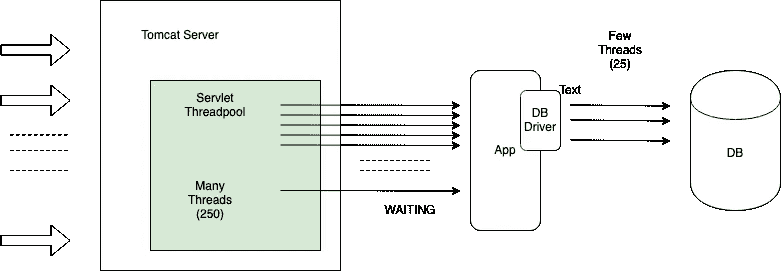
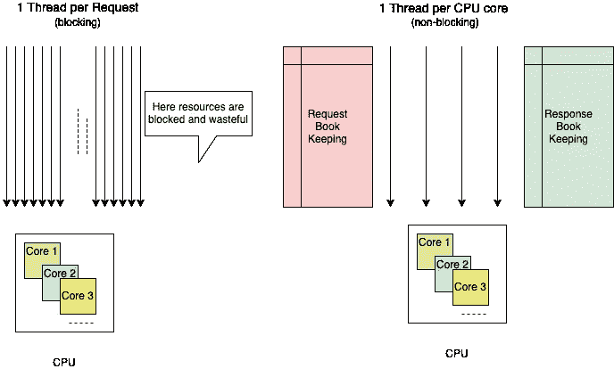
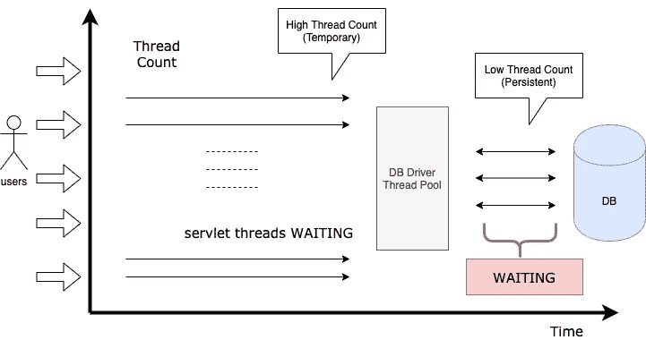
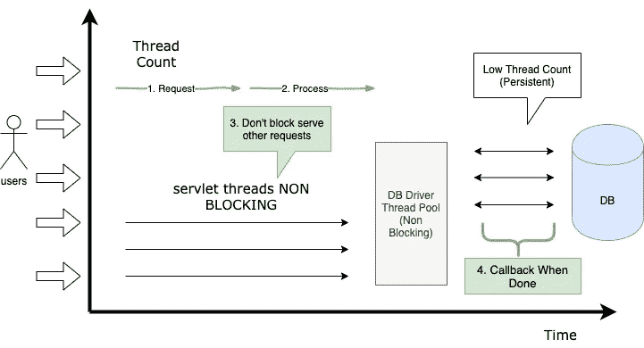
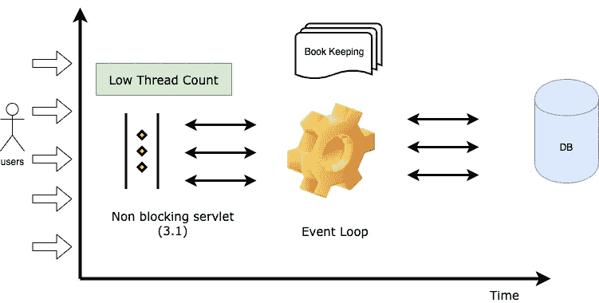
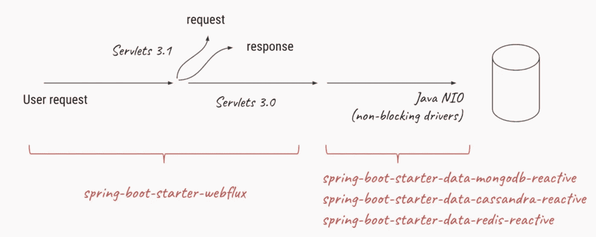
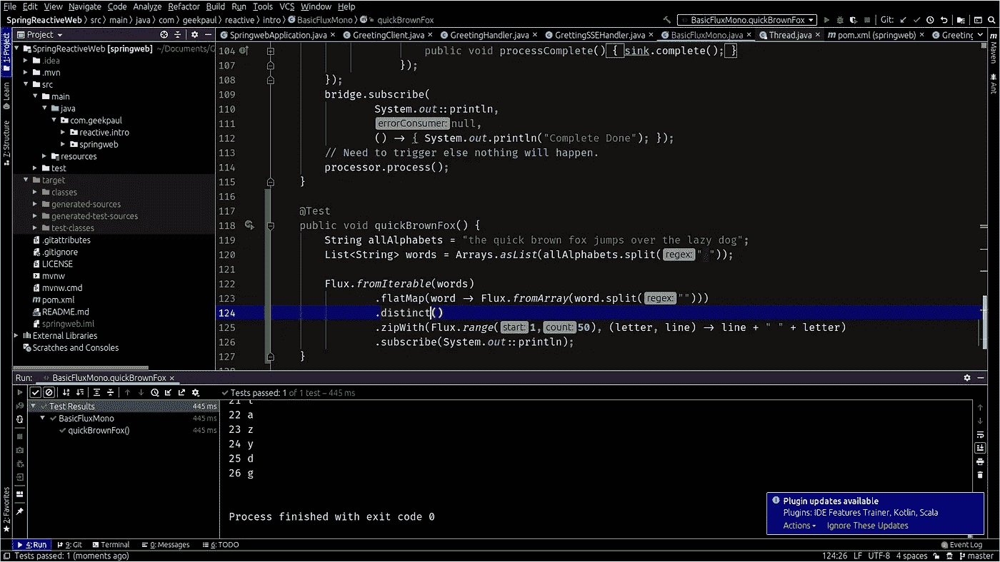

# 使用 Reactor Core 在 Java 中进行反应式异步编程(第 1 部分)

> 原文：<https://levelup.gitconnected.com/reactive-asynchronous-programming-in-java-using-reactor-core-part-1-cd516dd579fe>

# **简介**

这将是两部分系列，第一部分我们将了解反应式编程背后的**基础和动机**，它如何帮助现代应用程序扩展，将介绍 Project Reactor 和使用 Reactor 和 Spring 的反应式编程基础。

第二部分更深入地讨论了如何使用现有的代码库和利用反应式风格，如何处理反压力，进行错误处理等等。

[***Java 中使用反应堆内核的反应式异步编程(下)***](https://medium.com/@arindampaul/reactive-asynchronous-programming-in-java-using-reactor-core-part-2-e9c6caeb8833)

今天，大多数现代应用程序可以处理大量并发请求或用户。在过去的几十年里，现代硬件的现代功能已经有了很大的提高，但是在现代软件中正确有效地使用它们仍然是一个关键问题。此外，深入了解如何以最佳方式利用硬件变得更加重要。

在我们进入技术层面之前，让我们先谈一谈程序效率。概括地说，有两种方法可以提高程序的性能:

*   使用更多线程和更多硬件资源
*   更有效地使用每个线程。( ***你会明白我的意思*** )

# 并发与并行编程(和异步？)

当我们说两个线程或程序(为简单起见，我们称之为任务)并行运行时，我们的意思是它们同时在不同的内核或处理器上运行或执行，做不同的事情。**重要的是同时运行，如果任务不同时运行，那就不是并行。**

另一方面，并发任务似乎是同时运行的，就好像它是并行运行的一样，但是基本上**在下一个任务被调度之前，许多任务会占用一片 CPU** 一小段时间，因此，理论上，随着时间的推移，许多任务在小块中连续进行，可以被认为是并发的。因此，总的来说，它似乎运行许多事情，但不一定在同一时间片，每个任务在 CPU 上共享小块时间。

所以你可以想象**并行编程是并发编程**的一个特例，并发编程不一定需要任何多核、多处理器的设置。甚至在单 CPU 设置中运行的程序也可以并发。

**异步**和**回调**通常是一种表达**并发**的方式(工具或机制)，即一组实体可能相互对话并共享资源和时间。在**的情况下，异步或回调通信是隐式的**，而资源共享是可选的。

# 为什么多线程并不总是高效的？

通常， **Java 开发者倾向于使用阻塞代码**编写程序。这种做法很好，直到出现性能瓶颈。然后是时候引入额外的线程(多线程)，运行类似的阻塞代码。

但是这种资源利用的扩展会很快引入争用和并发问题。更糟糕的是，阻塞浪费资源。如果仔细观察，只要程序涉及到一些延迟(特别是 I/O，如数据库请求或网络调用)，资源就会被浪费，因为线程(可能是许多线程)现在处于空闲状态，等待数据。

**因此，并行化方法并不是灵丹妙药**。使用硬件的全部能力是必要的，但是推理起来也很复杂，并且容易造成资源浪费。

让我们来看一个例子，

假设您正在一个典型的 Tomcat 服务器上运行一个 Web 应用程序，它连接到一个数据库，代表用户请求查询数据。如果稍微深入一点，您会发现 **Tomcat 本身创建了一个由许多线程**组成的线程池，每个线程都将用于处理每个请求。通常这种线程的数量是数百个，我们的例子是 250 个。

现在，当使用 servlet 线程发出这样的请求时，应用程序将依次要求数据库客户端获取连接到某个数据库驱动程序的查询。差异来了，不像 Tomcat 有那么多临时使用的线程， **DB 连接是昂贵且持久的**。此外，如果您持有一个 DB 连接而不使用它，那么在某个地方会有一些其他的客户机在等待那个连接而没有得到它。这也是浪费资源。通常，数据库驱动程序层中的线程会管理 20 到 25 个连接。

每当一个请求需要 DB 数据时，servlet 线程**就会被阻塞/等待(state ),并等待 DB 驱动程序分配一个线程来完成任务**。现在，只要您服务于 DB 驱动程序可以管理的请求，就可以了。但是一旦数据库调用成为瓶颈，许多许多这样的 Servlet 请求线程现在被置于等待状态，等待数据库结果返回，大多数时候这些线程不做任何事情**，而是记录哪个请求属于哪个响应，并等待响应。这是一种浪费，而且由于阻碍交互的层越来越多，因此增加了有效管理每一层的复杂性。**

*   首先，在 Tomcat 中，不能超过分配的线程总数，这对每个请求所做的工作的性质来说是非常主观的。所以在任何情况下，你都不能在任何时候满足超过 250 个请求。
*   你不能释放那些没有做太多事情，而是等待回复或者在某个固定的 MAX_TIME 超时(取决于实现)的资源。

如果你真的想一想，在任何时间点，你都将运行你的机器中可以有效处理的尽可能多的线程，换句话说，有多少个处理器核心，那就是你可以获得的效率的峰值。但是，为了实现那个**，我们必须小心，负责完成工作的线程永远不会被阻塞**。

但是，仅仅这个要求是不够的，如上所述，我们首先需要 Tomcat 的所有线程的全部原因是**来记录哪些请求属于哪个线程，以及哪些响应应该相应地发出**。这个记账很重要。

如果你看上面的图表，在我们自己的多线程方法中，我们最终创建了许多处于等待状态的线程，增加它们的数量不会进一步提高性能，而且由于它们阻塞调用的本质，它们不能保证 CPU 是否被使用，因为它取决于当时的请求状态(阻塞/等待或就绪)。

另一方面，如果我们只能为每个 CPU 内核建立一个线程模型，并保证它们不会被阻塞。我们可以得到一个非常高效的系统。例如，一旦他们收到一个需要阻塞调用的任务，我们将在本子上记下这个调用完成后需要发生的事情，然后**继续请求其他请求，而不会被阻塞**。此外，没有线程切换发生或不需要发生，这使得事情更加有效。

所以从上面的情况来看，我们想转移到这里，

但是我们需要记账，所以，

当结果返回时，我们应该能够重用同一个线程来发送回响应，因为我们通常需要一个队列或请求/响应以及一个围绕它的管理器，通常它被称为 **EventLoop** 。

**举例来说，JavaScript** 就是基于这种想法建立起来的，它不允许多线程(web workers 允许，但他们不会再次阻塞并运行他们独立的事件循环)，并且完全运行在这种**异步编程**和**事件循环**的模型上，这使得它重量轻、可伸缩，是 web 服务器类场景的非常好的选择。

现在，在这个前提下，让我们进入反应式编程的世界，并尝试看看不同的执行模型如何试图解决这个问题，以及如何更好地利用现代硬件，同时将复杂性保持在最低水平。

# 反应式编程

在反应式编程中，**我们不会根据线程**来考虑哪个线程将执行什么，我们**变得更加声明性，这很好地定义了手头的工作**并且**分解为简单的任务**，这些任务可以被组合和组合以获得最终结果。

> *反应式编程是一种与数据流和变化传播相关的异步编程范例。这意味着可以通过所使用的编程语言轻松表达静态(如数组)或动态(如事件发射器)数据流。*

—[https://en.wikipedia.org/wiki/Reactive_programming](https://en.wikipedia.org/wiki/Reactive_programming)

之所以称之为反应式编程，是因为**它可以对系统中的变化和外部事件**做出反应，而外部事件又会产生需要处理的结果或更多事件，每个事件都是独立的，并且可以被任何线程调度处理，每当需要发生异步调用时，线程将接受回调(以某种形式，当异步调用完成或出错时需要发生什么),并将它移交给 EventLoop，并拾取下一个事件/任务。

它还轮询 **EventLoop** 队列，查看现在可以处理的已完成任务，并逐个运行那些已经准备好的任务。

需要注意的是，在这样的非阻塞环境中，没有人会阻止你自己编写阻塞代码，但是你应该非常小心，如果你阻塞了，你的程序将会变得非常低效，因为你没有线程可以使用，阻塞一个线程意味着一个 CPU 现在实际上没有被使用。因此，当您选择这种模型时，您必须从请求到响应全程异步。(例如，如果您在代码中使用 IO，而不是普通的 Java IO，那么您最终会使用非阻塞的 NIO)

# Java 中的反应式编程

反应式编程进入主流 Java 和其他语言是由网飞和微软(虽然不是一起)发起的，在一系列被称为[反应式扩展](http://reactivex.io/)的规范中。

RxJava 是相同的 Java 实现。但是，Spring 团队已经构建了 [Reactor](https://projectreactor.io/) 在我看来，这是一个更好的库，具有更好的 API 和对各种非阻塞库的完全支持，使您的生活更加轻松。举个例子，如果你必须以一种反应式的方式实现一个 web 服务器，你可以选择下面的方法，由于 Project Reactor，这些方法可以使它完全无阻塞。

Reactor 实现了一个发布/订阅模型，拥有强大的能力来转换、控制和组合它们，更重要的是，即使在使用调度程序编写代码之后，您的代码也可以以多种方式进行调度和运行，并且可以在运行时进行切换，这非常强大。总结一下，为什么 Reactor 很棒，他们的医生说是最好的，我引用一下，

[https://project reactor . io/docs/core/release/reference/index . html](https://projectreactor.io/docs/core/release/reference/index.html)

> Reactor 等反应式库旨在解决 JVM 上“经典”异步方法的这些缺点，同时还关注一些其他方面:
> 
> **可组合性**和**可读性**
> 
> 数据作为一个**流**由丰富的**操作符词汇操纵**
> 
> 在你**订阅**之前什么都不会发生
> 
> **背压**或*消费者向生产者发出排放率过高信号的能力*
> 
> **高层次**但**高价值**抽象，即*并发不可知*
> 
> 通过“**可组合性**”，我们指的是编排多个异步任务的能力，其中我们使用先前任务的结果为后续任务提供输入。或者，我们可以以 fork-join 方式运行几个任务。此外，我们可以在更高级别的系统中重用异步任务作为离散组件。

# 反应堆芯

让我们在本系列的这一部分开始探索 Reactor 的构建模块。

命令式编程模式，即使访问值的方法完全是`**Iterable**`的责任。事实上，由开发人员决定何时访问序列中的`**next()**`项。在反应流中，上述对的等价物是`**Publisher-Subscriber**`。但是是`**Publisher**`在新的可用值*到来时通知订户这些值*，这个推送方面是反应性的关键

# 出版商

一个`**Publisher**`可以将新值推送到它的`**Subscriber**`(通过调用`**onNext**`)，但也可以发出出错(通过调用`**onError**`)或完成(通过调用`**onComplete**`)的信号。错误和完成都会终止序列。这可以总结如下:

Reactor 中有两个主要的原语**发布者**，

*   **单声道:单声道可以产生 0 到 1 的数值**
*   **Flux: Flux 更通用，可以产生从 0 到 N 的值**

# 订阅者

在 Reactor 中，当你写一个`**Publisher**`链时，默认情况下数据不会开始注入其中。相反，您可以创建异步流程的抽象描述(这有助于重用和组合)。

通过**订阅**的行为，您将`**Publisher**`绑定到一个`**Subscriber**`，这触发了整个链中的数据流。这是通过来自`**Subscriber**`的单个`**request**`信号在内部实现的，该信号向上游传播，一路回到信号源`**Publisher**`。

***在你订阅之前什么都不会发生***

当你写一个`**Publisher**`链时，默认情况下数据不会开始注入其中。相反，您可以创建异步流程的抽象描述(这有助于重用和组合)。

通过**订阅**的行为，您将`**Publisher**`绑定到一个`**Subscriber**`，这触发了整个链中的数据流。这是通过来自`**Subscriber**`的单个`**request**`信号在内部实现的，该信号向上游传播，一直回到信号源`**Publisher**`。

# 经营者

虽然 Reactive Streams 规范根本没有指定操作符，但 Reactive 库(如 Reactor)的最佳附加值之一是它们提供了丰富的操作符词汇。这些涵盖了很多方面，从简单的转换和过滤到复杂的编排和错误处理。

您可以将反应式应用程序处理的数据想象成在装配线上移动。反应器既是传送带又是工作站。原材料从一个源头(最初的`**Publisher**`)涌出，最终成为准备推向消费者的成品(或`**Subscriber**`)。

原材料可以经历各种转变和其他中间步骤，或者成为将中间部件聚集在一起的更大装配线的一部分。如果在某一点出现故障或堵塞(也许装箱需要不成比例的长时间)，受影响的工作站可以向上游发出信号，限制原材料的流动。

在我们的装配类比中，操作员是工作站。每个操作符将行为添加到一个`**Publisher**`中，并将前一步的`**Publisher**`包装到一个新实例中。整个链因此被链接，使得数据从第一个`**Publisher**`开始，并沿着链向下移动，由每个链接转换。最终，一个`**Subscriber**`完成该过程。记住，在一个`**Subscriber**`订阅一个`**Publisher**` **之前，什么都不会发生。**

这里有一个关于操作者力量的例子，假设我们想知道**“敏捷的棕色狐狸跳过懒惰的狗”**中不同的人物

# 结论

在本文中，您看到了如何在不总是考虑线程的情况下建模一个高效的程序，您可以欣赏反应式模型和编程思维中的权宜之计，这使它更加高效和无错误。

但是线程并没有消失，我们需要了解发生了什么，以及线程现在是如何被处理的。在本系列的下一部分中，我们将看看使用`**Schedulers**` 的线程建模，我们还将看看测试方面，Reactor Core 的 **StepVerifier** 如何使异步任务和代码的测试变得超级简单和有趣。

您可以在这里找到本系列的下一个第 2 部分，

[***【使用 Reactor Core 的 Java 反应式异步编程(下)***](https://medium.com/@arindampaul/reactive-asynchronous-programming-in-java-using-reactor-core-part-2-e9c6caeb8833)