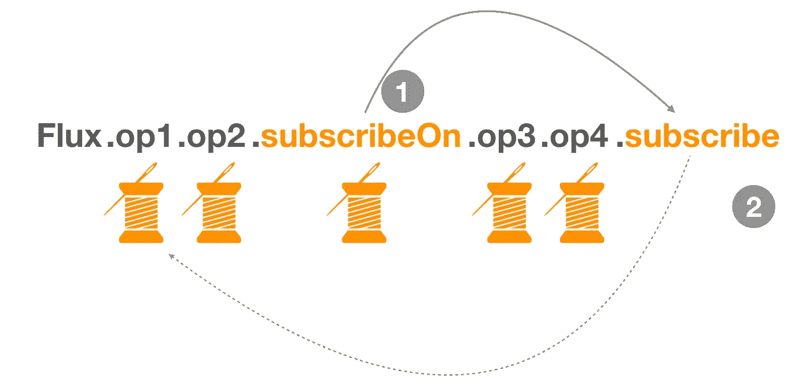

# 使用 Reactor Core 在 Java 中进行反应式异步编程(第 2 部分)

> 原文：<https://levelup.gitconnected.com/reactive-asynchronous-programming-in-java-using-reactor-core-part-2-e9c6caeb8833>

# 介绍

这篇博客文章是关于学习异步和反应式编程的两部分系列文章的第 2 部分。如果你还没有机会阅读**第 1 部分**，即使这不是必需的，我也强烈建议你这样做，以正确设置上下文。

[***【使用 Reactor Core 的 Java 反应式异步编程(上)***](/reactive-asynchronous-programming-in-java-using-reactor-core-part-1-cd516dd579fe)

这一部分将 ***更强烈一点，更长一点，*** 建立在我们目前已经看到的基础上。我尽量让解释简短，尽可能提供简单的例子。

在这一部分，我们将了解更多关于反应堆堆芯的构建模块(即`**Flux**` 和`**Mono**`)以及你如何将你的作品**构建成一条由独立的可组合部分组成的流水线**。我们将看看不同类型的发行商，如`Hot Publisher`和`Cold Publisher`，以及你想使用它们的一些场景。

然后，我们将围绕 ***调度器*** 学习一些关键的思想和概念。**调度器**非常强大，**它们允许我们以一种高效的方式在阻塞和非阻塞世界之间架起桥梁**(稍后你会看到更多)。我们还将看到向这些**发布者**提供我们自己的定制**调度程序**是多么容易，他们可以在那些**调度程序**中运行他们的工作。但是，请记住一件事，调度程序本身不会神奇地完成工作，**我们需要通过 Publisher 的 *subscribeOn* 和*publish on*API**将我们的工作管道连接到调度程序，这两者都非常强大，我们将看到如何在现实世界的场景中利用它们。

接下来，我们将学习**错误处理**以及我们如何处理`try catch`和`Exceptions`。您将会看到，不仅处理错误**是多么容易，而且为一些优雅的恢复提供替代路径**或再次重试该工作也是多么容易。我们将尝试对我们的强制异常处理进行一对一的映射，并查看它们在 Reactor 和一般反应式编程中的对应部分。

最后，我们将学习返回通量或单声道函数的单元测试。在带有 ***StepVerifier*** 的 Reactor 中，它有助于针对这种反应式系统运行测试，我们可以验证所有类型的流及其预期，甚至不需要订阅(在测试期间，您不知道订阅会在哪里发生)。此外，在 ***时间内，Flux 是一个无限的事件/消息流，即使测试也可能需要很长时间，我们将利用助手来模拟时间*** 以进行有效和快速的测试，我们将看到使用`withVirtualTime`我们可以使它变得真正简单)。

我们有很多地方要去，所以不要再多说了，让我们一起踏上这段旅程吧。

> **注:**为了说明一些概念，经**西蒙·巴斯莱(**[@西蒙巴索](https://twitter.com/simonbasle) **)** 从甲板上[《飞流》](https://speakerdeck.com/simonbasle/flight-of-the-flux)，你也可以在这里找到精彩的演讲[。](https://www.youtube.com/watch?v=hfupNIxzNP4)

# *出版商通量*和 Mono 在行动

这是对前一篇文章的快速回顾，但我认为这是值得的，所以让我们快速回顾一下关于它们的更多细节，

一个`**Publisher**`可以将新的值推送到它的`**Subscriber**`(通过调用`**onNext**`)，但也可以发出出错(通过调用`**onError**`)或完成(通过调用`**onComplete**`)的信号。错误和完成都会终止序列。

反应器中有两个主要的原语**发布者**， ***，*** 和*单色*

# 流量

**Flux** 是 Reactor 中的一个通用标准发布器，它可以发布一个`<T>`类型的数据/事件，并且可以异步产生从 0 到 N 的**值。**

**Flux** 自带一些工厂方法来构建 Flux，比如。`**Flux#just()** or **Flux#fromIterable()** or **Flux#fromStream()**`等。很少有像`**Flux#range()**`或`**Flux#interval**`这样特别有趣的，我们会在这篇文章中反复使用。

但是 Flux 的创建不仅仅局限于工厂方法，它的 API 提供了一个带有`generate() and create()`方法的低级接口，在那里你可以生成任意的 Flux。

以编程方式创建`Flux`的最简单形式是通过`generate`方法，该方法采用一个生成器函数。这是为了**同步**和**逐个**排放

`**create**`提供更低层次的 API，可以**处理数据的异步多线程发送**。这是解释从常规 Java 世界过渡到反应式世界的一种方法的绝佳场所。让我解释一下，假设你有一个常规的基于 Java 事件监听器的 APIs)发送下一个需要处理的数据块(2)通知 T21 完成进程(2)。因此，问题是我们如何能得到这样的大块的流量，然后反应性地处理它们。

# 单声道的

[**Mono**](https://projectreactor.io/docs/core/release/api/reactor/core/publisher/Mono.html) 简单来说就是可以产生**零或者最多产生一个值的发布者。**

你可能会问为什么只有一个值的发布者有一个特殊的类型，因为 Flux 可以处理任何数量的项目，包括一个值。基本上，**原因在于可用性和上下文**，大多数情况下，对于程序员和价值观的消费者来说，Mono 与 Flux 之间的关系可以提供很多关于如何处理它们的信息。例如，来自 http 调用的 **ServerResponse** 被建模为 Mono。现在你可以想象在任何情况下，来自 GET 或 POST 调用的 http ServerResponse 都不可能是一个流，这使得很多东西更容易构建、编码和测试。(我们有用于流式传输的 **SSEs** ，但我们不要深入讨论它)

工厂方法 ***与焊剂*** 相似，但仅限于一个项目。在这篇文章的后面，你会看到 Mono 将阻塞呼叫转换为非阻塞响应呼叫的强大功能。

# 发布服务器上的平面映射运算符

发布者通过操作者来转换数据、聚合数据、过滤数据，直到你找到订阅者。有很多运营商，像`map() filter()`等。这对我们所有这些都有帮助。但是有一个操作符`flatMap`被广泛使用，需要一些解释，至少我偶然发现过几次，

所以，我决定花些精力来解释什么是`flatMap`以及它如何有用。以后你会发现我们的例子里充满了`flatMap` s。

从概念上讲，`map`只是一次映射一个集合，对应的每个集合都会给映射器产生一个值。现在，产生的值有时本身是嵌套的集合或对象，除非被展平，否则不能用于下一个操作。因此，在这些情况下，我们首先`map`，然后`flatten`收集。

考虑下面的例子，其中有一个`List<Parcel>`，每个包裹可以包含不止一个商品。如果你想从所有的包中得到单个的项目，单独使用`map`是不行的。你必须使用如图所示的`flatMap`。

现在，当我们将定义扩展到 map 之后的异步操作时，这种扁平化变得**非常强大，比如当您`map`在集合上，并且每个映射的项目本身需要做一些异步操作(基本上，返回另一个发布者)来进行扁平化，然后它们才能在下一个链中单独使用或传递`flatMap`变得非常有用。请看反应堆上的**平面图**的不同之处，**

在上面的场景中，你可以看到，如果我们使用`flatMap`，它不仅映射集合，而且对于每个集合，通过订阅发布者来完成异步任务，以提取值，然后将它们展平为我们的常规值。

现在，你对`flatMap`的用法有所了解了。我们可以说,`flatMap`可以在发布者链中使用，只要我们需要在处理步骤中执行更多的异步操作，并在进入下一步之前完成所有操作。

例如，假设我们需要显示组织前 10 名员工的最爱，如果步骤是首先获取员工，获取前 10 名，然后获取他们每个人的偏好，然后将他们汇总在一起，您会看到这类事情的`flatMap`。

# 热门出版商和冷门出版商

到目前为止，我还没有谈到一个发布者 ***发布给多个订阅者*** 。在**发布/订阅模式**中，这很有可能发生。这就是您订阅的发布者类型变得重要的地方。

所以，Reactor 中有两种发布者，*冷发布者*和*热发布者。*如果发布者为每个订阅重新生成数据，则该发布者被称为**Cold。如果没有创建订阅，则永远不会生成数据。但是，每个新订阅都将从头开始获取全部数据。到目前为止，我们看到的例子都是冷冰冰的出版商。例如，考虑一个 HTTP 请求:每个新订户触发一个 HTTP 调用，但是如果没有人对结果感兴趣，就不会进行调用。**

**另一方面，热门发布者**不依赖于任何数量的订阅者。他们可能会立即开始发布数据，并在新的 `**Subscriber**` **到来时继续发布**(在这种情况下，订阅者只会看到在它订阅了**的之后发出的*新元素)***

***每一个出版者开始都是冷的*** ，我们可以在一个冷的出版者身上调用`publish()`的方法使其变热。一旦 publish 被调用，您将获得一个`ConnectableFlux<T>`作为发布者的返回值。当`publish()`被调用时，你订阅这个 ***connectableFlux(在这个例子中是 publisher)***而不是原始的 Flux 来获得热发布。这样，现在可以订阅同一个发布者，它将在订阅后仅发出新数据。但是在这里，你必须使用`connect()`来启动整个有意义的链，因为对于 **HotPublishers** 我们必须告诉它何时应该开始发布数据。请看下面一个热门出版商的例子，

## Cold Publisher 示例

您可以在结果中看到，即使第二个订户在 3 秒钟后订阅，它仍然从开始开始设置值。这是 Reactor 中任何发布者的默认行为。

## 热门发布者示例

您可以在结果中看到，第二个订户**仅从 3 秒开始获取值，也就是从 3 秒开始**，并且错过了 0，1，2。

# 订阅者

在 Reactor 中，当你写一个`**Publisher**`链时，默认情况下数据不会开始注入其中。相反，您可以创建异步流程的抽象描述(这有助于重用和组合)。

***你可以把它想象成一条汽车装配线，发行商链就是装配，每个操作者都是汽车(或其部件)的实际操作者，但在有人订购汽车之前，任何工作都没有完成。只有当有人订购汽车时，装配线才开始生产，并将材料和零件转化为一辆成熟的汽车。***

我强调这个类比是因为 ***我们将再次回到这个类比来理解并发性。***

现在，通过**订阅**的行为，您将`**Publisher**`绑定到了一个`**Subscriber**`，这触发了整个链中的数据流。这是通过来自`**Subscriber**`的单个`**request**`信号在内部实现的，该信号向上游传播，一直回到信号源`**Publisher**`。

> ***在你订阅之前什么都不会发生***

您可以用两种不同的形式定义`**Subscriber**` ，一种是基于 lambda 的表达式，另一种是完整的`**Subscriber**` 类型，您可以通过它进行更多的控制。

注意，你可以通过`sub`句柄随意传递你想要的数据量。默认情况下，**您会收到一个无限制的请求，但是您也可以向发布者**请求特定数量的项目，这是一个非常强大的工具，用于管理**背压**和**多订户场景**。如上所述，定义订户的另一种方法是按类实现一个订户，

# 阻塞世界与非阻塞世界相遇

获得一个`**Flux**`或者一个`**Mono**`并不一定意味着它运行在一个专用的`**Thread**`中。相反，大多数操作者继续在`**Thread**`中工作，上一个操作者已经在该处执行。

除非指定，最顶层的操作符(源)本身运行在发出`**subscribe()**`调用的`**Thread**`上。以下示例在新线程中运行一个`**Mono**`来显示该点:

# 调度程序(并发抽象)

在 Reactor 中，执行模型和执行发生的位置由使用的`Scheduler`决定，发布者链对此完全不可知。一个`[Scheduler](https://projectreactor.io/docs/core/release/api/reactor/core/scheduler/Scheduler.html)`有类似于一个`ExecutorService`的调度职责，但是有一个专用的抽象让它做更多的事情，特别是作为一个时钟和支持更大范围的实现(测试的虚拟时间、蹦床或即时调度，等等)。

`[Schedulers](https://projectreactor.io/docs/core/release/api/reactor/core/scheduler/Schedulers.html)` helper 类有静态工厂方法，可以轻松访问许多类型的执行上下文:

*   `Schedulers.immediate()` —不旋转任何线程，提交的`Runnable`将被直接执行，有效地在当前`Thread`上运行
*   `Schedulers.single()` —将产生一个可重用的线程，主要用于低风险、维护类的工作负载。如果您想要一个每个调用专用的线程，对每个调用使用`Schedulers.newSingle()`。
*   `Schedulers.parallel()` —一个固定的工作线程池，针对并行工作进行了优化(主要受 CPU 限制)，它创建的工作线程数与您拥有的 CPU 内核数一样多。
*   `Schedulers.elastic()` —一个无界的弹性线程池。随着`Schedulers.boundedElastic()`的引入，这种方法不再是首选，因为它有隐藏背压问题并导致过多线程的趋势(见下文)。这主要用于 I/O 密集型操作。
*   `Schedulers.boundedElastic()` —像它的前身`elastic()`一样，它根据需要创建新的工人池，并重用闲置的工人池。闲置时间过长(默认值为 60 秒)的工作池也会被释放。与它的前任`elastic()`不同，它对可以创建的支持线程的数量有一个上限(默认为 CPU 核心数 x 10)
*   `Schedulers.fromExecutorService(ExecutorService)` —使用这个 API，您可以从任何现有的`ExecutorService`中创建一个`Scheduler`

# 具有发布和订阅的调度器的执行控制平面

> 好了，有趣的事情从这里开始，如果你正在读这篇文章，那么到目前为止，你已经经历了一次漫长的旅程，给自己一些荣誉，准备好在这一部分看到所有的事情都走到一起。

**发布者**和**调度者**在需要做什么和需要如何做之间创建了一个清晰而独立的边界。现在，回到汽车装配线的类比，**调度人员将像承包商一样，他们自己的工人准备好进行装配所需的特定步骤或工作单元**，认为油漆是由这样的合同完成的。它为需要做什么和谁/如何做创造了一个非常清晰和分离的方法。如果**承包商表现很差，我们不需要正确地改变装配线**，另一方面，如果关于如何油漆的说明不清楚，如“如何完成”是低效的，**您可以改变流程/说明，而不改变执行流程的承包商**。总的来说，这是一种非常灵活的方法。

事实上，**我喜欢 Reactor，因为它更进一步**，如果你有**嵌套的发布者和订阅者，那么他们可以有他们自己的调度器**，这将不受顶级发布者的影响。这就像一个大集会被分成许多小集会，每个小集会可以选择任何形式任何类型的合同和承包商为他们工作。

那么我们如何将这两者结合在一起(即一个发布者和一个调度器)，我们在发布者上使用`publishOn`和`subscribeOn`API 来完成。

## 出版

`publishOn`适用于用户链中间的任何其他运营商。它从上游获取信号，并在下游重放它们，同时从相关联的`Scheduler`中对一个 worker 执行回调。因此，**影响后续操作员执行**的位置(直到另一个`publishOn`被链接进来)，如下所示:

*   将执行上下文更改为由`Scheduler`选择的一个`Thread`
*   根据规范，`onNext`调用是按顺序发生的，所以这使用了一个线程
*   除非他们在特定的`Scheduler`上工作，否则`publishOn`之后的操作符继续在同一线程上执行

在上图中，我们有一个通量，它执行一些操作，然后在中间使用`publishOn`，然后在它结束到订户之前再执行一些操作。这里，蓝色线程可以被认为是触发订阅的调用线程或主线程。

触发订阅的那个线程(主线程或这里的蓝色线程)将用于所有的工作，除非调度程序另有规定。所以，这里在`publishOn`之后**其余操作的执行都交给了指定的调度程序。**

## 订阅

`subscribeOn`适用于整个订阅流程，当构建后向链时。因此，无论您将`subscribeOn`放在链中的哪个位置，**都会影响源发射**的上下文。然而，这并不影响对`publishOn`的后续调用的行为——它们仍然切换后面部分链的执行上下文。

*   改变操作员**全链**订阅的`Thread`
*   从`Scheduler`中挑选一根线
*   实际上只考虑链中最早的`subscribeOn`调用

在上面例子的`subsribeOn`的情况下，手边的情况与`publishOn`非常相似，但是`subscribeOn`影响整个订阅，因为它在调度器上被调用。

所以在这种情况下，所有的操作都将在`subscribeOn`提供的调度程序上运行。

## 带订阅的出版(疯狂吧！)

我们甚至可以将它们结合起来，为我们在发布者上的整套操作获得我们想要的非常精细的执行模型。这里，`subscribeOn`影响整个链，直到您点击另一个`publishOn`，然后 publishOn 将在提供的新调度器上切换剩余的操作。

看看这个例子，事实上，在这里，订阅影响了整个链，然后发布接管。

# 让我们用调度程序来实现阻塞调用和非阻塞调用

我们学到了这么多，所以我们可以利用现有的应用程序**,它很可能是一种阻塞类型的工作负载，并将它们转换为这些漂亮的异步发布器**,这样我们就可以利用遗留代码的反应式编程的全部功能。

为了充分展示这一点，让我们添加一个阻塞方法，它将为我们模拟真实世界的操作，我们知道这实际上是阻塞 IO、数据库调用、网络调用等。

默认情况下没有任何调度程序，如果你试图通过一个 Flux 获得细节，我们的主线程会被使用并被阻塞，看看这段代码，

## 尝试#1

你可能会想，哦，这很简单，我们只需添加一个调度程序就可以了。那么，让我们看看当我们添加一个调度程序时会发生什么，

您会看到调度程序中只有一个线程一次选取一个任务，然后返回结果。那么，发生了什么！这不是我们想要的，我们想要它并行地触发所有阻塞调用。

## 尝试#2

我们可以尝试快速修复它，如果我们调用通量链本身的`parallel()`，这将通量转换为并行通量，然后可以提交给调度器，用`runOn`而不是`publishOn`，看看这个代码，

你可以看到它的工作原理，如果你看看时间戳，你会注意到，6 个任务中的 4 个都是并行发生的，但其中 2 个多花了 2 秒(这是阻塞调用的时间)，所以即使我们在调度程序池中有更多的线程，`parallel()`也只会为你创建少量(CPU 内核数)并行流，然后并行运行它们。所以在我们的例子中是 4。

## 尝试#3

我们可以通过向`parallel()`调用传递一个并行因子来解决这个问题，这将创建我们想要的那么多并行流。看一看，它确实按照我们期望的方式运行，

你可能不想再说，啊哈，我得到了我想要的。但对我来说，这也不是提高真正好的解决方案的门槛，原因如下:

*   首先，`parallel()`和调度器线程现在必须相互理解，如果并行流比工作线程多，那就没用了，反之亦然。
*   总的来说，ParallelFlux 是一个开销，首先是不需要的。

## 尝试#4

所以，我喜欢尝试另一种方法，它根本不需要创建一个平行流。这就是我们为这些出版商提供的工厂方法的力量。因此，我们将使用`**Mono.fromCallable()**`将一个阻塞调用建模成一个非阻塞调用，并为它给出一个调度器。

然后我们将在 Flux Publisher 中使用它来自然地获得并发性。看看下面的代码，

这很美，不是吗？它可以根据需要生成尽可能多的线程，摆脱并行和顺序事务的干扰，并更好地控制每个子任务的包装方式，有些可能使用许多线程，有些可能使用很少的线程。**如此干净高效(如有需要，在此暂停片刻，以便完全掌握！)**

# 错误处理

在反应流和反应器中，错误是终端事件。一旦出现错误，它就停止序列，并沿着操作符链传播到最后一步，即您定义的`Subscriber`及其`onError`方法。

Reactor 还提供了处理链中间错误的替代方法，如错误处理操作符。以下示例显示了如何实现这一点:

为了更实际地理解和使用它们，我们将查看和对比常规的命令性错误/异常处理，并尝试查看相同的反应模式，

## 1.用静态回退值处理错误

在这种情况下，我们想尝试一些可能会爆炸的危险的东西，如果你得到一个错误，你返回一个静态值上游消费自己的错误。

## 2.用回退方法调用处理

我们可以扩展前一种情况，不仅返回一个值，而且调用一个方法(可以是阻塞的)并返回响应，让我们看一个例子，

## 3.处理 Catch 和 Rethrow 时出错

有时你不想消耗错误，但你想像一个经典的捕捉和投掷一样将它向上冒泡到上游。看看我们是如何做到这一点的，

## 4.日志或反应在一边

我们可能还想记录一个失败的度量，在将错误提交给上游之前做一些记录，这在 Reactor 中也可以很容易地完成，例如

## 5.最终块

最后，如果我们需要清理数据库连接等。在链的末端，就像最后一样，我们可以在通量/单声道上利用`doFinally()`。例如

由于这些例子是不言而喻的，所以您可以看到以一种富有表现力和反应性的方式执行错误处理和处理异常是多么容易。一般来说，异常处理本身就是一个主题，关于这一点还有很多可以说的，但这将在以后的文章中讨论:)

# 测试

对反应器序列进行单元测试最常见的情况是在代码中定义一个`**Flux**`或一个`**Mono**`(例如，它可能由一个方法返回)并想测试它在被订阅时的行为。

这种情况可以很好地解释为定义一个**“测试场景”，**在这里，您根据事件一步一步地定义您的期望。您可以询问和回答如下问题:

*   下一个预期事件是什么？
*   你期望`Flux`发出一个特定的值吗？
*   或者在接下来的 300 毫秒里什么都不做？

这就是`**StepVerifier**`派上用场的地方。这是一个助手类，可以帮助你处理以上所有的场景，甚至更多。

您还可以使用`**StepVerifier**`轻松测试和断言测试用例中的错误。查看文档了解更多相关信息。

## 操纵时间

像通量这样的异步流的核心性质之一是它随着时间而发生，所以时间对于通量来说是一个非常重要的维度。但是，对于测试来说，它成了一个瓶颈，

假设您有一个发布时间为 5 分钟的发布者，您想要验证流中的内容，通常您的测试会运行与 Flux 需要产生和终止的时间相同的时间。但是，`**StepVerifier**`有一个特殊的方法`**.withVirtualTime()**`来操纵时间，让它滴答得更快。看一下下面的例子，

# 结论

我敢肯定，这是一个漫长的旅程，我花了很多努力才把这些放在一起，就像你一路来到这里一样，所以，我们在这里学到了很多东西，祝贺你。在第 1 部分中，我们通过一些例子了解了为什么我们首先需要不同的执行模型和反应系统。在这一部分中，我们通过学习如何使用 Reactor 这样的框架以一种反应式的方式对任务建模的构建模块、概念和示例，将它带到了一个新的层次。我们学习了如何进行错误处理、代码分支，以及如何将阻塞系统无缝集成到非阻塞生态系统中。请找出在你的工作领域中可以利用的用例及场景。天空是无限的！

# 奖金

在亚马逊，我们说，除非你可以用现实世界中的数据来证明一个说法，否则一切都是好的理论。因此，可选地，在第 2 部分之后会有关于**使用反应式编程**对真实世界进行扩展和性能测试的额外帖子。我们将构建一个 web 应用程序(虽然很简单),并了解可伸缩的反应式系统如何消耗更少的机器资源并服务更多的请求。我们还将看到这种方法的灵活性，也就是说，即使请求非常高或达到峰值，您的性能也几乎不会受到影响，直到达到您的处理能力。

你将看到我们在 Docker 中使用 **Spring Boot 构建了**两个应用程序(这样当运行性能测试时，我们可以限制硬件并查看性能)，一个在 SpringMVC 上使用 Tomcat(servlet 3.0)和 Spring Data for Mongo** 作为传统选择，另一个使用 **WebFlux、WebClient 和 Netty(servlet 3.1)和 Reactive Spring Data for Mongo。**两者都连接到 Mongo 容器进行数据访问。 ***我们将在最后使用 SoapUI 进行负载测试*** 并测量性能， **JConsole** 将同时用于监控 JVM 的健康状况。请继续关注，我将透露一些细节，以保持你对未来阅读的兴趣。尽情享受吧！**