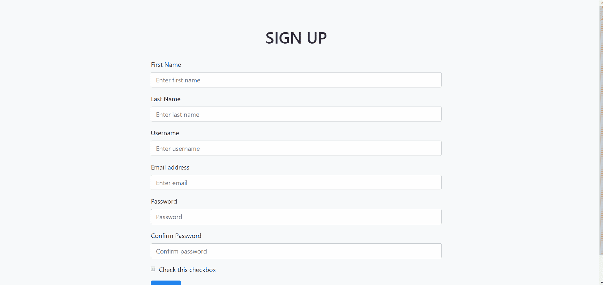
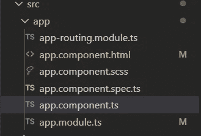
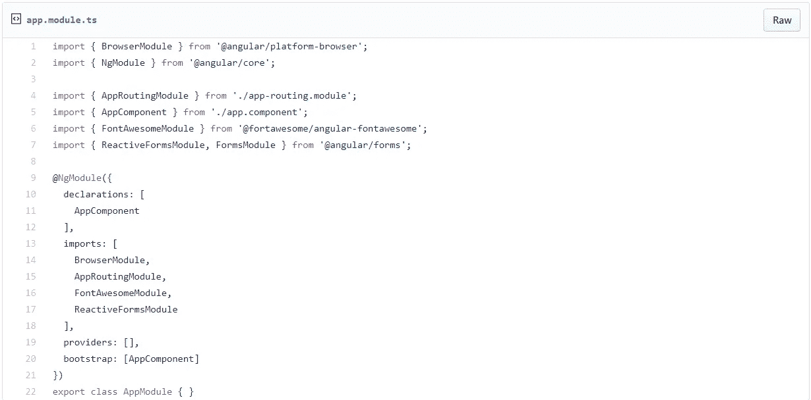
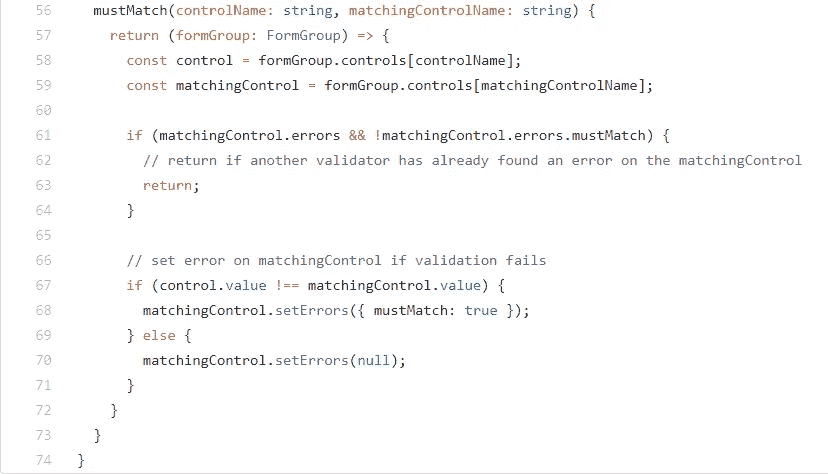
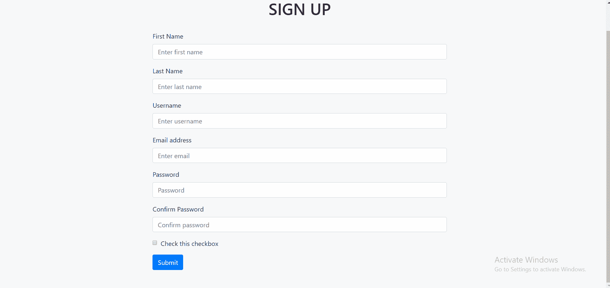

# 反应式表单验证，平滑滚动到角度 8 中的错误

> 原文：<https://levelup.gitconnected.com/reactive-form-validation-with-smooth-scrolling-to-errors-in-angular-8-57fa63b2689d>

## 通过平滑滚动到无效元素来聚焦表单错误

让我首先向您展示最终的结果:



最后结局

上面的动画显示，在您单击提交按钮后，您的屏幕将关注第一个验证错误，因为字段没有填写(无效表单)。因此，用户知道在提交表单之前需要检查哪些字段。

如果您有一个包含多个输入字段的长表单，这样您可以看到从底部到特定验证错误的平滑滚动，这是合适的，并且更具交互性。

让我们进行第一步。

# 用 Bootstrap 构建角度工程

这里我使用 Angular 8 和 Bootstrap 来设置这个项目。你可以点击[这里](https://medium.com/javascript-in-plain-english/build-angular-8-project-with-bootstrap-7b89775e5764)，查看我之前写的关于如何逐步建立 Angular 8 项目的文章。

我们在 Angular 中只使用了`app`组件，没有创建任何其他组件，因为它只涉及一个页面，下面是文件夹的结构。



文件夹结构

由于我们将使用反应式表单而不是模板驱动表单(我更熟悉)，我们需要将反应式表单模块导入到`app.module.ts`中。

**应用模块 ts**



应用程序模块

或者你可以在这里查看我的代码。

# 用验证器创建一个基本的注册表单

接下来，我们将创建一个基本的注册表单，其中包括输入字段，如名字、姓氏、用户名、电子邮件、密码和确认密码。您可以根据需要添加更多字段，以便在最后可以清楚地看到平滑滚动。

> 下面是我的[](https://gist.github.com/aimanrahmattt/e616a0e640082a13b826e4b83832dd1f)****和[**app . component . ts**](https://gist.github.com/aimanrahmattt/b4b5df9da5c95d857e1ee684582bd1ae)**。**这些文件包括我们在本文结束之前将要创建的所有函数和视图。****

****我们添加了`Validators.required`来确保在提交表单之前需要填写所有的字段。使用`Validators.pattern`而不是`Validators.email`来检查邮件有效性，因为我发现使用`Validators.email`时 **abc@gmail** 被认为是有效的。这就是为什么`Validators.pattern`在这里更受欢迎。模式如下:****

```
**Validators.pattern('[a-zA-Z0-9.-]{1,}@[a-zA-Z.-]{2,}[.]{1}[a-zA-Z]{3,}')**
```

****我们使用以下方法将密码的最小长度设置为 6 个字符:****

```
**Validators.minLength(6)**
```

****为了确保确认密码与输入的密码匹配，创建了一个新的名为`**mustMatch**`的自定义验证函数，如下所示:****

********

****mustMatch 函数****

****如果我们已经成功构建了表单，请尝试单击 submit 按钮，不要在表单中添加任何详细信息，验证错误应该会弹出，如下所示:****

********

****还没有滚动到第一个验证错误。接下来，我们将实现平滑滚动效果。****

# ****创建平滑滚动****

****为了实现平滑滚动，我们将使用 JavaScript 中的`scrollIntoView()`函数。****

****创建下面这两个函数，它们将完成工作。****

```
**scrollTo(el: Element): void {
   if (el) {
      el.scrollIntoView({ behavior: 'smooth', block: 'center' });
   }
}scrollToError(): void {
   const firstElementWithError = document.querySelector('.ng-  invalid[formControlName]');
   this.scrollTo(firstElementWithError);
}**
```

****`scrollIntoView`中的**行为**属性有 2 个值。默认情况下，它将设置为`auto`。您也可以设置**块**属性的值。我更喜欢把它设置为`center`，因为它会聚焦在你屏幕的中央。点击[此处](https://developer.mozilla.org/en-US/docs/Web/API/Element/scrollIntoView)查看关于`scrollIntoView`的详细说明。****

****`querySelector()`用于查找和选择页面上你想要关注的元素。这里我们将找到属性为`formControlName`的`ng-invalid`类。****

****这里再次是[app.component.html](https://gist.github.com/aimanrahmattt/e616a0e640082a13b826e4b83832dd1f)和 [app.component.ts](https://gist.github.com/aimanrahmattt/b4b5df9da5c95d857e1ee684582bd1ae) 你可以参考完成本教程。****

# ****结论****

****在本文中，我们学习了如何创建一个完整的带有多重验证的反应式表单。****

****我们还实现了平滑滚动，以关注验证错误，为用户提供更好的交互。****

****如果你认为这篇文章是有帮助的，不要忘记与你的朋友分享。****

# ****资源****

1.  ****[https://developer . Mozilla . org/en-US/docs/Web/API/Element/scrollIntoView](https://developer.mozilla.org/en-US/docs/Web/API/Element/scrollIntoView)****