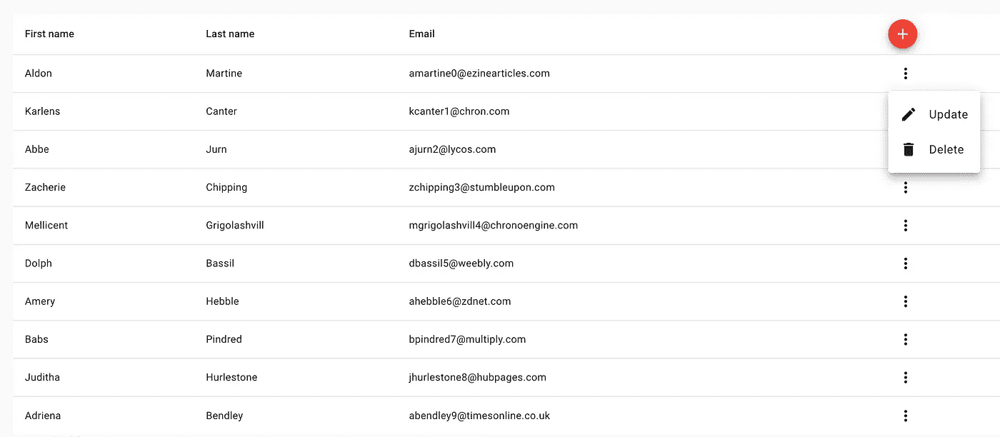

# RxJs ft 中的无功编程。有角的

> 原文：<https://levelup.gitconnected.com/reactive-programming-in-rxjs-ft-angular-eb0c63b809f7>

## 你的一生都是谎言


在我们的职业生涯中，我们大多数人都被教导要写一套指令并完成工作。它主要集中在“**如何**”而不是“**什么**”上，这完全有意义，而且学习如何解决问题也很重要，我们可以在下一个级别以更好的方式掌握写作技巧。当我说以更好的方式编写它时，我指的是将**最小的认知负荷**交给下一个开发人员。**让事情变得更简单**让下一个开发人员(以及未来的你自己)理解正在发生的事情(这段代码做什么)。

## 问题陈述



使用角形材料的用户列表

*   呈现从 API 获取的用户列表
*   **能够**添加**新用户(名字、姓氏和电子邮件)**
*   **更新现有用户的能力**
*   **能够**删除**现有用户**

## **被动第一的思维模式**

**从组件需要的动作和状态的角度来考虑，其中一切都是变量(可观察的流)，这可以被认为是一些增量的函数，这些增量(也是一些流)可以根据它们所具有的关系或依赖性使用 RxJs 操作符组合在一起。(例如 *sum$ = fn (delta1$，delta2$)* )**

## **行动**

```
// fire this to add a new user
addUserAction$$ = new Subject<IUser>();
// fire this to delete a user
deleteUserAction$$ = new Subject<IUser>();
// fire this update a user
updateUserAction$$ = new Subject<IUser>();
```

## **数据检索成员**

```
private fetchedUsers$ = this.http
    .get<IUser[]>('api/users');

private addUser(user: IUser) {
  return this.http.post<IUser>('api/users', user)
    .pipe(map(() => user));
}

private deleteUser(user: IUser) {
  return this.http
    .delete<IUser>(`api/users/${user.id}`)
    .pipe(map(() => user));
}

private updateUser(updatedUser: IUser) {
  return this.http
    .put<IUser>(`api/users/${updatedUser.id}`, updatedUser)
    .pipe(map(() => updatedUser));
}
```

## **用户事件**

```
private userAdded$ = this.addUserAction$$.pipe(
  switchMap((userToBeAdded) => this.addUser(userToBeAdded))
);

private userUpdated$ = this.updateUserAction$$.pipe(
  switchMap((userToBeUpdated) => this.updateUser(userToBeUpdated))
);

private userDeleted$ = this.deleteUserAction$$.pipe(
  switchMap((userToBeDeleted) => this.deleteUser(userToBeDeleted))
);
```

**这里，每个用户事件都是触发动作和 API 调用的函数。比如:`userAdded$`是`fn(addUserAction$$, addUserAPIRequest)`，`switchMap` (RxJs 运算符)用来支持这两个 deltas 之间的依赖关系，形成底层的`userAdded$`状态。**

```
userEvent$ = merge(this.userAdded$, this.userUpdated$, this.userDeleted$);
```

**这些事件中的任何一个触发，`userList$`都需要更新，因为`userList$`是`fetchedUsers$`和`userEvent$`之间的函数(依赖关系)**

```
userList$ = this.userEvent$.pipe(
    startWith(null),
    switchMap(() => this.fetchedUsers$)
);
```

**这是完整演示的链接👇**

**[](https://stackblitz.com/edit/angular-reactive-users?embed=1&file=src/app/user.service.ts) [## 被动用户 CRUD - StackBlitz

### 使用反应式(声明式)编程范例展示用户实体上的基本 CRUD 操作

stackblitz.com](https://stackblitz.com/edit/angular-reactive-users?embed=1&file=src/app/user.service.ts)** 

> **我会用同样的反应方法想出更多的场景，你的赞赏肯定会激励我。谢谢！😊**