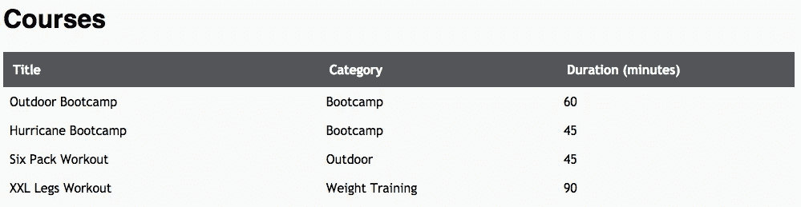

# 具有 Next.js 客户端的反应式 Spring Boot API

> 原文：<https://levelup.gitconnected.com/reactive-spring-boot-api-with-next-js-client-b08147ae5712>

让我们用一个很酷的反应式 UI 来扩展反应式 API 服务


马库斯·斯皮斯克在 [Unsplash](https://unsplash.com?utm_source=medium&utm_medium=referral) 上的照片

在这篇文章中，我想用一个用户界面来扩展我的[上一篇文章](/creating-a-reactive-restful-api-with-spring-boot-e706954f0633)中的课程服务 API。我也会继续走电抗元件这条路。

让我简单总结一下我们在上一篇文章中所做的事情。我们与 Spring Boot 合作创建了一项微服务，允许我们创建新的课程。我们已经向该服务添加了两个 GET 端点。一个传统的，允许检索所有课程。客户端可以订阅第二个端点，并通知他们新的课程。我们已经为此使用了 Spring Webflux。

现在我想用用户界面组件来扩展服务。

2015 年，我开始使用 Reactjs 来实现很酷的用户界面。我很快就被前端代码的良好结构迷住了。我还喜欢这样一个事实，你可以专注于“视图”而不用样板文件。最后但同样重要的是，您可以简单地更新单个页面元素，而不必重新加载整个页面。当然，之前也有类似的概念使得这成为可能。但是我一直觉得挺繁琐的。从那以后，只要方便或可能，我就使用 Reactjs。在过去的所有项目中，我都在客户端渲染 React。对我来说，通常没有什么大问题，因为它工作得很好，而且大部分公共 API 都被使用了。


React Web 应用程序连接到运行在 Kubernetes 上的微服务后端

大多数系统的设计如上图所示。业务逻辑被分割成小的独立服务，这些服务在 Kubernetes 集群上展开。各个服务通过 NGINX 入口控制器向外界公开。用户界面是作为独立的应用程序实现的，并在专用的 web 服务器上推出。API 网关允许 React 应用程序访问发布的 REST 端点。在我看来，这是一种非常普通的方式。

但是，如果我想让每个服务都有自己的 UI 组件，并在 Kubernetes 集群上推出它，该怎么办呢？


在 Kubernetes 上的一个 pod 中运行 React UI 容器和 REST API 容器

我想在每个微服务的一个 Kubernetes pod 中部署 REST API 和客户端组件，如上图所示。例如，在这种情况下，我们可以确保 API 和 UI 之间没有版本冲突，因为我们可以使用相同的发布管道推出两个容器。

但是在这种情况下，我必须避免的是，UI 组件是在客户端呈现的，因此必须通过 API 网关回调到集群中，才能到达其服务的 API 端点。

此时，服务器端呈现(SSR)开始发挥作用。服务器端渲染是指在网站的服务器上渲染网站的 JavaScript。

我不想在本文中深入探讨服务器端呈现的利弊。然而，一个优势是在任何情况下网页的性能。缺点是服务器端需要更多的负载来进行渲染。无论如何，我主要关心的是，我们可以通过 UI 交付微服务，对于 UI 组件，API 调用是通过公共端点进行的。

我计划使用 NGINX 作为入口控制器，它将把来自互联网的请求路由到各个微服务的相应用户界面。UI 组件与 REST API 的通信应该在 Kubernetes 中从一个容器到另一个容器进行，或者用 Kubernetes 的话说:UI 容器通过服务资源层调用 REST API 容器。在本文中，我不会讨论 Kubernetes 集群上的服务组件的操作。我将在下一篇文章中更详细地讨论这个问题。

首先，我们将在 REST API 项目中添加一个 UI 客户端，这是我们在上一篇文章中用 Spring Boot/ Webflux 创建的。这个我想用 Next.js。如果你没有听说过 Next.js:它是一个服务器渲染的 React 应用程序的极简框架。在我看来，Next.js 提供了一个现成的平台。你可以安装它。你已经具备了启动我们项目所需的一切。

使用 Next.js 的原因是，如前所述，一方面我想使用 React.js，但另一方面我想呈现服务器端。没有 Next.js 这当然也是可能的，但当然不是没有相应的努力。

最后让我们将 UI 组件集成到上次创建的课程微服务中。目前([源自上一篇文章](/creating-a-reactive-restful-api-with-spring-boot-e706954f0633))我们有以下可用的项目结构，见下图。


项目结构-课程服务 Spring Boot REST API

# 创建并准备 Next.js 客户机

让我们在与 */src* 文件夹相同的层次上创建客户端应用程序。我们可以使用下面的命令很容易地做到这一点。

现在我们有了下面的项目结构。

好消息是，我们的课程服务客户端应用程序已经启动并运行。

我们可以用命令来测试这个:***$ CD client&&yarn dev***

之后，我们可以简单地在浏览器中调用 [http://localhost:3000](http://localhost:3000) 来查看典型的 Next.js 索引页面。

我们还记得上一篇文章中的场景。REST API 创建了以下端点。

现在我们将需要这些端点来实现用户界面。基本上我们需要两个页面:一个页面列出所有课程，另一个页面允许创建新的课程。

在开始之前，我们可以从刚刚创建的 Next.js 应用程序中删除一些东西。在文件夹*页面*中有一个文件夹 *api* 。该文件夹的内容可以被删除。在文件夹 *styles* 中，我们也可以删除文件 *Home.modules.css* ，因为我们不需要其中定义的样式。

首先，让我们定义一些 CSS。您可以将以下样式复制/粘贴到文件夹 *styles* 中已经存在的 *global.css* 中。这没什么特别的，我们也不会拿设计师冠军。但是我们稍后需要它来显示创建新课程的表格和表单。

接下来，我想调整*索引*页面，以便我们看到现有课程的列表。在我的上一篇文章中，我描述了如何使用 H2 内存数据库运行我们的 API。为了最初有一些可用的数据，我现在将使用一个数据初始化器类来扩展我们的 Spring Boot Rest API，以创建一些示例数据。

# 调整 Spring Boot API

因此，我将类 *CategoryInitializer* 重命名为 *DataInitializer* ，并使用私有方法 *createExampleCourses* 对其进行扩展，如以下代码片段所示。

```
private void createExampleCourses(List<Category> categories){
    List<Course> courses = new ArrayList<>() {
        {
            add(new Course("Outdoor Bootcamp", categories.get(0), UUID.*randomUUID*(), 60L));
            add(new Course("Hurricane Bootcamp", categories.get(0), UUID.*randomUUID*(), 45L));
            add(new Course("Six Pack Workout", categories.get(3), UUID.*randomUUID*(), 45L));
            add(new Course("XXL Legs Workout", categories.get(4), UUID.*randomUUID*(), 90L));
        }
    };

    this.courseRepository.saveAll(courses);
    *log*.debug("Sample courses created.");
}
```

在创建完所有类别后，这个新方法由 ApplicationEvent 方法上的*调用。*

```
@Override
public void onApplicationEvent(ApplicationReadyEvent applicationReadyEvent) {
    ...

    this.createExampleCourses(categories);
}
```

如果我们现在重新启动我们的 Spring Boot 应用程序，将会创建四个示例课程。这些将首先作为列表显示在我们新的 Next.js 的索引页面中。

在文件夹页面中，我们找到一个名为 Index.js 的文件。我们现在用函数 *getInitialProps* 扩展它，以从 REST API 获取数据，如下所示。

```
Index.getInitialProps = async () => {
  const res = await fetch('http://localhost:4500/course');
  const json = await res.json();
  return {
      courses: json
  }
};
```

Next.js 提供 *getStaticProps* 和 *getServerSideProp* 获取数据。它们主要用于从外部来源获取数据。通过这样做， *getInitialProps* 可以专注于准备在呈现页面之前填充的属性。

现在让我们用下面的代码替换现有的 *home* 函数。如上所述，在呈现之前，最初将在服务器端获取课程列表。

```
const Index = ({ courses }) => {
  const courseList = courses.map(course => {
    return <tr key={course.id}>
      <td style={{whiteSpace: 'nowrap'}}>{course.title}</td>
      <td>{course.categoryTitle}</td>
      <td>{course.duration}</td>
    </tr>
  });

  return (
    <div >
      <Head>
        <title>Course Service Example</title>
        <link rel="icon" href="/favicon.ico" />
      </Head>

      <div>
        <h1>Courses</h1>
        <table>
          <thead>
          <tr>
            <th width="40%">Title</th>
            <th width="30%">Category</th>
            <th width="30%">Duration (minutes)</th>
          </tr>
          </thead>
          <tbody>
          {courseList}
          </tbody>
        </table>
      </div>
    </div>
  )
}... // getInitialPropsexport default Index;
```

如果我们现在调用 ***纱 dev*** ，然后在浏览器中转到[*http://localhost:3000*](http://localhost:3000)，我们得到如下页面。



下面的输出是通过调用 ***yarn build*** 创建的。图中显示*索引*页面是一个服务器文件。我们通过页面名称'/'左边的λ符号 ***λ*** 来识别这一点。


# 但是，小心！！！

构建输出表明数据是在服务器端获取的。而这也发生在你直接调用页面的时候。你可以在浏览器的控制台日志中很好地看到这一点，因为当你直接调用页面时，控制台日志中没有任何输出。这是因为数据是从服务器获取的。基本上正是我们想要的。
但是当我开始使用 Next.js 时，有一个问题让我绝望:如果我们从另一个位置导航到这个页面，例如来自 Next.js 库的组件 *< Link / >* ，数据将在客户端获取。

为了防止这种情况，我们必须使用***getServerSideProps***而不是 *getInitialProps* ，参见下面的代码示例。在我们的例子中，这比经典的混合方法 *getInitialProps 要好得多。*

```
export const getServerSideProps = async () => {
  ***console***.log("Fetch data...");
  const res = await fetch('http://localhost:4500/course');
  const json = await res.json();
  return { props: {
      courses: json
    }
  }
};
```

# “创建课程”页面

现在让我们创建一个新页面，通过 UI 添加新的课程。为此，我们在 */pages* 中创建了一个名为 course.js 的新文件。

在下图中，我们看到了页面应该是什么样子。


在浏览器中创建课程页面

您可以看到，我们有一个选择框，用户可以在其中选择课程的类别。当然，为此我们必须请求 REST API。如前所述，我们必须在服务器端完成这项工作。因此，我们再次需要一个 getServerSideProps 函数来检索可用的类别，请参见下面的代码片段。

```
export const getServerSideProps = async () => {
    const res = await fetch(
          `http://localhost:4500/course/category`);
    const data = await res.json();
    return { props: {
            categories: data,
            userId: uuid() // Fake user id
        }
    }
}
```

在这个函数中，我们加载初始的*属性*，即类别列表和一个随机的用户标识。我们稍后调用 POST 端点时需要这个 ID。因为我们还没有集成身份验证，所以我们没有当前用户的 ID。为了生成一个随机的 UUID，我使用了节点模块“uuid”。

添加此模块:

> $纱线添加 uuid

作为一个 Create Course 组件或页面，我现在实现了一个 React 挂钩，并为该组件提供了在服务器端创建的 *props* 。

```
const NewCourse = ({ categories, userId }) => {
    return <div>
      <h1>Create New Course</h1>
        <form onSubmit={handleSubmit}>
        ...
    </div>}export default NewCourse;
```

如代码片段所示，我们将使用 *onSubmit* 处理程序构建一个调用函数 *handleSubmit* 的表单。

这个 *handleSubmit* 函数成为我们的 *React* 钩子的一部分，负责向 API 发送数据。

```
const handleSubmit = async(e) => {
    e.preventDefault(); await fetch(`http://localhost:4500/course`, {
        method: 'POST',
        headers: {
            'Accept': 'application/json',
            'Content-Type': 'application/json'
        },
        body: ***JSON***.stringify(course),
    }).then(res => {
        if(res.status === 200){
            setSaved(true);
        }else{
            setError('Error: ' + res.status + ' :: ' 
              + res.statusText);
        }
    });
}
```

但是当我们在客户端代码中直接调用 *fetch* 时会发生什么呢？只要我们在本地开发环境中运行服务，它就能完美地工作，在本地开发环境中，我们可以访问 *localhost:4500* 。在实际情况下，只有通过公共端点才能访问 API。

但是我们的目标是在服务器端执行与后端的通信。Next.js 提供了一种很好的方式来实现这一点，即 */api* 路线。文件夹*/页面*下面是文件夹 */api* 。我们在 */pages/api* 中定义的一切都被路由到 */api/** 。基本上，这是一种提供自己的 API 的方式。/api 文件夹中的所有内容都是服务器端绑定的，与客户端绑定无关。

这意味着我们需要我们的 REST API 调用作为 next.js 应用程序中的 */api* 路由。因此我们创建一个新文件夹 */pages/api/course* ，并在新文件夹中创建一个文件 *index.js.*

为了舒适清晰地定义路由处理程序，我使用了轻量级库 next-connect。

> $纱线添加下一个-连接

通过将以下代码添加到 */course* 文件夹中的新 *index.js* 文件中，我们已经有了一个使用 Next.js 的工作 API 路径。

```
import nextConnect from 'next-connect';
const ***handler*** = nextConnect();***handler***.post(async (req, res) => {
    ***console***.log("api call");

    const course = req.body.course;

    await fetch(`http://localhost:4500/course`, {
        method: 'POST',
        headers: {
            'Accept': 'application/json',
            'Content-Type': 'application/json'
        },
        body: ***JSON***.stringify(course),
    }).then(r => {
        if(r.status === 201){
            res.json({ message: "ok" });
        }else{
            res.status(r.status).json({status: r.status, message: r.statusText})
        }
    });
});

export default ***handler***;
```

基本上，我们将 REST API 调用移到了应用程序的服务器端包中。从课程页面代码( *React Hook* )中，我们现在可以通过简单地处理对 */api/course 的 *POST* 调用来处理我们的新 API，*参见下面的代码示例。

```
const handleSubmit = async (e) => {
    e.preventDefault();
    await fetch('/api/course', {
        method: 'POST',
        headers: {
            'Accept': 'application/json',
            'Content-Type': 'application/json'
        },
        body: ***JSON***.stringify({
            course: course,
        }),
    }).then(res => {
        if(res.status === 200){
            setSaved(true);
        }else{
            setError('Error: ' + res.status + ' :: ' + res.statusText);
        }
    });
}
```

酷，现在我们已经有我们的网站来创建新的课程，它执行所有必要的请求到 Spring Boot 后端服务器端。

# **无功课程列表**

现在我们来看看这个小应用的亮点。当然，我们不希望**用户 A** 在**用户 B** 添加新课程时不得不重新加载他的可用课程列表。

为此，我们必须订阅我们的 Spring Boot REST API 的 SSE 流。在上一篇文章中，我们已经从终端和邮递员的角度研究过这个问题。


用户 A 添加了新的费率，这更新了用户 b 的列表。

通过我们到目前为止所做的一切，我们已经获得了足够的知识来实现这一部分。我们知道，我们不允许在 *React Hook* 中对 REST API 进行任何调用，因为它们会在客户端执行。在“创建课程”部分，我们展示了可以使用 Next.js 的 */api* 路径来创建服务器端包。
我们已经为客户端代码实现了一个可以通过端点 */api/course* 调用的 POST 处理程序。
现在，我们要从 Spring Boot API 订阅课程更新(*服务器发送事件*)需要做些什么？
我们必须实现一个 SSE 客户端。为此，我们首先将依赖项 **eventsource** 添加到我们的项目中。

> $ yarn 添加事件源

并将此模块导入到课程 API 模块中( */api/course/index.js* )。

```
import EventSource from 'eventsource';
```

现在我们能够通过 node.js 订阅服务器发送事件。

```
const stream = async (req, res) => {
    ***console***.log("connect to sse stream");

    let eventSource = new EventSource(`${API_HOST}/course/sse`);
    eventSource.onopen = (e) => { ***console***.log('listen to sse endpoint now', e)};
    eventSource.onmessage = (e) => {
        res.flushData(e.data);
    };
    eventSource.onerror = (e) => { ***console***.log('error', e )};

    // close connection (detach subscriber)
    res.on('close', () => {
        ***console***.log("close connection...");
        eventSource.close();
        eventSource = null;
        res.end();
    });
}
```

事件发生时( *onmessage* )，调用 *flushData* ，传输接收到的数据。为此我们必须实现一个*中间件*，它基本上只是一个小功能，见下一段代码。

```
const sseMiddleware = (req, res, next) => {
    res.setHeader('Content-Type', 'text/event-stream');
    res.setHeader('Cache-Control', 'no-cache');
    res.flushHeaders();

    const flushData = (data) => {
        const sseFormattedResponse = `data: ${data}\n\n`;
        res.write("event: message\n");
        res.write(sseFormattedResponse);
        res.flush();
    }

    ***Object***.assign(res, {
        flushData
    });

    next();
}
```

基本上，我们设置所需的响应头，并确保响应的格式正确，并且编写正确。

现在，我们可以从客户端代码使用这个 API 端点，并且确保到 Spring Boot 后端的连接是服务器端的，不需要公共 API 端点。

以下代码显示了课程列表页面(/pages/index.js)如何订阅新的 node.js SSE 端点。 *Onmessage* 将接收到的数据从流解析到 JSON，并将新数据推送到课程列表。

```
useEffect(() => {
  let eventSource = new ***EventSource***(`/api/course`);
  eventSource.onopen = (e) => { ***console***.log('listen to api-sse endpoint', e)};

  eventSource.onmessage = (e) => {
    const course = ***JSON***.parse(e.data);

    if (!courses.includes(course)){
      setCourses( courses => [...courses, course]);
    }
  };

  eventSource.onerror = (e) => { ***console***.log('error', e )};

  // returned function will be called on component unmount
  return () => {
    eventSource.close();
    eventSource = null;
  }
},[])
```

就是这样，所以课程列表能够收听新事件并更新列表。

在我看来，一旦你理解了 Next.js 的工作原理以及在哪里放置哪些功能，它的概念就非常清晰，并且易于使用。说实话，刚开始的时候我有时候有点迷茫。

和往常一样，你可以在 GitHub 上找到整个项目。开心快乐编码！

在我的下一篇文章中，我将展示如何在 Kubernetes 集群上安装和运行 Spring Boot API 服务和 Next.js 前端应用程序。

我总是乐于收到反馈、建议、批评或问题。如果你喜欢这篇文章，或者对当前的问题有所帮助，那么请在这里留下你的掌声。

干杯！