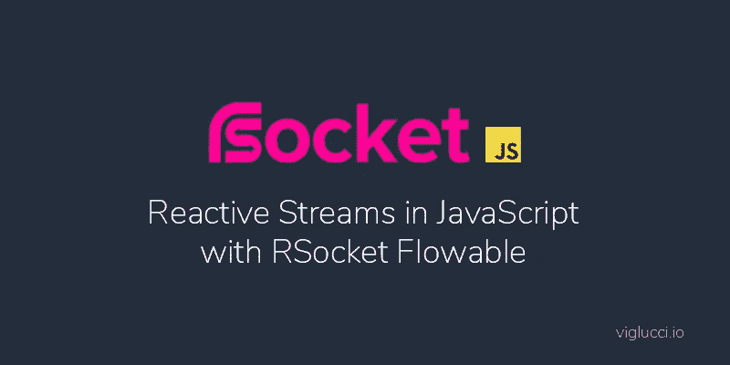

# 使用 RSocket flow 的 JavaScript 中的反应流

> 原文：<https://levelup.gitconnected.com/reactive-streams-in-javascript-with-rsocket-flowable-683097ff91eb>

*使用 rsocket-flow 在 JavaScript 中进行消息流、反压、取消和异步编程。*

在编程异步操作时，JavaScript 开发人员通常至少熟悉承诺、异步/等待和回调。然而，较新的异步模型，如 react vex(JavaScript 中的 [RxJS](https://github.com/ReactiveX/rxjs) )，并不那么受欢迎。在本文中，我们深入探讨与 RxJS 相似但略有不同的东西；一个名为[RSocket flow](https://github.com/rsocket/rsocket-js/blob/master/docs/03-flowable-api.md)的反应流实现(RSocket-flow on NPM)。

# 核心概念

r socket flow 的核心是观察者模式，通过**单个**和**可流动**接口在 r socket-flow 中实现。

> *观察者模式是一种软件设计模式，其中一个名为主题的对象维护一个名为观察者的依赖者列表，并自动通知它们任何状态变化，通常是通过调用它们的方法之一。*[【https://en.wikipedia.org/wiki/Observer_pattern】T21](https://en.wikipedia.org/wiki/Observer_pattern)

# 单一和可流动的界面

Single 是一个可观察的接口，支持以下交互:

*   通过`subscriber.onComplete`回调发出单个值
*   通过`subscriber.onError`回调发出一个错误值
*   通过`cancel`回调的取消通过`onSubscribe`回调传递给观察者

除了取消，这些操作应该感觉很熟悉，因为它们与承诺的交互几乎相同，因为承诺只能解决或拒绝。

## 单一示例

消费单一接口的一个实际例子是包装一个 promise API/操作，比如`fetch` API。在下面的例子中，我们就是这样做的；我们创建了一个新的 Single 实例，当订阅该实例时，它将调用 Starwars API 来检索有关卢克·天行者的数据。

可流动是支持以下交互的可观察界面:

*   通过`subscriber.onComplete`回调发出单个值
*   当订阅**请求回调**被调用时，通过`subscriber.onNext`回调发出一个或多个值
*   通过`subscriber.onError`回调发出一个或多个错误值
*   通过`cancel`回调的取消通过`onSubscribe`回调传递给观察者

“可流动”与“单一”在根本上不同，因为我们期望“可流动”发出一个或多个值。Single 只应该发出单个值或没有值。此外，可流动支持背压的概念。

来自《反应宣言》:

> *…背压是一种重要的反馈机制，它允许系统优雅地响应负载，而不是在负载下崩溃*[*https://www.reactivemanifesto.org/glossary#Back-Pressure*](https://www.reactivemanifesto.org/glossary#Back-Pressure)

背压的概念并不完全是 rsocket-flow 独有的，但与通过 RxJS 提供的背压支持相比，它更简单。用最简单的话来说，可流动的反压支持允许观察者控制被观察物发出或“发布”值的速率。为了支持这一点，**可流动接口接受必须实现请求方法**的订户。这个请求方法充当回调，负责根据观察者的请求“发布”值。

request 方法负责以观察器请求的速率发布数据，观察器通过传递一个表示它可以处理的事件数量的 int 值来控制数据流。

在这个例子中，调用`sub.request(3)`将导致用值`0, 1, 2`调用`onNext()`。

对于更复杂的“真实世界”使用示例，请阅读标记为“可流动代码示例解释”的利用可流动算法的详细解释，或者直接跳到标记为“可流动代码示例”的相应代码示例

下面我们实现了一个可流动的发布器，它将为每部包含卢克·天行者角色的电影发送从星球大战 API 中检索到的数据。为了实现这一点，我们实现了传递给`filmsSubscriber.onSubscribe()`的订阅对象的请求方法，该方法大致遵循以下算法:

第一次调用请求方法时:

*   从星球大战 API 中获取卢克·天行者的数据，并从响应中销毁电影数组。将电影集合保存到一个`pendingFilms`变量中，这样我们可以在后续调用`request`时引用它。

第一次调用 request 方法时，以及以后每次调用 request 时:

*   遍历`pendingFilms`数组中的每个 URL。
*   如果我们请求了观察者所请求的电影数量，则中断循环(`requestedFilmsCount`)。
*   如果加载了所有电影的数据，则中断循环。
*   从`pendingFilms`列表中检索电影的新 URL。
*   获取从`pendingFilms`列表中删除的电影的数据，并将得到的承诺添加到未完成的承诺数组中(`fetches`)。
*   一旦承诺完成，将结果数据传递给`filmsSubscriber.onNext(filmData)`。
*   如果承诺拒绝，则将产生的错误传递给`filmsSubscriber.onError(err)`。
*   一旦保存到 unsettled promises 数组(`fetches`)的所有承诺都已解决，检查我们是否还有尚未加载数据的电影。
*   如果还有电影还没有加载数据，什么都不做，等待观察者对其订阅执行对`request`的后续调用。
*   如果没有更多的电影等待加载，调用`filmsSubscriber.onComplete()`，这将向观察者表示所有可能的数据都已加载。

这种算法比利用`Single`转发承诺结果这种更简单的情况要复杂得多。然而，对控制我们提取额外数据的速率的支持，以及对取消的支持(通过小的调整)，使得增加的可流动的复杂性成为一个值得的权衡。

# 懒惰的可观测量

由 rsocket-flowerable 实现的可观察接口是“懒惰的”，这意味着在观察者订阅可观察接口之前没有“工作”开始。这些可观测量也可以被称为“冷可观测量”，这与“热可观测量”相反。当处理热可观察对象时，无论是否存在任何观察对象，可观察对象都可能发出值。

相比之下，您可能已经熟悉了承诺形式的“热切”或“热”界面的概念。对于 Promise，一旦创建了 Promise 实例，就会调用传递给 Promise 构造函数的回调函数(或者，如果您想更具体一些，可以在事件循环的下一个节拍调用)。

如果一棵树倒在树林里是一个热的可观测物，它会发出声音，不管周围是否有人听到。

在上面的例子中，无论`.then()`原型方法是否被调用，传递给 Promise 构造函数的回调中的`setTimeout`方法都会被调用。您可以通过将上面的示例复制到您的浏览器的 dev tools 控制台来验证这一点，在那里您会看到立即打印出一个控制台日志行，大约一秒钟后，紧接着是一个随机 int 值。

# 取消

取消是可观察接口的一个强大特性，比如 rsocket-flow。取消允许观察者向被观察者表明他们对正在进行的任何操作的结果不再感兴趣。在用 ReactJS 这样的框架编写用户界面时，取消是很有用的，在 react js 这样的框架中，能够取消正在进行的异步操作对于清除状态以避免卸载组件时的副作用是必不可少的。当使用 WebSockets 之类的协议实现有状态 web 服务时，取消支持也很有用，在这种情况下，客户端可以随时终止它们的连接，并且在它们断开连接后继续代表它们执行操作可能没有意义。

在下面的示例中，我们创建了一个可流动的实例，它将发出一个整数值，直到被取消，订阅者每 500 毫秒(半秒钟)请求一个随机数。订户将在三秒钟后额外取消 int 流。这个例子类似于如何实现异步操作的超时，比如网络请求或文件读取。

重要的是要理解，取消可观察的流仅指示可观察的订阅者不再关心接收更新，它不会自动取消发布者可能已经执行的任何操作。如果被取消的反应对你的观察对象来说是至关重要的，那么你可以实现`subscription.cancel`回调来根据需要执行清理。

最后，使用`rsocket-flowable@0.0.14`，为了避免下面的类型错误，如果您打算从订阅者调用 cancel，您必须在发布者上实现 cancel 回调。

# r socket flow 的未来

在之前的一篇文章[JavaScript 中 RSocket 的状态](https://gist.github.com/the-state-of-rsocket-in-javascript)中，我们回顾了 rsocket-js 的未来是如何不确定的，并且随着 rsocket-js 的维护者声明 r socket flow 可能会在未来被一个[新项目](https://github.com/rsocket/rsocket-js/issues/45#issuecomment-522035252)所取代，我对 r socket flow 也有同样的感觉。然而，GitHub 回购提议的替代已经超过 16 个月没有收到有意义的贡献，所以很难说这是否会发生。当然，这个项目也有可能在幕后开发，作为一个封闭源码项目，将来作为 OSS 发布。

# 最后的想法

诸如 RSocket 之类的进步支持可观察模式的持续采用。RSocket 对在系统中流畅流动的消息流进行建模，每个消息流都利用 ReactiveX 或 React Streams 实现。在发现 RSocket 之后，Reactive Streams 和 ReactiveX(在 JavaScript 中实现为 RxJS)在我身上成长起来，我相信在接下来的几年中，我们将继续看到这些模式的成长和采用。在 Java 生态系统中，通过流行的 Project Reactor，Reactive Streams 已经变得越来越流行。

如果构建高度可伸缩的反应式微服务和实时接口引起了您的兴趣，我建议您深入研究这些概念。

*最初发布于*[https://viglucci . io/reactive-streams-in-JavaScript-with-rsocket-flow](https://viglucci.io/reactive-streams-in-javascript-with-rsocket-flowable)