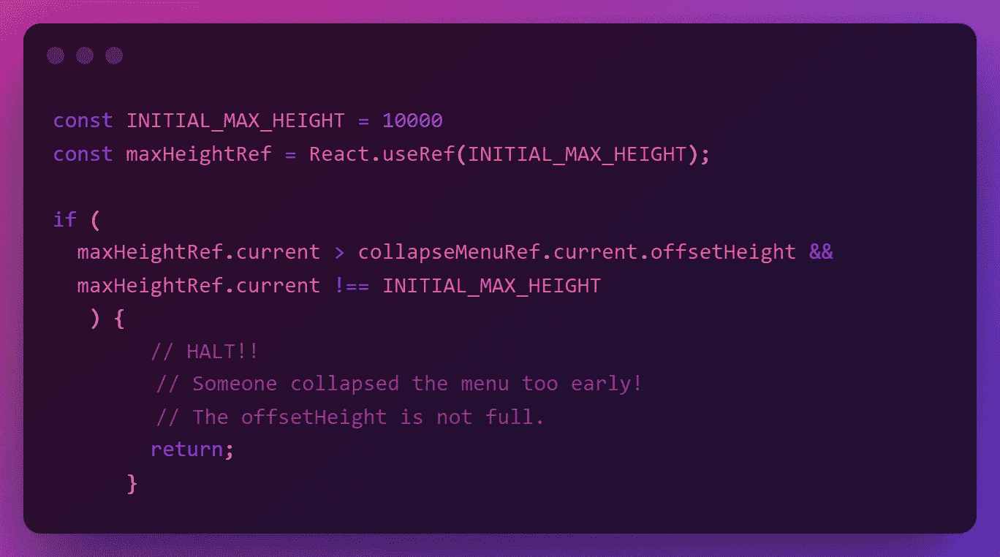

# ReactJS 方法:带有“高度:自动”或未知高度的动态动画。

> 原文：<https://levelup.gitconnected.com/reactjs-approach-dynamic-animation-with-height-auto-or-unknown-height-a55562e01f59>

在这篇文章中，我想分享我的解决方案，使用 Reactjs 中的`max-height`创建一个动态平滑的动画过渡。

# 介绍

最近我有一个任务，要做一个“可折叠菜单”，你可能知道，`height`没有平滑过渡，它是即时的。因此，我选择使用`max-height`，然而菜单中的内容对我来说是未知的，因此“最大高度”必须是一个`auto`，这意味着过渡将是生硬的…因此我不能使用纯 CSS 来制作动画…我最初的直觉是将`max-height`设置为一个大值，如 600，然而，其中一个菜单已经超过了高度，菜单修剪了其余的内容。

# 解决办法

首先，让我向您展示最终的输出，然后我将分解解决方案。

可以随意从这个嵌入中复制。

# 说明

> 重要的是在 React 中使用`useRef`进行 DOM 操作，并避免`getElementBy`…在组件挂载之后，不管组件的生命周期如何，您都可以继续访问 DOM 元素的引用。

下面，我保留了一个“折叠菜单”的参考。

这里我要在每次`isOpen`改变的时候触发`useEffect`的回调函数。

> 注意:在最终的输出中，我使用了`useReducer`，但是为了可读性，这里我保持了简单。

我使用标志`isFirstRender`的原因是因为菜单最初是折叠的(isOpen = false ),因此我无法判断它的高度。

然后，当菜单第一次打开时，我会将`isFirstRender`设置为 false…这很重要，我会在下面的代码片段中告诉你为什么。

> 注意:要访问 ref 对象，必须添加`.current`

对于第一次渲染，菜单将有一个非常高的`max-height`以避免修剪内容，然后我们将获得元素的高度并将其存储在一个`ref`中。

在这里，我正在检查菜单之前是否被打开过，或者`isFirstRender`是假的。如果为真，那么获取菜单的 DOM 元素的完整高度并存储在一个`ref`中，它将贯穿组件的整个生命周期。

`isFirstRender`的重要性在于避免在初始渲染时存储 DOM 元素的高度，因为它会在菜单折叠时存储菜单的高度。

## 边缘情况:用户在显示完整高度之前快速切换菜单。

我注意到当我在动画结束前快速切换菜单时，`maxHeightRef`存储了部分高度，所以我做了这个逻辑。

*   如果`maxHeightRef`大于菜单的当前高度？
*   如果`maxHeightRef`不等于初始`max-height` (10000)？

那就停下来！否则…继续。

最后，我发现使用`className`不能很好地处理模板字符串(` `)，所以我选择使用内联`style`。

就是这样。感谢阅读。

欢迎在 GitHub 上关注我:[https://github.com/AbdelrhmanAmin](https://github.com/AbdelrhmanAmin)