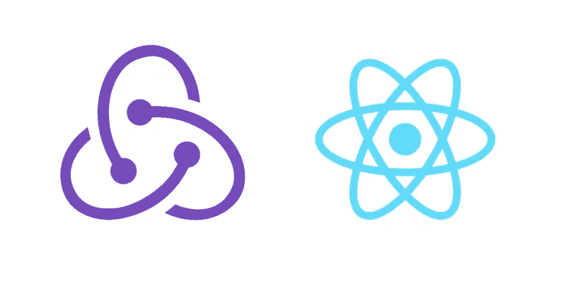

# ReactJS:使用 Redux 创建高级应用程序

> 原文：<https://levelup.gitconnected.com/reactjs-create-an-advance-app-using-redux-5da4835318de>

React 是一个基于组件的用户界面库。小组件总是好的，因为它们有特定的功能。React 遵循 Unix 哲学做一件事，并把它做好。当我们有小组件时，它们需要相互协调。为了相互协调，组件需要传递数据。React 提供了在组件之间传递数据的方法。这些方法是道具和回调。然而，我们可以使用诸如 RxJS 之类的库来创建行为主体，以便在组件之间传递数据。然而，随着应用程序开始增长，将数据从一个组件遍历到另一个组件变得更加复杂。



# 为什么和什么时候 Redux？

*   Redux 是 React 应用程序中可预测的集中式单一状态源。
*   当组件中存在非分层数据时，Redux 非常有用。Redux 将允许我们与不可变的单一数据存储进行对话。
*   Redux 解决了 React 中道具钻 ***的问题。当两个兄弟组件想要交互时，正确钻孔是一个问题。为了进行交互，兄弟组件必须遍历父组件。这种层次遍历需要传递数据。Redux 为这类问题提供了最优雅的解决方案。***
*   当应用程序中有许多操作时，Redux 很有用。即读、写、删除和按 id 获取等。

# Redux 的核心概念

以下是 Redux 的核心理念:

**动作创建者-** 动作只是定义事件的普通对象。这不是必须的，但拥有它是件好事。即在所有应用程序中都有添加、删除、更新动作。

**Store-** Redux store 是真实的单一来源。存储是不可变的。因此，如果有更新并在存储中添加新信息，将创建对象或数组的新副本。制作单个存储易于维护应用程序的状态。拥有单一存储将减少在多个位置存储相同数据副本的机会。

**Reducer-**Reducer 是一种接受状态和动作的方法。还原剂必须是纯功能的，它们不应该产生任何副作用。副作用意味着在 reducer 中不应该有任何 API 调用。减速器中也永远不会出现变异状态。总是创建状态的副本，应用更改，然后返回。

# 建筑高级应用

足够的理论让我们使用 react 构建一个高级应用程序。首先，我们使用 react 构建一个应用程序，在运行一个工作应用程序后，实现 redux。对于演示，我们正在构建产品组件。该产品具有产品 id、产品名称、产品代码和产品描述。我们将建立由产品细节组成的产品表单页面。填写并提交产品表单后，我们将在产品列表组件中显示产品列表。还有两个组件 home page 和 about page，使应用程序更加美观。下面是 stackblitz 中产品页面和运行应用程序的截图。


应用程序的文件夹结构如下。组件文件夹 common、pages 和 redux 中有三个文件夹。通用包含所有标题、关于和主页。pages 文件夹包含与应用程序相关的页面，即产品表单和产品列表。redux 文件夹包含操作、reducer 和配置存储。

```
App
  └── components
      ├── common
      │     └── Home, PageHeader, About Pages
      │
      ├── pages
      │     └── Product, ProductList
      │
      ├── redux
            └── Action, Reducer, configStores
```

# 构建应用程序页面

要构建公共页面，请创建组件文件夹。创建三个组件:标题、关于页面和主页。在表头组件中从`react-router-dom`导入`NavLink`。这将允许我们在应用程序中本地导航页面。产品导航将路由到我们稍后将讨论的产品表单。下面是完整的头文件。

现在创建产品表单。产品有产品名称、产品代码、产品类别和产品描述。像下面的代码一样初始化产品状态。

```
state = {product: {productID:””,productName: “”,productCode: “”,productdescription: “”,}}
```

我们正在为所有的输入控件创建一个单独的处理程序。该处理程序接受输入控件的名称和值，并将其设置为当前状态。

```
onChange = (e) => {const value = e.target.value;const product = { …this.state.product, [e.target.name]: value };this.setState({ product});}
```

完整的产品表单组件将类似于下面的代码:

# 设置 Redux 基础设施:创建动作、Reducer 和存储

安装 redux 既有趣又乏味。这需要大量的实践和大量的代码。但一旦设置得当，它就能发挥魅力。redux 配置的第一步是构建动作。在我们的例子中，通过 id，动作是`ADDPRODUCT`、`DELETEPRODUCT`、`UPDATEPRODUCT`。定义一个常量文件为`actionTypes`。

```
export const ADDPRODUCT = ‘ADDPRODUCT’;export const DELETEPRODUCT = ‘DELETEPRODUCT’;
```

创建产品操作，如下面的代码所示:

```
import * as types from “./actionTypes”;export function addProduct(product) {return { type: types.ADDPRODUCT, product };}export function deleteProduct(product) {return { type: types.DELETEPRODUCT, product };}
```

一旦设置了动作，就定义缩减器。Reducer 是一个接受状态和动作类型的纯函数。

```
import * as types from “./actionTypes”;export default function productReducer(state = [], action) {switch (action.type) {case types.ADDPRODUCT:return […state, { …action.product }];default:return state;}}
```

这里需要注意的重要一点是，我们没有更新状态，而是使用了 spread 操作符。这将允许我们创建状态的新副本并返回它。

```
return […state, { …action.product }];
```

创建一个`index.js`文件来组合减速器。导入`product`减速器。从 redux 导入`combineReducers`。写下面几行代码来合并 reducer。

```
import { combineReducers } from “redux”;import products from “./productReducer”;const rootReducer = combineReducers({products});export default rootReducer;
```

现在创建一个`configureStore`文件并导入根缩减器。编写一个默认方法`configureStore`，它接受`initialState`作为参数，并在创建商店时设置它。`window.__REDUX_DEVTOOLS_EXTENSION_COMPOSE__`将允许 redux 工具查看和处理商店数据。

```
import { createStore, applyMiddleware, compose } from “redux”;import rootReducer from “./index”;import reduxImmutableStateInvariant from “redux-immutable-state-invariant”;export default function configureStore(initialState) {const composeEnhancers =window.__REDUX_DEVTOOLS_EXTENSION_COMPOSE__ || compose; // add support for Redux dev toolsreturn createStore(rootReducer,initialState,composeEnhancers(applyMiddleware(reduxImmutableStateInvariant())));}
```

在处检查`devtool`延伸的反应[。截图如下。](https://chrome.google.com/webstore/detail/redux-devtools/lmhkpmbekcpmknklioeibfkpmmfibljd?hl=en)


哇，现在创建 redux 基础设施已经完成。现在我们可以在应用程序中使用 redux 了。

# 在应用程序中使用 Redux 存储

现在 redux 基础架构已经设置好，让我们在产品应用程序中使用它。从 redux 文件夹导入`configureStore`。

```
import configureStore from ‘./components/redux/configureStore’;const store = configureStore();
```

我们不能在 react 应用程序中直接使用 redux 存储。我们必须从 react-redux 库中导入 Provider。一旦导入了提供者，就在根 div 中包装提供者并传递存储。例如，检查下面的代码。

```
import { Provider as ReduxProvider } from “react-redux”;render() {return (<ReduxProvider store={store}>.....Store is available for all components.</ReduxProvider>);}
```

既然我们的组件已经准备好使用商店了。我们可以使用`productform`组件中的存储。要连接商店，请编写下面的连接代码。连接接受两个参数`mapStateToProps`和`mapDispatchToProps`。

```
export default connect(mapStateToProps,mapDispatchToProps)(ProductForm);
```

`mapStateToProps`发送我们想要设置的状态。`mapDispatchToProps`是我们想要调度的一组动作。

```
function mapStateToProps(state) {console.log(state);return {products: state.products};}function mapDispatchToProps(dispatch) {return {actions: bindActionCreators(productActions, dispatch)};}
```

React 有一些内置的类型检查功能。要对组件的属性进行类型检查，我们可以分配特殊的`propTypes`属性，如下所示。

```
ProductForm.propTypes = {products: PropTypes.array.isRequired,actions: PropTypes.object.isRequired};
```

完整的文件如下所示。

一旦我们可以提交产品表单并将表单对象添加到 state。我们可以迭代它。为了以表格形式展示，创建另一个组件，并将产品作为道具传递。这称为产品列表组件。在这个组件中，我们可以迭代产品。

```
{products.map(p => {return (<tr><td>{p.productName}</td><td>{p.productCode}</td><td>{p.productdescription}</td></tr>);})}
```

完整的产品列表组件看起来像下面的代码。

现在在`productForm`组件中导入`productList`。在产品元素中传递 this.state.products。

```
<ProdList products ={this.props.products} />
```

哇，现在我们的商店正在增加产品。我们可以提交产品并显示产品列表。哇，我们已经创建了一个先进的反应 redux 应用程序。


# 摘要

哇，我们已经创建了一个高级的 react-redux 应用程序。我们首先开始创建主页、产品和关于页面。向应用程序添加导航。然后，我们为我们的应用程序设置 redux 基础设施。一旦 redux 设置完成，我们就在应用程序中使用它。我们在产品表单页面中使用了 action，reducer。我已经附上了 Stackblitz 项目，请按照建立应用程序。

快乐阅读！