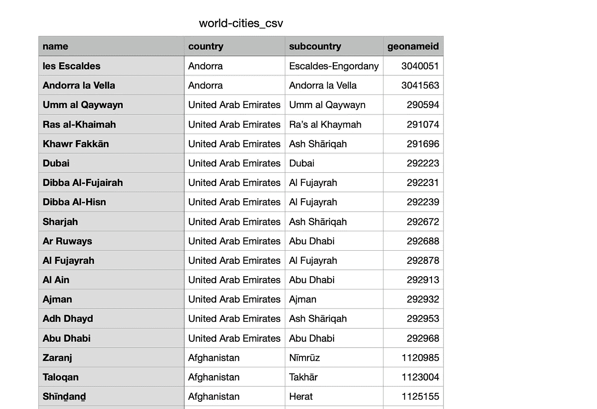
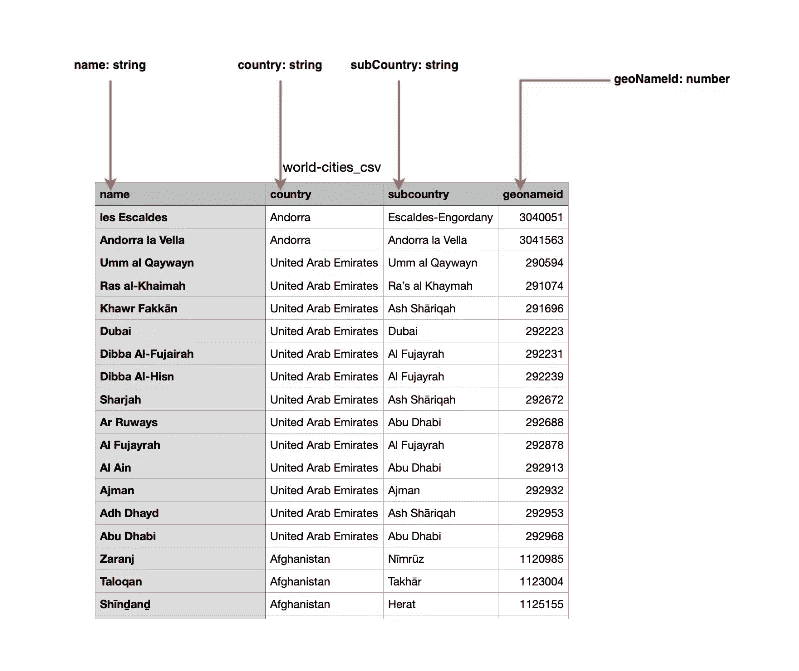
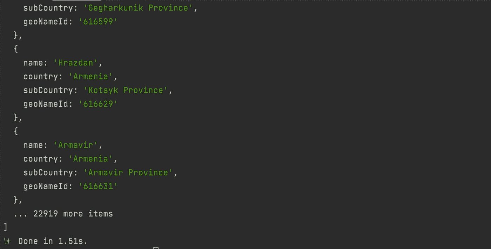
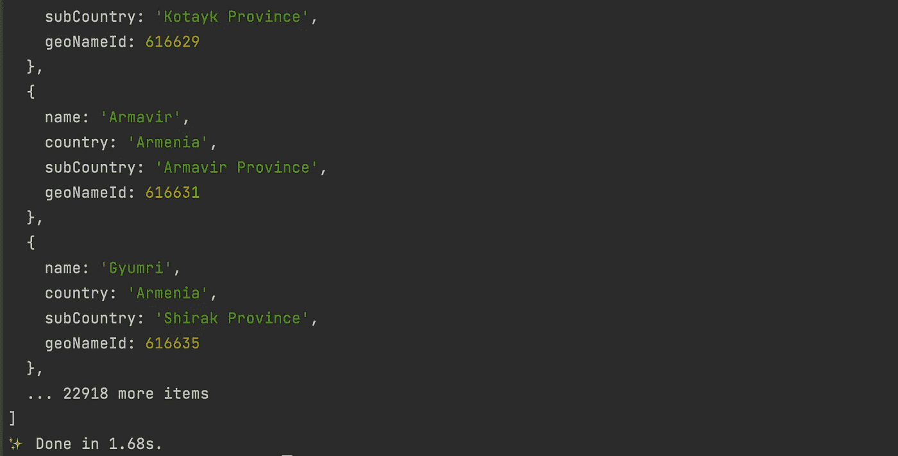
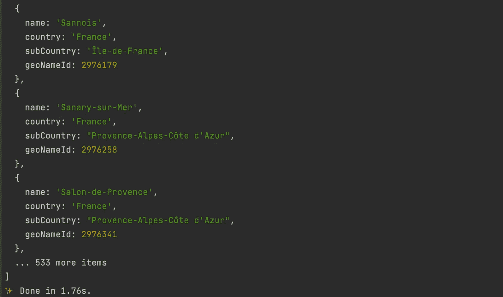

# 读取 Node.js 和 Typescript 中的 CSV 文件

> 原文：<https://levelup.gitconnected.com/read-csv-file-in-node-js-and-typescript-91cf98e2e64e>


照片由 [Unsplash](https://unsplash.com?utm_source=medium&utm_medium=referral) 上的[思想目录](https://unsplash.com/@thoughtcatalog?utm_source=medium&utm_medium=referral)拍摄

在构建 web 应用程序时，从数据源读取数据是非常常见的。在众多数据源中，CSV 是最受欢迎的，因为其内部的数据格式化非常容易，使得解析这些文件非常容易。

在本教程中，我们将了解如何读取 CSV 文件的内容，然后解析其内容，以便在应用程序中进一步使用。

# 要使用的数据集

对于本教程，我们需要一个包含数据的示例文件。我找到了一个包含世界城市的 CSV 文件。你可以在[这个链接](https://datahub.io/core/world-cities)下载这个文件。

让我们打开示例文件，看看里面有什么:



要读取的 CSV 文件的内容

所以在这里，我们的目标是读取这些数据，并将它们转换成在应用程序中使用的 Typescript 对象，比如保存在数据库中或作为 JSON 响应返回。



表头和 Typescript 类型之间的映射

基于下面的图片，我们将有一个类似这样的类型:

```
type WorldCity = {
    name: string;
    country: string;
    subCountry: string;
    geoNamId: number;
};
```

# 设置项目

初始化 Node.js 项目并键入脚本

```
mkdir node-csv-readcd node-csv-readyarn init -yyarn add -D typescript ts-node [@types/node](http://twitter.com/types/node)yarn tsc --inittouch index.ts
```

安装用于读取名为 [csv-parse](https://www.npmjs.com/package/csv-parse) 的文件的节点包。

```
yarn add csv-parse
```

在文件 **index.ts、**中添加以下代码:

这里，我们首先定义要读取的文件所在的路径；在我们的例子中，我们在根项目目录中创建一个名为`files`的文件夹，然后将我们之前下载的 CSV 文件复制到这个文件夹中。

我们读取文件的内容，并使用来自`csv-parse`的`parse()`函数解析字符串，并将结果作为类型为 **WorldCity** 的项目数组返回。

我们还添加了两个选项来定义`delimiter`和允许将 CSV 标题映射到 WorldCity 类型属性的列。

让我们试着执行应用程序来看看结果:

```
yarn ts-node index.ts
```

我们得到了类似这样的输出:



CSV 文件的内容在控制台中被解析和打印。

# 解析时应用转换

在输出中打印的内容上，我们看到`geoNameId`一定是一个数字，然而它是一个字符串。在解析数据时，我们需要将字符串转换成数字。

Csv-parse 提供了一个名为`**cast**`的选项，允许对每行的每列应用定制的转换。解析函数现在看起来像这样:

我们检查列名是否为`geoNameId`，并将值解析为一个数字；否则，我们返回的值没有任何变化。

我们添加了一个名为`**fromLine**`的新选项，它从要解析的数据中排除了 CSV 头。运行代码并查看结果:



用正确的类型分析数据。

该数字现在按照预期进行了解析:

# 检索 CSV 数据中的特定行

假设我们只想从法国检索城市。我们如何做到这一点？Csv-parse 提供了另一个名为`**on_record**`的选项，它允许我们在行级别过滤数据，通过使用这个选项来排除一整行数据。解析函数现在看起来像这样:

运行代码并查看结果:



线条被过滤以仅显示法国的城市。

我们可以看到检索到的项目数量急剧下降。

# 包裹

我们看到了如何使用 csv-parse 库读取 CSV 文件，该库提供了许多选项，使我们在解析文件时更加灵活。

csv-parse 有许多其他选项，如果你想了解更多，请点击这个链接。

你可以在 [GitHub 库](https://github.com/tericcabrel/blog-tutorials/tree/main/node-csv-read)上找到代码源。

这篇文章最初发表在我的博客[https://blog.tericcabrel.com](https://blog.tericcabrel.com)上，在那里我写了关于构建后端应用程序的文章。

请在 [Twitter](https://twitter.com/intent/user?screen_name=tericcabrel) 上关注我，或者订阅[我的简讯](https://newsletter.tericcabrel.com/)以便在我发布新帖子时得到通知。

很高兴很快见到你😉