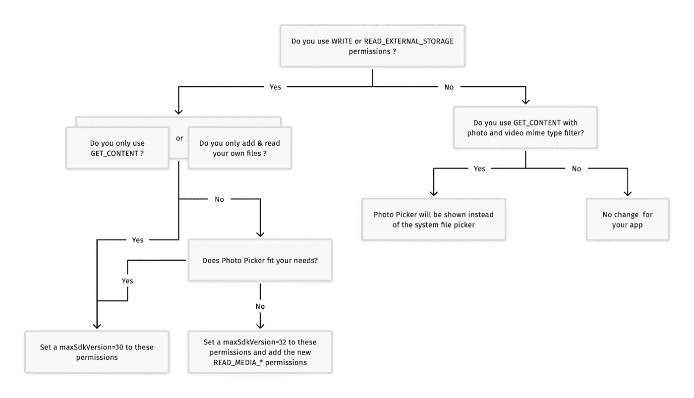
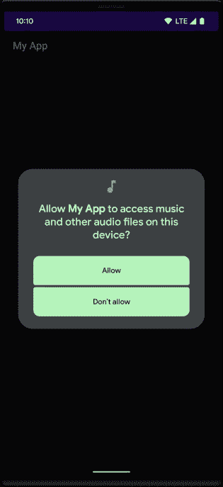

# 在 Android 13 及更高版本上访问 Android 存储

> 原文：<https://levelup.gitconnected.com/read-external-storage-permission-is-deprecated-heres-the-new-way-to-access-android-storage-8ce0644e9955>

## Android 13 引入了粒度存储权限和用于访问媒体文件的照片拾取工具

S 从 Android 13 开始，`READ_EXTERNAL_STORAGE` permission 已经被弃用，取而代之的是更好的 API 来访问 Android 存储中的媒体文件。如果您的应用程序面向 Android 13 (API 级别 33)或更高版本，并且需要访问其他应用程序创建的媒体文件，您需要更新代码以利用 Android 13 版本引入的新 API 集


照片由[罗斯·芬登](https://unsplash.com/@rossf?utm_source=medium&utm_medium=referral)在 [Unsplash](https://unsplash.com?utm_source=medium&utm_medium=referral) 上拍摄

在本文中，我们将看到从 Android 存储访问媒体文件的两种不同方法。选择哪种方法取决于用例及业务需求。这里有两种方法:

## **1。照片拾取器(无需许可):**

该工具为用户提供了一种选择媒体文件的方式，而无需授予对其整个媒体库的访问权限。

**使用案例:**
如果你的 app 只需要访问图片、照片、视频，可以考虑使用 Android Photo Picker。Android 系统将负责显示媒体选择器用户界面

Photo picker 已被反向移植到所有运行 Android OS 11 和 12 的 Android 设备(不包括 Android Go 设备)，因此用户将在所有 Android 设备上获得统一和标准的体验

**限制:** 照片拾取器有一些限制，例如，它只适用于视觉媒体类型，不适用于音频类型

在本文的下一部分，我们将看到照片拾取器的实现

## 2.请求粒度媒体权限

**使用案例:** 虽然建议使用新的照片拾取器来请求访问所有媒体文件，但您的应用程序可能会有需要这种广泛访问的使用案例(例如图库照片备份)。对于这些特定用途，引入了新的权限，提供对特定类型的媒体文件(包括图像、视频或音频)的访问

从目标 13 开始，您必须请求一个或多个以下粒度媒体权限，而不是`[READ_EXTERNAL_STORAGE](https://developer.android.com/reference/android/Manifest.permission#READ_EXTERNAL_STORAGE)`权限:

1.  `READ_MEDIA_IMAGES`用于访问图像
2.  `READ_MEDIA_VIDEO`用于访问视频
3.  `READ_MEDIA_AUDIO`用于访问音频文件

查看此决策树，帮助您决定选择哪种方法:



来源:[androidx.activity](https://medium.com/u/f51b24785c0d#1.6.0)库。这是一个简单的启动意图，它将在可用时使用照片选择器，并在旧设备上返回到 ACTION_OPEN_DOCUMENT:

支持库使用以下活动结果合同来启动照片拾取器:

1.  `[PickVisualMedia](https://developer.android.com/reference/kotlin/androidx/activity/result/contract/ActivityResultContracts.PickVisualMedia)`:选择单幅图像或视频。
2.  `[PickMultipleVisualMedia](https://developer.android.com/reference/kotlin/androidx/activity/result/contract/ActivityResultContracts.PickMultipleVisualMedia)`，选择多个图像或视频。

如果设备上没有照片拾取器，支持库会自动调用`ACTION_OPEN_DOCUMENT` intent 动作。

## 选择单个媒体项目

要选择单个媒体项目，请使用`PickVisualMedia`活动结果契约，如下面的代码片段所示:

从存储器中选择一个可视媒体的示例

## 选择多个媒体项目

要选择多个媒体项目，请设置可选择媒体文件的最大数量，如下面的代码片段所示。

从存储中选择多个可视媒体的示例

该平台限制了您可以要求用户在照片拾取器中选择的文件的最大数量。要访问此限制，请调用`[getPickImagesMaxLimit()](https://developer.android.com/reference/android/provider/MediaStore#getPickImagesMaxLimit())`。在不支持照片选择器的设备上，此限制将被忽略。

您可以通过调用`[isPhotoPickerAvailable](https://developer.android.com/reference/kotlin/androidx/activity/result/contract/ActivityResultContracts.PickVisualMedia.Companion#isPhotoPickerAvailable()).`来验证照片拾取器在给定设备上是否可用

## 持续媒体文件访问

默认情况下，系统会授予您的应用程序访问媒体文件的权限，直到设备重新启动或您的应用程序停止运行。如果你的应用程序执行一些长时间运行的工作，需要在更长的时间内保持对文件的访问，那么你可以调用`[takePersistableUriPermission()](https://developer.android.com/reference/android/content/ContentResolver#takePersistableUriPermission(android.net.Uri,%20int))`方法

```
val flag = Intent.FLAG_GRANT_READ_URI_PERMISSION
context.contentResolver.takePersistableUriPermission(uri, flag)
```

# 粒度媒体权限

从 API 等级 33 开始，如果你的应用程序访问其他应用程序的媒体文件，不需要请求`READ_EXTERNAL_STORAGE`许可。相反，请求这些权限中的一个或多个:`READ_MEDIA_IMAGES`、`READ_MEDIA_VIDEO`、`READ_MEDIA_AUDIO`

## 履行

若要访问其他应用程序创建的媒体文件，您必须声明适当的与储存相关的权限。下面的代码片段演示了如何声明适当的存储权限:

Android 13 上的存储权限示例



Android 13 上的存储权限示例

如果您同时请求`READ_MEDIA_IMAGES`权限和`READ_MEDIA_VIDEO`权限，只会出现一个系统权限对话框。

如果用户之前授予您的应用程序`READ_EXTERNAL_STORAGE`权限，系统会自动授予您的应用程序粒度媒体权限。

希望这篇文章对你有所帮助。如果有，别忘了点击拍手图标，并关注更多类似内容