# 如果您对 Regex 了解不够，请阅读本文

> 原文：<https://levelup.gitconnected.com/read-this-if-you-dont-know-enough-about-regex-73141bb0e1a7>


[斯特凡·斯特凡·契克](https://unsplash.com/@cikstefan?utm_source=medium&utm_medium=referral)在 [Unsplash](https://unsplash.com?utm_source=medium&utm_medium=referral) 拍摄的照片

## 学习作为程序员最难学的东西之一的基础知识

正则表达式是对文本进行模式匹配的一种方式。它们经常被忽视，大多数程序员认为它们很难学。

尽管正则表达式非常强大，但很多程序员并不真正了解正则表达式。

钻研正则表达式会变得相当困难，因为它肯定有一个学习曲线。尽管一旦你对正则表达式有了更多的了解，你会发现它们可以完成很多事情。

一个最明显的用例是在大型代码库中搜索某些文本。如果您是一名 web 开发人员，您可能在职业生涯的某个阶段使用过正则表达式来验证用户数据。正则表达式甚至可以用来禁止提交某些字符串。

如您所见，正则表达式有很多用例。正则表达式的用例是如此多才多艺，以至于你不能简单地忽略它们。

这就是为什么更熟悉正则表达式是一件好事。为了成为一名更好的程序员，你必须对正则表达式有更多的了解，并且至少知道一些基本知识。

在本文中，我们将介绍正则表达式的基础知识。除了理论之外，正则表达式的基础将使用阐明正则表达式工作方式的例子来演示。

# 从头开始

正则表达式最基本的例子是当你试图在文本中查找某个字符串时。在这个例子中，我们将使用字母表。

为了在文本中搜索字符串 **hij** ，我们使用下面的正则表达式:`/hij/`。请注意，该字符串被正斜杠包围。这些指示正则表达式的开始和结束。

正如你在下图中看到的，我们有一个匹配。很高兴知道这个搜索区分大小写，并且只返回第一个匹配。

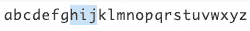

我们第一个正则表达式的结果:/hij/

但是大多数时候，你想做的事情要比上一个例子复杂一点。你可能想做的一件事就是寻找一个以特定字符开头的字符串。

让我们开始吧。让我们创建一个正则表达式，它在一个字符串的开头匹配 **abc** 。为了做到这一点，你必须给你的正则表达式加上前缀`^`——这导致了正则表达式`/^abc/`。

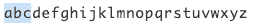

/^abc/正则表达式的结果

如果我们想在一个字符串的末尾寻找匹配某些字符的字符串，我们也可以这样做——但是我们必须使用`$`而不是`^`并加上后缀。这导致了 regex `/xyz$/`。

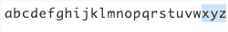

/xyz$/ regex 的结果

也可以将这两个锚点结合起来，从而得到精确的字符串匹配。

## 摘要

```
*bar* matches a string that contains **bar** *^bar* matches a string that starts with **bar** *bar$* matches a string that ends with **bar** *^foo bar$*matches exactly the string **foo bar**
```

# 逃避

正则表达式中有几个特殊字符有特殊的含义。为了对这些字符进行文字搜索，需要对它们进行转义。

以下是所有特殊字符的列表:

```
[ \ ^ $ . | ? * + ( )
```

假设我们要搜索一个问号。在正则表达式中，问号有特殊的含义。所以为了对问号进行文字搜索，我们需要对它进行转义。

可以通过在字符前加一个反斜杠:`\?`来对字符进行转义。这允许您将特殊字符用作常规字符。

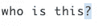

/\的结果？/ regex

## 摘要

为了对特殊字符`[ \ ^ $ . | ? * + ( )`进行文字搜索，您需要用反斜杠对它们进行转义。

# 旗帜

现在，您对如何构造正则表达式有了更好的理解，是时候回顾正则表达式的另一个基本部分，称为标志。

如您所知，正则表达式通常出现在搜索模式由两个正斜杠字符分隔的表单中。要指定一个标志，您可以将它添加到最后一个斜杠字符之后。也可以组合标志。

尽管有许多不同的标志，我们将讨论最常用的三个标志，它们是全局标志、不区分大小写标志和多行标志。

## 全球的

全局标志将接受所有匹配，而不是在第一次匹配后返回。

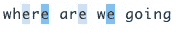

/e/g 正则表达式的结果

## 不分大小写

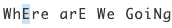

/e/i 正则表达式的结果

如前所述，我们还可以组合这些标志:

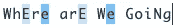

/e/gi 正则表达式的结果

## 多线

当你想在多行中搜索一个文本时，你必须使用多行标志。

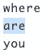

/are/m 正则表达式的结果

## 摘要

```
*g* global, don't return after first match*i* case insensitive matching*m* multi-line, ^ and $ match start and end of line
```

# 字符类别

字符类是一种特殊的符号，它匹配某个集合中的任何符号。假设我们有一个电话号码`+(903)123-4567`，我们只想把它转换成数字。

为了做到这一点，我们必须找到并删除任何不是数字的东西。这是角色类可以帮助解决的问题。例如，`\d`字符类匹配任何数字。

这非常适合我们的使用案例:

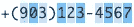

`The result of the /\d/g regex`

`\d`字符类匹配一个数字，这个数字是一个从 0 到 9 的字符。但是`\d`并不是唯一的角色职业。

`\w`字符类匹配一个“wordly”字符，它可以是拉丁字母、数字或下划线。非拉丁字母不属于`\w`字符类。

`\s`字符类匹配一个空格符号。这包括空格、制表符和换行符。

尽管有更多的角色类别，我们已经讨论过的是最常用的。

## 相反的

有可能得到一个字符类的逆。假设我们想要一个非数字的字符——基本上可以归结为除了`\d`以外的任何字符。为了做到这一点，我们可以使用相反的方法。

每个字符类都有一个反义词，用相同的字母表示，但是大写。`\d`的逆是`\D`。

## 摘要

```
*\w* wordly character*\d* digit*\s* whitespace**Inverse**
*\W* non wordly character*\D* nondigit*\S* nonwhitespace
```

# 量词

本文中我们要讨论的最后一个话题是量词。正则表达式限定符指定前面的正则表达式匹配的频率。

这里有几个不同的量词，我们都会讲到。

我们要学习的第一个量词是`?`,表示零或一。在下面的例子中，我们使用了`/ba?/g`正则表达式。这个正则表达式将检查任何跟有零个或一个 *a* 字符的 *b* 字符。

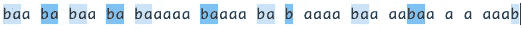

/ba 的结果？/g 正则表达式

第二个量词是表示零或更多的`*`。

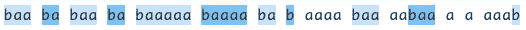

/ba*/g 正则表达式的结果

而且对于一个或多个还有一个量词，就是`+`量词。

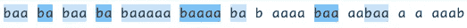

/ba+/g 正则表达式的结果

您还可以处理限定符中必须匹配的特定数量的事件。`/ba{2}/g`正则表达式匹配任何后面跟有两个连续的 *a* 字符的 *b* 字符。

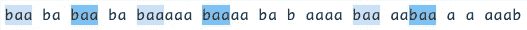

/ba{2}/g 正则表达式的结果

如果你想限制连续的*一个*字符的数量，你可以在第二个数字上用逗号隔开。`/ba{2,4}/`正则表达式匹配任何后面跟有两到四个连续的 *a* 字符的 *b* 字符。

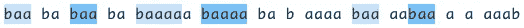

/ba{2，4}/g 正则表达式的结果

我们也可以对任何后面跟有至少两个 *a* 字符的 *b* 字符这样做。为了做到这一点，您必须在出现的次数后面加一个逗号——结果是/ `ba{2,}/g`。

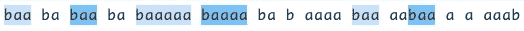

/ba{2，}/g 正则表达式的结果

## 摘要

```
*a?* matches an `a` character or nothing
*a** matches zero or more consecutive `a` characters
*a+* matches one or more consecutive `a` characters
*a{2}* matches exactly 2 consecutive `a` characters
*a{2,4}* matches between 2 and 4 consecutive `a` characters
*a{2,}            m*atches at least 2 consecutive `a` characters.
```

# 包装它

现在我们已经学习了正则表达式的基础知识，是时候自己做一些练习了。当然，说到正则表达式，还有很多东西需要学习。既然我们已经复习了基础知识，我们还没有触及更高级的话题。

然而，明智的做法是首先充分了解基础知识。

编码快乐！