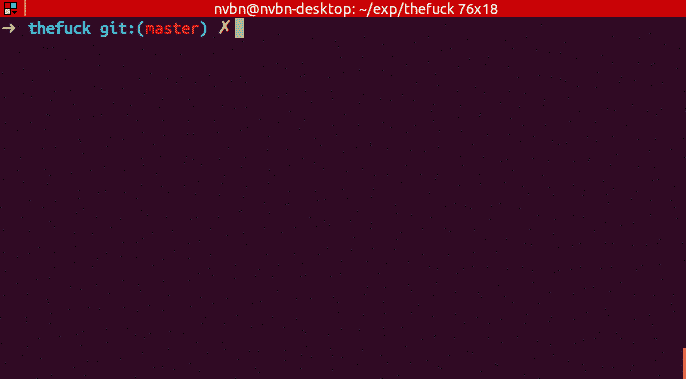

# 如果你在终端命令中打错了字，请阅读这篇文章

> 原文：<https://levelup.gitconnected.com/read-this-if-you-make-typos-in-your-terminal-commands-5a784b4d288a>

## 密码

## 我差点和前任 CEO 陷入麻烦的故事。


Gabriel Heinzer 在 [Unsplash](https://unsplash.com?utm_source=medium&utm_medium=referral) 上拍摄的照片

想象一下，一个大学生坐在他的笔记本电脑前。时钟显示上午 5:15，他刚刚通宵完成一个项目，该项目的最后期限是上午 7:00。他想在编写代码之前再测试一次这个项目，并试着睡一会儿。

```
puthon main.py
```

“该死的。”

```
python main.yp
```

“呃。”

```
python main.pu
```

“…”

他输入的下一个东西是谷歌上的“终端自动更正”。

几年前那确实是你的。这是我的发现。

[](https://github.com/nvbn/thefuck) [## nvbn/thefuck

### 他妈的是一个宏伟的应用程序，灵感来自@liamosaur 的推文，它可以纠正以前的控制台命令中的错误。是…

github.com](https://github.com/nvbn/thefuck) 

是的，我又浪费了 30 分钟来安装和阅读这个应用程序，但是想象一下我有目的地输入`puthon main.py`然后输入`f*ck`并看到它自动更正为`python main.py`是多么的满意。

实际上，默认情况下，实际的命令是`f*ck`的非 PG 版本。从这一点开始，我也将把这个应用程序称为 F，以减少这个故事中的脏话。

> F 实际上是你终端的自动修正。

不，不是像语法上那样使用机器学习。它使用[很多规则](https://github.com/nvbn/thefuck/tree/master/thefuck/rules)来修正你的命令，所以先检查一下，看看你的工作流程是否被覆盖。

如果你不想浏览这个列表，这里是定义命令的 TLDR。

*   常见的终端操作，如`cd`和`ls`
*   包管理器，如`apt`、`brew`、`npm`、`conda`和`pip`
*   工具如`git`和`docker`
*   编程语言，如`python`、`go`、`cpp`和`java`

# 装置

幸运的是，通过自制软件或 pip 安装 F 很简单。我已经写了另一篇文章(链接如下),如果你还没有在 MacOS 上设置的话，我会告诉你如何设置家酿。

[](https://towardsdatascience.com/maybe-its-time-to-upgrade-your-terminal-experience-a9e12b2af77) [## 也许是时候升级你的终端体验了

### 默认的 MacOS 终端不适合你，也不适合任何人。

towardsdatascience.com](https://towardsdatascience.com/maybe-its-time-to-upgrade-your-terminal-experience-a9e12b2af77) 

对于安装了 Homebrew 的 Mac 用户，只需使用下面的命令。

```
brew install thefuck
```

对于其他系统，请确保正确安装了 pip，然后运行此命令。

```
pip install thefuck
```

如果您在安装时仍然有问题，您可以通读 f。

# 使用和定制



由 [nvbn](https://github.com/nvbn/thefuck) 提供的 F 在工作中的示例

这很简单，真的。每当你在终端中输错一个命令，只要输入`f*ck`，应用程序就会尝试自动更正。然后，它会显示建议的正确命令，您需要做的就是按 Enter 键。

如果你想完全跳过按 Enter 键，并相信它会执行 100%正确的命令——我不这么认为，你可以按照本指南[用下面的代码行创建一个`settings.py`文件。](https://github.com/nvbn/thefuck#settings)

```
require_confirmation = False
```

还有许多其他可能的设置可以更改，但是我发现默认设置已经涵盖了我的大多数用例——如果它没有坏，就不要修复它，嗯？

如果你倾向于犯应用程序没有涵盖的错误，你也可以[创建自己的规则](https://github.com/nvbn/thefuck#creating-your-own-rules)。类似于设置，基本规则已经覆盖了我的大部分错别字(除了`gits tatus`，所以我真的懒得定制那么多。

# 设置别名

> 我强烈建议设置一个别名来替换 f。

一天，我向包括 CEO 在内的业务团队展示了一项新功能，我需要展示在现有客户的服务器上安装它是多么容易。

当我试图获取最新的变化时，我打错了`git fecth`，我的肌肉记忆开始工作。我没有像普通人一样重新输入`git fetch`，而是在屏幕共享激活时在终端输入了`f*ck`。

云服务器过去没有，现在也没有安装这个特定的库，所以它返回了`command not found: f*ck`。当然，这引起了首席执行官本人的注意，他问我，“你为什么要打这个？”

最后，我不得不向他们解释整个应用程序，并展示了它在我的本地终端上是如何工作的。幸运的是，他们笑得很开心，但我不认为我会在不久的将来向我们的外部客户展示。

那天晚上晚些时候，我把这句话添加到我的`~/.zshrc`中。

```
eval $(thefuck --alias f)
```

至少如果我习惯性地在一个失败的命令后输入`f`，我可以把它当作一个额外的错别字，而不是一些脏话。打字时间也短得多，这是一个优势。

# 结论

当我早上 5 点第一次发现这个图书馆时，我一点也不知道我将会使用它很多年。有时我会几天甚至几周不使用“自动更正”命令，但每当我在一个失败的命令后键入`f*ck`时，它总会发出咯咯的笑声，然后自动更正。

为了更健康的体验，你可以设置一个更好的别名，比如`please`，或者`cmiiw`。

人们会认为输入`please`和`cmiiw`比输入`f*ck`要长，这是事实。但是，我保证你的终端体验会比一天多次敲`f*ck`更愉快。哦，`plz`也可以。或者干脆选择更短的版本`f`，就像我现在使用的。

不过，不建议过度依赖这款应用。这对于真正的输入错误来说是没问题的，但是不要把它作为不记住基本终端命令的借口。

是否保证一直正常工作？号码

值得麻烦向我的 CEO 解释吗？绝对没有。

在你的终端里有没有帮助和乐趣？绝对的。

*代码是一系列与编程更相关的故事，而不是机器学习。我发现拥有广泛的编程知识会让你成为更好的数据科学家，所以我决定为这些故事创建一个单独的系列。* [*定期更新*](https://chandraseta.medium.com/subscribe) *新故事和* [*成为中等会员*](https://chandraseta.medium.com/membership) *阅读无限故事。*

[](https://chandraseta.medium.com/membership) [## 成为媒体成员—里奥纳尔迪·钱德拉塞塔

### 作为一个媒体会员，你的会员费的一部分会给你阅读的作家，你可以完全接触到每一个故事

chandraseta.medium.com](https://chandraseta.medium.com/membership)