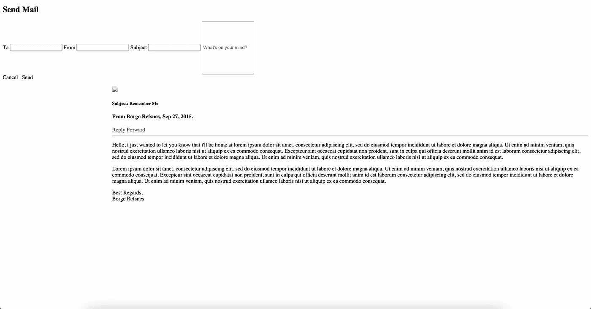
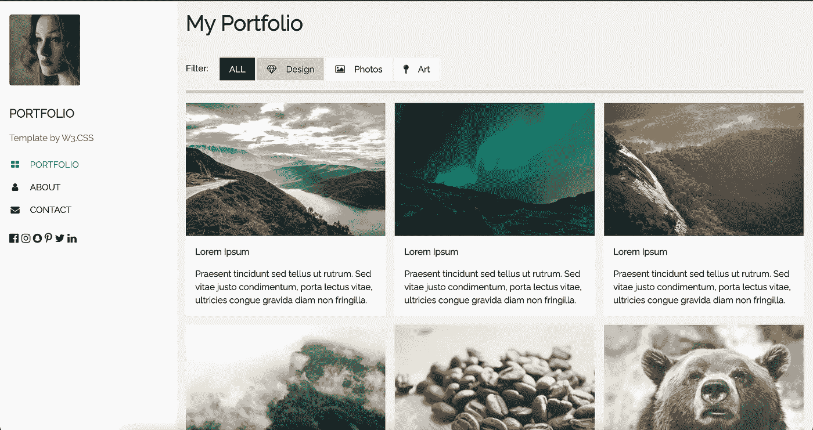
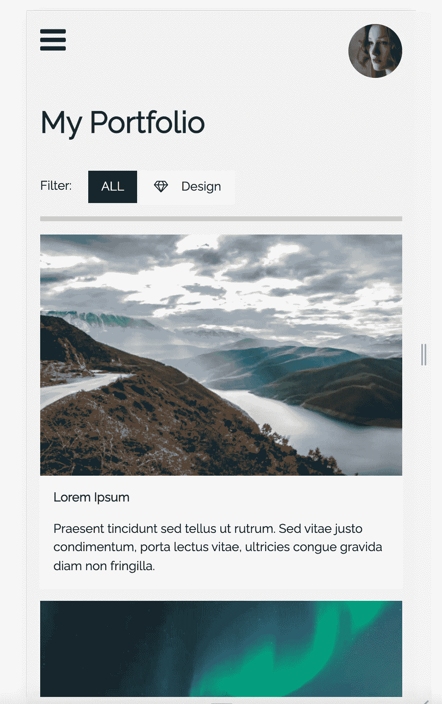

# 阅读这篇文章，开始你的网络开发之旅！

> 原文：<https://levelup.gitconnected.com/read-this-to-kickstart-your-web-development-journey-26f54b1a4843>

Web 开发是软件工程师最受欢迎的工作领域之一。由于互联网只有 32 年的历史，所以 web 开发呈现出一个充满希望的特性。你知道每天有 35 亿次谷歌搜索吗？这就需要更多的网站为用户提供他们需要的服务。

2022 年对网络开发有着巨大的需求，而且这种需求在未来只会增加。因此，在这篇文章中，我将向你展示如何启动你的 web 开发之旅。如果你感兴趣，请阅读这篇文章直到最后。

## 正面和背面

Web 开发由前端和后端两部分组成。前端是用户访问网站时看到的和与之交互的东西，而后端是实现网站主要功能的地方。

我们举个例子。向下滚动到这篇文章的末尾，点击拍手按钮并发表评论。在这里，你正在与这个网站的前端部分互动。后端负责从数据库(也是后端的一部分)获取这篇文章，并发布你的喜欢和评论。

## 从前端开发开始

既然用户直接和这个部分进行交互，那么你的网站的前端(UI)就得是顶级的。你的功能可能很棒，但是如果用户不喜欢 UI(用户界面)，网站就会失败。

对于前端开发，学习 [HTML](https://www.w3schools.com/html/) 、 [CSS](https://www.w3schools.com/css/default.asp) 和 [JavaScript](https://www.w3schools.com/js/default.asp) 。HTML 用于开发静态网页，而 CSS 用于样式化网页。(注意:HTML 和 CSS 都不是编程语言)。这两个帮助你建立一个静态网页，现在是时候让页面动态化了，这就是 JavaScript 的用武之地。

这是一个纯 HTML 网站的外观。

这是你添加 CSS 时的样子。

学习前端开发，你应该对 HTML、CSS 和 JavaScript 有很强的掌握。之后可以选择 Angular、Vue 这样的框架和 CSS、React JS 这样的 [bootstrap](https://getbootstrap.com/docs/5.1/getting-started/introduction/) 这样的库。访问[此处](https://reactjs.org/docs/getting-started.html)开始使用 React JS。

## 让它有反应

假设你开发了一个在桌面上看起来很不错的网站。你觉得自己已经准备好开始创业了。但是如果用户从手机或平板电脑上打开你的网站呢？看起来可能会很奇怪，对吧？当你打开一个没有被缩放到更小屏幕的网页时，就会发生这种情况。

这里有一个有趣的事实:*手机占了全世界网络使用的三分之二*。所以，如果你不把网站的尺寸缩小到更小，你可能会失去三分之二的客户群。这是否意味着你必须为手机创建另一个应用程序？不，你只需要让你的网页具有响应性，即创建一个在所有屏幕上都好看的网页。

这里有一个在桌面和移动屏幕上都很好看的网站的例子。

桌面上的网站(来源: [w3schools](https://www.w3schools.com/)

手机网站(来源:w3schools)

了解如何设计一个响应式网站[在这里](/read-this-to-make-your-website-responsive-35af4ab7992b)。

## 学习后端开发

后端是 web 应用程序的核心。后端是实现网站主要功能的地方。它是网站的服务器端。网站需要的所有数据都存储在后端的数据库中。

我们讨论了一个好看的 UI 的重要性，但是不要忘记后端的重要性。如果你的网站需要很长时间来加载或交付其功能(高响应时间)，用户会感到沮丧，可能永远不会回到你的网站。因此，适当的代码优化非常重要。您的代码还应该能够健壮地处理意外情况。

你可以从学习这些语言中的一种开始:Java、Python 或 JavaScript。然后转移到基于以上三种语言的后端框架像 [Spring Boot](https://spring.io/projects/spring-boot) 、 [Django](https://www.djangoproject.com/) 或者 [Node.js](https://nodejs.org/en/) 。此外，请阅读[和](https://medium.com/@ramya.girishkumar/building-a-robust-code-in-three-simple-steps-aa7afccb0c2)以了解更多关于编写健壮代码的信息。

当你开发一个网站时，你肯定会需要某种形式的持久存储(即使在关闭网站后数据仍然存在)。所以，学习数据库的基础知识。MySQL 和 [MongoDB](https://www.tutorialspoint.com/mongodb/index.htm) 是常用的，但也有其他的。在使用这些数据库之前，了解它们是如何存储数据的。

## 重要提示

1.  不要在教程上花太多时间。你可能会变得过于依赖他们，陷入“教程地狱”。这并不意味着教程没有用。你应该按照它们去理解核心概念，但只是在一定程度上。如果你无法获得过去的教程，请阅读本教程。
2.  一旦你理解了基本概念，就开始着手一个项目。它可以像待办事项或计算器应用程序一样简单。你可以按照你的第一个项目的教程，但要确保你理解它的每一个步骤。
3.  开始时尝试不同的框架，找到一个适合你的。一旦你决定了一个框架，坚持下去。
4.  作为一个初学者，你应该对前端和后端开发有一个基本的了解。后来，你可能会决定专攻一门。
5.  一开始你可能会面临很多困难，所以不要气馁。坚持练习，随着时间的推移，你会变得更好。

以上讲解的方法和技巧都是基于我自己的经验和知识；你可能有不同的建议。如果你先从后端开始，然后再转移到前端，这是没问题的。此外，除了我在本文中提到的框架和语言之外，还有许多用于 web 开发的框架和语言。你可以在这里阅读关于他们的。

# 结论

Web 开发可以分为两个部分。前端部分是网站的设计和外观，后端部分包括网站的主要逻辑和数据库。一个网站的 UI 应该在包括手机在内的各种尺寸的屏幕上都好看。

后端的代码应该针对更快的响应时间和故障期间的健壮性进行优化。数据库是任何网站的重要组成部分，因此它们应该与后端集成。

如果您无法理解内容或对解释不满意，请在下面评论您的想法。新想法总是受欢迎的！如果你喜欢这篇文章，请关注我的每周更新。到那时，再见！！