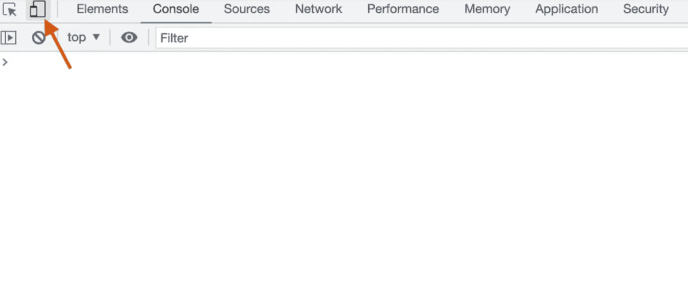

# 响应式网页设计的简单指南

> 原文：<https://levelup.gitconnected.com/read-this-to-make-your-website-responsive-35af4ab7992b>


卡伦·艾姆斯利在 [Unsplash](https://unsplash.com/) 上的照片

随着智能手机的出现，网页开发这些年来发生了很大的变化。目前，[超过一半的用户通过手机浏览互联网](https://www.statista.com/statistics/277125/share-of-website-traffic-coming-from-mobile-devices/)。因此，越来越多的网站不得不调整他们的设计以适应移动屏幕，否则将面临失去一半用户的风险。

这是通过使网站具有响应性来实现的。一个响应迅速的网站在各种尺寸的屏幕上都很好看，并为用户提供最佳体验。

> 响应式网页设计为我们提供了一条前进的道路，最终允许我们为事物的潮起潮落而设计。
> 
> *—伊桑·马科特(创造了“反应式网页设计”这个术语)*

在这篇文章中，我将解释构建一个响应式网站所需要的基本要素。如果你是初学者，请从头到尾阅读这篇文章。在深入本质之前，让我们了解一下响应式网页设计的重要性。

# 为什么是响应式网页设计？

响应式网页设计包括创建灵活的布局，以适应不同的屏幕尺寸。用户可能会从他们的笔记本电脑、平板电脑或手机上访问你的网站，所以它在所有这些设备上都应该看起来不错。

如前所述，由于一半的用户通过手机访问互联网，你的网站应该是手机友好的。它使您的应用程序更加灵活，适应性更强。此外，如果您能够通过手持设备有效地使用网站，难道您不喜欢吗？

使用响应式设计，您不需要为台式机和手机维护不同的网站，从而节省时间和精力。也是性价比高。

# 测试你的网站的响应能力

让我们来了解一下如何测试你的网站的响应能力。在 Chrome 中，通过按 ctrl+shift+I(MAC OS 为⌘ + ⌥ + I)打开开发者工具。选择左上角的以下开关。



在开发工具中切换设备视图

从那里，你可以选择不同的设备或调整屏幕大小，看看你的网站看起来如何。

如果你已经有一个正在运行的网站，你也可以使用谷歌的手机友好测试来检查它的响应能力。

# 如何让你的网站响应迅速？

让你的网站具有响应性是开发过程的一部分，而不是你最终要做的事情。在设计你的网站时，你应该记住小屏幕。

站点可以通过多种方式做出响应。这些方法经常结合在一起，以做出最好的设计。

## 流体布局

响应式设计的第一步是流畅的布局。流体布局采用随不同屏幕尺寸而变化的动态值。定义布局的宽度和高度时，使用百分比单位而不是像素。

考虑一个带有类*包装器*的 *div* ，该包装器具有以下样式。

```
.wrapper {
    width: 50%;
}
```

这意味着 div 将占据屏幕宽度的 50%,从而根据不同的屏幕大小进行自我调整。

响应式设计还包括根据可用空间重新安排元素，因此，仅仅一个流畅的布局不会让你的网站具有响应性。Flexbox 就是为了这个目的而使用的，我很快会解释这一点。

## 媒体查询

CSS 中的媒体查询允许您根据屏幕大小、方向或屏幕分辨率对元素应用不同的样式。在这篇文章中，我将只使用它们的屏幕尺寸。点击阅读更多关于媒体询问[的信息。](https://www.seobility.net/en/wiki/Media_Queries)

我们如何使一个网站具有响应性？对屏幕的媒体查询检查当前屏幕大小是高于还是低于某个值，类似于编程语言中的 *if* 条件。媒体查询最常用的属性是`min-width`和`max-width` ，它们是不言自明的。

假设，您有一个占据桌面屏幕 40%的元素。在手机屏幕上，它会显得小很多。因此，如果屏幕宽度减小到特定值以下，请增加元素的宽度。下面的容器将占据宽度小于 600 像素的屏幕的整个宽度。

```
.container1 {
    padding: 4rem;
    background-color: lightgreen;
    width: 40%;    
}[@](http://twitter.com/media)media screen and (max-width: 600px) {
   .container1 {
      width: 100%;
   } 
}
```

也可能有这样的情况，为了节省空间，您需要隐藏一个不太重要的元素。下面的容器消失在一个更小的屏幕上。

```
.container2 {
    padding:3rem;
    background-color: cyan;
    width: 30%; 
}[@](http://twitter.com/media)media screen and (max-width: 600px) {
    .container2 {
       display: none;
    }
}
```

在这个[编辑器](https://www.w3schools.com/css/tryit.asp?filename=tryresponsive_breakpoints)上处理媒体询问。

如果您想要在改变屏幕尺寸时有不同的样式，请使用媒体查询

## 灵活的布局

在简单的情况下，您甚至可能不需要媒体查询。灵活的布局简化了代码，使您的工作更容易。

**柔性盒布局**

Flexbox 布局提供了多种属性，可以根据可用空间以不同方式排列多个元素。现在，我假设你对 flexboxes 很熟悉。如果您不是，请阅读此。让我们来看看 flexbox 布局如何让你的网站响应迅速。

默认情况下，flex 容器会将其元素向一个方向对齐，即使它们溢出了容器。flex-wrap 属性将多余的元素换行。

```
.flex-container {
    flex-wrap: wrap;
}
```

流体布局随着屏幕尺寸的减小而变小。因此，将元素换行有助于在不使用媒体查询的情况下实现响应行为。

检查 CodePen 上的以下实现。

柔性包装示例

如果您想要直接更改布局而不换行，也可以将 media query 与 flex 配合使用。[这里的](https://www.w3schools.com/css/tryit.asp?filename=trycss3_flexbox_image_gallery)就是一个很好的例子。

**响应式电网**

网格是一种在容器中以行和列的形式显示元素的方法。但是，grid 和 flexbox 有什么区别呢？一个简单的区别是，flexbox 在一个维度(行或列)上布局元素，而网格在两个维度上布局元素。

[这里的](https://travishorn.com/responsive-grid-in-2-minutes-with-css-grid-layout-4842a41420fe)是一个构建响应网格的指南。

## 响应图像

每个网站都有图片，因此，他们必须作出回应。一种方法是将`max-width`属性设置为 *100%* 。

```
img {
    max-width: 100%;
}
```

只要屏幕更宽，图像就会以其原始宽度显示。如果屏幕变得比图像窄，图像会占据整个屏幕宽度并随之缩小。

这与使用`width: 100%`相反，在`width: 100%`中，图像无论如何都会占据整个屏幕宽度。

但是，Internet Explorer 不支持`max-width`属性。一种解决方法是将图像包装在一个 div 中，并使用媒体查询。这与使用最大宽度不同，但嘿，这是你的老浏览器。如果有其他方法，请在评论中提及。

下面是一个响应图像的演示，请随意玩。

响应图像

使用图像时还有另一个问题。如果您有一个高分辨率的图像，如为大屏幕设计的背景图像，它可能会减慢速度或不必要地占用移动屏幕上的空间。因此，调整图像大小很重要。

使用 *srcset* 属性加载不同情况下的不同图像。阅读[本](https://www.w3schools.com/tags/att_source_srcset.asp)了解更多。

## 相对单位

任何事情都不要使用像素单位！像素是绝对值，它们不会随着屏幕大小而改变。如今，你创建的任何网站都必须在手机上看起来很好，所以像素是一个大禁忌。

如前所述，使用百分比单位来定义布局的宽度和高度。您也可以使用视口单位，即 vh 和 vw 分别代表高度和宽度。1vw 是视窗宽度的 1%。Viewport 是网页的可见区域。但是，Internet Explorer 8 和更早版本不支持视口单位。

用于边距、填充、字体大小等。，使用相对于父元素的字体大小设置的相对单位，如`em`和`rem`。点击了解更多相关单位[。](https://www.freecodecamp.org/news/css-unit-guide/)

## 响应式印刷

响应式排版包括使你的文本和字体具有响应性。同样，不要使用绝对字体大小(像素)，因为它们在任何设备上都是一样的。因此，使用包括百分比、em、rem、vw 和 vh 的相对单位。

字体的百分比单位也是相对于父字体大小设置的。如果没有定义父字体大小，那么它们是相对于浏览器的基本字体大小设置的(大多数浏览器是 16px)。因此，50%的字体大小将使您的文本为基本字体大小的 50%，即 8px。请看下面 [CSS-Tricks](https://css-tricks.com/) 的演示:

百分比单位的使用

视口单元 vw 和 vh 设置相对于视口的字体大小。随着屏幕大小的变化，字体大小会根据视窗进行自我调整。您也可以使用媒体查询在较小的屏幕上设定不同的字体大小。这两种方法都在[这里](https://www.w3schools.com/howto/howto_css_responsive_text.asp)演示。

## 移动优先设计

在“移动优先”的设计中，你主要为手机设计网站，并使它能适应更宽的屏幕。到目前为止，我们已经讨论了如何让你的布局适应更小的屏幕，mobile-first 的做法正好相反。使用这种方法有很多好处。

点击了解有关移动优先设计[的更多信息。](https://xd.adobe.com/ideas/process/ui-design/what-is-mobile-first-design/)

# 结论

响应式设计已经成为网站开发的重要组成部分。我已经解释了响应式设计的重要性，以及如何检查你的网站的响应性。我已经用例子展示了各种方法，您可以用它们来使您的站点具有响应性。我试图详细解释每种方法，并在某些地方参考了其他材料以获得详细的理解。使用这篇文章作为指南，而不是一次性阅读。

我希望这篇文章对你有用。如果您无法理解内容或对解释不满意，请在下面评论您的想法。新想法总是受欢迎的！如果我添加了太多的超链接，一定要让我知道。如果你喜欢这篇文章，请鼓掌。**订阅**、**关注**我获取每周内容。另外，不要忘记看看我的其他[帖子](https://medium.com/@kunal.nalawade25)。祝你未来的项目好运！