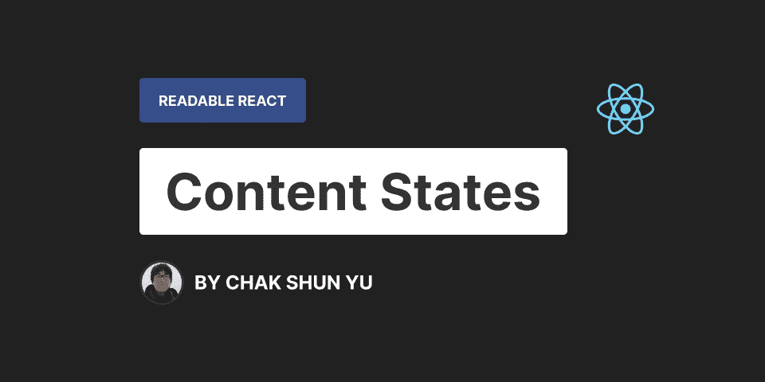

# 可读反应:内容状态

> 原文：<https://levelup.gitconnected.com/readable-react-content-states-eb9ab72b786c>



内容对于任何 React web 应用程序都至关重要。它让我们的应用变得生动，与用户互动，也让它不仅仅是一个静态的网站，而是一个网络应用。对于更大的 React 应用程序，有十到一百个不同的内容流并不罕见。由于这个庞大的量，正确地实现它们是很重要的。

每个内容流都有不同的状态。最常见的分离有 4 个不同的类别，即当流挂起、加载、成功加载或出错时。这意味着每个组件必须为每个内容流实现 4 个不同的代码分支，以考虑每种可能的状态。除此之外，每一个额外的内容流都会成倍地增加代码中需要维护的分支数量。

每个可能的分支都会导致额外的逻辑来考虑代码中的分支，这反过来增加了 React 代码的复杂性。随着复杂性的增加，保持代码的可读性变得越来越困难。这将导致更差的可维护性，这对任何 React 代码库来说都是一个严重的长期风险。因此，从最基础的层面开始，确保处理 React 内容状态的代码保持可读非常重要。

在本文中，我将介绍在 React 组件中处理内容状态的两种最常见的方法。我们将讨论可读性方面的优点和缺点，以及每种结构的用例。这些信息将为如何以可读的方式在 React 组件中实现内容状态提供坚实的基础。阅读完本文后，您将能够应用这些结构，确定代码可读性下降的时间，并通过在这些知识的基础上构建来保持更复杂的结构的可读性。

# 处理呈现中的状态

您将遇到的最常见的方法是通过条件直接在呈现中处理内容状态。您所做的是检查特定的内容状态，并基于它有条件地呈现反映该内容状态的 UI 的代码。一般来说，它看起来如下:

```
export const ComponentWithContent = (props) => {
  // Code...
  return (
      <div className="container">
        {contentState === "pending" && <span>Pending...</span>}
        {contentState === "loading" && <span>Loading...</span>}
        {contentState === "error" && <span>An error has occurred...</span>}
        {contentState === "success" && <div>{/* ... */}</div>}
      </div>
  );
}
```

这里我们有一个组件，它带有一个捕获内容流状态的变量。该流可能来自任何地方:道具、状态、挂钩或外部代码。在本文的上下文中，这都被认为是相同的，并且不影响将要讨论的任何内容。最重要的方面是有一个变量可以捕获内容状态。

在呈现中，我们检查不同的可能内容状态，并基于它呈现 UI。在这个例子中，我们使用了 AND 运算符。但是，即使条件以不同的方式实现，情况也是一样的。例如，使用三元运算符或处理状态的复合组件。

```
export const ComponentWithContent = (props) => {
  // Code...
  return (
      <div>
        <State value={contentState}>
	   <State.Pending>
	     <span>Pending...</span>
	   </State.Pending>
	  <State.Loading>
	    <span>Loading...</span>
	  </State.Loading>
	  <State.Error>
	    <span>An error has occurred...</span>
	  </State.Error>
	  <State.Success>
	    <div>{/* ... */}</div>
	  </State.Success>
        </State>
      </div>
  );
}
```

在呈现中处理内容流的所有情况的最大优点是所有内容都在一个地方。在审查、检查代码或重构代码时，您只需查看一个地方。您将立即获得整个结构的概览，并看到内容状态是如何处理的。

还有一个好处就是异同很明显。特别是，这种结构侧重于相似之处，同时强调微小的差异。基于内容状态的条件放置在哪里，确定哪些代码是共享的，哪些代码是特定于某个状态的相对容易。这不仅提高了可读性，还提高了将来的可维护性，因为这是将来在没有先前上下文的情况下重构这样一个组件时所需要的关键信息。

由于这种结构关注相似性和突出差异的方式，它在不同内容状态具有相似的 DOM 结构或者只影响相似的 DOM 区域的场景中非常有用。在这些情况下，不同的分支在渲染函数中的目标位置进行分组。如果你从上到下通读 React 代码，这将感觉非常自然，因为最后一部分总是渲染，并大大提高可读性。

以本节开头的例子为例。所有的分支都嵌套在容器元素中。在阅读、重构或审查这些代码时，有两件事是显而易见的。首先，所有内容状态的 UI 都是相同的，包括容器元素。第二，内容只影响这个特定区域的 UI，即容器元素的子元素。

在这个精简示例的上下文中，这些信息块并不太重要。但是在现实场景中，DOM 结构通常要大得多。在它们之间导航不是一件简单的任务，更不用说能够识别相似性和差异，这对于重构和可维护性是很重要的。在这种情况下，每一点信息都会累积起来，处理呈现中的所有内容状态是提高可读性的一种方式。

虽然我们已经讨论了优点和用例，但也有一些场景，这种方法实际上对可读性的伤害大于好处。如前所述，如果不同的内容状态具有相似的 DOM 结构或者只影响相似的 DOM 区域，那么这种方法非常有效。

如果这些不适用于组件，那么使用这种方法实现内容状态会变得非常混乱。如果 DOM 的许多不同区域受到不同内容状态的影响，这种方法将导致渲染中出现许多分布式条件。虽然在较低的数量下这还不算太坏，但是随着条件数量的增加，React 代码的可读性会大大降低，因为它们相对来说比较冗长。

如果内容状态具有不同的 DOM 结构，情况会更糟。试图创建一个容纳所有这些元素的大型结构对代码的可读性没有任何好处。它会将你的代码分割成更大的条件块，并将它们分布在不同的位置甚至嵌套层次上。这将导致极其复杂和难以理解的 DOM 结构，这只会损害代码的可读性。

# 摘要

*   ✅所有的东西都被组织在一个地方。
*   ✅关注相似之处，强调不同之处。
*   如果内容状态具有非常相似的 DOM 结构或者影响相同的 DOM 区域，那么✅就能很好地工作。
*   如果内容状态具有不同的 DOM 结构，⛔将导致渲染中出现大量分布式条件。
*   如果大块被有条件地分开并位于不同的嵌套层次，⛔代码会变得一团糟。

# 通过提前返回处理状态

处理内容状态的另一种方法是通过早期返回。这种方法将条件排除在呈现之外，并将它们在组件中上移。当条件满足时，组件会提前返回相应的代码。这一直持续到所有的内容分支都被处理并且所有的选项都用尽。一般来说，它看起来如下

```
export const ComponentWithContent = (props) => {
  // Code...
  if (contentState === "pending") {
    return (
      <SomePendingComponent />
    );
  }

  if (contentState === "loading") {
    return (
      <LoadingSpinner />
    );
  }

  if (contentState === "error") {
    return (
      <ErrorMessage>An error has occurred...</ErrorMessage>
    );
  }

  return <div>{/* ... */}</div>;
};:
```

在该示例中，组件首先检查内容流是否仍然未决。如果是这样，它将使用特定于挂起状态的组件进行提前返回。如果没有，我们将继续并立即检查下一个可能的状态。加载状态和错误状态也是如此。最后，我们确信所有其他选项都已经用尽了，所以要处理的最后一个案例是成功状态，我们可以通过定期返回来完成。

这种方法的最大优点是，当从头到尾阅读组件代码时，这种结构需要最少的精力来跟踪数据流。代码总是一次只处理一个状态。这意味着当你读它的时候，你只需要记住你所处的状态，这是由条件句指示的。然后，当您输入 block 语句时，您知道块内的所有内容都只与特定的内容状态相关。这减轻了读者不断保持用户界面的心理模型、状态之间的相似性和差异的负担。相反，他们可以一次专注于一个状态，就像阅读一本书的章节，当他们完成时，就转移到下一个状态。

与此相一致的是，人们通常更喜欢经历不同的内容状态。根据我个人所做的和从其他人那里看到的，我们大多数时候更喜欢首先处理加载状态，然后是错误状态，最后才是成功状态。这种方法正好符合这种偏好，因此代码的结构最符合读者的期望。这将使代码更容易理解和阅读，从而有利于可读性。

如果不同的内容状态导致完全不同的 DOM 结构，这种方法会非常有效。如果相似性很小，那么就很难既保持代码的可读性又保持代码的完整性，同时还要考虑所有的差异，因为差异太大了。所以取而代之的是，内容案例相互分离，各自处理。这就把重点放在了差异上。内容状态的 DOM 结构越不同，这种方法就越能增强代码的可读性。

这种方法的最佳情况是每个内容状态都有一个完全不同的 DOM 结构，这样可以最大限度地提高这种方法的可读性。但是这在现实世界中并不总是可能或适用的。很可能，内容状态之间的结构仍然有一些相似之处，这也是这种方法的主要缺点。

一般来说，通过早期返回来处理内容状态确实可以很好地适应差异，但在考虑相似性方面却非常糟糕。由于它一次完全处理一个内容状态的方式，如果出现相似之处，代码将不得不重复。内容状态之间共享的代码越多，引入 React 组件的代码重复就越多。

这种方法的另一个缺点是处理内容流的代码和逻辑垂直分布在整个组件中。不可能快速了解如何处理所有不同的内容状态。相反，如果读者需要一幅完整的图画，比如重构，他们需要从头到尾地浏览一遍，并逐例进行比较。这可能需要相当多的时间和精力。

另一个缺点是在处理特定案例的代码和与之相关的实用程序代码之间产生了距离。React 组件的通常结构是钩子位于顶部。这不仅是一种约定，也是一种要求，因为它们不能被有条件地调用。在这种方法中，我们积极地在代码和状态代码之间建立距离，这些状态代码将在组件中稍后处理。一个状态处理得越晚，用于处理其他状态的代码就越大，相对于相关(状态)变量、回调或挂钩的距离就越大。在某些情况下，这种距离会变得如此之大，以至于严重影响了读者阅读和理解代码的效率，从而降低了可读性。

# 摘要

*   ✅一次处理一个内容状态。
*   《✅》的读者不需要保持一个关于相似性和差异的完整的心理模型，而只需要关注当前处理的状态。
*   ✅把成功案例放在最后，这是许多开发人员喜欢的阅读方式。
*   如果内容状态具有非常不同的 DOM 结构，✅就能很好地工作。
*   ⛔没有很好地处理代码相似性，这会很快导致大量代码重复。
*   ⛔不可能快速浏览内容状态逻辑。
*   内容状态逻辑和它们的实用程序代码(变量、回调和钩子)之间的⛔垂直距离如果变得太大，会妨碍可读性。

# 最后的想法

内容流是任何 React 项目的重要组成部分。它们使 React 应用程序活跃起来，并与用户进行交互。但是从开发的角度来看，随着内容流数量的增加，您的组件变得非常复杂。这导致组件需要处理的内容状态数量成倍增加。从长远来看，确保这些代码可读对可维护性有着严重的影响。

在本文中，我们讨论了在 React 组件中处理内容状态的两种基本方法。要么在渲染中使用条件或复合组件处理它们，要么通过早期返回处理它们。就可读性而言，两者各有优缺点和使用案例。这些信息为如何以可读的方式在 React 组件中实现内容状态提供了坚实的基础。您将能够应用这些结构，识别您的代码何时可读性下降，并通过在这些知识的基础上构建来保持更复杂的结构的可读性。

如果你喜欢这篇文章，可以考虑看看 Readable React 系列的其他文章，我的 T2 Twitter，或者我在 Medium 上的其他编程文章:

[](https://betterprogramming.pub/a-comprehensive-guide-to-proper-behaviour-testing-in-react-with-enzyme-and-jest-ae866188f29a) [## 与酶和 Jest 反应中正确行为测试的综合指南

### 基于三年实践经验的七点建议

better 编程. pub](https://betterprogramming.pub/a-comprehensive-guide-to-proper-behaviour-testing-in-react-with-enzyme-and-jest-ae866188f29a) [](/3-levels-of-mocking-a-react-hook-control-and-effort-against-representability-2c6be067dba7) [## 模仿反应钩子的三个层次:对可表现性的控制和努力

### 向您展示了在模仿 React 钩子时如何平衡控制和努力与可表示性，以及为什么它很重要。

levelup.gitconnected.com](/3-levels-of-mocking-a-react-hook-control-and-effort-against-representability-2c6be067dba7)