# 如何使用 ASP.NET 核心 MVC 应用程序读取 Excel 文件

> 原文：<https://levelup.gitconnected.com/reading-an-excel-file-using-an-asp-net-core-mvc-application-2693545577db>

## 文件阅读技巧

使用 ExcelDataReader

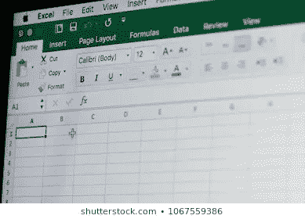

资料来源:shutterstock.com

在这篇文章中，我们将重点介绍如何使用 [Visual Studio 2019](https://visualstudio.microsoft.com/free-developer-offers/) 创建一个 ASP.NET 核心 MVC 应用程序来读取和显示 Excel 工作表中的数据。为了帮助实现这一点，我们将使用 NuGet 包 ExcelDataReader。

本教程不仅让我们了解如何读取 Excel 文件，还让我们了解:

*   [MVC](https://www.geeksforgeeks.org/mvc-design-pattern/) (模型-视图-控制器)如何工作
*   [剃刀语法](https://docs.microsoft.com/en-us/aspnet/core/mvc/views/razor?view=aspnetcore-3.1)
*   [HTTP Get 与 POST](https://www.diffen.com/difference/GET-vs-POST-HTTP-Requests)

如果你已经熟悉这些话题，你可能想浏览一下其中的一些解释。

# 工具

对于本教程，您将需要 Microsoft Visual Studio ( **而不是** Visual Studio 代码)。推荐免费的 [Visual Studio 2019 社区版](https://visualstudio.microsoft.com/downloads/)。

# 创建我们的应用程序

## 创建 ASP.NET 核心 MVC Web 应用程序

1.  启动 Visual Studio 并点击**创建一个新项目**

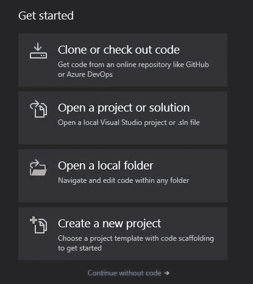

2.接下来，我们将在左侧和右侧选择项目类型。我们想要的是一个**ASP.NET 核心网络应用**。在右侧，选择**ASP.NET 核心网络应用**。

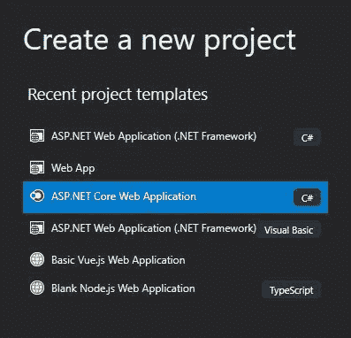

屏幕的左侧

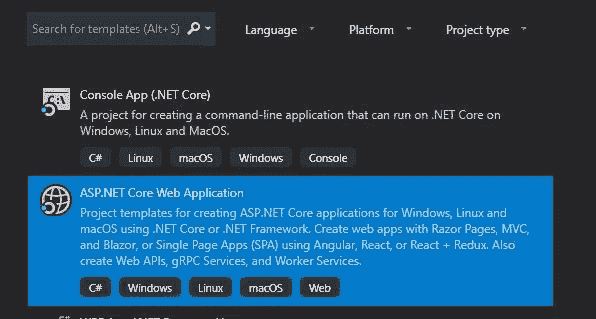

屏幕右侧

3.点击旁边的**，输入项目的**名称**和项目所在的**位置**。我给自己起的名字是 **ReadExcel** 。完成后点击**创建**。**

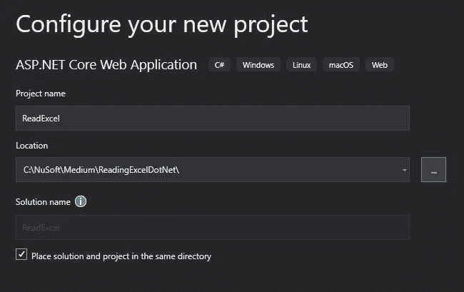

项目名称和地点

4.最后，我们选择我们想要的 Web 应用程序的类型。在我们的例子中，我们想要 **Web 应用程序(模型-视图-控制器)。**然后点击**创建**。

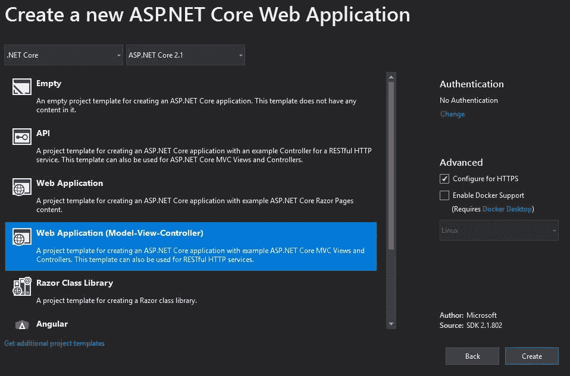

MVC 应用程序

在一个 [MVC](https://www.geeksforgeeks.org/mvc-design-pattern/) 应用程序中，我们使用**模型**来描述我们的数据。**控制器**获取我们的数据(并且通常操纵数据。)的**视图**来显示我们的数据。

我们的数据将是一个 Excel 文件中的用户列表。我们希望在控制器中读取 Excel 文件，并在网页视图中显示用户。

# 创建 Excel 文件

首先创建一个包含以下(或类似)数据的 excel 文件，并在应用程序的根目录下保存为 **Users.xlsx** 。

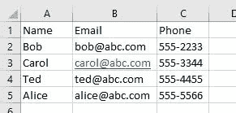

Users.xlsx

查看解决方案资源管理器，您的文件结构应该如下所示，

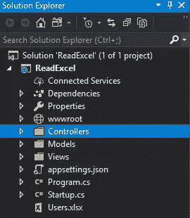

根目录中的 Users.xlsx

我们将首先创建一个控制器，稍后将对其进行修改。我们的模型和视图，后面也会修改。

## 创建控制器

Excel 文件的读取将在控制器文件中完成。我们可以使用现有的 HomeController.cs，但是让我们创建自己的 **UserController** 。

1.  在解决方案浏览器中，右击控制器文件夹并选择**添加**，然后选择**控制器**。现在选择如下所示的控制器类型，并点击**添加**。根据您的使用情况，这些控制器类型中的每一种都用有用的方法填充控制器。

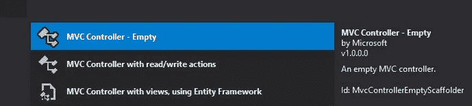

2.然后键入单词 **User** 代替 **Default** ，保留单词 Controller。点击**添加**。

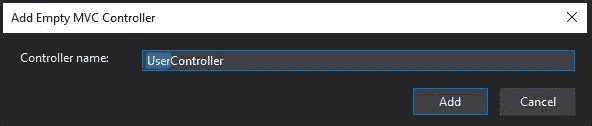

在解决方案资源管理器中，打开**user controller . cs**。注意它只有一个方法。这是默认的 HTTP GET 方法。换句话说，当用户运行我们的应用程序时，这是默认运行的方法，并提供给我们的页面。

我们的页面将是简单的，只包含一个从 Excel 文件获取数据的按钮。然而，在点击按钮之后，我们已经启动了一个 HTTP POST。因此，我们稍后需要创建一个 HTTP POST 方法来读取 Excel 文件，并将数据发送到视图进行显示。

```
using System;
using System.Collections.Generic;
using System.Linq;
using System.Threading.Tasks;
using Microsoft.AspNetCore.Mvc;namespace ReadExcel.Controllers
{
    public class UserController : Controller
    {
        // Default GET method
        public IActionResult Index()
        {
            return View();
        }
    }
}
```

## 创建我们的模型

接下来，我们将创建我们的模型。这是 Users.xlsx 中包含我们每个用户的内容。

1.  右键单击**型号**文件夹。选择**添加**然后**新增物品…** 选择**类别。**在**底部**输入名称 **UserModel.cs** ，点击**添加**。

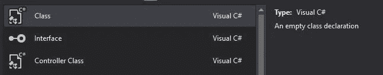

2.修改**用户模型. cs** 来包含我们的用户模型。

```
using System;
using System.Collections.Generic;
using System.Linq;
using System.Threading.Tasks;namespace ReadExcel.Models
{
   ** public class UserModel
    {
        public string Name { get; set; }
        public string Email { get; set; }
        public string Phone { get; set; }** **}**
}
```

*当我们读取文件时，我们将为 Users.xlsx 中的每个用户创建一个该类的实例。*

## 创建视图

我们将创建我们的视图，在一个**用户**文件夹中命名为 **Index.cshtml** 。

*如果您现在运行您的应用程序，您将获得包含在 Views/Home 文件夹的 Index.cshtml 中的标记。*

1.  右键点击**视图**，选择**添加**，然后选择**新建文件夹**。将其命名为**用户。**
2.  右击**用户**文件夹选择**添加**然后**查看**。使用下面的选项。

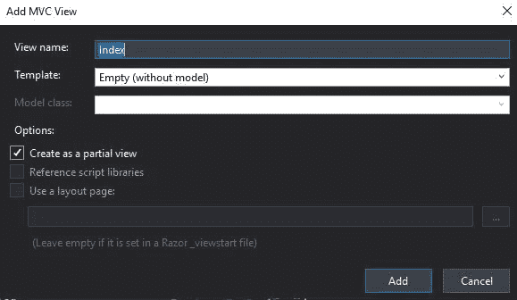

我们想修改这个以适应我们的目的。这将包含一些 HTML 标记以及 Razor 语法。

1.  打开**用户**文件夹中的 **Index.cshtml** 。用下面的 HTML 和 Razor 替换任何现有的标记。

```
[@using](http://twitter.com/using) ReadExcel.Models
[@model](http://twitter.com/model) IEnumerable<**UserModel**>
@{
    Layout = null;
}<!DOCTYPE html><html>
<head>
    <meta name="viewport" content="width=device-width" />
    <title>Users</title>
</head>
<body>
  [**@using**](http://twitter.com/using) **(Html.BeginForm("Index", "User", FormMethod.Post))** {
      **<input type="submit" value="Get Users" />**
    }
   [**@if**](http://twitter.com/if) **(Model.Count() > 0)**
    {
        <hr />
        <table cellpadding="0" cellspacing="0" border="1">
            <tr>
                <th>Name</th>
                <th>Phone</th>
                <th>Email</th>
            </tr>
           [**@foreach**](http://twitter.com/foreach) **(UserModel user in Model)**
            {
                <tr>
                    <td>[@user](http://twitter.com/user).Name</td>
                    <td>[@user](http://twitter.com/user).Email</td>
                    <td>[@user](http://twitter.com/user).Phone</td>
                </tr>
            }
        </table>
    }</body>
</html>
```

以下注意事项。

在顶部，我们告诉它预期的模型，UserModel。

当应用程序第一次运行时，它将调用 UserController 中的当前索引方法。这是一个 GET 方法，它将提供视图，该视图只包含一个按钮。我们将不得不编写另一个方法来处理由单击按钮触发的 POST，这也将是索引，但将被标记为 POST，并能够接受表单数据。

此外，当最初访问该页面时，它将期待模型数据。这个看剃刀标记就知道了， **@if(型号。Count() > 0)。**我们希望确保它在首次加载时不会试图显示任何数据。只有表单按钮。

此页面需要用户模型数据。然而，现在我们的用户(控制器)索引方法没有向视图传递任何用户模型数据。为了解决这个问题，我们将传递一个空列表。

打开 **UserController** ，修改默认的 GET **Index** 方法如下。注意新的 using 语句。没有这个，它就不知道什么是用户模型。我还添加了[HttpGet]来更清楚地说明这个方法的作用。注意 return 语句现在返回一个空的 UserModel 列表(空的用户列表。)所以第一次访问时，只会显示“获取用户”提交按钮，因为 **@if (Model。Count() > 0)** 将为假。

```
using System;
using System.Collections.Generic;
using System.Linq;
using System.Threading.Tasks;
using Microsoft.AspNetCore.Mvc;
**using ReadExcel.Models;**namespace ReadExcel.Controllers
{
    public class UserController : Controller
    {
        [HttpGet]
        public IActionResult Index()
        {
           ** return View(new List<UserModel>());**
        }}
}
```

再改一下，我们就可以试运行了。我希望这是默认路由，而不是 HomeController。

在解决方案资源管理器的底部，打开 Startup.cs 底部的 **Startup.cs.** 我们会告诉它默认使用 User(Controller)和 GET Index 方法。

```
app.UseMvc(routes =>
  {
      routes.MapRoute(
          name: "default",
          template: "{**controller=User**}/{action=Index}/{id?}");
  });
```

运行您的解决方案。虽然不够优雅，但它应该显示一个“获取用户”按钮。

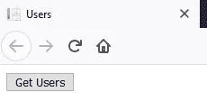

在[里面@使用](http://twitter.com/using) (Html。BeginForm("Index "，" User "，FormMethod。Post))

## 读取和显示 Excel 数据

此时，我们需要安装两个 **NuGet** 包。

*   ExcelDataReader 将允许我们读取数据。
*   系统。文本.编码.代码页

第二个是一个不幸的副作用。net core 默认不包括正确的编码，如. NET.

转到项目并选择**管理 NuGet 包**。分别浏览和安装。

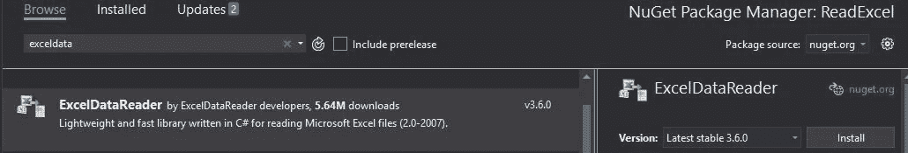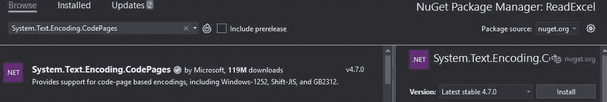

**修改 UserController 读取 Users.xlsx**

打开**用户控制器**。我们需要编写当点击“获取用户”按钮时将被访问的 POST 方法。在这里，我们将读取 Users.xlsx 并向视图返回一个用户模型数据列表。

在现有的 GET Index 方法下添加以下代码。

```
[HttpPost]
public IActionResult Index(IFormCollection form)
{
    List<UserModel> users = new List<UserModel>(); var fileName = "./Users.xlsx";// For .net core, the next line requires the NuGet package, 
// System.Text.Encoding.CodePages
    System.Text.Encoding.RegisterProvider(System.Text.CodePagesEncodingProvider.Instance);using (var stream = System.IO.File.Open(fileName, FileMode.Open, FileAccess.Read))
    {
        using (var reader = ExcelReaderFactory.CreateReader(stream))
        {

            while (reader.Read()) //Each row of the file
            {
                users.Add(new UserModel
                {
                    Name = reader.GetValue(0).ToString(),
                    Email = reader.GetValue(1).ToString(),
                    Phone = reader.GetValue(2).ToString()});}}
}return View(users);}
```

这段代码接受表单数据(这只是一个按钮)，然后打开一个指向 Users.xlsx 文件的流。

对于每一行，用户模型的一个实例被填充并添加到用户模型列表中。

最后，在 return 语句中将 users 传递给视图 Index.cshtml。从模特开始。Count()>0，数据显示在表格中。

运行您的解决方案，然后单击“获取用户”按钮。


初始获取

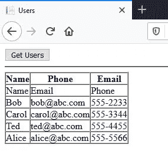

发布结果

完整的代码如下。

# 结论

在本教程中，我们学习了如何创建一个 ASP.NET 核心 MVC Web 应用程序。这允许我们探索模型、视图和控制器的概念。当然，作为我们的主要目标，我们学习了如何从 Excel 文件中读取数据。

我会鼓励你用以下方式拓展和探索。

*   更改 Excel 文件中的数据。
*   更改模型以符合 Excel 文件。
*   提高。cshtml 文件并更详细地研究 Razor 标记。
*   提高代码的模块化。

**感谢阅读，继续学习！**

在 Medium 上阅读所有你想要的文章，并通过成为 Medium 会员来帮助我继续写作，每月只需 5 美元。

[](https://bobtomlin-70659.medium.com/membership) [## 通过我的推荐链接加入灵媒——重力井(罗伯·汤姆林)

### 作为一个媒体会员，你的会员费的一部分会给你阅读的作家，你可以完全接触到每一个故事…

bobtomlin-70659.medium.com](https://bobtomlin-70659.medium.com/membership) 

额外资源

*   [模型视图控制器](https://www.geeksforgeeks.org/mvc-design-pattern/)
*   [ASP.NET 核心的 Razor 语法](https://docs.microsoft.com/en-us/aspnet/core/mvc/views/razor?view=aspnetcore-3.1)

你也可以享受，

[](https://medium.com/javascript-in-plain-english/how-to-read-an-excel-file-in-node-js-6e669e9a3ce1) [## 如何在 Node.js 中读取 Excel 文件

### 这再简单不过了

medium.com](https://medium.com/javascript-in-plain-english/how-to-read-an-excel-file-in-node-js-6e669e9a3ce1) [](/creating-an-asp-net-core-restful-web-api-62b3a5a90ba5) [## 创建 ASP.NET 核心(RESTful) Web API

### 探索 HTTP 动词并执行 CRUD 操作

levelup.gitconnected.com](/creating-an-asp-net-core-restful-web-api-62b3a5a90ba5) 

# 完全码

**型号(用户型号)**

```
using System;
using System.Collections.Generic;
using System.Linq;
using System.Threading.Tasks;namespace ReadExcel.Models
{
    public class UserModel
    {
        public string Name { get; set; }
        public string Email { get; set; }
        public string Phone { get; set; }}
}
```

**视图(User/Index.cshtml)**

```
[@using](http://twitter.com/using) ReadExcel.Models
[@model](http://twitter.com/model) IEnumerable<UserModel>@{
    Layout = null;
}<!DOCTYPE html><html>
<head>
    <meta name="viewport" content="width=device-width" />
    <title>Users</title>
</head>
<body>
    [@using](http://twitter.com/using) (Html.BeginForm("Index", "User", FormMethod.Post)){<input type="submit" value="Get Users" />
    }
    [@if](http://twitter.com/if) (Model.Count() > 0)
    {
        <hr />
        <table cellpadding="0" cellspacing="0" border="1">
            <tr>
                <th>Name</th>
                <th>Phone</th>
                <th>Email</th>
            </tr>
            [@foreach](http://twitter.com/foreach) (UserModel user in Model)
            {
                <tr>
                    <td>[@user](http://twitter.com/user).Name</td>
                    <td>[@user](http://twitter.com/user).Email</td>
                    <td>[@user](http://twitter.com/user).Phone</td>
                </tr>
            }
        </table>
    }</body>
</html>
```

**控制器(用户控制器)**

```
using System;
using System.Collections.Generic;
using System.Linq;
using System.Threading.Tasks;
using Microsoft.AspNetCore.Mvc;
using ReadExcel.Models;
using Microsoft.AspNetCore.Http;
using ExcelDataReader;
using System.Data;
using System.IO;namespace ReadExcel.Controllers
{
public class UserController : Controller
{
    [HttpGet]
    public IActionResult Index()
    {
        return View(new List<UserModel>());
    }[HttpPost]
    public IActionResult Index(IFormCollection form)
    {
        List<UserModel> users = new List<UserModel>();var fileName = "./Users.xlsx";// For .net core, the next line requires NuGet package, 
        // System.Text.Encoding.CodePages
        System.Text.Encoding.RegisterProvider(System.Text.CodePagesEncodingProvider.Instance);
        using (var stream = System.IO.File.Open(fileName, FileMode.Open, FileAccess.Read))
        {
            using (var reader = ExcelReaderFactory.CreateReader(stream))
            {

                while (reader.Read()) //Each ROW
                {
                    users.Add(new UserModel
                    {
                        Name = reader.GetValue(0).ToString(),
                        Email = reader.GetValue(1).ToString(),
                        Phone = reader.GetValue(2).ToString()});}}
}return View(users);}}
}
```

**更改 Startup.cs 路线**

```
app.UseMvc(routes =>
  {
      routes.MapRoute(
          name: "default",
          template: "{**controller=User**}/{action=Index}/{id?}");
  });
```