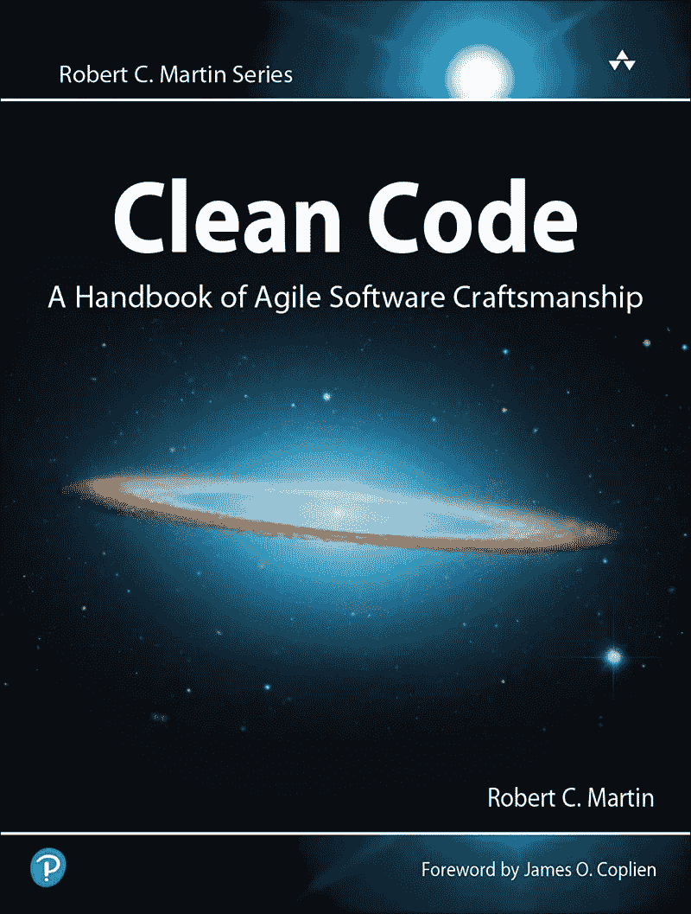
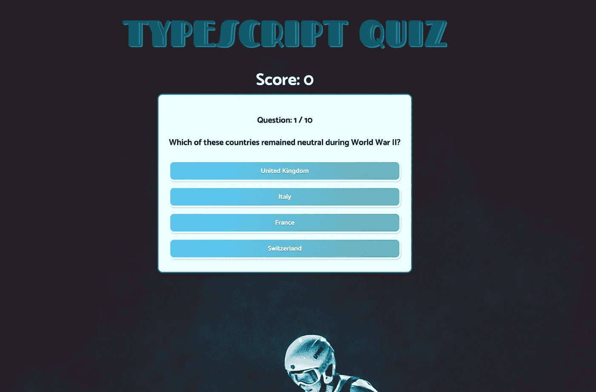
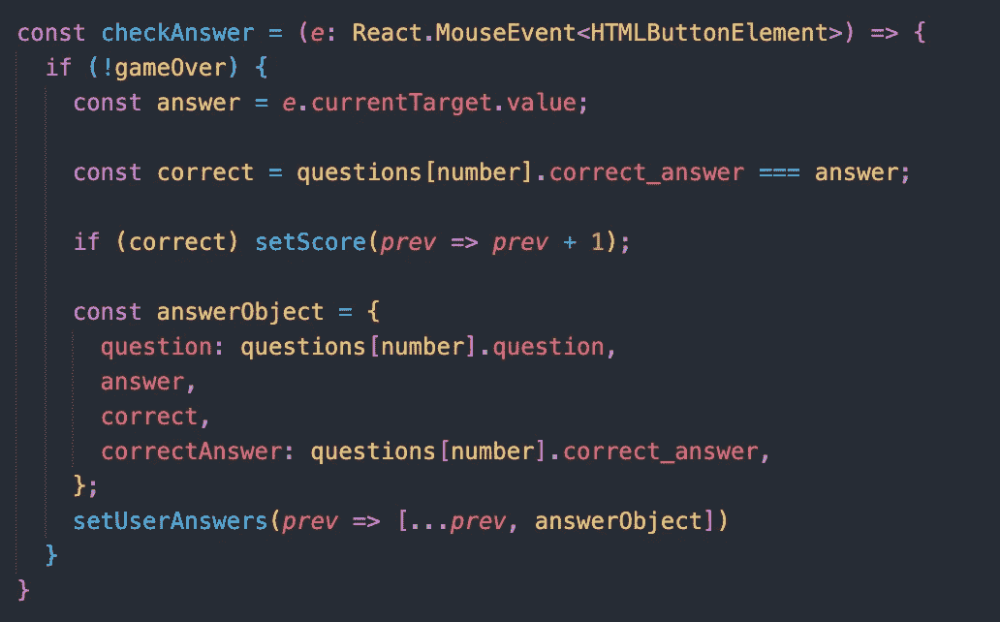
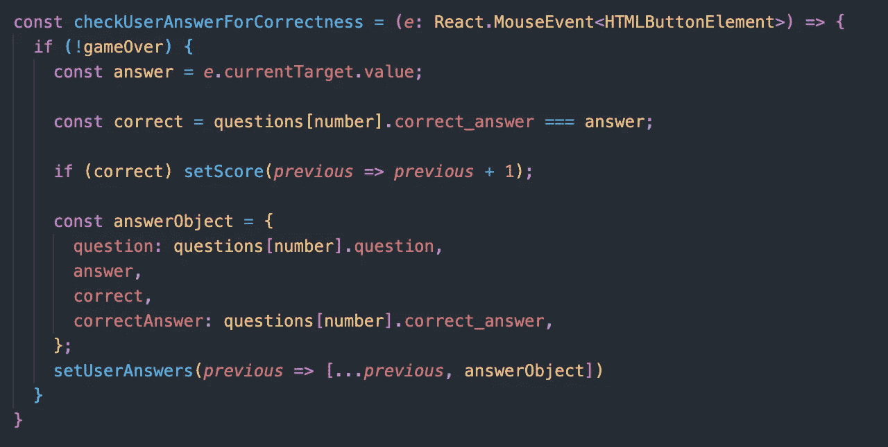
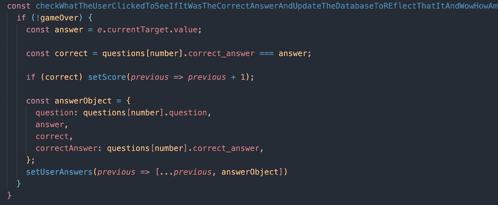
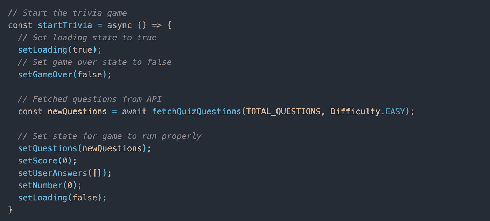
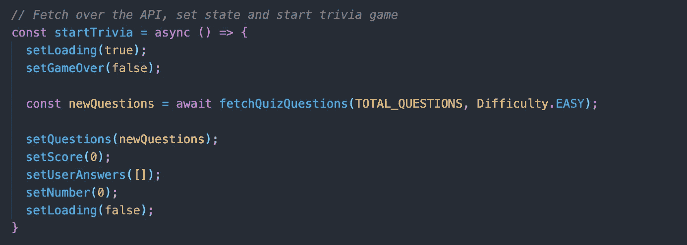
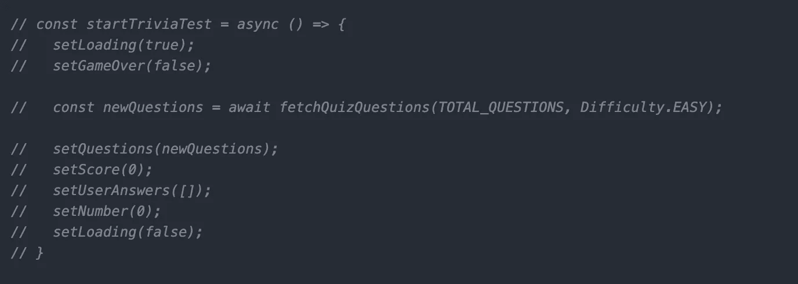

# 阅读干净的代码:第 1 周

> 原文：<https://levelup.gitconnected.com/reading-clean-code-week-1-a4df2c392e66>

正如这篇博客的关注者可能已经注意到的，在过去的几周里，我一直在引用 [*干净的代码*](https://www.amazon.com/Clean-Code-Handbook-Software-Craftsmanship/dp/0132350882/ref=sr_1_1?dchild=1&keywords=clean+code&qid=1622646055&sr=8-1) 。我是在一位朋友兼软件工程师同事的建议下开始阅读这本书的，他称赞了这种经典编程文本的价值。我一直在非常缓慢地阅读它，每周只阅读一章，以确保我将这些课程深深地植入我的大脑。尽管如此，我可以看到*干净代码*对我如何思考我写的代码以及我将来要写的代码产生了重大影响。

经典

由[鲍伯·马丁](http://cleancoder.com/products)——或“鲍勃叔叔”写给那些知道他的人的— *干净代码*于 2009 年首次发布，遵循了程序员在过去几十年中发现的一些最佳见解。你可能以前听说过它，它几乎肯定在科技领域几乎每家公司的货架上。由于计算就是制造能够比人更有效地完成特定任务的机器，我们最好听听业内一些最有见地的观点。

在这篇博文中，我将回顾我为之前的项目编写的代码，重构它来反思我从*干净代码*中学到的经验。因为我只读过前几章，所以我将非常具体地阐述我的见解，只关注有意义的名字和评论。我希望它能激励你，无论你做什么，都要写干净的代码。

更具体地说，我将重构一个我为了自学 TypeScript 而构建的简单测验应用程序。随意查看 GitHub repo [这里](https://github.com/jmarthaller/quiz-app)或者阅读我的 Medium [关于学习 TypeScript 的文章](/typescript-javascripts-more-responsible-cousin-58d1f045a7b2)。在本地运行应用程序，您应该会看到类似这样的内容:

我从学习 TypeScript 中获得了很多乐趣，并且我完全理解为什么程序员希望 JavaScript 的所有功能都具有更严格的类型。虽然我喜欢构建这个小应用程序，但我怀疑我可能没有写出最干净的代码。虽然这是一个单独的项目，我是唯一的开发人员，但其他人可以很容易地来决定在我所做的基础上进行构建。协作是互联网魅力的一部分，像 GitHub 这样的工具让编程变得如此强大。然而，如果另一个程序员来了，我缺乏干净的代码无疑会减慢他们的速度。正如 Bob 叔叔一次又一次告诉我们的那样，阅读代码的时间与编写代码的时间之比为 10:1。让我们深入代码，看看我们可以重构什么。

## 名称

《洁净代码》的前几章中有一章是关于名字的。这一章的第一句话是“名字在软件中无处不在。”我们不断地命名函数、变量、参数等等。因为我们程序中的命名元素经常出现，所以我们应该做好它，给出清晰有意义的名称。让我们以下面的函数为例:

上面的函数相当简单。它接受 click 事件的值(无论用户选择哪个答案),并检查该答案是否正确。虽然我对这里使用的一些命名约定相当满意，但我认为我们可以做得更好。首先，我认为`checkAnswer()`可以更具体一点。如果这是一个更大的项目，有不同种类的测验问题，仅仅告诉你的程序员同事“是的，这个函数检查答案或什么的”可能不够好。它会检查用户的答案吗？它在什么语境下检查答案？是否有一些后台进程“回答”它正在检查？正如*干净代码*告诉我们的，作为程序员，我们希望使用**透露意图的名字**。也就是说，我们希望向读者展示这个函数为什么存在以及它有什么作用。现在让我们试着清理一下:

在我看来，这个小小的更新极大地改进了我们的程序。现在，当其他编码人员遇到`checkUserAnswerForCorrectness()`时，他们会清楚地看到它从用户那里接受一个`MouseEvent`，并检查该答案是否与我们数据库中的数据相匹配。这个小小的改变可能会节省我们团队成员的宝贵时间。

敏锐的读者可能已经注意到，我还用`previous`替换了`prev`变量。虽然大多数人可能已经知道了`prev`是什么的简称，但是我做这个重构是为了一个非常重要的*干净代码*的原因:**避免虚假信息**。清晰意味着具体，我们不希望我们的程序员同事碰到`prev`并认为它可以代表除了以前以外的任何东西。虽然程序员可能总是使用`i`进行迭代，或者使用`x`来保存特别明显的数据，但从长远来看，写出完整的单词应该会对你有所帮助。

虽然在命名约定中保持冗长很重要，但是编写干净的代码需要平衡。你不能像这样命名你的函数:

虽然从技术上讲，这是该函数的一个更具体的名称，但它显然比`checkUserAnswerForCorrectness`更糟糕。我们甚至看不到函数的全名，更不用说它接受的任何参数了！我们的节目是故事，作为故事讲述者，我们应该努力提高我们的描述技能。虽然在*干净代码*的这一章中有更多的经验，但这是使用有效名称的好入门。

## 评论

简单地说，程序员不能依靠注释来保存他们混乱的代码。正如 Bob 叔叔所说，没有什么比一个恰当的注释“更有帮助”了，但是当你使用程序越多，它也会使你的程序变得混乱。虽然以注释的形式向读者提供版权信息或意图解释可能是有用的，但总的来说，注释是不必要的，会分散读者对代码的注意力，而代码是程序中真理的最终来源。

我承认，我其实很擅长回避评论。教我的程序员一直教导我用代码来表达自己，而且评论大多是无聊的。更有可能是因为他们比我先阅读*干净的代码*,所以他们才教我这个。为了忠于这篇博文，我将在应用程序中插入一些评论，并分享一些从*干净代码*中得到的重要教训。我们先来看看下面的差评:

上面的评论是*干净代码*称之为**多余评论**的一个很好的例子。这里的评论对读者有什么帮助吗？如果您将函数名重构得更具描述性，比如将其命名为`provideNextQuestionToUser()`，您的程序不是会更清晰吗？最终，你不希望一个注释——它应该传递理解——花费比函数本身更长的时间，所以这是一个很容易避免的注释。再来看另一种差评:

以上评论代表亲爱的鲍勃大叔所说的**噪音评论**。他们在编写糟糕的函数中加入胡椒，膨胀你的代码直到你几乎无法理解。虽然程序员可能希望在函数的顶部包含一个注释来引导读者，但是使用良好的命名约定可以节省几行注释。只要看看当我们把它减少一点时，代码有多干净:

我想我们可以同意这是非常容易阅读的，你的程序员同事可能会喜欢描述函数将做什么的顶部注释。记住，在你写评论之前，看看你是否能重构你的代码，使它更清晰。让我们看看最后一个不好的评论，我们要在这里检查:

希望这是显而易见的，但是**注释掉的代码**对阅读你的程序的其他人几乎没有任何用处。也许上面的代码是为了应用程序的早期迭代，也许这只是一个粗心的程序员忘记删除的 cruft。不管怎样，它可能不应该存在于程序中，因为它携带的信息很少，所以它可能会持续存在。正如 *Clean Code* 告诉我们的，其他人可能没有勇气删除这个评论，因为他们不知道它是否重要。作为我们节目的最初作者，我们应该密切注意可以从我们的节目中删除哪些内容，以使它们更加清晰。评论可能是有用的，但只有在做得好的时候。

在接下来的几周里，我会阅读更多的 *Clean Code* 并分享它对初涉程序员的启示。通过非常缓慢地阅读这本书(大约一章/周)，我想真正吸收尽可能多的信息，最终使我成为一个更好的程序员。每周回来看看我的进步！