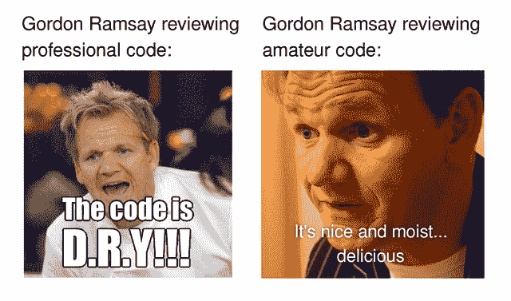
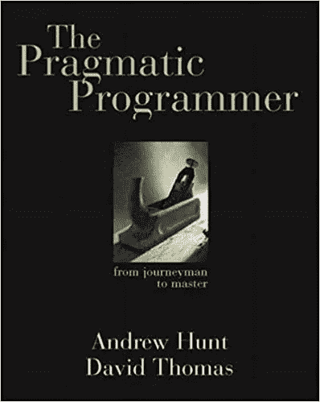
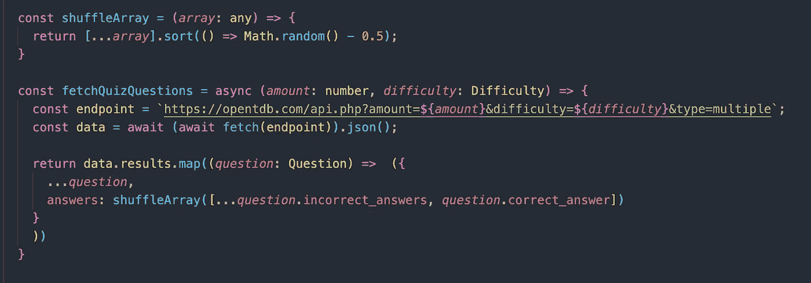
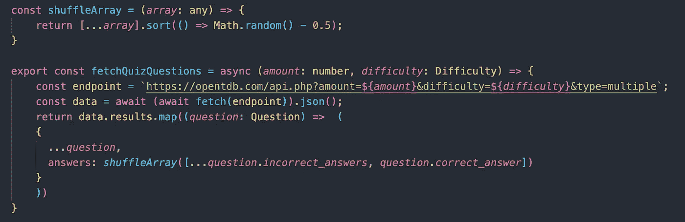
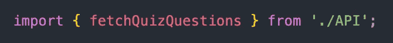
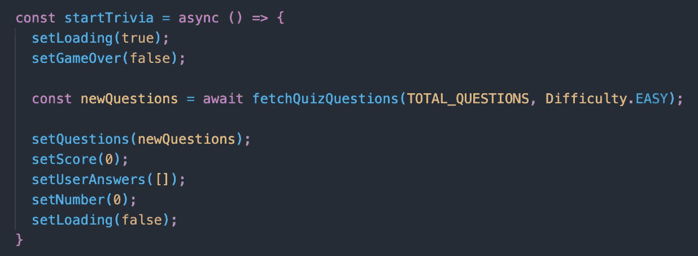
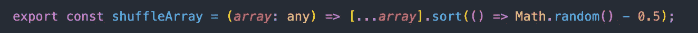
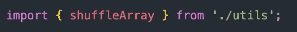

# 阅读干净代码第三周:D

> 原文：<https://levelup.gitconnected.com/reading-clean-code-week-3-d-r-y-178da32e6220>

本周我将继续我的[系列](/reading-clean-code-week-1-a4df2c392e66)关于 [*干净代码*](https://www.amazon.com/Clean-Code-Handbook-Software-Craftsmanship/dp/0132350882/ref=sr_1_1?dchild=1&keywords=clean+code&qid=1622646055&sr=8-1) ，但是我想用这篇博文做一些不同的事情。当我第一次开始阅读鲍伯·马丁的经典《编写更好的代码手册》时，给我的建议是非常非常慢地阅读。有人告诉我，如果你有一份实体副本，它应该看起来像一件珍贵的传家宝:折角，来回翻看，清楚地使用过。事实上， *Clean Code* 也提供了同样的建议。正如鲍勃叔叔在前言中写道的，这不是一本“你可以在飞机上阅读并在着陆前完成的感觉良好的书。”相反，马丁和他的合著者敦促读者在文本中的每个概念上花足够的时间，与代码片段和案例研究搏斗，以深刻理解为什么他们的建议如此重要。

出于这个原因，本周我将只关注*清洁代码*中的一个指导方针，剥离层以更好地了解它如何改进我的代码。更具体地说，我将专注于保持我的代码 D.R.Y .，或者不要重复你自己。在简要概述了如何保持代码 D.R.Y .之后，我将在重构我的一个作品集项目中应用这些原则，这是一个用 TypeScript 编写的[简单测验应用程序。](https://github.com/jmarthaller/quiz-app)

公平地说，鲍伯·马丁和 *Clean Code* 不能独揽《不要重复自己》的功劳。最初由迪夫·托马斯和安迪·亨特在他们自己的经典编程文本 [*《实用程序员*](https://www.amazon.com/Pragmatic-Programmer-Anniversary-Journey-Mastery/dp/B0833FBNHV/ref=sr_1_1?dchild=1&keywords=The+Pragmatic+Programmer&qid=1625587763&sr=8-1) 中构思的，编写 D.R.Y .代码的原则几十年来一直是优秀软件开发的主要内容。尽管如此，在*干净代码*中对 D.R.Y 代码的简短讨论强调了它对任何专业软件工程师的重要性。

该领域的又一经典

在最基本的层面上，不要重复你自己的陈述，你写的每一行代码应该在你的程序中有一个单一的，明确的表示。一个类比可能有助于进一步解释这一点。我有时在记事本上草草记下笔记来组织我的工作周。有时当我回顾一周的笔记时，我会注意到有些笔记我写了不止一次。也许我没有在周二给同事发邮件，而是在周三的清单上重写了一遍。也许我只是忘了我写下了一张纸条，然后复制了它。无论如何，在我的笔记本上抄笔记对我的大脑来说不是什么大不了的事情，因为我可以很容易地跳过它们，或者在周末把笔记本扔掉，然后忘记它。

但是计算机大脑不像我们的大脑那样工作。我的程序在任何时候运行，它都会编译*文件中的所有*代码，不管是不是原始的。如果我对该文件进行编辑，并且某个特定逻辑有多个实例，我必须编辑该逻辑的所有实例，否则我的程序将会中断。正如马丁在*干净代码*中所说，复制是“软件中所有罪恶的根源”“湿”代码使我们的程序膨胀，对这些程序的任何修改都要大 n 倍。由于湿代码对我们和(尤其是)我们的开发伙伴来说更难阅读和维护，我们应该不惜一切代价避免它。

说到这里，我回头看看我的 TypeScript 测验应用程序，看看有什么可以重构，使我的代码更 D.R.Y。在清理我的代码库时，我注意到的第一个逻辑是我用来获取和打乱我的测验问题的函数:

在 App.tsx 中

最初构建这个项目时，我希望每当有人启动应用程序时，我的代码都能获取测验问题，所以我在顶层组件`App.tsx`中包含了`fetchQuizQuestions()`。然而，在阅读了更多关于 D.R.Y .代码的内容后，我对这种设计策略所带来的问题有了更好的理解。

通过将这些代码直接包含在我的组件中，它是不可重用的。如果我和其他程序员要进一步构建这个应用程序，我们可能会决定在应用程序的不同部分添加获取测验问题的功能。如果我们这样做，我们将不得不多次写`fetchQuizQuestions()`。更糟糕的是，如果我们必须基于新的规范重构`fetchQuizQuestions()`，我们必须找到项目中函数的每个实例并编辑它们。这不仅乏味而且危险，因为我们会因为丢失重复的代码而破坏我们的代码库。

相反，我们应该**抽象出**我们的代码，以便更容易地在整个应用程序中重用它。通过将应用组件的功能提取到它自己的文件中，我们称之为`API.ts`，我们将使这个项目整体上更易于维护。我们可以看到一个例子来说明我的意思:

在 API.ts 中

通过将这种逻辑提取到它自己的文件中，我们分离了获取测验问题的逻辑，将它们模块化成任何程序员都可以容易理解和参与的小块。现在，回到`App.tsx`，我们只需要导入函数，就像这样:

将 fetchQuizQuestions()导入回 App.tsx

然后在我们启动整个应用程序并设置状态时调用`fetchQuizQuestions()`:

这种方式的重构还有一个额外的好处，就是缩短了`App.tsx`，使得其他开发人员更容易理解。但是等等，你可能已经注意到我们可以进一步清理`API.ts`，将`shuffleArray()`函数放入它自己的模块中以增加可读性。我们将这样做，在一个名为`utils.ts`的文件中:

utils.ts

然后我们将`shuffleArray()`导入`API.ts`:

API.ts

虽然可能感觉我们通过创建许多文件来存储我们的逻辑，从而使我们的代码变得更加复杂，但是我们实际上为我们未来的自己使开发变得更加容易。请记住，计算机的大脑可以很好地记录我们把哪些文件放在了哪里。通过将事情分成越来越小的部分，我们可以很容易地跟踪这些功能，如果它们需要改变的话，按住 command 键点击应用程序，找到需要编辑的确切的逻辑部分。有了这些变化，我们的 TypeScript 测验应用程序仍然像以前一样工作良好，并且现在更易于维护。

就像软件开发中的几乎所有事情一样，关于 D.R.Y .代码的观点很多。一些人认为保持代码 D.R.Y .是过于严格的指导方针，甚至推荐 W.E.T .(将所有东西写两遍)有助于更快的开发工作流程。其他人说，D.R.Y .的从业者过于热心，开发人员应该[避免仓促的抽象](https://kentcdodds.com/blog/aha-programming)(或 A.H.A .)。然而，尽管这些用于编写软件的替代框架无疑有其优点，但目前我想遵循 *Clean Code* 的建议来提高我的代码的整体可读性。虽然保持您的代码 D.R.Y .还有许多其他方面——包括三原则和关注点分离，等等——但是这个高层次的概述应该让您对如何开始这个概念有一个大致的了解。

我希望你和我一样喜欢这个关于*干净代码*的系列。很多时候，作为软件工程师，我们通过键盘发出多少声音来衡量我们的成功。然而，正如有经验的开发人员会告诉你的，坐下来看一本厚厚的书，慢慢挖掘它所提供的课程，对于你作为一名专业工程师的长期成长来说，会有无限的价值。我喜欢 Clean Code 不仅帮助我思考重构现有代码的方法，还帮助我思考如何编写新代码。下周回来看看我的进步吧！