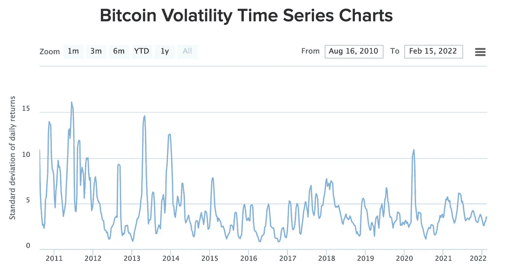

# 解读加密货币市场:有可能理解加密的趋势吗？

> 原文：<https://levelup.gitconnected.com/reading-cryptocurrency-markets-is-it-possible-to-understand-trends-within-crypto-2f06b995e387>

加密货币市场是出了名的不稳定，那么在这样一个复杂的生态系统中识别和理解新兴趋势有多困难呢？

尽管机构投资者和采用率在整个 2021 年都在增长，但比特币仍然遭受了重大崩溃，导致加密货币的价格下跌了 50%。虽然对市场将在今年最后几个月复苏持乐观态度，但我们看到创纪录的通胀率导致更多投资者抛售和进一步低迷。

*(图片:* [*ETF 走势*](https://www.etftrends.com/crypto-channel/is-bitcoins-volatility-less-than-tech-stocks-ytd/) *)*

如上图所示，我们已经看到，与形成时期相比，比特币表现出较低的波动性。对于发现趋势来说，这是一个好兆头，因为趋势很可能不会被剧烈波动和严重抛售所打断。

因此，考虑到这一点，让我们更深入地了解一下在 crypto 中识别[趋势有多容易，以及它们能够告诉我们什么:](/how-i-tripled-my-return-on-bitcoin-using-mathematics-algorithms-and-python-347edd9b5625)

# 识别资产趋势

尽管加密生态系统在很大程度上受到投资者情绪的控制，但自由金融欧洲公司(Freedom Finance Europe)投资咨询主管马克西姆曼图罗夫(Maxim Manturov)指出，与其它股票和大宗商品一样，这些市场仍有一些公认的趋势。

“鉴于任何市场都有两种主要的资产价格趋势:上涨——“看涨”，下跌——“看跌”，还有一种水平趋势——“持平”。有可能分析并正确识别加密货币的价格运动，”曼图罗夫说。“价格的稳步上升和购买订单量的稳步累积表明趋势变化已经发生或正在发生。此外，当资产价格在高点和低点之间波动时，趋势从向下到向上的变化也被视为。这标志着一个看涨的趋势。这样的事件可以在 2022 年 1 月中旬和 2022 年 3 月中旬看到。”

“除了技术分析，还应该考虑专业社交媒体社区(如 Twitter、Telegram 和 Reddit)日益增长的活动，以更全面地确定加密资产的价格趋势，”曼图罗夫补充道。

值得注意的是，社交媒体可能是识别加密货币世界趋势的最佳场所——比任何其他市场都更好。这是因为 crypto 在很大程度上基于投资者情绪，而投资者情绪可以通过社交媒体进行监控。

事实上，投资者非常珍惜社交媒体情绪，我们已经看到了[比特币恐惧指数](https://twitter.com/BitcoinFear)的发展，该指数衡量投资者对加密货币的感受——有助于显示乐观情绪是否可能为未来的价格上涨铺平道路。

# 从库存模型转向流动模型

尽管情绪有助于为投资者进行某种程度的趋势分析铺平道路，但我们看到比特币最著名的趋势分析模型之一在 2021 年陷入困境:股票到流量。

*(图片:* [*【推特】*](https://twitter.com/100trillionUSD/status/1509689772184420353/photo/1) *)*

比特币的存量-流量模型(S2F)一直是一种非常准确的衡量方法，可以衡量在该资产的预编程减半事件发生后，加密货币的价格应该走向何处——在该事件中，授予矿工的 BTC 量大约每四年减半。

然而，正如图表所示，在比特币最近于 2020 年 5 月减半后，BTC 的价格涨势远未达到模型预测的 10 万美元，比特币的历史最高价格约为 69000 美元。

比特币 S2F 的表现不佳是一个打击，因为该币的减半周期被视为一个机会，可以获得对这种数字货币可能价格路径的前所未有的洞察力。

从模型的价格预测中我们可以看出，在 2024 年减半后，比特币的价值将达到 110 万美元——这是投资者非常乐观的原因。失去 S2F 模型作为未来价格走势的指标，意味着投资者对其加密货币持有量在未来几年走高的保证要少得多。

由于比特币的市场主导地位，比特币未来的价格上涨将会影响整个加密货币生态系统，并在此过程中拖累其他资产。

# 为什么更难预测密码市场

可悲的是，加密货币比更传统的投资选项更难预测有许多[原因。](https://en.freedom24.com/ideas/11841-cryptocurrency-for-portfolio-diversification)

因为这是一个相当新的领域，世界各地的监管机构一直在努力提供前瞻性的国内密码买卖规则，这可能会导致严重的价格波动。

对去中心化数字货币的安全担忧也可能导致大范围抛售——以及硬币技术框架的脆弱性。

损害加密趋势的另一个主要因素是市场易受操纵的脆弱性。因为加密货币在很大程度上是以情绪为导向的，所以鲸鱼(即持有大量 BTC 的鲸鱼)很容易出售主要股份，以促使投资者抛售，然后再折价买回。

但从根本上说，比特币这样的加密货币之所以如此不可预测，是因为它们本质上没有有形价值。因为这种资产不与现实世界的商品或货币挂钩，所以它的价格纯粹是投机性的。

这造成了一种情况，即任何被解释为具有负面市场影响的因素都可能引发恐慌性抛售——即使它对任何加密货币资产的价格没有直接影响。

考虑到这一点，在投资 crypto 时最好保持警惕，并始终保持警惕。在情绪驱动的生态系统中，趋势可以以完全社会化的方式出现。