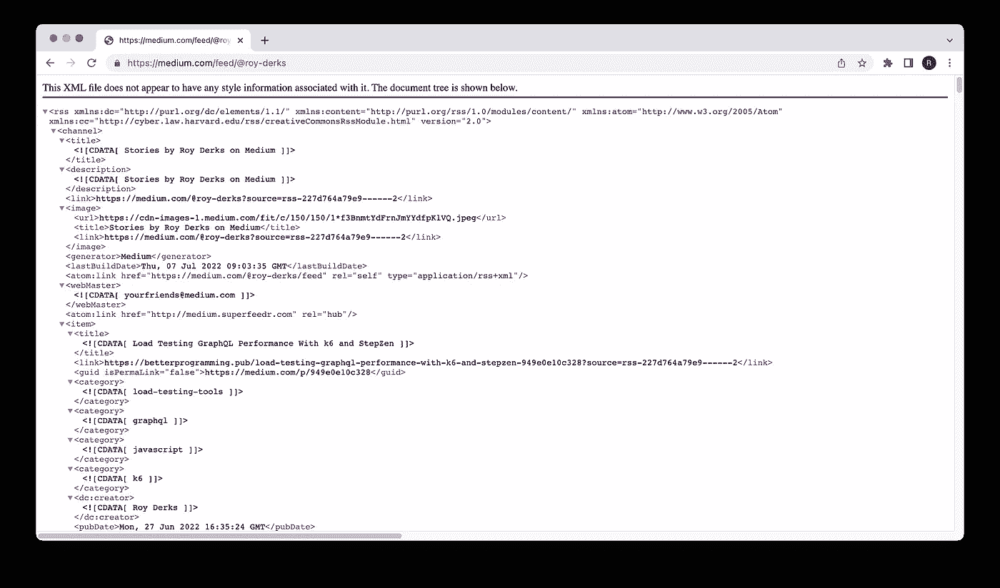
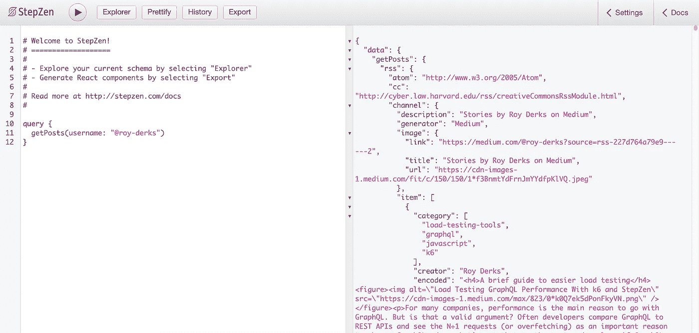
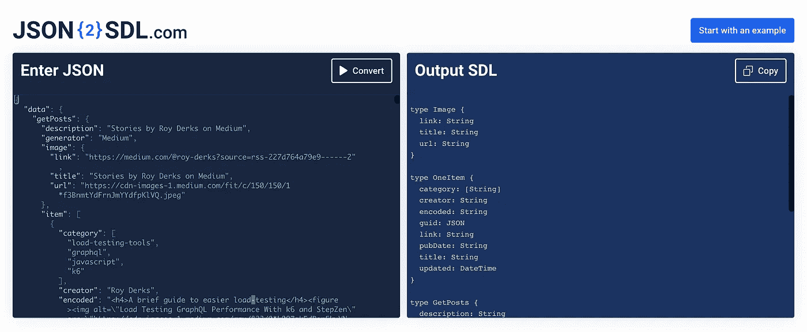

# 使用 GraphQL 读取媒体 RSS 提要

> 原文：<https://levelup.gitconnected.com/reading-the-medium-rss-feed-with-graphql-cdd25b8ee634>


RSS 源作为一种从网站获取更新的流行方式，自 90 年代以来就一直存在。许多网站广泛使用它，今天它正成为播客在不同流媒体平台上分发内容的主要方式。在本文中，我们将从 Medium 获取 RSS 提要并使用 GraphQL 阅读它。

> 你可以在我们的 [Github 示例库](https://github.com/stepzen-dev/examples/tree/main/with-rss)中找到本文的完整代码，或者在我们的 [Youtube 频道](https://www.youtube.com/watch?v=aGS-pB28TSk)上观看视频演示。

RSS 提要到底是什么？RSS 代表真正简单的联合组织，是一种用于传递频繁更新的内容(通常是新闻标题)的格式。这是一种基于 XML 的格式，允许您订阅网站的提要，并在有新帖子或播客时接收更新。RSS 提要是网站保持其内容与读者设备同步的标准方式。让我们更深入地研究一下中型 RSS 提要。

## 探索中型 RSS 提要

RSS 提要是阅读媒体的最佳方式。它简单快捷，只要你喜欢的媒体出版物上有新文章发表，它就会更新你的信息。每个媒体用户都有自己的 RSS 提要，如下所示:

```
[https://medium.com/feed/@username](https://medium.com/feed/@username)
```

它包含关于提要所有者的信息，在这个例子中是作者，以及这个作者发布到 Medium 的所有帖子。关于媒体 RSS 的文档可以在[这里](https://help.medium.com/hc/en-us/articles/214874118-Using-RSS-feeds-of-profiles-publications-and-topics)找到，其中也包括关于获取媒体出版物或标签的 RSS 提要的信息。

如果你没有中等帐户，你可以在这个浏览器中打开下面的 RSS 源:[https://medium.com/feed/@roy-derks](https://medium.com/feed/@roy-derks)。此订阅源包含我在 Medium 上发布的所有博客帖子，当您在浏览器中打开它时，它看起来如下:



响应是 XML 格式的，文章可以在开始和结束标签之间的元素中找到。在这个元素中，可以找到 HTML 格式的标题、作者、类别、URL 和文章内容。这个提要可以通过浏览器、RSS 提要阅读器或 HTTP 请求来阅读。但是在本文中，我们将使用 GraphQL！

## 连接到 RSS 源

我们将使用 StepZen 来使使用 GraphQL 连接到中型 RSS 提要成为可能。使用 StepZen，您可以为所有现有数据源创建一个 GraphQL API，包括 REST 或 SOAP APIs。RSS 提要非常类似于 SOAP API，因为两者都以 XML 格式返回响应。

要使用 StepZen 创建新的 GraphQL API，可以使用 CLI 导入数据源，或者使用 GraphQL SDL 来配置 GraphQL 模式。我们将进行第二步，这意味着您需要在您的机器上创建一个新目录，并将两个文件放在那里:`index.graphql`和`rss.graphql`。第一个是链接到`rss.graphql`的配置文件，它包含到 RSS 提要的连接。

*   `index.graphql`

```
schema @sdl(files: ["rss.graphql"]) {
  query: Query
}
```

*   `rss.graphql`

```
type Query {
  getPosts(username: String!): JSON
    @rest(
      endpoint: "https://medium.com/feed/$username"
      headers: [
        { name: "Content-Type", value: "text/xml" }
      ]
      transforms: [{ pathpattern: "[]", editor: "xml2json" }]
    )
}
```

要基于该模式创建 GraphQL API，必须安装 StepZen CLI。安装 CLI 后，从终端或命令行运行命令:

```
stepzen start
```

CLI 询问您希望如何调用 GraphQL API 的端点(在示例`api/with-rss`中)。然后，它根据您的身份验证状态，将端点部署到公共或私有端点。如果你还没有注册 StepZen 账户，GraphQL API 将永远是公开的。当你注册后，它将是一个受 StepZen API 密钥保护的私有端点。

在下一节中，我们将使用 GraphQL 查询中型 RSS 提要。

## 使用 GraphQL 查询 RSS 提要

在上一节中，我们已经创建了 GraphQL 模式并部署了它。运行`stepzen start`之后，GraphQL API 在终端或命令行中显示的端点上可用。如果你还没有注册 StepZen，它看起来是这样的:

```
[https://public3b47822a17c9dda6.stepzen.net/api/with-rss/__graphql](https://public3b47822a17c9dda6.stepzen.net/api/with-rss/__graphql)
```

当您注册 StepZen 时，有两个端点可用:一个包含 GraphiQL IDE 的`localhost`端点和一个可以通过提供 StepZen API 密钥来访问的生产就绪端点。在文档中了解有关不同端点的更多信息。

我们将使用公共端点来探索使用 GraphQL 的 GraphQL API，如果您有 StepZen 帐户，也可以使用`localhost`端点。在 GraphiQL IDE 中，您可以粘贴以下查询以从中型 RSS 提要中获取信息:

```
query {
  getPosts(username: "@roy-derks")
}
```

您可以更改`username`值并添加自己的介质用户名。

从 GraphiQL 中，您可以看到类似的结果，如下所示:



响应是 JSON 格式的，而不是 RSS 提要先前返回的 XML 响应。在 GraphQL 模式中，我们已经配置了`@rest`自定义指令来将 XML 转换成 JSON。该配置在`transforms: [{ pathpattern: "[]", editor: "xml2json" }]`中完成，其中`xml2json`用于转换。

为了动态选择 GraphQL API 返回的字段，我们需要为`getPosts`查询设置一个定制的响应类型。在最后一节中，我们将使用一个名为 JSON2SDL 的工具来生成响应类型。

## 创建自定义响应类型

查询`getPosts`现在返回响应类型为`JSON`的 RSS 提要的响应。我们希望创建一个定制的响应类型，这样我们就可以动态地选择返回的字段。首先，我们将限制返回的字段，因为我们只需要位于 RSS 提要的`channel`元素中的作者信息和文章。

在`@rest`配置中，您可以添加一个`resultroot`字段来返回频道信息:

```
type Query {
  getPosts(username: String!): JSON
    @rest(
      endpoint: "https://medium.com/feed/$username"
      headers: [
        { name: "Content-Type", value: "text/xml" }
      ]
      transforms: [{ pathpattern: "[]", editor: "xml2json" }]
      resultroot: "rss.channel"
    )
}
```

当您再次运行上一节中的查询时，您可以看到 GraphQL API 只返回来自中型 RSS 提要的频道信息。我们可以使用 GraphQL API 的响应为`getPosts`查询创建定制的响应类型。

转到 [JSON2SDL](https://www.json2sdl.com/) ，您可以在页面左侧复制粘贴完整的 JSON 响应。按下 **Convert** ，JSON2SDL 为响应生成 GraphQL 类型。



您可以将生成的 GraphQL 类型复制到您的`rss.graphql`文件的顶部。

```
type Image {
  link: String
  title: String
  url: String
}

type OneItem {
  category: [String]
  creator: String
  encoded: String
  guid: JSON
  link: String
  pubDate: String
  title: String
  updated: DateTime
}

type GetPosts {
  description: String
  generator: String
  image: Image
  item: [OneItem]
  lastBuildDate: String
  link: JSON
  title: String
  webMaster: String
}
```

并将类型`GetPosts`链接到查询，以检索帖子作为其响应类型。

```
type Query {
  getPosts(username: String!): GetPosts
}
```

这告诉 StepZen GraphQL 引擎可以从 RSS 提要中查询哪些字段。现在，您可以动态地选择返回哪些字段，而不是一次从 Medium RSS 提要中获取所有数据。例如，如果您只想获取文章的标题和类别，下面的查询就可以做到这一点:

```
query {
  getPosts(username: "@roy-derks") {
    item {
      title
      creator
    }
  }
}
```

从 GraphQL 模式或 GraphiQL IDE 中，您可以看到还可以返回哪些字段。通过这些步骤，您已经创建了一个连接到中等 RSS 提要的 GraphQL API。

## 结论

本文向您介绍了如何将中型 RSS 提要转换成 GraphQL API。当然，您可以对其进行修改，使其适用于任何其他 RSS 提要。你可以在我们的 [Github 范例库](https://github.com/stepzen-dev/examples/tree/main/with-rss)中找到完整的代码，或者在我们的 [Youtube 频道](https://www.youtube.com/watch?v=aGS-pB28TSk)上观看视频。我们很想知道你尝试转换了什么 RSS 提要(或 SOAP API)。加入我们的 [Discord](https://discord.com/invite/9k2VdPn2FR) 来了解我们社区的最新动态。

这篇文章最初发表于[stepzen.com](https://stepzen.com/blog/reading-medium-rss-feed-with-graphql)。用[自动转贴。](https://reposted.io)

# 分级编码

感谢您成为我们社区的一员！在你离开之前:

*   👏为故事鼓掌，跟着作者走👉
*   📰查看更多内容请参见[升级编码刊物](https://levelup.gitconnected.com/?utm_source=pub&utm_medium=post)
*   🔔关注我们:[Twitter](https://twitter.com/gitconnected)|[LinkedIn](https://www.linkedin.com/company/gitconnected)|[时事通讯](https://newsletter.levelup.dev)

🚀👉 [**加入升级人才集体，找到一份神奇的工作**](https://jobs.levelup.dev/talent/welcome?referral=true)