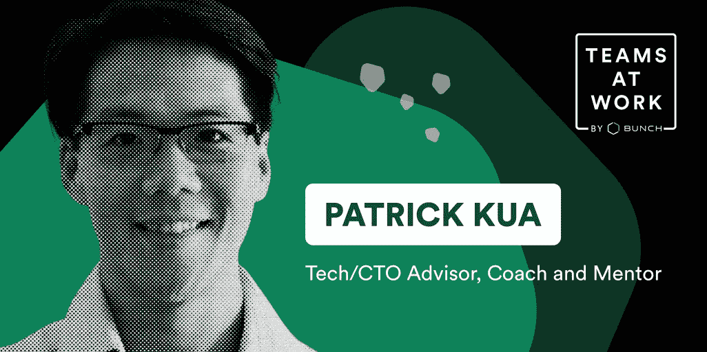

# 自述文件:发展团队(和你自己)的技术领导力的 5 个技巧

> 原文：<https://levelup.gitconnected.com/readme-5-tips-on-tech-leadership-to-grow-your-team-and-yourself-5fcda2c0b41f>

如果你有 30 分钟时间向一位技术领导力教练和导师询问你的紧迫问题，你会如何利用这段时间？

上周，我们的 Slack 社区“工作中的团队”有机会与 N26 的前 CTO、导师和教练 Pat Kua 分享他们的挑战。从帮助发展个人贡献者，到适应混合工作模式，一直到与难相处的人一起工作，Pat 分享了他的微教练建议，现在我在这里与大家分享。

以下是我们和帕特在《松弛的 AMA》中的主要收获。

# 🤝关于授权和承诺

问:我有一个直接下属，他最近加入了我的团队。我给了他一些工作任务，但他没有完成，总是找借口。有什么改进的想法吗？

**帕特:**如果有人在很少参与的情况下被赋予一项任务和截止日期，一个正常的后果是他们对结果的承诺会减少。如果你能找到一种方法，让他们参与决定任务是什么，应该如何完成，以及他们提出一个最后期限，他们应该更致力于结果。

**问:你见过的给 IC 们明确的职业发展机会而又不会强迫他们进入管理层的最好方法是什么？**

Pat: 我喜欢创造“委派机会”,让人们自愿参与。例如，作为技术领导，一个好的方法是创建“功能领导”,这是一个小型的技术领导，但不要强迫他们担任管理角色。如果可以的话，命名它，分享它，给人们一个参与其中的机会。

# 🚀激励你的团队

**问:团队领导如何才能拥有一个有动力的团队？它的关键是什么？**

**Pat:** 在考虑建立一个有动力的团队时，我会考虑一些事情。我思考外在的(如奖金等外部奖励)和内在的(如有意义的)之间的区别，研究表明后者更有影响力(见丹·平克的《好阅读的动力》)。

我也倾向于认为 Ikigai 模式(领导者试图将环境中的机会与人们想要做的事情/增加价值的事情结合起来)是一种双赢的局面。

我还倾向于留意环境中的消极因素(如流程、无效的反馈)，以及我可以做些什么来消除它们或至少最小化它们。一种不同的思考方式是建立心理安全(见谷歌项目亚里士多德的工作),允许人们尝试事情而不用担心负面后果。

# 🌱帮助你的团队成员成长

**问:你有什么建议可以帮助你正在辅导的人发现他们的职业目标(如果他们还不知道的话)？**

Pat: 我还没有找到解决这个问题的神奇方法。如果有，请告诉我。我做了几件事来帮忙:

*   **探索榜样**——当某人有了具体的东西，那肯定会有帮助
*   **时间盒**——时间无限，一切皆有可能。如果你把时间限制在 6 个月或 12 个月，可能会感觉更现实、更具体
*   探索个人价值和优先事项 —在一些人的生活中，家庭时间可能更重要，有时赚钱或个人职业发展也很重要。因此，了解全貌肯定可以探索适合他们整个生活的职业目标。

# 🤲为他人创造展示领导力的空间

**问:当你自己担任正式的领导角色时，你如何为其他人创造担任领导职务的机会；尤其是在早期公司的背景下(跑道总是很短，有犯错误的空间，但没有那么多错误)？**

**Pat:** 如果你担任正式的领导角色，有一个机会是赞助人们(例如，说好话、推动/鼓励某人)尝试一些能拓展他们的事情。有时候人们需要赞助来尝试。

第二部分(让失败变得安全)是你能做些什么来创造快速反馈。这就是每天/每周进行检查的好处，并表明你预计人们会犯错误，但检查不是为了斥责，而是为了支持和提供他们学习的方法。正式的领导者应该预料到，当某人第一次做某事时，他们会犯错误，但如果他们被发现得早或快，人们会吸取教训，影响会被最小化。

# 🧠讲述如何让你从制造者快速成长为倍增者

**问:有哪些很常见的低挂水果？(我们很多人都会犯的错误很容易解决。)**

**Pat:** 需要关注的一些常见高影响领域:

*   强大的时间管理技能
*   强大的授权技巧
*   很强的沟通技巧
*   强大的规划/风险管理技能

这些都是人们在担任正式领导角色之前可以培养/练习的技能。

**来自 Bunch 团队的提示:**如果你喜欢 Pat 的建议，你可以和我们一起欣赏他在[团队工作](https://open.spotify.com/episode/5b5DxGDhsZyxC4Bbe0DesT?si=046df06224124626)的完整播客片段。在这一集中，他还提到要警惕反模式。

反模式是一种在以前的角色中对您有帮助，但现在可能有负面后果的行为。Pat 提到了技术领导者的一些常见问题:

*   **制定所有决策** —作为一名高级开发人员，这可能是真的，但作为一名技术主管，你可能会与产品负责人、创始人或其他利益相关者分享决策。你需要倾听、协商和权衡。
*   **保护专注时间**——最大限度地减少分心曾经是这个游戏的名字，但现在它掌握了上下文切换和沟通的艺术。你会参加更多的会议和对话，所以你必须更加积极地改变心态。
*   **作为维护者**——作为第一次领导，你可能认为你的职责是保护你的团队免受外来请求和不必要的噪音，但要小心跳过重要的上下文。例如，如果你的公司正在进行重组，即使这会让你的团队有点分心，但不要在最后一刻才发现，这对你的团队来说可能是件好事。
*   **成为纯粹主义者**——你和你的团队可能有偏好的工作方式，但如果你无情地保护这一点，你可能会变得难以与其他利益相关者共事。愿意适应，并和你的团队一起设定期望。

***想在一半的时间里做出更强的决策？下载*** [***一堆 AI 领导力蔻驰***](https://apps.apple.com/app/apple-store/id1500872908?pt=121075759&ct=pat%20kua%20article&mt=8) ***app 每天 2 分钟成为更好的领导者。***

喜欢帕特说的话吗？点击这里查看我们的[团队工作播客第](https://open.spotify.com/episode/5b5DxGDhsZyxC4Bbe0DesT?si=046df06224124626)集，讲述他从个人贡献者到工程副总裁的历程。

🐦[在 Twitter 上关注我](https://bit.ly/3qwwVNB)或[查看我们的 YouTube 频道](https://bit.ly/3uaB8ZH)了解更多关于技术领导力的内容。

💌你也可以订阅每周简报，这是我的周日领导时事通讯。