# 真实与否？带有灾难推文的 NLP(使用 Google BERT 分类)

> 原文：<https://levelup.gitconnected.com/real-or-not-nlp-with-disaster-tweets-classification-using-google-bert-76d2702807b4>

# 目录

1.  项目概述
2.  数据描述
3.  探索性数据分析
4.  特征工程
5.  数据预处理
6.  构建伯特模型
7.  结果

# 项目概述

推特已经成为紧急时刻的重要沟通渠道。无处不在的智能手机使人们能够实时宣布他们正在观察的紧急情况。正因为如此，越来越多的机构对有计划地监控推文感兴趣(如救灾组织和新闻机构)，但人们并不总是清楚一个人的话是否真的在宣布灾难。

以一条推文*为例，上面写着“昨晚看天空，它着火了”*。这条推文的作者明确使用了“闪亮”一词，但这是一种隐喻。这对于人类来说是显而易见的，尤其是有了视觉辅助，但是对于机器来说就不那么清楚了。

Kaggle 在他们的平台上举办了这次挑战，数据集是由 figure-figure-figure 公司创建的，最初分享在他们的“人人数据”网站(【https://www.figure-eight.com/data-for-everyone/】T2)上。

# 数据描述

**我需要什么文件？**

您需要 train.csv、test.csv 和 sample_submission.csv。

**我希望数据格式是什么样的？**

训练和测试集中的每个样本都有以下信息:

*   一条推文的文本
*   那条推文中的一个关键词(虽然这可能是空白的！)
*   发送推文的位置(也可以是空白的)

我预测的是什么？

你在预测一条推文是否是关于一场真正的灾难。如果是，预测一个 1。如果没有，预测 0。

**文件**

*   train.csv 训练集

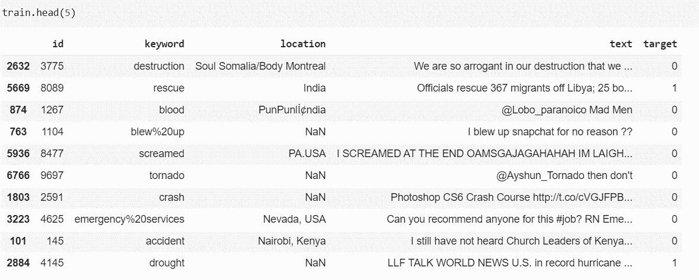

培训用数据

*   test.csv —测试集

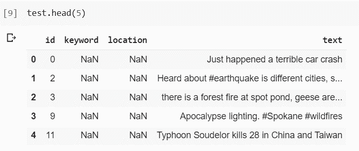

测试数据

*   sample_submission.csv —格式正确的示例提交文件

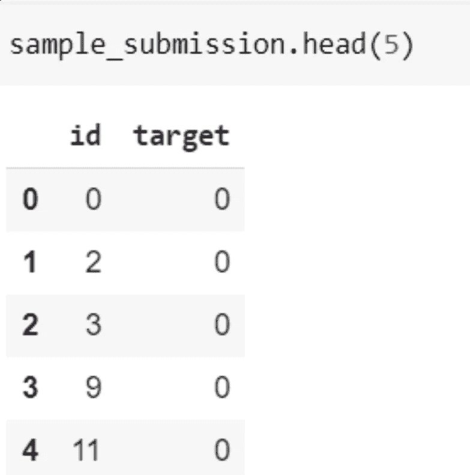

提交文件

**列**

*   id——每条推文的唯一标识符
*   文本——推文的文本
*   位置—发送推文的位置(可以为空)
*   关键词——推文中的特定关键词(可以为空)
*   target —仅在 train.csv 中，这表示一条推文是关于一场真正的灾难(1)还是(0)

# 探索性数据分析

1.  空值

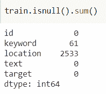

训练数据集中的空值

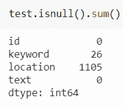

测试数据集中的空值

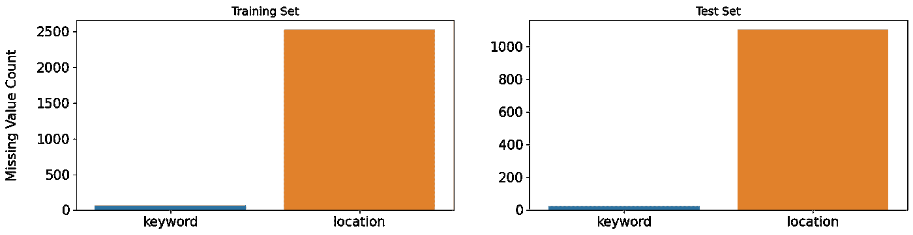

训练和测试数据集中关键字和位置要素中缺失值的分布

1.  目标分布:在训练分布中，少数目标有非常高的概率成为真正的灾难 tweet (class = 1)。如果测试数据集也是从列车分布中提取的，那么我们可以使用这些信息来改进我们的预测。

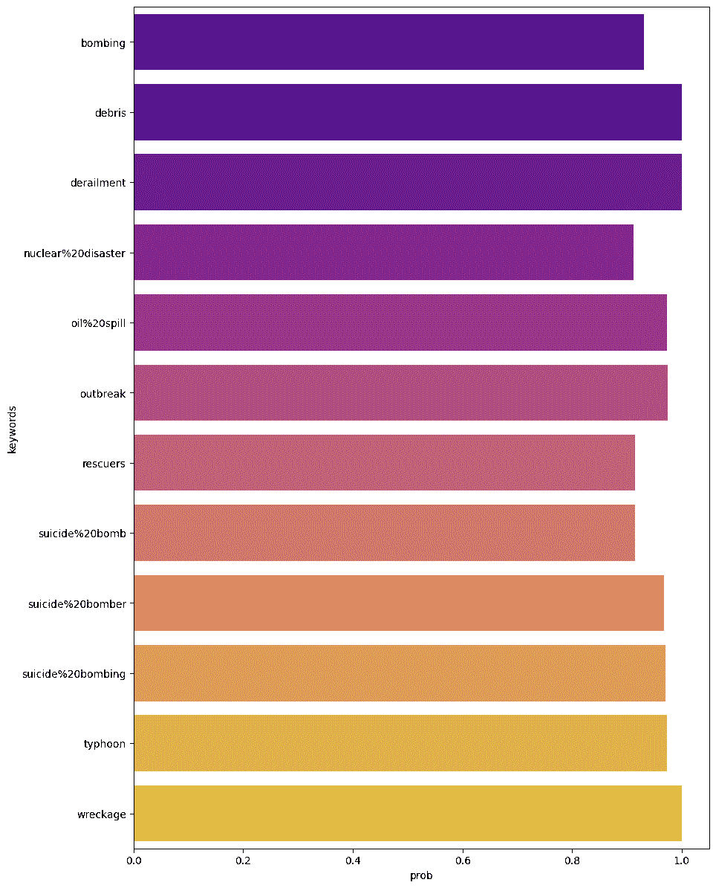

关键字的目标等于 1 的概率

# 特征工程

1.  如何处理位置和关键字列？

位置不是自动生成的，而是用户输入的。这就是为什么外景地很脏，有太多独特的价值在里面。不应该作为一个功能。

幸运的是，关键字中有信号，因为其中一些单词只能在一种上下文中使用。关键词有非常不同的 tweet 计数和目标均值。关键字可以单独作为一个特性使用，也可以作为一个词添加到文本中。训练集中的每个关键词都存在于测试集中。如果训练集和测试集来自同一个样本，也可以对关键字使用目标编码。

# 数据预处理

1.  清理文本特征

训练集和测试集中的文本特征有噪声。清洁该特征的一种方法是移除:

*   删除 URL
*   移除表情符号
*   删除 html 内容
*   删除标点符号

# 构建伯特模型

来自变压器的双向编码器表示(BERT)是由 Google 开发的用于 NLP 预训练的技术。BERT 利用了 Transformers，这是一种学习文本中单词(或子单词)之间上下文关系的注意力机制。一般来说，Transformer 包括两个独立的机制——一个读取文本输入的编码器和一个为任务生成预测的解码器。

BERT 是一个预训练的变压器编码器堆栈。它是在维基百科和图书语料库数据集上训练的。

BERT 引入了上下文单词嵌入(一个单词可以根据它周围的单词有不同的意思)。转换器使用注意机制来理解使用单词的上下文。然后，该上下文被编码成向量表示。实际上，它在长期依赖方面做得更好。

例如伯特做了什么

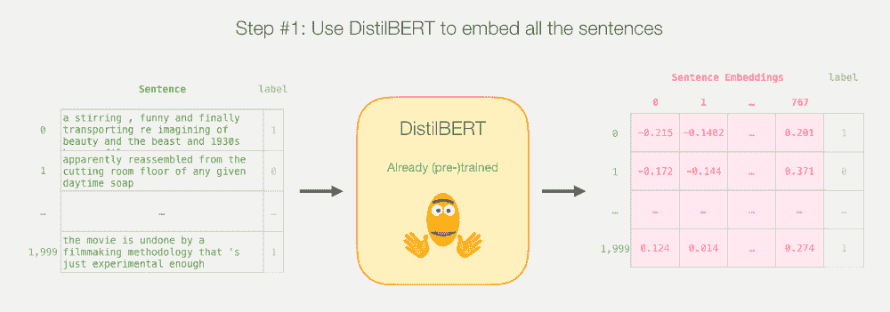

谷歌伯特的工作

**伯特是如何被训练的:**

掩码语言模型(MLM):

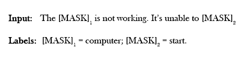

掩蔽语言建模

下一句预测(NSP):

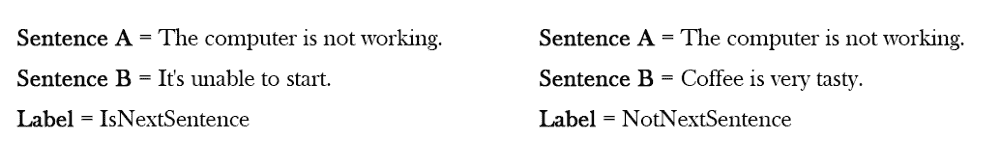

下一句预测

**伯特的好处:**

1.  捕获电子邮件的语义和上下文
2.  在小数据集上给出了良好的结果，因为它是在维基百科语料库上预先训练的

**构建 BERT 分类器:**

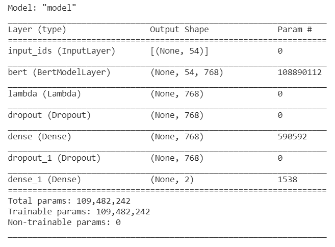

模型摘要

为创建分类器而对标准 Bert 模型进行的添加

1.  λ层
2.  具有 tanh 激活的密集层，用于将嵌入值保持在范围:[-1，+1]内
3.  具有 softmax 激活函数的密集层，该层的输出是属于某个类的输入的概率。

**训练:**

超参数:

1)历元数= 15

2)批量大小= 16

3)Adams 优化器，学习率= 1e — 5

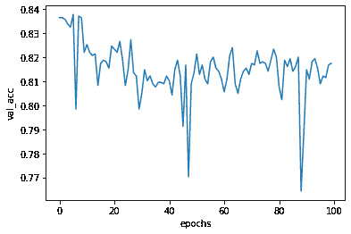

跨时代的验证损失

验证损失在第 15 个时期后持续下降，因此我们针对 15 个时期训练我们的模型。

# 结果

训练精度:0.95

测试精度:0.81

**混淆矩阵:**

0:代表虚假推文

1:代表真实的推文

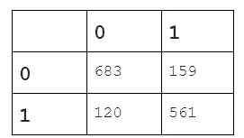

混淆矩阵

**准确度得分** : 0.81

**报告**:

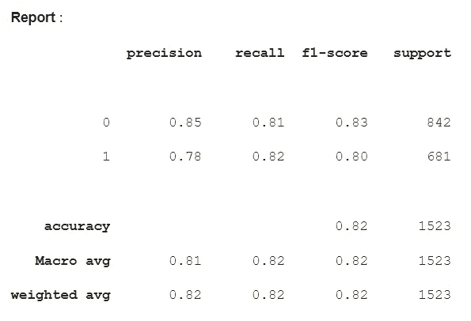

精确回忆 f1-分数和对预测的支持

对于提交的样本，我们得到的公开分数是 0.83

# **链接到代码**

 [## Gautam 1998/NLP _ Predict _ 灾难 _Tweets

### 这个代码是基于 kaggle 竞赛真实与否？灾难推文的 NLP。本次比赛的目的是…

github.com](https://github.com/gautam1998/NLP_Predict_Disaster_Tweets) 

# **参考文献**

 [## 使用 Keras 和 tensor flow 2-KD 块的 BERT 意图识别

### 如今，从文本中识别意图非常有用。通常，你会得到一篇短文(一两句话),然后…

www.kdnuggets.com](https://www.kdnuggets.com/2020/02/intent-recognition-bert-keras-tensorflow.html)  [## NLP 与灾难推文- EDA，清洁和伯特

### 使用 Kaggle 笔记本探索和运行机器学习代码|使用来自多个数据源的数据

www.kaggle.com](https://www.kaggle.com/gunesevitan/nlp-with-disaster-tweets-eda-cleaning-and-bert)  [## 真实与否？灾难推文的 NLP

### 预测哪些推文是关于真正的灾难，哪些不是

www.kaggle.com](https://www.kaggle.com/c/nlp-getting-started/discussion/123343)