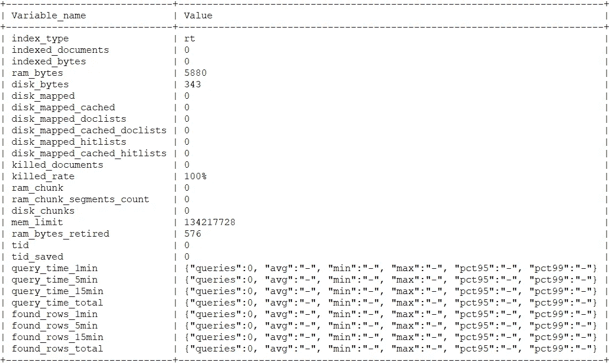

# 实时模式—索引管理

> 原文：<https://levelup.gitconnected.com/real-time-mode-index-administration-937ee6655300>

## 权威指南

## 在这篇文章中，我们将详细了解蝎狮搜索实时模式是如何工作的，以及你如何自己使用它。我们将学习如何使用 SQL 语句在蝎狮搜索中操作索引。


# 索引创建

让我们首先通过 SQL 连接到蝎狮:

```
root@rtmode-79f9d6d867-fptcc:/# mysql -P9306 -h0
Welcome to the MariaDB monitor.  Commands end with ; or \g.
Your MySQL connection id is 1
Server version: 3.5.2 0686d9f0@200326 releaseCopyright (c) 2000, 2018, Oracle, MariaDB Corporation Ab and others.Type 'help;' or '\h' for help. Type '\c' to clear the current input statement.
```

一个简单的表创建语句如下所示:

```
MySQL [(none)]> CREATE TABLE testrt1 (title TEXT, category INT);
```

这将创建一个包含文档 id(不需要声明)、文本字段和整数属性的索引。

索引支持一系列可以在声明时传递的选项:

例如:

```
MySQL [(none)]> CREATE TABLE testrt2 (title TEXT, category INT)  html_strip='1' docstore_compression_level = '12';
```

在这个索引中，文本将被剥离 HTML，文档存储的压缩级别被设置为最高级别。

如果未指定类型，默认情况下，索引将是实时的。如果我们想创建一个分布式索引，我们需要传递类型:

```
MySQL [(none)]> CREATE TABLE testrtdist type='distributed' local='testrt1' local='testrt2';
```

如果我们不确定表格是否已经制作好，可以使用“IF NOT EXISTS”子句来避免错误:

```
MySQL [(none)]> CREATE TABLE IF NOT EXISTS testrt1 (title TEXT, category INT);
```

也可以使用现有索引的设置和模式创建索引:

```
MySQL [(none)]> CREATE TABLE testrt3 LIKE testrt2;
```

# 更多表格操作

要删除索引，请使用 DROP TABLE:

```
MySQL [(none)]> DROP TABLE testrt3;
```

要清空索引:

```
MySQL [(none)]> TRUNCATE TABLE testrt2;
```

要添加或删除列:

```
MySQL [(none)]> ALTER TABLE testrt2 ADD COLUMN tagId INT;MySQL [(none)]> ALTER TABLE testrt2 DROP COLUMN tagId;
```

请注意，当前不能添加或删除文本字段。如果需要修改文本字段，您需要重新创建表格。

也可以更改索引设置:

```
MySQL [(none)]> ALTER TABLE testrt2 ignore_chars='.';
```

请注意，标记化设置不会应用于全文组件中的现有数据，只有在更改后添加的新文档才会受到影响。
如果您需要更新整个集合，必须使用所需的设置重新创建索引。

# 表格信息

有几个语句提供了关于索引的信息。

要获取索引模式:

```
MySQL [(none)]> DESCRIBE testrt2;
+----------+--------+----------------+
| Field    | Type   | Properties     |
+----------+--------+----------------+
| id       | bigint |                |
| title    | field  | indexed stored |
| category | uint   |                |
+----------+--------+----------------+
```

有关文档数量、大小和性能指标的信息可以通过显示索引状态来查看:

```
mysql> SHOW INDEX testrt2 STATUS;
```



显示索引设置还可以提供索引设置列表:

```
MySQL [(none)]> SHOW INDEX testrt2 SETTINGS;
```


如果需要导出完整的索引声明，请使用 SHOW CREATE TABLE:

```
MySQL [(none)]> SHOW CREATE TABLE testrt2;
```


# 导入索引

RT 索引可以使用 IMPORT TABLE 语句导入。
索引文件将被复制到您在配置中指定的 data_dir。

示例:

```
MySQL [(none)]> IMPORT TABLE movies FROM '/index/movies_rt';MySQL [(none)]> SELECT * FROM movies\G
*************************** 1\. row ***************************
id: 1
num_critic_for_reviews: 4
duration: 96
director_facebook_likes: 0
actor_3_facebook_likes: 460
actor_1_facebook_likes: 708
gross: 0
num_voted_users: 961
cast_total_facebook_likes: 2307
facenumber_in_poster: 0
num_user_for_reviews: 12
budget: 3500000
title_year: 2009
actor_2_facebook_likes: 574
movie_facebook_likes: 211
imdb_score: 4.800000
aspect_ration: 2.350000
color: Color
movie_imdb_link: [http://www.imdb.com/title/tt1002561/?ref_=fn_tt_tt_1](http://www.imdb.com/title/tt1002561/?ref_=fn_tt_tt_1)
language: English
country: USA
content_rating:
director_name: Charles Adelman
actor_2_name: Kevin Pollak
actor_1_name: Teri Polo
movie_title: 02:13
actor_3_name: Jere Burns
plot_keywords: death|forensic|murder|profiler|serial killer
...
*************************** 20\. row ***************************
id: 20
num_critic_for_reviews: 1
duration: 111
director_facebook_likes: 0
actor_3_facebook_likes: 247
actor_1_facebook_likes: 1000
gross: 14616
num_voted_users: 314
cast_total_facebook_likes: 2059
facenumber_in_poster: 1
num_user_for_reviews: 10
budget: 12000000
title_year: 2015
actor_2_facebook_likes: 445
movie_facebook_likes: 26000
imdb_score: 7.500000
aspect_ration: 1.850000
color: Color
movie_imdb_link: [http://www.imdb.com/title/tt3453052/?ref_=fn_tt_tt_1](http://www.imdb.com/title/tt3453052/?ref_=fn_tt_tt_1)
language: English
country: USA
content_rating: R
director_name: Timothy Hines
actor_2_name: Kelly LeBrock
actor_1_name: Christopher Lambert
movie_title: 10 Days in a Madhouse
actor_3_name: Alexandra Callas
plot_keywords:
```

RT 模式是一种新的默认模式，在大多数情况下，它将使在蝎狮搜索中维护索引变得更加容易。至于其他方面，仍然支持普通模式。你可以从[蝎狮的搜索文档中了解到不同之处。](https://manual.manticoresearch.com/Read_this_first#Real-time-mode-vs-plain-mode)