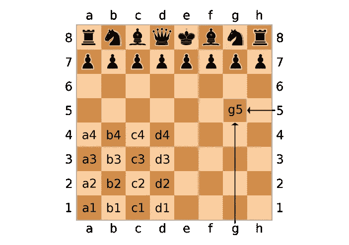
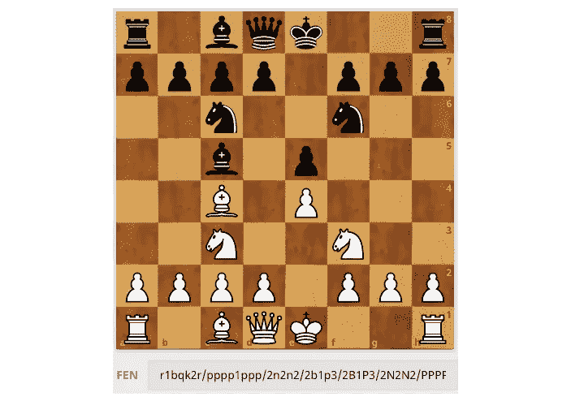
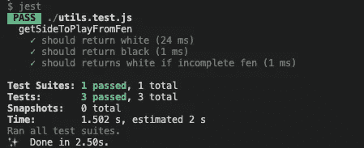
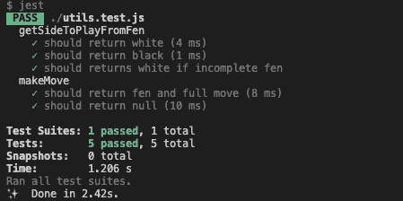

# 让您开始单元测试的真实例子

> 原文：<https://levelup.gitconnected.com/real-world-examples-to-get-you-started-with-unit-testing-9e51b6d2b819>

## 用 Jest 在 Javascript 中进行单元测试


图片由来自 [Pixabay](https://pixabay.com/?utm_source=link-attribution&utm_medium=referral&utm_campaign=image&utm_content=762486) 的 [testbytes](https://pixabay.com/users/testbytes-1013799/?utm_source=link-attribution&utm_medium=referral&utm_campaign=image&utm_content=762486)

你还记得你必须写的 1+1 = 2(或类似的)测试吗？我想，“为什么我需要一个检验 1+1 = 2 的测试。每个人都知道。”

所以，在这个帖子里。我将向您展示一些真实世界的测试示例，而不是 1+1 = 2 测试，我们将看到编写测试如何帮助您查明 bug，并让您对代码充满信心。

## 先决条件

*   关于[国际象棋](https://en.wikipedia.org/wiki/Chess)的基本知识和玩法。

## 我们在测试什么

因为，我们不想写 1+1 = 2 的测试，我们要测试的是[棋](https://en.wikipedia.org/wiki/Chess)函数。不要让[棋](https://en.wikipedia.org/wiki/Chess)这个词吓到你。我将带你浏览一下为了理解这个测试你需要了解的国际象棋术语。

如果你想知道我在哪里使用了这些函数，我们正在测试。你可以看看我以前的帖子。

*   [用 React 构建一个象棋战术应用(第一部分)](/build-a-chess-tactics-app-with-react-part-1-49be01fc63b5)
*   [用 React 构建一个象棋战术应用(第二部分)](/build-a-chess-tactics-app-with-react-part-2-35621640afd1)
*   [如何用 React 创建一个简单的象棋 App](/how-to-create-a-simple-chess-app-with-react-e18c0179b167)

## 开始之前

在我们开始之前，我想向你介绍一些你需要知道的国际象棋术语，以便理解我们编写的测试。

## 棋盘坐标



棋盘坐标

棋盘就像一个 8×8 的矩阵。其尺寸沿 y 轴标注为 1–8，沿 x 轴标注为“a”-“h”。

为了指向棋盘上的一个正方形，我们取 x 和 y，称两者的交点为正方形。

比如上图指向 g5 广场。如果你想了解更多，你可以去[这里](https://www.chessprogramming.org/Algebraic_Chess_Notation)。

## 象棋分

分是棋子位置的文本表示。它包含了从特定位置开始游戏的所有必要信息。



象棋分

上面我们有一个在 [Lichess](https://lichess.org/analysis/standard/r1bqk2r/pppp1ppp/2n2n2/2b1p3/2B1P3/2N2N2/PPPP1PPP/R1BQK2R_w_KQkq_-_6_5) 看粉的例子。一个开源的在线下棋网站。你可以在这里了解更多关于 fen [的知识。](https://www.chessprogramming.org/Forsyth-Edwards_Notation)

## 象棋移动

在棋盘上走棋的文字表示叫做[散](https://www.chessprogramming.org/Algebraic_Chess_Notation#Standard_Algebraic_Notation_.28SAN.29)。San 包含描述在给定位置移动的所有必要信息。san 移动看起来像这样，Bc5、Bb4、Kh1 等等。你可以在这里了解更多关于 san [的信息。](https://www.chessprogramming.org/Algebraic_Chess_Notation#Standard_Algebraic_Notation_.28SAN.29)

## 回到测试

现在，基本的方法。让我们开始测试。我们将测试两个功能

1.  给它一分，它会还回来，让它站在哪一边。
2.  `makeMove` —给定一个分三步走。它在移动完成后返回 fen，而 full move 也包含其他关于移动的信息。

## 项目设置

为了测试这些功能，我们需要一个 npm 项目和几个 npm 包。

创建一个新文件夹，并在其中创建一个 npm 项目。

```
mkdir real-world-jest && cd real-world-jest && npm init -y
```

正在安装所需的依赖项。我们将使用 [jest](https://jestjs.io/) 作为测试框架。

```
yarn add --dev jest
```

我们还需要一个函数使用的象棋库

```
yarn add chess.js
```

将这个`scripts`添加到您的`package.json`中。

```
"scripts": {
 "test": "jest"
}
```

创建一个名为`utils.js`的文件。并粘贴下面的代码。

现在，我们将创建另一个名为`utils.test.js`的文件。我们将在那里编写我们的测试。

## getSideToPlayFromFen

我们将为这个函数编写 3 个测试。

1.  我们将测试它是否变黑。
2.  我们将测试它是否变成白色。
3.  如果 fen 不包含必要的信息，我们将测试它是否变成白色。

这是我们测试的代码。

如果运行`yarn test`。它过去了。



## 进行移动

我们将为这个函数编写 2 个测试。

1.  我们将测试，如果我们在那个位置通过 fen 和合法移动，它将返回更新的 fen 和完整移动。
2.  我们将测试，如果我们在那个位置传递一个 fen 和非法移动，它将返回 null。

这是它的代码。

如果现在运行`yarn test`。它过去了。



## 现在怎么办？

现在，我们通过了测试。我们可以将这些测试添加到我们的 CI/CD 管道中。

或者每当您收到问题报告时。在研究你的代码之前。您可以首先运行测试套件，并确保所有测试都通过。

失败的测试也会告诉你，到底是什么失败了，你需要在哪里寻找。

测试还会告诉你你的 cod 是否有问题。或者任何第三方包发生了变化，导致测试失败。

你可以在这里找到完整的源代码。

[](https://github.com/varunpvp/real-world-jest/) [## 真实世界笑话

### 让你从 jest 开始的真实世界的例子。为 varunvpp/real-world-jest 开发做出贡献，创建一个…

github.com](https://github.com/varunpvp/real-world-jest/) 

如果你想知道，我在哪里用过这个功能。你可以看看我以前的帖子。

*   [用 React 建立一个象棋战术应用(第一部分)](/build-a-chess-tactics-app-with-react-part-1-49be01fc63b5)
*   [用 React(第二部分)](/build-a-chess-tactics-app-with-react-part-2-35621640afd1)打造一款象棋战术 App
*   [如何用 React 创建一个简单的象棋 App](/how-to-create-a-simple-chess-app-with-react-e18c0179b167)

我希望，我已经给了你开始编写单元测试的好例子。如果你喜欢，就鼓掌吧。

感谢阅读，
测试愉快。