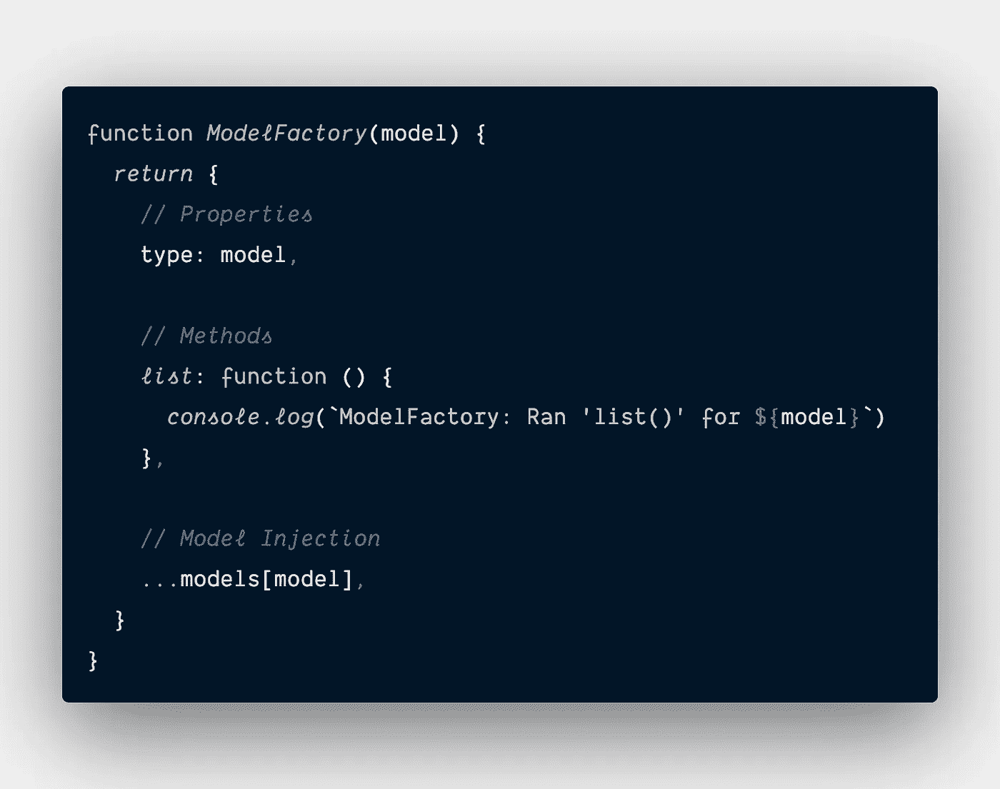

# 函数式 JavaScript 设计模式的真实实现

> 原文：<https://levelup.gitconnected.com/real-world-implementation-of-functional-javascript-design-patterns-6547d4e68e30>

沙哈达特·拉赫曼在 [Unsplash](https://unsplash.com?utm_source=medium&utm_medium=referral) 上拍摄的照片

# 问题陈述

*   我正在做一个使用 SQL 数据库(例如 PostgreSQL)的项目，而客户决定要迁移到 NoSQL 数据库(例如 MongooseDb)。现在，为了使用这个新的数据库，我必须检查我的整个项目来重构一切。
*   我正在开始一个新项目。客户希望管理用户和产品。我上一个项目也有类似的要求。我可以从我以前的项目中复制/粘贴代码，但由于代码的编写方式，有很多变化要做，所以我可能会更好地从头开始。
*   我为许多客户建立了几个项目，并负责维护所有这些项目。这对于我一个人来说太多了，所以我雇佣了更多的开发人员。每个客户对修复或特性的请求都写在他们各自的项目中。尽管我可能有多个客户要求相同的特性，但我最终会得到由不同开发人员创建的不同实现。当一个修复被实现时，它很可能只在一个项目中完成，将来我们可能会在其他项目中遇到同样的问题。

这些问题会导致许多负面结果，例如时间利用效率低下、无法扩展以及安全风险增加等等。

# 解决方案概述

作为一名开发人员，我创建了许多具有不同架构的项目。当我在不同的项目上工作时，我希望建立在我的“工具箱”之上，以提高我的效率，减少错误，并简单地遵循最佳实践。我已经创建了这个工具包的一个基本示例，它实现了数据库集成和模型管理。这个工具包当然还有更多的内容，但是希望这是一个足够“真实”的例子，可以让你开始构建自己的工具包。

该示例代码实现了抽象工厂设计模式。使用这种模式的目的是为了在实体中遵守开/闭原则(OCP)。这是这样实现的，我们的“客户端”将与我们的抽象工厂交互，而不是直接与众多工厂交互。当我们添加一个新工厂时，我们的“客户端”代码不需要改变。我们的抽象工厂只需要很少或不需要修改代码就可以实现一个新工厂。

这个例子有一个名为`DbStoreFactory`的抽象工厂和一个名为`ModelFactory`的抽象工厂。`DbStoreFactory`的目标是抽象对我们数据库的调用，这样客户就不需要知道我们在使用什么数据库、它们独特的模式和它们独特的功能。`ModelFactory`的目标是抽象和规范化与我们需要管理的任何模型相关的操作。一个“模型”将是一个实体类型或者集合，我们将(可能)存储在一些数据库表中。例如，我们可能有一个“用户”模型，它定义了管理“用户”所需的属性(属性或模式)和方法(函数)。

# 模型工厂

## 概观

如前所述，使用抽象工厂设计模式的主要目的是确保我们实现了 OCP。这种设计模式的第二个好处是跨项目的可重用性。一个完美的例子是我们的`ModelFactory`抽象工厂。

当构建一个新的应用程序时，第一步是定义您的模型。假设这个应用程序是一个博客应用程序。至少，我们需要定义一个*用户*和*发布*模型。每个模型将包括它的属性(例如 JSON 模式)和它的方法(例如 CRUD 操作)。

接下来，我们被委托构建另一个应用程序。该应用程序是一个社交消息应用程序。我们再次需要*用户*和*帖子*的模型。此外，我们需要一个*通道*的模型。理想情况下，我们希望重用上一个项目中的代码，并扩展它以包含新的模型。

## 履行

实现的第一部分是创建我们的抽象工厂，我们将命名为`ModelFactory`。然后，对于每一个模型，我们都会创建一个具体的工厂，比如`UserModelFactory`和`PostModelFactory`。

`ModelFactory`将包括所有模型共享的任何属性或方法。例如，您可以为所有模型分配一个`type`属性。`ModelFactory`将有一个参数告诉它“客户机”想要与哪个模型接口。

现在我们可以创建我们的`UserModelFactory`并使用`ModelFactory`创建接口。我们需要查看`model`参数来知道要注入哪个模型。我们可以使用一个`if`或`switch`语句，但是我决定使用一个对象来更快地引用。

实现的第二部分在我们的“客户端”代码中。(客户代码是指与我们的工厂接口的任何代码)。

从这个实现中，您可以看到，当我们实例化`users`模型时，我们最终得到了来自`ModelFactory`的`type`属性和`list`方法以及来自`UserModelFactory`的`create`方法。

现在，让我们添加我们的`posts`型号。

因此，我们将新模型添加到我们的模型定义中。然后我们创造了我们的`PostModelFactory`。请注意，我们没有**而不是**对我们的`ModelFactory!`做任何更改

现在让我们与“客户端”中的*帖子*模型进行交互。

瞧啊。我们“扩展”了我们的`ModelFactory`,让“客户”使用起来非常简单，因为它的使用方式与*用户*模型完全相同。

现在我们需要添加我们的数据库集成，这样我们的模型就可以执行它们的 CRUD 操作。

# 数据库工厂

## **概述**

在我们的问题陈述中，我们谈到了数据库平台的变化如何在我们的整个项目中产生显著的连锁反应。我们不希望这种情况继续下去，我们将再次使用抽象工厂模型并创建我们的`DbStoreFactory`。

> *FWIW，我选择这个名字是因为我还将添加一个* `*FileStoreFactory*` *用于与文件存储服务接口，这些名字对我来说有意义。*

为了这个例子，假设我们将使用 Firebase Firestore 和 Firebase 实时数据库。我们实际上不会在这里编写集成代码，但是我们将展示它是如何构建的。

## 履行

这将如何工作的模式与我们用于`ModelFactory`的模式相同，所以我将在这里展示`DbStoreFactory`实现的结果。

在那里，我们通过抽象工厂方法实现了数据库集成。显然，这实际上不是在与数据库平台对话，但这不是重点。

与`DbStoreFactory`的一个微妙区别是，我包含了每个混凝土工厂都会有的方法。我喜欢这样，因为我可以直接进入`DbStoreFactory`代码，查看不同具体工厂中可用的所有方法。

现在我们需要实现的“客户端”部分。在这种情况下，模型工厂是“客户端”,因为我们将在那里进行数据库调用。在这个项目示例中，我们将对所有模型使用 Firebase Firestore。这意味着我们将直接在`ModelFactory`中实例化数据库会话，因为它在所有模型中共享。然后我们更新`list`方法来使用数据库集成。

从`ModelFactory`的角度来看，改变数据库平台，比如从 Firebase Firestore 到 Firebase Realtime，只需要改变`db`属性定义，使其指向新的商店定义。我们只需要确保`DbStoreFactory`提供规范化的方法集。这意味着模型只需要担心数据库`list`方法。由不同的数据库工厂将其翻译成数据库平台返回列表的方式。

接下来，我们需要更新我们的模型工厂来实现数据库调用。

我们永远不需要在我们的任何模型工厂中修改数据库代码…永远！我们可以通过添加新的方法来扩展它们，但是一旦部署好了，就不应该改变现有的方法。

没有必要改变我们的“客户端”代码，因为数据库接口是完全抽象的。

这就是使用函数式 JavaScript 时“干净代码”的样子。(我相信这个说法会引起一些丰富多彩的回应！)

完整的[代码可以在这里找到](https://gist.github.com/34fame/8a5ee6ba96b47aa8d6411839c82dfef0)。

保重！

# 分级编码

感谢您成为我们社区的一员！在你离开之前:

*   👏为故事鼓掌，跟着作者走👉
*   📰查看[升级编码出版物](https://levelup.gitconnected.com/?utm_source=pub&utm_medium=post)中的更多内容
*   🔔关注我们:[Twitter](https://twitter.com/gitconnected)|[LinkedIn](https://www.linkedin.com/company/gitconnected)|[时事通讯](https://newsletter.levelup.dev)

🚀👉 [**加入升级人才集体，找到一份神奇的工作**](https://jobs.levelup.dev/talent/welcome?referral=true)