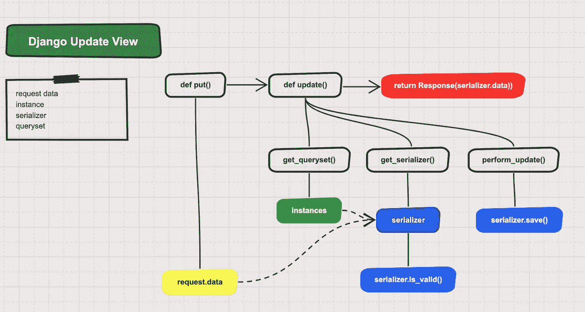
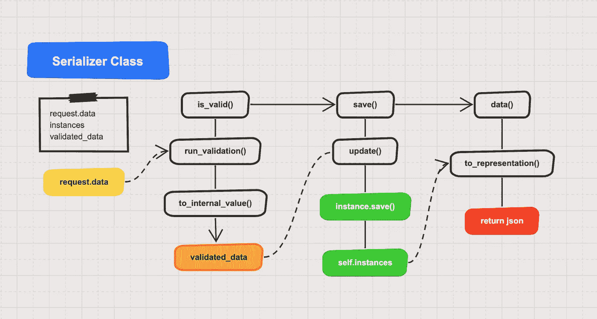

# 使用 Django Rest 框架进行高效的批量更新

> 原文：<https://levelup.gitconnected.com/really-fast-bulk-updates-with-django-rest-framework-43594b18bd75>

## 使用 ListSerializer 和 bulk_update 通过 Django Rest 框架构建高效的 PUT API 端点


一般的 rest 框架端点通常被设计成一次修改一个对象。然而，当您需要修改数千个对象时，您会经常发现这可能会成为一个巨大的性能瓶颈。在这种情况下，与其对您的端点进行成千上万次调用，不如进行一次批量操作的调用。本教程向您展示了如何为 PUT API 端点创建高效的批量更新。

在 [**第 1 部分:使用 Django Rest 框架高效批量创建**](https://medium.com/p/f73da6af7ddc/edit) 中，我们回顾了如何使用 Django Rest 框架优化 **POST** API。在本文中，我将向您展示如何通过 bulk_update 方法使用 ListSerializers 来提高您的 **PUT** API 调用的性能。可以在 GitHub [**这里**](https://github.com/cdknorow/django_bulk_tutorial) 找到一个包含代码和单元测试的完整的 Django 应用程序。

## 目标

学完本教程后，您应该能够

1.  使用标准 Django Rest 框架工作流实现一个 PUT API 来更新数据库模型。
2.  使用 **ListSerializer** 修改 API 以执行批量更新。
3.  剖析并优化 ListSerializer，通过使用 **bulk_update** 并减少对数据库的调用次数，实现**10 倍的性能提升**。

本教程中的 toy 应用程序由一个可以有许多任务的项目组成。每次添加或更新新任务时，我们还希望更新项目的上次修改日期。让我们开始吧。

## **Django API 概述**

您可能会觉得 Django Rest 框架的高度抽象使得理解正在发生的事情变得很困难。我也发现它们在开始时有一个非常陡峭的学习曲线，但是一旦你熟悉了它的结构，使用它们来管理一个有许多 API 的大型项目可以大大提高生产率。您还会发现，如果团队中的每个人都遵循相同的模式，协作会变得更加容易。通常，创建 Django Rest 框架 API 有 5 个主要部分。它们如下:

1.  **模型**管理数据库表和 python 之间的关系。
2.  **串行化器**验证并串行化输入和输出数据
3.  **Querysets** 哪些查询将数据库查询的结果构造、查询和存储为模型实例。
4.  **视图**是为每个端点包装模型、序列化器和查询集的类。
5.  **URL**指定何时调用**视图。**

我们现在将检查这些代码以创建我们的 REST API。

## 模型

Django ORM 使用模型来管理与后端数据库的交互。对于本教程，我们将创建两个模型，一个项目模型具有与之相关联的任务模型。模型在 [models.py](https://github.com/cdknorow/django_bulk_tutorial/blob/master/datamanager/models.py) 中定义为:

此外，每当更新一个新任务时，业务逻辑要求应该更新最后修改的项目。为了处理业务逻辑，我们在任务上使用带有 **post_save** 和 **post_delete** 的信号 API。这样，在调用保存后，还将调用信号来更新项目 **last_modified** 。

## 视图

通用视图类是来自 Django Rest 框架的抽象方法，用于实现 HTML 方法 POST/PUT/GET/DELETE。对于更新端点，我们将使用通用的 **UpdateAPIView** ，它提供了一个 PUT 方法处理程序。为了更好地理解 Django 更新视图的基本控制流，我整理了下面的流程图作为参考。



对于 PUT API，我们使用 [UpdateAPIView](https://www.django-rest-framework.org/api-guide/generic-views/#updateapiview) 在任务模型上执行更新。为此，我们需要定义调用该函数的 API 的**序列化器**、 **get_queryset** 方法和 **URL** 。

如果你不熟悉 Django Rest 框架，你可能会注意到上面的 TaskUpdateView 代码中没有很多代码。对于基本 API 来说，完成这项工作的几乎所有管道都被完全抽象掉了。为了优化这个 API，我们最终需要覆盖许多继承的方法。关于视图的更深入的文档，查看官方教程[这里](https://www.django-rest-framework.org/tutorial/3-class-based-views/)。

## 查询集

[**queryset**](https://docs.djangoproject.com/en/3.0/ref/models/querysets/) 是 Django ORM 的一部分，它促进了模型和数据库之间的交互。Querysets 是强大的抽象，允许您以编程方式构建复杂的数据库查询。在我们的 **get_queryset** 函数中，我们在任务对象上使用了一个过滤器，只返回具有用户指定项目作为外键和任务 id 的任务。queryset 包含一个实例列表，我们可以更新这些实例，然后将用户传入的数据保存回数据库。

## 序列化程序

序列化程序负责获取用户输入，验证它，并将其转换为数据库可消费的对象。它们还处理将数据库中的对象转换成可以返回给用户的东西。此外，序列化程序指定哪些字段是必需的，以及它们具有哪些属性。为了更好地演示序列化程序的基本控制流，我创建了下图以供参考。要深入了解序列化器，请点击这里查看官方教程。



对于这个项目，我们创建了 TaskSerializer，它可以更新一个对象的名称**和描述**。****

**因为项目的 **id** 是在 URL 中指定的，所以我们使用带有 CurrentProjectDefault 类的隐藏字段来指定如何从请求中提取**项目 id** 并从数据库中检索项目对象。 **CurrentProjectDefault** 类定义如下。**

**有了所有这些东西，我们就完成了 API 的基本实现。让我们继续分析性能。为此，我们将使用 [**pytest**](https://docs.pytest.org/en/latest/) 来创建一个单元测试，其中我们通过调用 API 一次来更新 10，000 个任务对象。**

**为了获得测试的运行时间，我们将在调用 pytest 时设置 duration 标志。**

```
>> py.test --durations=1

==================
101.21s call test_update_task
```

**你可以看到它是如此缓慢！执行 10，000 次更新大约需要 100 秒。**

## **列表序列化程序**

**让我们看看如何提高代码的性能。我们要做的第一个优化是切换到使用一个 **ListSerializer** 。列表序列化程序将允许您提交一个请求进行多次更新。首先，我们将创建 **UpdateListSerializer** 类，它扩展了 **ListSerializer** 。**

**通过计算 **instance_hash** ，我们避免了需要索引到实例中，这是非常低效的。然后，我们将修改 TaskSerializer 的 **Meta** 属性，以使用新的 list serializer 类。**

**我们还需要修改我们的 url，现在它将只把 **project_id** 作为路径的一部分，而 **task_id** 将作为发送到 PUT API 的数据对象的一部分。**

**最后，我们将创建一个新的视图；**任务更新列表视图。**这里我们将覆盖基本的 **get_serializer** 方法来检查输入数据是否是列表。当我们检测到用户已经传递了一个列表的输入时，我们将设置属性 **kwargs["many"] = True** 。这告诉序列化程序在调用每个任务的单独更新之前应该使用 **list_serializer_class** 。**

**我们还覆盖了视图的基本**更新**方法。现在，它将在调用修改后的 **get_queryset** 方法之前对**id**执行简单的验证，该方法将**id**作为输入。queryset 将返回用户请求更新的所有任务对象的实例。**

**有了所有这些优化，我们现在使用 ListSerializer 对任务模型进行批量更新。我们将创建另一个单元测试来分析性能。**

**让我们继续检查这一变化的性能。**

```
>> py.test --durations=2

==================
101.21s call test_update_task
55.98s call test_update_list_serializer
```

**因此，通过添加 ListSerializer 方法，我们可以看到 2 倍的性能提升。尽管如此，10，000 次更新用 55 秒还是很慢。进一步优化该 API 性能的关键是减少对数据库的调用次数。**

## **巩固逻辑**

**目前，我们的序列化程序正在调用 CurrentProjectDefault 来获取与它正在创建的每个任务实例对象相关联的项目。相反，我们将修改视图的 put 函数来拉取项目，并将其插入到 **request.data** 对象中。这样，我们只需要点击一次数据库就可以获得所有任务的项目。**

**我们还需要用自定义字段替换序列化程序中的 **CurrentProjectDefault** 字段。我们创建一个名为 **ModelObjectidField** 的自定义字段，它只返回传递给它的数据。**

## **批量更新**

**接下来，我们将创建一个**BulkUpdateListSerializer**，它将使用 Django 2.2 中引入的 Django 的 **bulk_update** 。该函数允许您通过传递要更新的实例列表来在数据库中执行批量更新。以下代码描述了**BulkUpdateListSerializer**。**

**我们还需要修改序列化程序，使它不再保存更新方法，而只返回新的实例。然后，在我们更新了所有实例的值之后，我们的 BulkUpdateListSerializer 将调用 **bulk_update** 方法，该方法将发出一个数据库调用来执行更新。**

## **至表示法**

****to_representation** 函数是序列化程序的一部分，它处理如何将实例转换成可以返回给用户的序列化对象。ListSerializer 的默认 **to_representation** 方法在获取要返回的 **instance.project id** 值时效率非常低。在下面的 to_representation 代码中，我们利用了所有项目 id 都相同的事实，因此我们只需要获取该属性一次。**

## **我们的信号呢？**

**进行批量更新时，不再触发模型的信号。这实际上是一件好事，因为**信号虽然方便，但效率却低得令人难以置信**。相反，我们创建一个**update _ Project _ last _ modified**函数，它在执行更新之后更新项目的最后修改日期。**

**需要注意的一点是， **bulk_update** 函数不会修改数据库中的 **auto_add_now** 字段。为了克服这个问题，我们为所有实例显式地设置了 **last_modified** 字段，以便更新可以执行它们。**

**最后，让我们使用 **bulk_update** 测试新函数的性能。**

**结果是:**

```
>> py.test --durations=3

==================
101.21s call test_update_task
55.98s call test_update_list_serializer
12.06s call test_bulk_update_list_serializer
```

**如你所见，现在测试只需 20 秒左右。这大约是 10 倍的速度提升。 nt 没有太多额外的代码复杂性。**

## **摘要**

**至此，我们已经了解了如何使用 Django 2.2 中引入的 **ListSerializer** 和 **bulk_update** 功能来提高 Django 应用的性能。这两种方法，再加上仔细注意**尽量减少对数据库**的调用次数，可以让你在不做很多额外工作的情况下获得超过**10 倍的性能提升。****

**同样，包含所有代码和单元测试的完整 Django 项目可以在 GitHub 的**d**[**ango _ Bulk _ tutorial**](https://github.com/cdknorow/django_bulk_tutorial)资源库和之前的文章 [**第 1 部分:使用 Django Rest 框架**](https://medium.com/me/stats/post/f73da6af7ddc) 高效批量创建中找到。我希望你喜欢这篇文章，一定要关注我的更多关于 Django、Python、DevOps、机器学习和 Tinyml 的文章。你有喜欢用的优化 Django 的小技巧吗？留下评论让我现在或提供对文章的反馈。**