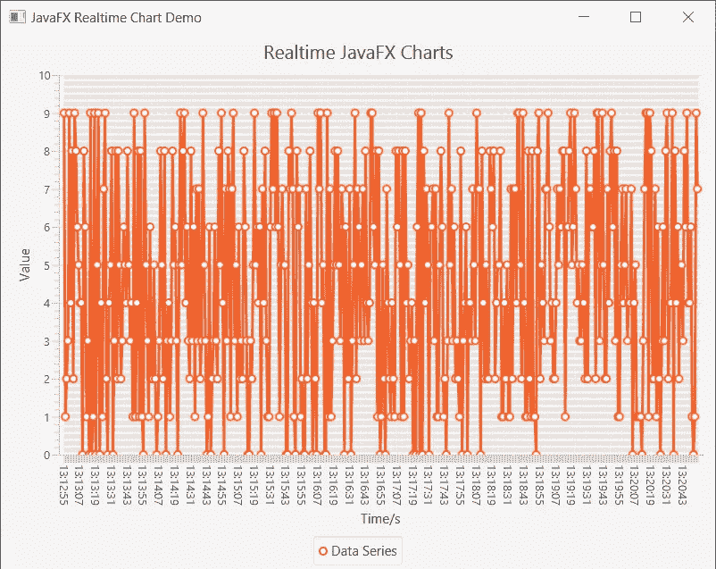

# 使用 JavaFX 的实时图表

> 原文：<https://levelup.gitconnected.com/realtime-charts-with-javafx-ed33c46b9c8d>

用 **JavaFX** 开发实时图表非常容易。你只需要知道一些事情。让我们开始吧。

# 引导应用程序

首先，我们需要像往常一样创建一个 **JavaFX** 应用程序。我们不会在这里使用任何花哨的控制器，因为这将增加教程的复杂性，但你可以很容易地得到这里的概念。

显示标题的简单 JavaFX 应用程序

# 添加图表

接下来，我们将添加轴和图表来显示数据。为了简单起见，我将使用图表本身作为场景。

沿轴添加折线图

我们现在已经创建了两个轴

*   **类别** —该轴可以显示字符串数据
*   **数字** —该轴可以显示整数、双精度等数字

设置轴标签后，我们禁用了轴上的**动画**。如果你愿意，你可以*启用*它们。

接下来，我们创建了一个折线图。当然，你不局限于折线图，使用任何你喜欢的。

折线图是针对两种数据类型创建的。X 轴和 Y 轴上的字符串和数字。接下来，我们还有禁用的动画。

# 显示数据的 x 系列

接下来我们要在图表上显示数据。为此，我们需要一系列。 **XYSeries** 支持一个[**observable list**](https://docs.oracle.com/javase/8/javafx/api/javafx/collections/ObservableList.html)**作为底层数据结构。它允许监听器监听数据的变化。**

**例如，当您向系列中添加一个新的点时，图表会监听该点并在屏幕上绘制该点。**

**一个简单的序列，可以将一个字符串作为 X 轴，将一个数字作为 Y 轴**

# **表演时间到了**

**设置并显示场景**

**接下来，我们将创建一个新的场景，并显示在我们的窗口**

**如果你现在跑，它会看起来像以下**

****

**带有图表的 JavaFX 应用程序**

# **模拟实时数据**

**现在我们想为演示模拟实时数据。基本上，我们会定期将数据放入图表**。为此，Java 中有许多方法。但是我们将使用一个[**ScheduledExecutorService**](https://docs.oracle.com/javase/7/docs/api/java/util/concurrent/ScheduledExecutorService.html)来有效地处理这些情况。****

****我们还使用一个 [**简单日期格式**](https://docs.oracle.com/javase/7/docs/api/java/text/SimpleDateFormat.html) 以 *HH:mm:ss* 格式显示当前时间。****

****创建一个调度程序，以固定速率运行每秒更新图表的线程****

****我们使用 Executors 类通过单线程轻松设置一个 **ScheduledExecutorService** 。****

****scheduleAtFixedRate 有 4 个参数****

```
**scheduleAtFixedRate([Runnable](https://docs.oracle.com/javase/7/docs/api/java/lang/Runnable.html) command,
                    long initialDelay,
                    long period,
                    [TimeUnit](https://docs.oracle.com/javase/7/docs/api/java/util/concurrent/TimeUnit.html) unit)**
```

****简单地说，它每隔一段时间运行一次 Runnable 命令。****

****在我们的示例中，我们以每秒 0 initialDelay 更新图表的速度运行该命令。****

****对于这个命令，我们使用一个简单的 [lambda](https://docs.oracle.com/javase/tutorial/java/javaOO/lambdaexpressions.html) (它是一个 **Runnable** )来执行。****

****它生成一个 0 到 10 之间的随机整数，并把它放到图表中。****

****我们使用[**platform . run la ter**](https://docs.oracle.com/javase/8/javafx/api/javafx/application/Platform.html)方法来更新 UI。背后的简单原因是更新 JavaFX UI，这需要在 JavaFX 应用程序线程中完成。runLater 将调度运行应用程序线程中传递的可运行的**。******

******我们只是通过将数据点添加到数据中来将它添加到序列中。然后图表会自我更新以绘制新数据。******

******如果您运行该应用程序，它现在可能看起来像这样。******

************

******图表很有用耶！:百胜:******

******你可以看到它起作用了，井点也越来越近了:******

# ******问题是******

******嗯，这很好地工作，直到一段时间过去，这是大约 2 或 3 分钟，现在图表几乎不可能阅读******

************

******哦，不，图表不可读:******

# ******解决方案******

******为了防止臃肿的图表，我们需要遵循一个简单的策略。我们只需要从系列的开始删除点。姑且称之为窗口吧。当窗口填满时，它将丢弃旧数据并让新数据进入。******

```
****final int WINDOW_SIZE = 10;****
```

******首先我们定义 **WINDOW_SIZE** 为 10，s **o 在任何时候图表上的元素都不会超过 10 个**。******

```
**if (series.getData().size() > WINDOW_SIZE)
    series.getData().remove(0);**
```

****然后我们将它添加到平台内部的 runnable . run la ter。****

****它做了一件非常简单的事情，如果窗口大小超出，它将删除序列中的第一个元素。请记住保存 ObservableList 的系列，这样图表就知道如何响应这种删除并相应地更新图表。****

# ****结果呢****

****经过我们的补救，看起来怎么样。****

********

****图表现在可以更新而不会膨胀****

# ****还有一点****

****好了，在我们应用了我们的补救措施后，图表工作得很棒，它在给定时间只保留了 10 个元素( **WINDOW_SIZE** )，并从列表中删除了旧的元素。****

****但是你试过关闭应用程序吗？不知什么原因还挂着。****

****这种不寻常的悬挂背后的原因是我们的朋友 **ScheduledExecutorService** 。即使在应用程序关闭后，它仍试图工作。解决这个问题的方法很简单。我们需要显式关闭 executor，这样当我们关闭窗口时，它就可以停止工作。****

****为此，我们将使用 JavaFX 中一个名为 **stop** 的方法。我们需要*覆盖*它，并告诉它关闭 executor 服务，如下所示。****

****也关闭计划的执行者服务****

****立即尝试停止执行程序服务。****

****现在，如果你勾选了，应用程序将会关闭而不会异常挂起。****

# ****最终源代码****

****实时图表的完整源代码****

****或者你也可以在这里找到它****

******GitHub**:[https://github.com/kasvith/javafxrealtimechartsdemo](https://github.com/kasvith/javafxrealtimechartsdemo)****

# ****结论****

****我们创建了一个简单的折线图，并使用一个用于演示的**ScheduledExecutorService**在上面添加实时数据。它可以被你想要的任何东西代替。****

****然后我们最终得到了一个臃肿的图表，并找到了一个解决方案，使用一个 **WINDOW_SIZE** 来限制**图表上的*数据点数*。******

> ****这个想法很简单，但是很强大。****

****希望对某人有帮助:简单 _ 微笑:****

****祝你好运！！！。****

****[](https://levelup.gitconnected.com)********[](https://gitconnected.com/learn/java) [## 学习 Java -最佳 Java 教程(2019) | gitconnected

### 38 大 Java 教程-免费学习 Java。课程由开发者提交并投票，使您能够找到…

gitconnected.com](https://gitconnected.com/learn/java)****