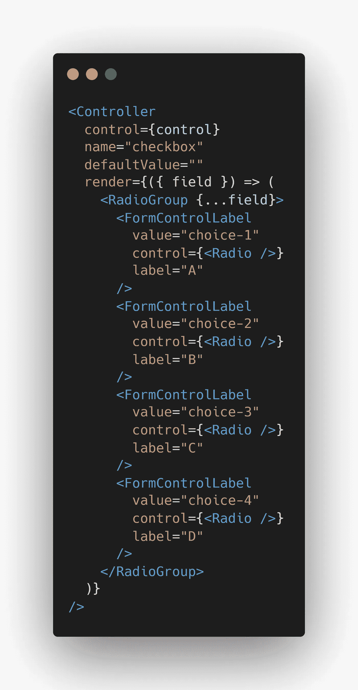

# 带有 Mui 示例的 React-hook-form

> 原文：<https://levelup.gitconnected.com/reareact-hook-form-with-mui-examples-a3080b71ec45>

本文将教你如何在 ReactJS 中用 Material-UI 实现 React-hook-form。

**反应-钩-形？**

这是一个很小的库，可以帮助你在 ReactJs 中验证表单。它是可扩展的、灵活的，可以使你的 React 在表单验证中表现得更好。使用 React-Hook-Form，在 ReactJs 中执行有限的重新渲染。

如果我们在 React with useState hook 中控制了窗体，组件将重新呈现，如下例所示

你可以试一下，每当你改变`username`或`password`中的值，应用就会引起`re-render` (检查`console log`)。如果表单有太多的子元素和元素，会导致应用程序的性能问题。

但是如果我们使用 React-Hook-Form 呢？？

[https://codesandbox.io/s/jolly-moon-2hb03x](https://codesandbox.io/s/jolly-moon-2hb03x)

没有意外和不需要的重新呈现！！帮助我们隔离重新渲染！！

**现在我将向您展示 React-hook-form + Mui** 中的常见用例

**例题**

***1。正文***

Mui 文本字段+反应-挂钩-表单

**②*。选择***

Mui 选择+反应-挂钩-表单

***3。自动完成*和**

Mui 自动完成+ React-Hook-Form

**4。复杂的自动完成**

Mui 自动完成多重+反应-挂钩-表单

***5。复选框***

Mui 复选框+矩形钩形

***6。*电台**

Mui 单选按钮组+反应-挂钩-表单

***7。滑块***

Mui 滑块+反应-挂钩-表单

**8*。滑块范围***

Mui 滑块+反应-挂钩-表单

**9*。验证***

Mui 错误+反应-挂钩-形式验证

**10*。usefield array***

mui TextField+React-Hook-Form usefield array

现在就享受使用 React-Hook-Form 和 Mui 吧~

您可以在下面的沙盒中找到工作示例:

[https://codesandbox.io/s/eager-wiles-xkz3qg?file=/src/App.js:8391-8404](https://codesandbox.io/s/eager-wiles-xkz3qg?file=/src/App.js:8391-8404)

如果你觉得这篇文章有用，请给我鼓掌并关注我~谢谢

我以后可能会更新这篇文章的 TypeScript 版本，如果想学习如何用 Mui + React-Hook-Form 在 TypeScript 中编码，请跟随我~