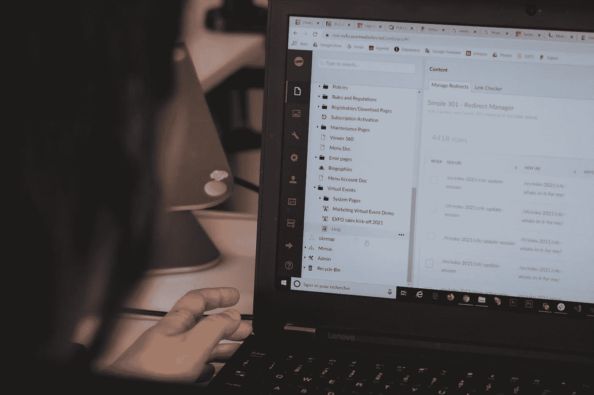
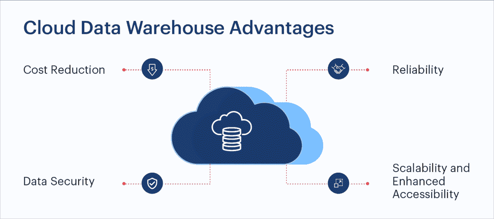

# 2021 年使用云数据仓库的理由

> 原文：<https://levelup.gitconnected.com/reasons-to-use-a-cloud-data-warehouse-in-2021-f2e70b0ce632>

照片由[西格蒙德](https://unsplash.com/@sigmund?utm_source=unsplash&utm_medium=referral&utm_content=creditCopyText)在 [Unsplash](https://unsplash.com/s/photos/cloud-computing?utm_source=unsplash&utm_medium=referral&utm_content=creditCopyText) 上拍摄

如今，大多数企业更喜欢使用云数据仓库来处理和存储关键数据，因为在处理大规模数据集时，它允许自动扩展并具有成本效益。

本地数据仓库的能力是有限的。设置它们、使它们保持最新、维护它们以及自动化资源扩展的过程是耗时且昂贵的。

然而，企业有时会发现，要想出一个足够好的理由来承担转移到[云数据仓库](https://www.firebolt.io/blog/cloud-data-warehouse)的任务是很有挑战性的。让我们更详细地讨论一下。

# 为什么要使用云数据仓库？

企业喜欢和使用云数据仓库有多种原因。从数据的角度来看，云功能更有价值。让我们更深入地了解一下为什么企业会朝着这个方向发展:

[来源](https://www.sigmoid.com/blogs/cloud-data-warehouse-is-the-future-of-data-storage/)

# 同类最佳的资源安全性

由于最近网络攻击的快速增加，云数据仓库的使用已经激增。大多数公司都关心其数据的安全性，无论是与人员还是组织相关的数据。数据是一种重要的资产，但是如果处理不当，它可能会成为一个严重的问题。此外，物理基础架构的缺失消除了物理数据被盗的可能性。

为了确保数据始终受到保护，云服务提供商实施了强大的安全措施，例如 24 小时监控数据、数据屏蔽以及在存储点和传输过程中的数据加密。例如，如果一个组织拥有[个人身份信息(PII)](https://www.csoonline.com/article/3215864/how-to-protect-personally-identifiable-information-pii-under-gdpr.html) 或与健康问题相关的数据，此类措施对他们具有特殊价值。

值得注意的是，数据安全不仅包括数据处理，还包括与数据相关的授权，这由云服务提供商管理。因此，大多数云服务提供商都采用了自己的工具来帮助维护监控规则、身份访问管理、单点登录、双因素身份认证以及各种其他功能和特性。

# 轻松扩展

云数据仓库提供了非常好的可伸缩性和灵活性，特别是在成本方面。在适应性方面，企业可以将其需求与云提供商的基本和高级能力进行比较，然后根据所涉及的成本做出明智的决策。

有时，组织可能在特定时刻需要额外的资源。在这种情况下，公司只在需要时才通过云数据仓库支付额外空间的费用。云计算服务基于“按需付费”的商业模式。

但是，如果在内部环境中出现这种需求，管理起来就成了一个相当大的问题。由于预期过高，无法在短期内完成扩展。随着业务的增长，企业可以更新计划并添加更多资源。然而，这需要在早期阶段投入现金。

在云上，不仅可以进行纵向扩展，还可以根据需要进行横向扩展。因此，如果一个组织在任何时候都不需要大量的资源，它可以通过消除不必要的资源来最小化资源的数量并降低项目的成本。

云数据仓库是唯一允许按需添加和删除资源的数据仓库。我们从来没有预料到内部安排的这种适应性水平。

# 数据的灵活性和稳健性

敏捷性被定义为以动态的方式响应变化并相应行动的能力。处于成长阶段的企业必须对新的数据流做出快速判断——是添加、删除还是调整现有的解决方案——而不需要在这个过程中花费过多的金钱或时间。

云数据仓库提供商的方法非常专业。因此，公司可以在云数据仓库上试验各种业务用例，并根据试验中获得的实时结果做出决策。

众所周知，数据是所有业务的支柱，因此数据的可用性和可靠性是至关重要的考虑因素。因此，如果组织的数据至关重要，并且组织的所有者希望他们的数据始终可用，云提供商会提供尽可能最短的停机时间策略，这意味着数据可用性的延迟时间非常短。

云数据仓库的用户可以利用提供商提供的冗余和故障转移功能。当谈到灾难恢复时，这些解决方案中的大多数确实是有益的。

# 更好的可访问性和可用性

从云数据仓库以最小的延迟访问网络非常简单。云数据仓库会立即响应每个请求，这是内部数据仓库无法做到的。

由于企业处理敏感数据，并要求以最小的延迟交付数据，因此这种能力非常有益。云数据仓库能够近乎实时地提供数据变化。这意味着最终用户可以看到它，没有任何延迟，你有一个跨多个位置的 CDN。

由于云提供商为我们提供了存储桶功能，我们只需点击一下鼠标就可以获得数据。根据该政策，一旦公司将数据上传到他们的云数据仓库，数据就可以开始运行。因此，任何具有适当授权的人都可以立即查看它。已上传的数据将保持可用，直到组织决定删除它。

**结论**

不可否认的事实是，内部数据存储已经成为许多企业的数据分析架构的基石。然而，内部数据中心无法满足现代世界的需求。

云数据仓库代表了数据存储、访问和用于创建新应用程序的方式的重大变化。小投资公司可以想得更大——这是通过云数据仓库的帮助实现的。一眨眼的功夫，一个新的特性就可以以一种舒适的方式实现和测试，同时保持一个合理的价格。