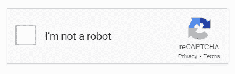
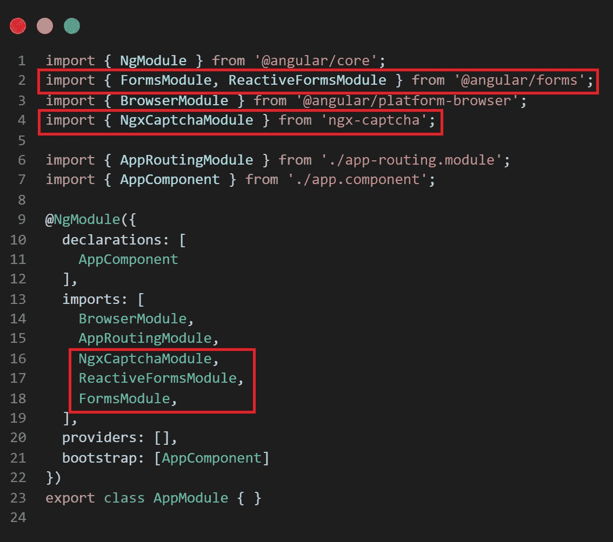
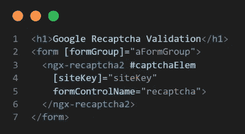
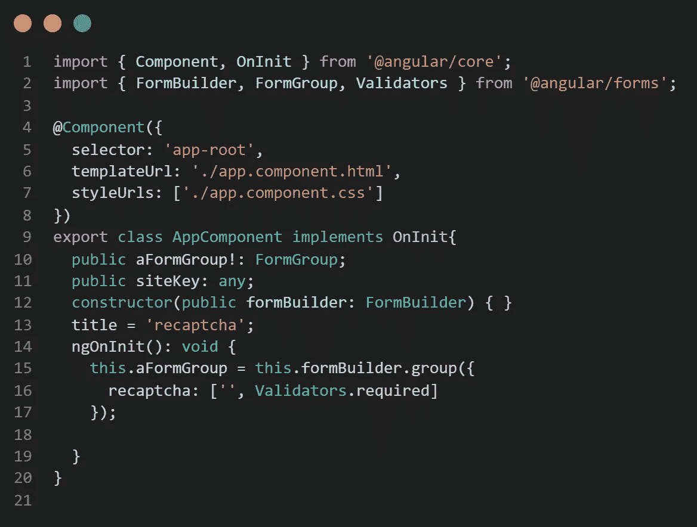
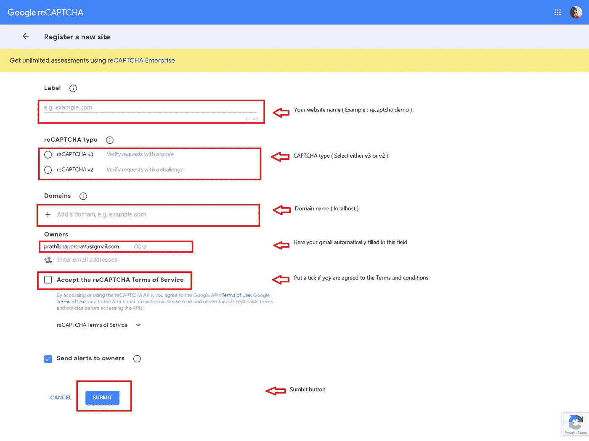
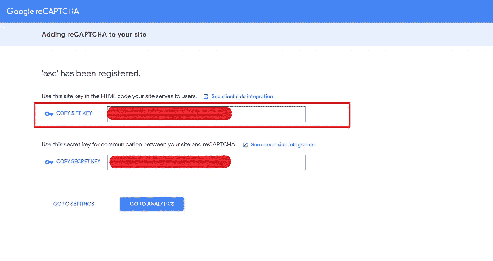
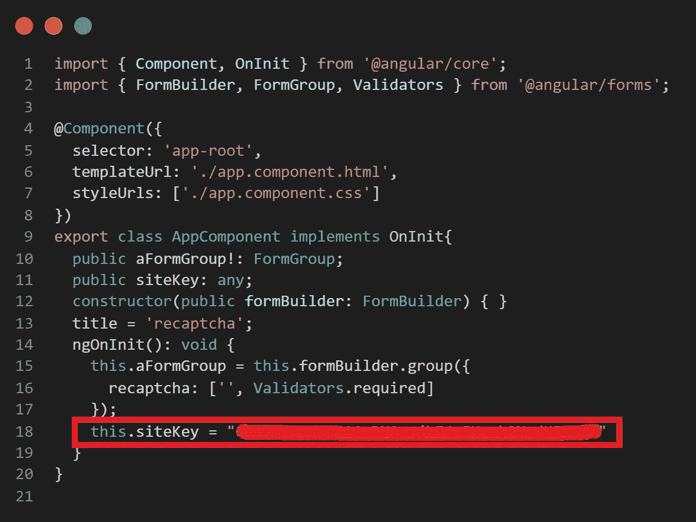

# reCAPTCHA 验证

> 原文：<https://levelup.gitconnected.com/recaptcha-validation-f0c0aea02caa>

## 谷歌 reCAPTCHA 与角形


照片由 [XPS](https://unsplash.com/@xps?utm_source=unsplash&utm_medium=referral&utm_content=creditCopyText) 在 [Unsplash](https://unsplash.com/?utm_source=unsplash&utm_medium=referral&utm_content=creditCopyText) 上拍摄

当我们与一些网站打交道时，你可能会经历一种叫做 reCAPTCHA 的验证，它证明你不是一个机器人。



reCAPTCHA —作者图片

reCAPTCHA 是一种人类互动证明，CAPTCHA 代表完全自动化的公共图灵测试，以区分计算机和人类。它属于谷歌，它有几种类型，如输入一个单词或勾选匹配图像，使用 reCAPTCHA 进行验证。这是一种挑战，有助于识别真正的用户和他们正在处理的计算机程序。

让我们看看如何使用 Angular 框架向应用程序添加 reCAPTCHA 验证。

1.  您可以将其添加到现有的 Angular 项目中，如果没有，您可以使用`ng new your_project_name`创建一个新项目。

Angular 项目创建成功后，需要打开项目，打开终端。

2.为了将验证码验证添加到您的项目中，有必要将“ [NgxCaptchaModule](https://www.npmjs.com/package/ngx-captcha) ”安装到现有项目中。因此，打开您的终端并使用这个命令`npm i ngx-captcha`。

3.然后将“NgxCaptchaModule”导入 app.module.ts。

需要注意的是，大多数时候我们在表单中使用验证码验证。因此，我们需要使用“反应式 FormsModule”和“FormsModule”实现一个角度形式。为此，请确保将“ReactiveFormsModule”和“FormsModule”导入 app.module.ts。



app.module.ts —作者图片

4.然后，我们需要在 app.component.ts 和 app.component.ts 中创建一个表单，如下所示。



app.component.html——作者图片



app . component . ts-作者图片

在 app.component.html 的 ngx-recaptcha2 标签下，有几个参数[你可以自定义。但在这种情况下，我们只需要“siteKey”和“formControlName”。在您的 app.component.ts 中，导入必要的模块并创建必要的变量。这里有一个称为站点密钥的字段。你需要通过访问](https://www.npmjs.com/package/ngx-captcha)[https://www.google.com/recaptcha/admin/create](https://www.google.com/recaptcha/admin/create)在谷歌 reCAPTCHA 上注册来获得它。当您要获取站点密钥时，需要填写下面提到的字段。



这里你必须提供你的网站名称作为标签。然后需要选择 v3 或 v2 版本的 Google reCAPTCHA 验证。之后，提供 localhost 作为域。在“所有者”下，它将作为一个自动填充的区域，包含您用来登录您的 Google 帐户的电子邮件。如果您同意 Google reCAPTCHA 提供的条款和条件，请打勾。然后点击“提交”按钮。

然后，您将重定向到具有“siteKey”的页面，并复制该密钥。



5.然后转到 app.component.ts 文件，通过创建 siteKey 的实例来粘贴 siteKey。



现在保存所有的更改并运行项目。您可以观察到您的 Angular web 页面包含验证码验证。之后，您可以自定义自己的表单域并进一步实现表单。例如，您可以禁用提交按钮，直到验证码响应验证。通过将下面这段代码添加到 app.component.html 中，您可以禁用您创建的表单的提交按钮。(此处按钮添加了 MD 引导风格)

```
<button type="button" mdbBtn color="primary [disabled]="!aFormGroup.valid">Submit</button>
```

通过以上步骤，您可以成功地创建一个带有 reCAPTCHA 验证的角形。

感谢您的阅读。如果这篇文章对你有用，请鼓掌！！！🤗