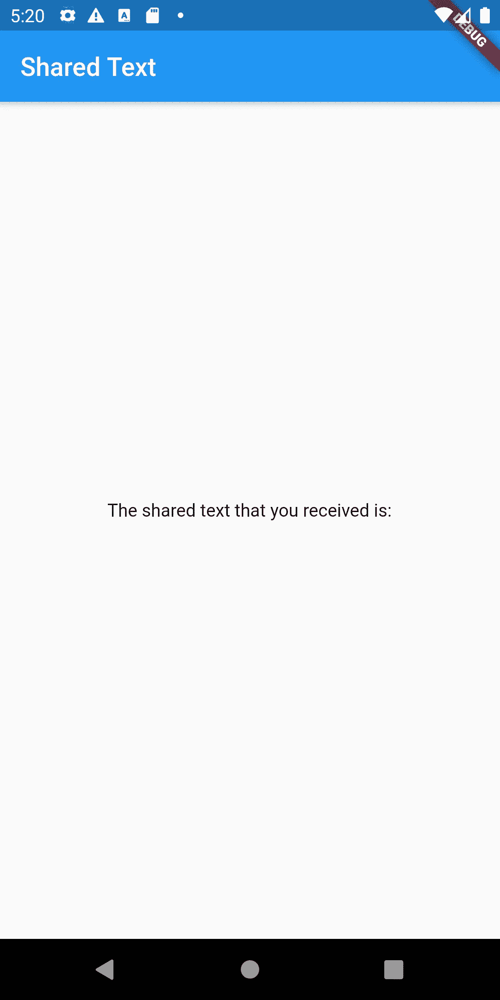
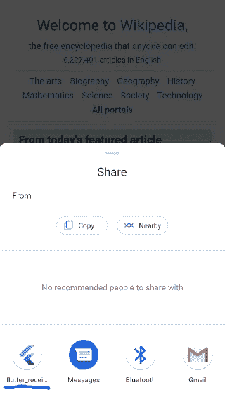
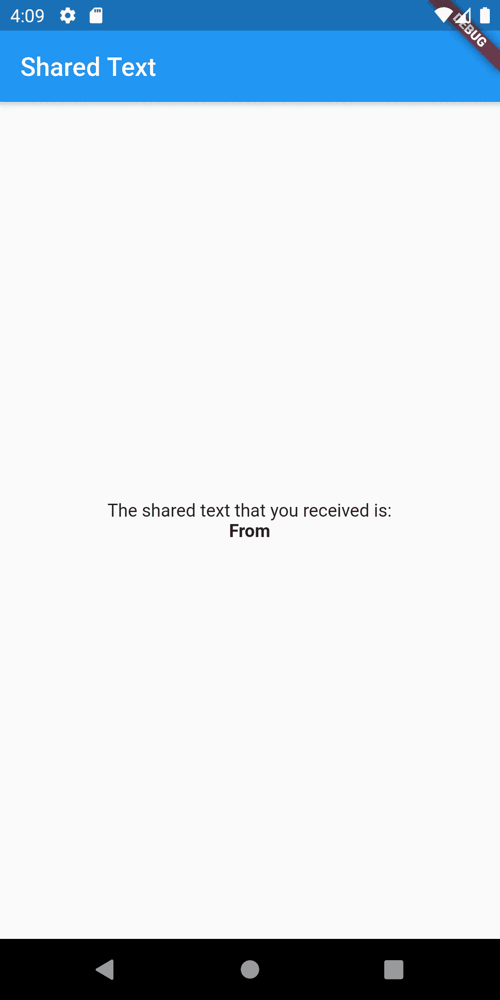
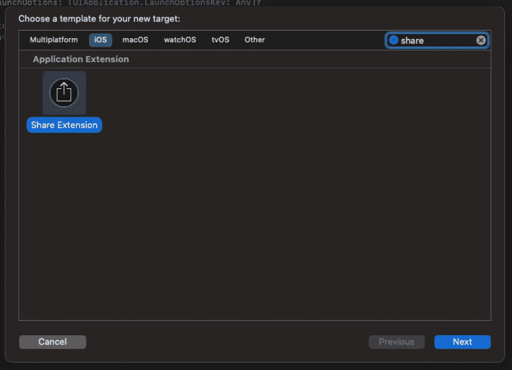
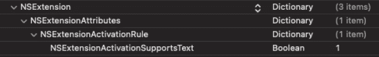
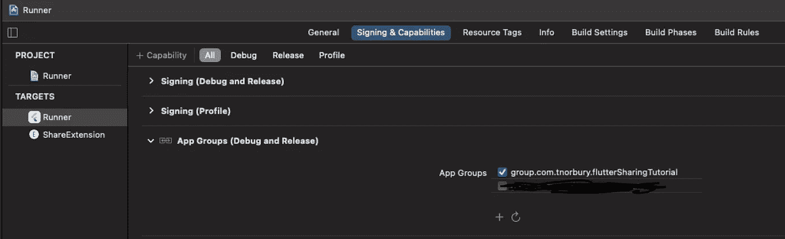
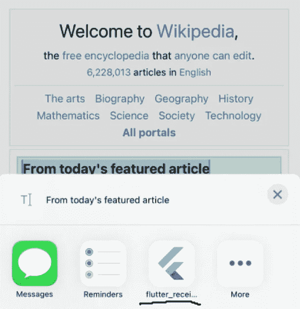
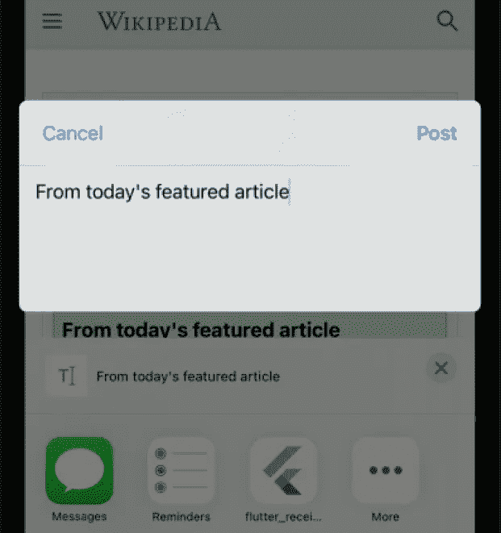

# 使用 Android 发送意图和 iOS 共享扩展在 Flutter 中接收共享数据

> 原文：<https://levelup.gitconnected.com/receiving-shared-data-in-flutter-using-android-send-intents-and-ios-share-extensions-b6a2a3fdf998>

## **让其他应用程序向你的应用程序发送内容**


[本·怀特](https://unsplash.com/@benwhitephotography?utm_source=medium&utm_medium=referral)在 [Unsplash](https://unsplash.com?utm_source=medium&utm_medium=referral) 上拍照。假设这是两个应用程序，这张纸实际上是一些数据。

# 本教程已更新为使用 Flutter 2 和 null-safety。

## 如果你想看到成品与颤振 1，检查出[这一分支](https://github.com/TNorbury/flutter_receive_shared_data_tutorial/tree/flutter_v1)

# iOS 14 的已知问题

运行 iOS 14 的虚拟设备似乎有问题，根本原因仍然未知，但是一个解决方法是将`didSelectPost`中的代码移动到`viewDidLoad`中。然而，如果用户编辑文本，修改后的文本将不会被共享。由于这只是虚拟设备的问题，因此只需在开发时进行更改。

与此相关的部分将添加另一个注释。感谢 [Ali Fatemi](https://ali-fatemi.medium.com/) 发现这个问题，并做了大量工作来寻找解决方案！

另一个正在进行的可能相关也可能不相关的问题在这里谈到[。](https://developer.apple.com/forums/thread/662671)

# 原创文章

在应用程序之间共享数据是很常见的，可能是你每天都在做的事情，甚至都没有想过。最简单的形式就是复制和粘贴，但其他时候你想添加一些功能，这样你的应用程序就可以获取数据并做一些事情。

## 我们要完成的事情

我们将构建一个简单的应用程序，检查它是否有共享数据，如果有，我们将向用户显示它。我们对这款应用的目标如下:

1.  允许用户在手机的某个地方高亮显示文本，并分享到我们的应用程序。
2.  共享到应用程序的文本将被存储，以便用户在启动应用程序时可以阅读。
3.  当应用程序启动时，它会检查共享文本，如果找到，它会将该文本发送到 Flutter 层，并清除任何存储的数据。
4.  Flutter 将向用户显示共享的文本。

## 创建颤振项目

我们将开始设置这个项目的颤振方面。如果你想跟随这个应用程序的建设，开始项目的源代码可以在这里找到[。(**注意**:分支`tutorial_start`是你开始学习教程的地方。如果你想看到完整的完成状态，切换到`main`分支。](https://github.com/TNorbury/flutter_receive_shared_data_tutorial/tree/tutorial_start)

从`main.dart`开始，我们只是对默认的 Flutter create 项目做了一些快速的修改，主要是去掉了浮动的动作按钮和计数器的东西，取而代之的是与一个`ShareService`接口，它将检查共享数据。服务只是我喜欢的分解事物的方式，但是没有理由你需要一个，你可以在 main 里面或者任何你想要的地方拥有所有的共享代码。用于共享的代码在下面的代码片段中。

共享服务将处理与平台(例如 Android/iOS)层的所有通信，并将共享数据发送到我们应用程序的其余部分。有很多方法可以实现这一点，但为了简洁起见，我只选择使用一个简单的回调属性和一个方法，这两种方法都允许我们的应用程序根据接收数据的两种情况来获取共享数据:

1.  我们的应用程序不在后台运行，因此共享会启动它。
2.  我们的应用程序在后台运行，被接收到的共享数据唤醒或“恢复”。

这样我们就可以发布我们的应用程序了！



颤振的东西做了，但它仍然有点无用

就目前情况来看，我们的 Flutter 东西已经完成了，但是如果你启动这个应用程序，你会看到一个异常抛出，说“getSharedData 没有在我们的频道上实现”。不用担心，因为现在我们将从 Android 开始实施这些功能！

# 一个 ndroid 和发送意图

意图是 Android 的核心部分，我们可以利用它们来处理应用程序的输入数据。如果你想在我们开始之前了解更多关于意图的知识，你可以在这里阅读关于它们的文档。

## 设置清单

首先，我们需要设置一个意图过滤器来告诉 Android 我们愿意接收发送意图。对于这个应用程序来说，我们只希望接收文本，我们将只为此创建一个单一的意图过滤器。将这个意图过滤器放在您的主活动中。

太好了，有了这个，我们的应用程序现在只要有文字分享就会出现在分享菜单中！然而，我们的应用程序不会对这些共享文本做任何事情，让我们改变这一点。



刚刚突出显示了一些来自维基百科的文本，点击分享，我们在这里！

## 启动时的处理意图

既然我们可以通过意图向我们的应用程序发送文本，我们需要弄清楚如何获得这些甜蜜的数据。我们通过访问启动我们的应用程序的意图，并检查它是否是一个发送意图(不同的意图可以启动我们的应用程序，所以我们必须确保它是正确的。)

从添加一个成员变量到`MainActivity.kt`中的 activity 开始，这将用于存储意图数据，这样当我们的 Flutter 层需要它时，它就准备好了。

```
private var sharedData: String = ""
```

接下来我们将覆盖`onCreate`函数。在这里，我们将调用另一个函数来处理意图，如果是发送意图，就提取数据。

最后，我们将为颤振层发出的`getSharedData`调用添加方法调用处理程序。通过执行以下操作，覆盖`configureFlutterEngine`并设置`MethodChannel`以响应`getSharedData`方法:

1.  检查意图数据并保存到`sharedData`
2.  将数据放入结果中，结果会被发送到 Flutter 层。
3.  然后清除掉`sharedData`

运行应用程序并与它分享一些东西(比如你在网站上突出显示的一些文本)，我们会看到它现在显示在前面和中间！



现在我们已经设置好了 Android 端，剩下的就是…

# iOS 和共享扩展

可以预见的是，iOS 处理应用程序之间共享内容的方式与 Android 不同。你可以在这里阅读共享扩展[，](https://developer.apple.com/library/archive/documentation/General/Conceptual/ExtensibilityPG/Share.html)但是有两件事需要注意:

1.  share 扩展是围绕着向你的应用程序“发布”一些东西的想法(比如分享一些东西，这样它就可以是一条推文)。
2.  iOS 扩展意味着在后台运行，这意味着你不能通过共享来启动你的应用程序(不使用黑客，我不会深入讨论)。但你仍然可以保存共享数据，以便下次启动应用程序时检索。

## 创建共享扩展

设置共享扩展的第一步是创建扩展本身。首先在 XCode 中打开项目，然后进入文件->新建->目标…并从列表中选择共享扩展。你会被要求给它一个产品名称，这可以是任何东西，但我选择了“共享扩展”。



在搜索栏中输入“share ”,让您的生活更轻松。

之后你会被询问是否要“激活‘共享扩展’方案”。选择“激活”，因为这将使扩展成为您点击运行时运行的选定项目(这很有用，因为它允许您调试扩展，而不必构建和运行应用程序的其余部分)。

我们要做的下一件事是配置`Info.plist`来确定我们想要使用`NSExtensionActivationRule`接受什么类型的数据，默认情况下，这被设置为`TRUEPREDICATE`，这基本上意味着任何东西都可以共享到您的应用程序。然而，你不能用这个设置把你的应用上传到应用商店，因此我们需要配置一些东西。我们将从把`NSExtensionActivateRule`从一个字符串变成一个字典开始，并给它一个关键字为`NSExtensionActivationSupportsText`的条目，它的类型为 boolean，值为‘true’



将 XCode 内部视为键/值对

视为未加工。plist 文件(必须设置为。用于正确语法突出显示的 Gist 上的 xml)。只需将其复制并粘贴到 Info.plist 文件中，替换 NSExtensionAttributes 的当前值

## 创建应用程序群组

现在，为了在扩展和主应用程序之间共享数据，我们需要创建一个应用程序组。首先打开项目配置(默认情况下，它在左侧栏中被称为“Runner ”),然后转到“Signing & Capabilities”。从那里按“+ Capability”按钮并选择“App Group”，然后按 app group config 内的“+”按钮(在“App Groups”下面，刷新按钮旁边)创建一个新容器。你可以给它起任何你想要的名字，但是我建议你只在“组”前面加上前缀。到您的包标识符。对 ShareExtension 目标重复此步骤。



根据这篇文章的时间长短，它可能看起来完全不同

## ShareViewController

当您创建共享扩展时，生成的文件之一是`ShareViewController.swift`，它处理共享扩展的所有行为。这个类中马上有三个被覆盖的方法

1.  `isContentValid`验证共享的内容。在本教程中，我们不会使用这个方法，但是您可以使用它来做一些事情，比如验证用户在 share 字段中输入了什么。
2.  `didSelectPost`当用户点击共享界面中的“发布”按钮时运行。
3.  `configurationItems`它允许您进行可选配置，但我们不会在本教程中使用它。

在`didSelectPost`中，我们想要定义以下两个变量，它们将用于存储数据，以便我们的主应用程序可以访问这些数据。第一个`sharedSuiteName`是我们之前创建的应用程序组的名称，这将用于打开正确的 UserDefaults 对象。第二个`sharedDataKey`是我们将放入 UserDefaults 的键/值对中的键的名称。

```
*let* sharedSuiteName: String = *"group.com.tnorbury.flutterSharingTutorial"**let* sharedDataKey: String = *"SharedData"*
```

接下来，我们希望加载附件并提取文本，最后将文本存储到 UserDefaults 中。

**与上述代码相关的已知问题，如果由于某种原因代码片段第 9 行的 if 条件失败，尝试将所有代码从** `**didSelectPost**` **移动到** `**viewDidLoad**` **。**

现在，您可以启动扩展(启动时选择“Safari”作为应用程序)，突出显示一些文本和共享，并在选项列表中看到应用程序！



点击我们的应用程序，会出现一个对话框，允许我们在“发布”之前编辑文本。当我们点击 post 时，`didSelectPost`中的代码将运行，我们的文本将被保存。



## AppDelegate，让我们的数据飘动起来

这里我们需要做的最后一件事是设置我们的应用程序委托来处理来自 Flutter 的方法并发送来自 UserDefaults on up 的数据。类似于我们在上面用 Android 做的事情，我们将创建一个 Flutter 方法处理程序，读取存储在 UserDefaults 中的数据，然后将其放入结果中。

开始时，我们想要创建与上面相同的两个变量来获取共享数据，`sharedSuiteName`和`sharedDataKey`。把这些放在`application`函数里面。

接下来，我们检查是否有共享的内容，如果有，把它放在结果中，这样我们就可以在 Flutter 中得到它。

将此放入应用程序函数。

现在，当您运行应用程序时(在 XCode 中将方案设置为“Runner”)，您之前共享的文本应该会显示出来！


iOS 上好看！

# 包扎

将分享添加到我的应用程序中是一次有趣的经历，比我最初想象的要多花一些时间。因此，我希望那些偶然看到这篇文章的人也能找到分享的方法，这对你有所帮助！

此外，在这里，我将再次插入我的应用程序，[音乐笔记，](https://www.music-note.app/)。这是记录你音乐收听历史的好方法(如果我自己这么说的话)！

同样，同样，这是我的第一篇媒体文章，所以任何反馈都将非常感谢！