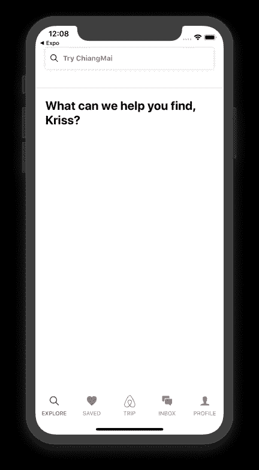

# 推荐的 Home UI——Airbnb 主屏幕 UI 克隆，带有 React Native #2

> 原文：<https://levelup.gitconnected.com/recommended-homes-ui-airbnb-home-screen-ui-clone-with-react-native-2-75ffb1e6d4c6>


本教程是我们使用 React Native 克隆 Airbnb 主屏幕 UI 的第二部分。在前一部分中，我们成功地实现了底部的标签栏和顶部的搜索栏。本教程是我们上一部分停止的同一教程的继续。因此，建议浏览前一部分，以便更好地理解和洞察整个项目。

正如在第一部分中提到的，创建本教程系列的灵感来自于[React native real estate template](https://www.instamobile.io/app-templates/real-estate-app-template-react-native/)，它帮助我们构建一些令人惊叹的现成应用程序，任何人都可以使用它们来创建创业公司或销售应用程序模板。这一部分也是 YouTube 视频教程中由不确定的程序员为 Airbnb 克隆的编码实现和设计的延续。

在这一部分中，我们将实现我们的主屏幕 UI 的两个主要部分，这将强调来自实际应用程序的推荐主页。它们是“探索”屏幕上的“类别”部分和“Airbnb Plus”部分。这个想法是从实现 category 部分开始。然后，我们将把类别代码实现转换成单个组件，并使该组件可重用。然后，我们将转移到 Airbnb 部分 UI 的设计。

*那么，我们开始吧！*

# 实施类别部分

## 导入所需组件

首先，我们将把所需的组件从 react-native 包导入 Explore.js 文件。所需的组件是`ScrollView`、`Image`和`Text`组件，我们将在 Explore.js 文件中使用它们来实现类别部分。所有导入如下面的代码片段所示:

```
import { 
   View, 
   TextInput, 
   Text,
   Image, 
   SafeAreaView, 
   ScrollView
 } 
from "react-native";
```

## 添加包含描述的 HeroText

在这一步，我们将利用之前在 Explore.js 文件中导入的`ScrollView`和`Text`组件。组件使我们能够实现一个用户可以滚动的视图。我们将用值为 16 的`scrollEventThrottle`来实现它。然后，`ScrollView`组件用内嵌样式包装了一个`View`组件，以获得正确的视图。然后，视图组件用一些内联样式包装包含描述的文本组件，使描述看起来像原始应用程序一样。下面的代码片段提供了实现这一切的代码:

```
<ScrollView scrollEventThrottle={16}>
          <View style={{ flex: 1, backgroundColor: "white", paddingTop: 20 }}>
            <Text
              style={{
                fontSize: 24,
                fontWeight: "700",
                paddingHorizontal: 20
              }}
            >
              What can we help you find, Varun?
            </Text>
          </View>
        </ScrollView>
```

我们在模拟器屏幕上得到以下结果:



## 在类别部分添加特色主页用户界面

在这一步中，我们将创建一个特征部分，在该部分中，我们显示一个住宅的图像，并在底部显示一些文本。该部分将在描述部分下面进行编码。为此，我们需要添加一个新的`View`组件来包装流程中的另一个`View`组件。两个`View`组件都有适合正确视图的内嵌样式。内部的`View`组件将包装从`./images`目录获取源图像的`Image`组件。我们还需要将一些样式绑定到`Image`组件，以使图像看起来更合适、更漂亮。

然后就在包装`Image`组件的`View`组件下面，我们需要添加另一个带有一些内联样式的`View`组件。现在，这个`View`组件将包装`Text`组件，后者将包含一些描述图像的文本。下面的代码片段提供了实现这一切的代码:

```
<View
            style={{
              height: 130,
              width: 130,
              marginLeft: 20,
              borderWidth: 0.5,
              borderColor: "#dddddd"
            }}
          >
            <View style={{ flex: 2 }}>
              <Image
                source={require("../images/home.jpeg")}
                style={{
                  flex: 1,
                  width: null,
                  height: null,
                  resizeMode: "cover"
                }}
              />
            </View>
            <View style={{ flex: 1, paddingLeft: 10, paddingTop: 10 }}>
              <Text>My Home</Text>
            </View>
          </View>
```

我们将在模拟器屏幕中得到以下结果:


正如我们所看到的，我们已经获得了类别部分的描述和图像部分。然而，我们需要重复添加相同类型的图像部分，使其成为类别部分。我们要怎么做呢？答案是**为类别部分创建一个单独的组件**。

## 类别部分的单独组件

我们将为 category 部分创建一个单独的组件，其中包含我们在上一步中实现的图像和文本元素。在 React Native 的情况下，将 UI 分成不同的组件是非常必要的，因为它使我们能够在不同的部分重用相同的代码，并使代码看起来清晰。

为了创建组件，首先，我们需要创建一个单独的目录来保存组件文件。所以，我们需要**创建一个名为‘的目录。/components '放入我们的主项目目录**。之后，我们需要**在组件目录中创建一个名为 Category.js** 的文件。然后我们需要从 react-native 包以及 react 包中导入必要的组件。只需创建一个名为`Category`的`class`，它扩展到`Component`模块。

之后，我们只需要将之前在 Explore.js 文件中实现的由`View`组件包装的`Image`和`text`部分添加到 Category.js 组件文件的`render()`函数中。用包含来源和纹理的`prop`值替换`Image`来源，用我们将从父组件发送的另一个属性替换`Text`组件中的来源和纹理。下面的代码片段提供了实现整个类别组件的代码:

```
import React, { Component } from "react";
import { View, Text, StyleSheet, Image } from "react-native";

class Category extends Component {
  render() {
    return (
      <View
        style={{
          height: 130,
          width: 130,
          marginLeft: 20,
          borderWidth: 0.5,
          borderColor: "#dddddd"
        }}
      >
        <View style={{ flex: 2 }}>
          <Image
            source={this.props.imageUri}
            style={{ flex: 1, width: null, height: null, resizeMode: "cover" }}
          />
        </View>
        <View style={{ flex: 1, paddingLeft: 10, paddingTop: 10 }}>
          <Text>{this.props.name}</Text>
        </View>
      </View>
    );
  }
}
export default Category;
```

## 导入类别组件以浏览屏幕

我们将使用以下代码片段中的代码，将在前面步骤中实现的类别组件导入到 Explore.js 文件中:

```
import Category from "../components/Category";
```

我们将在探索屏幕中使用该组件。我们需要创建三个包含图片和文本的`Category`组件。我们需要记住传递名为`imageUri`的`prop`值，它将包含来自。/image '目录，以及一个名为`name`的`prop`，如下面的代码片段所示:

```
<ScrollView scrollEventThrottle={16}>
  <View style={{ flex: 1, backgroundColor: "white", paddingTop: 20 }}>
    <Text
      style={{
        fontSize: 24,
        fontWeight: "700",
        paddingHorizontal: 20
      }}
    >
      What can we help you find, Kriss?
    </Text>
    <Category imageUri={require("../images/home.jpeg")} name="Home" />
    <Category
      imageUri={require("../images/experience.jpeg")}
      name="Experiences"
    />
    <Category
      imageUri={require("../images/restuarunt.jpeg")}
      name="Resturant"
    />
  </View>
</ScrollView>
```

我们将在模拟器屏幕中得到以下结果:


我们现在有三个图像块代表类别部分。

现在我们需要横向显示那些也可以滚动的图像类别。为此，我们需要添加一个带有两个道具`horizontal`和`showHorizontalScrollIndicator`的`ScrollView`组件。`horizontal`属性被设置为`true`以水平显示类别并使其可滚动。为了隐藏水平滚动条，将`showHorizontalScrollIndicator`设置为`false`，如下面的代码片段所示:

```
<View style={{ height: 130, marginTop: 20 }}>
  <ScrollView
    horizontal={true}
    showsHorizontalScrollIndicator={false}
  >
    <Category
      imageUri={require("../images/home.jpeg")}
      name="Home"
    />
    <Category
      imageUri={require("../images/experience.jpeg")}
      name="Experiences"
    />
    <Category
      imageUri={require("../images/restuarunt.jpeg")}
      name="Resturant"
    />
  </ScrollView>
</View>
```

我们将在模拟器屏幕中得到以下结果:


正如我们所看到的，我们在模拟器屏幕上看到了水平的类别，这表明我们已经成功地完成了类别部分的实现。

## 实施 Airbnb Plus 部分

在本节中，我们将实现 Airbnb plus 部分，向用户介绍 Airbnb plus 的功能，就像在真实应用程序中一样。这是一个简单的步骤，我们只需要包括一个标题，副标题，和一张图片。为此，我们将使用像`Image`、`Text`和`View`这样的组件。我们需要添加一个带有内联样式的`View`包装器，其中包含两个包含标题和副标题的`Text`组件。`Text`组件有自己的样式绑定，如下面的代码片段所示:

```
<View style={{ marginTop: 40, paddingHorizontal: 20 }}>
     <Text style={{ fontSize: 24, fontWeight: "700" }}>
       Introducing Airbnb Plus
     </Text>
     <Text style={{ fontWeight: "100", marginTop: 10 }}>
       A new selection of homes verified for quality & comfort
</Text>
```

我们在模拟器屏幕上得到以下结果:


我们将在`Text`组件下方添加一张特色图片。为此，我们将使用带有内联样式的`Image`组件和一个从'获取的图像源。/images '目录。`Image`组件由绑定到一些内联样式的`View`组件包装，以给图像提供适当的高度和宽度，如下面的代码片段所示:

```
<View style={{ marginTop: 40, paddingHorizontal: 20 }}>
   <Text style={{ fontSize: 24, fontWeight: "700" }}>
     Introducing Airbnb Plus
   </Text>
   <Text style={{ fontWeight: "100", marginTop: 10 }}>
     A new selection of homes verified for quality & comfort
   </Text>
   <View style={{ width: "100%", height: 200, marginTop: 20 }}>
     <Image
       style={{
         flex: 1,
         height: null,
         width: null,
         resizeMode: "cover",
         borderRadius: 5,
         borderWidth: 1,
         borderColor: "#dddddd"
       }}
       source={require("../images/home.jpeg")}
     />
   </View>
</View>
```

我们在模拟器屏幕上得到以下结果:


正如你所看到的，Airbnb plus 部分看起来非常吸引人。至此，我们已经成功地完成了本系列教程的第二部分。我们已经成功地将类别部分和 Airbnb 部分实现到我们的 Airbnb 主屏幕 UI 克隆中。

## 结论

本教程是 Airbnb 主屏幕 UI 克隆教程系列的第二部分。在这一部分中，我们从本系列教程第一部分停止的地方继续。我们学习了如何实现可重用组件，并在屏幕文件的多个地方使用它。我们还学习了如何实现带有滚动条的水平滚动元素的水平类别布局。教程的这一部分主要是关于不同元素的组件创建和样式。然后，我们最终使用 React Native 为我们的主屏幕 UI 克隆创建了水平类别部分和 Airbnb plus 部分。

*最初发表于* [*克里斯*](https://kriss.io/airbnb-home-screen-ui-clone-with-react-native-2-recommended-homes/) *。*