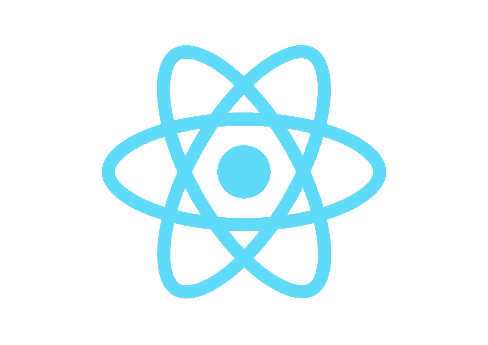

# 重新创建 React 的 useState 挂钩

> 原文：<https://levelup.gitconnected.com/recreating-reacts-usestate-hook-697766aac4b2>



你不需要**类**，也不需要**。bind()** 方法及其造成的混乱。React 16.8 版就是这么说的。基本上，函数使得提高应用程序的性能变得更加容易。类让人类和机器都感到困惑。

这篇文章的目的是从内部了解新钩子是如何工作的。为此，我将重新创建自定义的 useState 挂钩。

*这不是 useState 钩子的实际代码，只是一个想法。实际的使用状态挂钩要复杂得多*

> 你可以在这里找到完整的代码:
> 
> [https://github.com/nitesh-rana-repo/useState-hook](https://github.com/nitesh-rana-repo/useState-hook)

那我们开始吧。在我们的 App.js 中，我们添加了以下代码。这应该只是更新我们在输入中输入的名称。从最简单的组件开始:

```
function MyName () { const [ name, setName ] = useState(''); function handleChange (evt) {
    setName(evt.target.value);
 } return (
      <div>
        <h1>My name is: {name}</h1> 
        <input type="text" value={name} onChange={handleChange} />
     </div>
)}
```

不出所料，什么都不管用。未定义使用状态。所以让我们来创造它。

在 App.js 中，导入 ReactDOM。在 ReactDOM 的帮助下，我们将在状态改变时重新呈现组件。这就是你的进口货应该看起来的样子。

```
import React  from 'react';
import ReactDOM from 'react-dom';
```

现在我们一步一步地编写我们的 useState 函数。

**步骤 1** —它应该接受 initialState 作为参数。然后，我们将 initialState 参数值设置为一个局部变量。

```
function useState(initialState) {
    let value = initialState;
}
```

**第 2 步** —我们可以利用 JavaScript 闭包的概念，创建一个可以访问 value 变量的 setState 函数。该函数将待设置的状态作为参数。最后，我们通过 ReactDOM.render 重新呈现我们的组件。

```
function useState(initialState) {
    let value = initialValue;
    function setState(nextValue) {
        value = nextValue;
        ReactDOM.render(<MyName />,     document.getElementById("root")); }
}
```

**第 3 步**—useState 函数最后要添加的是 return 语句。useState 应该返回包含 value 和 setState 函数的数组。

```
function useState(initialState) {
    let value = initialValue;
    function setState(nextValue) {
        value = nextValue;
        ReactDOM.render(<MyName />,     document.getElementById("root"));
}
return [value, setState];
}
```

还是不行。

原因:

```
ReactDOM.render(<MyName />, document.getElementById("root"));
```

当调用上面的渲染时，函数组件再次被重新渲染。再次调用 useState 函数，将值重置为 initialValue。所以输入的状态是一样的。

为了解决这个问题，我们全局定义了值变量。因此，useState 函数变成了:

```
let value;function useState(initialState) {
    if(typeof value === "undefined") value = initialState;
    function setState(nextValue) {
        value = nextValue;
        ReactDOM.render(<MyName />, document.getElementById("root"));
}
return [value, setState];
}
```

通过这次更新，我们看到我们的代码工作了，状态更新了，组件重新呈现了。

这段代码仍然有许多问题，其中之一是你不能多次使用 useState，因为它会覆盖。我们可以通过将值变量转换为数组并保留一个计数器变量来解决这个问题。

因此，通过重新实现 useState，我们学到了一些东西:

1.  钩子只是可以访问 React 特性的 JavaScript 函数。
2.  闭包的重要性。
3.  对于多次使用，必须添加索引或计数器，所以钩子定义的顺序很重要(在我们的实现中)。

[](https://skilled.dev) [## 编写面试问题

### 一个完整的平台，在这里我会教你找到下一份工作所需的一切，以及…

技术开发](https://skilled.dev)