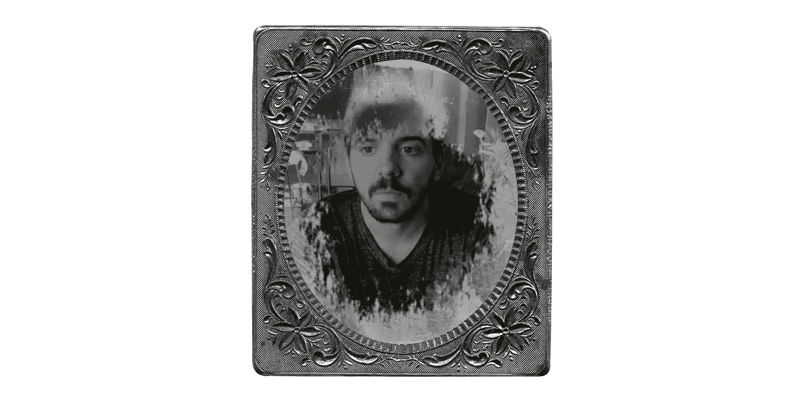

# 在 CSS 中重新创建红色死亡救赎 2 Tintype 加载屏幕效果

> 原文：<https://levelup.gitconnected.com/recreating-the-red-dead-redemption-2-tintype-loading-screen-effect-in-css-10ca87d5b9de>

## 灵感来自 2016 年的一篇 Codrops 文章



铅字相框里的李·摩根

像你们中的许多人一样，我已经把工作、家庭和社会义务放在一边，准备参加 Rockstar Game 最新的 Red Dead Redemption 系列游戏。我是西方神话的超级粉丝(并且是反社会的)，所以这个游戏非常适合我。对我的客户来说幸运的是，我在一台连接到投影仪的 Xbox 上玩游戏，由于阳光透过我公寓 15 英尺的窗户照射进来，投影仪在白天变得毫无用处。正是在这样的时刻，我梦想玩游戏，并在 [Codepen](https://codepen.io/leemartin/pen/KrKGbM?editors=1100) 中重新创建界面元素。

第一次看到[加载屏幕](https://www.youtube.com/watch?v=F5rNlOZhhOM)，立刻引发了我对 2016 年一篇关于用 CSS 遮罩构建过渡效果的 Codrops [文章](https://tympanus.net/codrops/2016/09/29/transition-effect-with-css-masks/)的思考。很自然地，我只是在心里记了下来，因为我要在实际的游戏中投入几个小时...嗯，现在阳光明媚，我做了一个简单的 [Codepen](https://codepen.io/leemartin/pen/KrKGbM/) ，它利用 CSS 蒙版动画技术和 Photoshop 过滤的 *tintype* 我自己的照片。我们来分解一下。

HTML 非常简单，包括一个包含两个附加 div 的`#photo` holder div。`#normal` div 将保存结果照片，`#invert` div 将保存预先制作的*反转照片。这个`#invert` div 被放置在顶部，我们将使用 CSS 蒙版来显示下面的`#normal` div。*

```
<div id="photo">
  <div id="normal"></div>
  <div id="invert"></div>
</div>
```

这些 div 中的每一个都将接收相同的背景图像，但是`#invert` div 也将包括一个*反转*和灰度过滤器。

```
#photo div{
  background: url('lee-morgan.jpg');
  background-size: cover;
}#invert{
  filter: invert(1.0) grayscale(1.0);
}
```

在 Codrops 的文章之后，我在 After Effects 中添加了一个新的墨迹显示[精灵表](https://s3-us-west-2.amazonaws.com/s.cdpn.io/141041/sheet.png)，我觉得它更好地模仿了 RDR2 中的效果。额外提示，我使用下面的 Imagemagick 命令从 After Effects 导出的帧目录中缝合一个水平 sprite 表。

```
convert *.png +append sheet.png
```

然后我可以将这个遮罩应用到`#invert` div。将动画中的帧数乘以 100 就可以得到你的蒙版大小。

```
#invert{
  mask: url('sheet.png');
  mask-size: 7000% 100%;
}
```

虽然 CSS 动画看起来只是简单地将蒙版位置从一边滑动到另一边，但真正神奇的是动画声明中包含的`steps`命令。这允许蒙版在动画持续期间均匀地*步进*它的位置，而不是补间它。

```
#invert{
  animation: mask 5s steps(69) infinite alternate;
}@keyframes mask{
  from{
    mask-position: 0% 0%;
  }
  to{
    mask-position: 100% 0%;
  }
}
```

最后，我添加了一个额外的 CSS 动画来淡化和模糊效果，并将其附加到`#photo` div。这让它更接近游戏中的内容。

```
#photo{
  animation: blur 5s infinite alternate;
}@keyframes blur{
  from{
    filter: blur(3px);
    opacity: 0;
  }
  to{
    filter: blur(0px);
    opacity: 1;
  }
}
```

现在这个例子简单地使用 CSS 动画的`alternate`属性循环相同的照片。为第一个采用这种幻灯片格式的人终身提供经典燕麦饼。现在，我要睡几个小时，直到太阳下山，这样我就可以继续玩了。