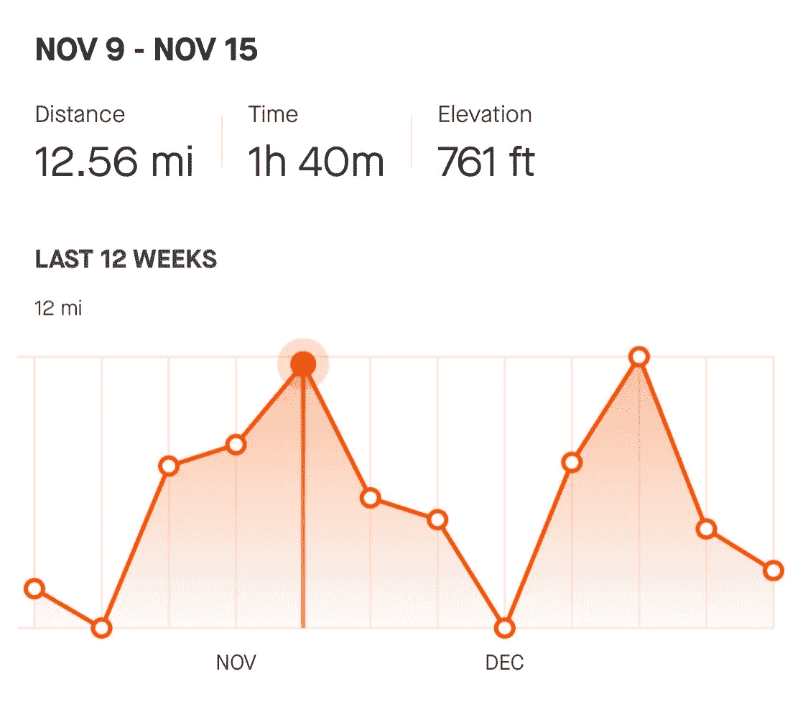
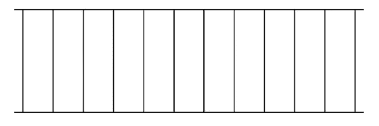
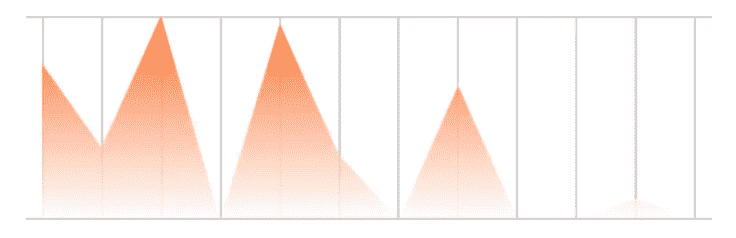
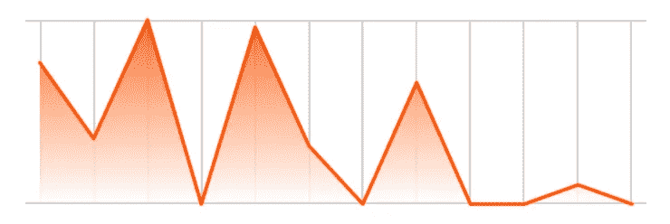
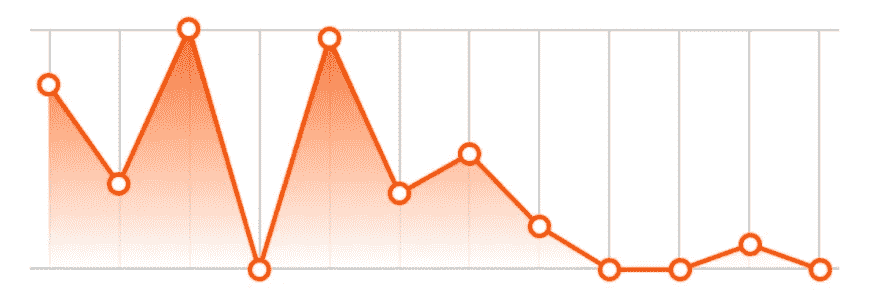
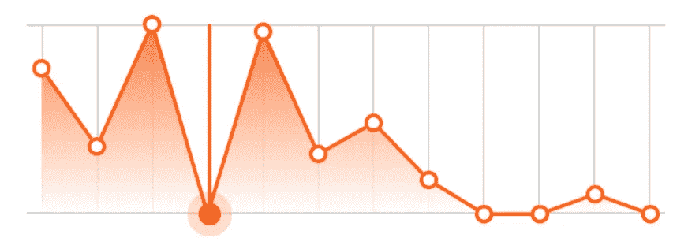
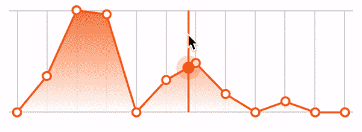

# 在 SwiftUI 中重新创建 Strava 活动图

> 原文：<https://levelup.gitconnected.com/recreating-the-strava-activity-graph-in-swiftui-9db271a2dd66>

## 让-马克·布里安内

本周的 SwiftUI 教程主要关注一款流行的跑步和骑行应用 Strava。在本教程中，我将介绍如何重新创建显示在 Strava 应用程序中的活动历史图表。像往常一样，我将把它分成小块，一路解释。



Strava 活动历史视图

> 如果你觉得这个教程有帮助，请考虑使用这个[链接](https://trailingclosure.com/signup/?utm_source=trailing_closure&utm_medium=blog_post&utm_campaign=strava_view)订阅，如果你没有在[TrailingClosure.com](https://trailingclosure.com/?utm_source=trailing_closure&utm_medium=blog_post&utm_campaign=strava_view)上阅读这篇文章，请随时来看看我们！

## 概观

我们将把这篇文章分成几个不同的部分。你可以随意点击某个部分的链接，在你空闲的时候跳过或跳过去。

*   [型号—](#model) `[ActivityLog](#model)`
*   [构建活动图](#graph)
*   [按周分组日志](#grouping-graph)
*   [绘制网格](#grid)
*   [绘制活动线的坡度](#gradient)
*   [画活动线](#line)
*   [画点](#points)
*   [添加用户交互](#interaction)
*   [构建活动统计文本](#text)

## 型号— `ActivityLog`

如果我们要重新创建一个显示活动历史的视图，那么我们需要一些方法来组织和存储数据。下面是`ActivityLog`的结构定义。我们将使用它来存储我们的活动数据，我们将在图形和文本中显示这些数据。(在本教程中，我们不会实现单位转换)

```
struct ActivityLog {
    var distance: Double // Miles
    var duration: Double // Seconds
    var elevation: Double // Feet
    var date: Date
}
```

现在我们已经定义了模型，我们可以转移注意力，开始创建自定义 SwiftUI 视图。

## 构建图表

我们将首先创建一个新的 SwiftUI `View`文件，并将其命名为`ActivityGraph`。它将接受一个`ActivityLog`数组以及当前所选周索引的绑定。Strava 只显示了过去的 12 周，所以这就是我们的指数将涵盖的范围(0-11)。

```
struct ActivityGraph: View {

    var logs: [ActivityLog]
    @Binding var selectedIndex: Int

    init(logs: [ActivityLog], selectedIndex: Binding<Int>) {
        self._selectedIndex = selectedIndex
        self.logs = logs // Temporary, we'll group logs next
    }

    var body: some View {
        // Nothing yet...
    }
}
```

## 按周对日志分组

如果你回想一下我们的模型，`ActivityLog`结构只代表一个单独的活动(比如跑步、散步、远足等等)。).但是，我们也可以使用它将一周的统计数据汇总到一个`ActivityLog`中。我们将在`ActivityGraph`的`init()`里做同样的事情。这允许我们通过将`logs`数组压缩到只有 12 个实例来简化图形的创建。请看下面是如何做到的。

> 注意，这是历史的滚动视图。统计数据不会从每周开始进行分组，而是从当天开始以 7 天为增量进行分组。

```
init(logs: [ActivityLog], selectedIndex: Binding<Int>) {
    self._selectedIndex = selectedIndex

    let curr = Date() // Today's Date
    let sortedLogs = logs.sorted { (log1, log2) -> Bool in
        log1.date > log2.date
    } // Sort the logs in chronological order

    var mergedLogs: [ActivityLog] = []

    for i in 0..<12 { // Loop back for the past 12 weeks

        var weekLog: ActivityLog = ActivityLog(distance: 0, duration: 0, elevation: 0, date: Date())

        for log in sortedLogs {
            // If log is within specific week, then add to weekly total
            if log.date.distance(to: curr.addingTimeInterval(TimeInterval(-604800 * i))) < 604800 && log.date < curr.addingTimeInterval(TimeInterval(-604800 * i)) {
                weekLog.distance += log.distance
                weekLog.duration += log.duration
                weekLog.elevation += log.elevation
            }
        }

        mergedLogs.insert(weekLog, at: 0)
    }

    self.logs = mergedLogs
}
```

## 绘制网格

目前`body`代码为空。让我们从为图表绘制网格开始。我将为图形的每一部分编写函数，使`body`代码更容易阅读。例如:

```
var body: some View {
    drawGrid()
        //.opacity(0.2)
        //.overlay(drawActivityGradient(logs: logs))
        //.overlay(drawActivityLine(logs: logs))
        //.overlay(drawLogPoints(logs: logs))
        //.overlay(addUserInteraction(logs: logs))
}
```

这就是`body`代码的样子。我们将首先编写`drawGrid`函数，在编写后面的函数时取消对它们的注释。`drawgrid()`函数相当简单。我们有两条水平黑线包围着一组垂直黑线。您可以看到，我让 SwiftUI 完成了所有正确分隔行的繁重工作。我们需要确保做的唯一事情是设置线条的宽度或高度。

```
func drawGrid() -> some View {
    VStack(spacing: 0) {
        Color.black.frame(height: 1, alignment: .center)
        HStack(spacing: 0) {
            Color.clear
                .frame(width: 8, height: 100)
            ForEach(0..<11) { i in
                Color.black.frame(width: 1, height: 100, alignment: .center)
                Spacer()

            }
            Color.black.frame(width: 1, height: 100, alignment: .center)
            Color.clear
                .frame(width: 8, height: 100)
        }
        Color.black.frame(height: 1, alignment: .center)
    }
}
```



图表的网格

## 绘制线条的渐变

接下来，我们将编写`drawActivityGradient(logs:)`函数。这将为图表添加一些样式，以更好地展示数据的高/低。该函数背后的思想是创建一个矩形的`LinearGradient`，然后使用图形数据将其屏蔽掉。让我们看一下代码。

```
func drawActivityGradient(logs: [ActivityLog]) -> some View {
    LinearGradient(gradient: Gradient(colors: [Color(red: 251/255, green: 82/255, blue: 0), .white]), startPoint: .top, endPoint: .bottom)
        .padding(.horizontal, 8)
        .padding(.bottom, 1)
        .opacity(0.8)
        .mask(
            GeometryReader { geo in
                Path { p in
                    // Used for scaling graph data
                    let maxNum = logs.reduce(0) { (res, log) -> Double in
                        return max(res, log.distance)
                    }

                    let scale = geo.size.height / CGFloat(maxNum)

                    //Week Index used for drawing (0-11)
                    var index: CGFloat = 0

                    // Move to the starting y-point on graph
                    p.move(to: CGPoint(x: 8, y: geo.size.height - (CGFloat(logs[Int(index)].distance) * scale)))

                    // For each week draw line from previous week
                    for _ in logs {
                        if index != 0 {
                            p.addLine(to: CGPoint(x: 8 + ((geo.size.width - 16) / 11) * index, y: geo.size.height - (CGFloat(logs[Int(index)].distance) * scale)))
                        }
                        index += 1
                    }

                    // Finally close the subpath off by looping around to the beginning point.
                    p.addLine(to: CGPoint(x: 8 + ((geo.size.width - 16) / 11) * (index - 1), y: geo.size.height))
                    p.addLine(to: CGPoint(x: 8, y: geo.size.height))
                    p.closeSubpath()
                }
            }
        )
}
```

如果您现在取消注释在您的`body`代码中绘制渐变的调用，您应该会看到类似下图的内容。

```
var body: some View {
    drawGrid()
    .opacity(0.2)
    .overlay(drawActivityGradient(logs: logs))
    //.overlay(drawActivityLine(logs: logs))
    //.overlay(drawLogPoints(logs: logs))
    //.overlay(addUserInteraction(logs: logs))
}
```



添加了渐变的图形

## 绘制活动线

线条绘制功能的工作方式与渐变功能类似。唯一的区别是，我们不会关闭路径，并把它作为一个面具。我们将简单地画一条线，并给它一些颜色。`drawActivityLine(logs:)`功能见下。

```
func drawActivityLine(logs: [ActivityLog]) -> some View {
    GeometryReader { geo in
        Path { p in
            let maxNum = logs.reduce(0) { (res, log) -> Double in
                return max(res, log.distance)
            }

            let scale = geo.size.height / CGFloat(maxNum)
            var index: CGFloat = 0

            p.move(to: CGPoint(x: 8, y: geo.size.height - (CGFloat(logs[0].distance) * scale)))

            for _ in logs {
                if index != 0 {
                    p.addLine(to: CGPoint(x: 8 + ((geo.size.width - 16) / 11) * index, y: geo.size.height - (CGFloat(logs[Int(index)].distance) * scale)))
                }
                index += 1
            }
        }
        .stroke(style: StrokeStyle(lineWidth: 2, lineCap: .round, lineJoin: .round, miterLimit: 80, dash: [], dashPhase: 0))
        .foregroundColor(Color(red: 251/255, green: 82/255, blue: 0))
    }
}
```

一旦您取消了对`body`变量中的行的注释，您应该会在预览画布中看到类似下图的内容。



添加线条的图形

## 画出要点

我们的下一个函数`drawLogPoints(logs:)`将再次像前面的函数一样工作，除了我们将在图上放置`Circle`点作为覆盖。请参见下面的代码:

```
func drawLogPoints(logs: [ActivityLog]) -> some View {
    GeometryReader { geo in

        let maxNum = logs.reduce(0) { (res, log) -> Double in
            return max(res, log.distance)
        }

        let scale = geo.size.height / CGFloat(maxNum)

        ForEach(logs.indices) { i in
            Circle()
                .stroke(style: StrokeStyle(lineWidth: 4, lineCap: .round, lineJoin: .round, miterLimit: 80, dash: [], dashPhase: 0))
                .frame(width: 10, height: 10, alignment: .center)
                .foregroundColor(Color(red: 251/255, green: 82/255, blue: 0))
                .background(Color.white)
                .cornerRadius(5)
                .offset(x: 8 + ((geo.size.width - 16) / 11) * CGFloat(i) - 5, y: (geo.size.height - (CGFloat(logs[i].distance) * scale)) - 5)
        }
    }
}
```

通过取消注释`body`变量中的行来绘制点，您应该在画布预览中获得以下结果。



对数点重叠的图表

## 向图形添加用户交互

我们现在已经到了构建图表的最后一步。我们将为用户添加跨图形拖动的功能。这将沿图形显示一条垂直线，描述他们的选择。



通过在图形上拖动进行用户交互

其工作方式是在视图中添加一个`DragGesture`，在这个视图中我们将获得用户触摸位置的位置。使用该位置，我们将放置一条垂直线以及一个点，该点将沿着图表的活动线。

同样，我们将编写一个返回名为`addUserInteraction(logs:)`的`View`的函数。

```
func addUserInteraction(logs: [ActivityLog]) -> some View {
    GeometryReader { geo in

        let maxNum = logs.reduce(0) { (res, log) -> Double in
            return max(res, log.distance)
        }

        let scale = geo.size.height / CGFloat(maxNum)

        ZStack(alignment: .leading) {
            // Line and point overlay

            // Future Drag Gesture Code

        }

    }
}
```

首先让我们设计垂直线和圆圈覆盖。

```
func addUserInteraction(logs: [ActivityLog]) -> some View {
    GeometryReader { geo in

        let maxNum = logs.reduce(0) { (res, log) -> Double in
            return max(res, log.distance)
        }

        let scale = geo.size.height / CGFloat(maxNum)

        ZStack(alignment: .leading) {
            // Line and point overlay
            Color(red: 251/255, green: 82/255, blue: 0)
                .frame(width: 2)
                .overlay(
                    Circle()
                        .frame(width: 24, height: 24, alignment: .center)
                        .foregroundColor(Color(red: 251/255, green: 82/255, blue: 0))
                        .opacity(0.2)
                        .overlay(
                            Circle()
                                .fill()
                                .frame(width: 12, height: 12, alignment: .center)
                                .foregroundColor(Color(red: 251/255, green: 82/255, blue: 0))
                        )
                    , alignment: .bottom) // Aligned to bottom in order to accurately offset the circle.

            // Future Drag Gesture Code

        }

    }
}
```

为了让视图跟随用户的触摸，我们需要偏移视图，包括垂直线和圆圈覆盖。为此，我们需要添加一些新的`@State`变量。目的是让垂直线在被选中时吸附到用户的触摸位置，但在用户抬起手指时又吸附到最近的记录点。

```
@State var lineOffset: CGFloat = 8 // Vertical line offset
@State var selectedXPos: CGFloat = 8 // User X touch location
@State var selectedYPos: CGFloat = 0 // User Y touch location
@State var isSelected: Bool = false // Is the user touching the graph
```

现在定义了这些变量，我们可以添加代码来偏移视图。

```
func addUserInteraction(logs: [ActivityLog]) -> some View {
    GeometryReader { geo in

        let maxNum = logs.reduce(0) { (res, log) -> Double in
            return max(res, log.distance)
        }

        let scale = geo.size.height / CGFloat(maxNum)

        ZStack(alignment: .leading) {
            // Line and point overlay
            Color(red: 251/255, green: 82/255, blue: 0)
                .frame(width: 2)
                .overlay(
                    Circle()
                        .frame(width: 24, height: 24, alignment: .center)
                        .foregroundColor(Color(red: 251/255, green: 82/255, blue: 0))
                        .opacity(0.2)
                        .overlay(
                            Circle()
                                .fill()
                                .frame(width: 12, height: 12, alignment: .center)
                                .foregroundColor(Color(red: 251/255, green: 82/255, blue: 0))
                        )
                        .offset(x: 0, y: isSelected ? 12 - (selectedYPos * scale) : 12 - (CGFloat(logs[selectedIndex].distance) * scale))
                    , alignment: .bottom)

                .offset(x: isSelected ? lineOffset : 8 + ((geo.size.width - 16) / 11) * CGFloat(selectedIndex), y: 0)
                .animation(Animation.spring().speed(4))

            // Future Drag Gesture Code

    }
}
```

有了这些，我们就可以添加`DragGesture`代码了。我们要补充的是，这是一个几乎完全透明的图形视图，可以捕捉用户输入。

```
func addUserInteraction(logs: [ActivityLog]) -> some View {
    GeometryReader { geo in

        let maxNum = logs.reduce(0) { (res, log) -> Double in
            return max(res, log.distance)
        }

        let scale = geo.size.height / CGFloat(maxNum)

        ZStack(alignment: .leading) {
            // Line and point overlay code from before
            // ....

            // Drag Gesture Code
            Color.white.opacity(0.1)
                .gesture(
                    DragGesture(minimumDistance: 0)
                        .onChanged { touch in
                            let xPos = touch.location.x
                            self.isSelected = true
                            let index = (xPos - 8) / (((geo.size.width - 16) / 11))

                            if index > 0 && index < 11 {
                                let m = (logs[Int(index) + 1].distance - logs[Int(index)].distance)
                                self.selectedYPos = CGFloat(m) * index.truncatingRemainder(dividingBy: 1) + CGFloat(logs[Int(index)].distance)
                            }

                            if index.truncatingRemainder(dividingBy: 1) >= 0.5 && index < 11 {
                                self.selectedIndex = Int(index) + 1
                            } else {
                                self.selectedIndex = Int(index)
                            }
                            self.selectedXPos = min(max(8, xPos), geo.size.width - 8)
                            self.lineOffset = min(max(8, xPos), geo.size.width - 8)
                        }
                        .onEnded { touch in
                            let xPos = touch.location.x
                            self.isSelected = false
                            let index = (xPos - 8) / (((geo.size.width - 16) / 11))

                            if index.truncatingRemainder(dividingBy: 1) >= 0.5 && index < 11 {
                                self.selectedIndex = Int(index) + 1
                            } else {
                                self.selectedIndex = Int(index)
                            }
                        }
                )
        }

    }
}
```



图形上的用户交互

## 构造活动统计文本

现在我们已经有了图表，我们可以转移到项目中更简单的部分，即显示活动统计数据。我创建了一个名为`ActivityStatsText`的新 SwiftUI 视图，并传入了与图表相同的参数。我不会在这里做太多深入的讨论，但是我将日志按周分组，就像图表一样，并在视图中显示这些周的里程、持续时间和海拔统计数据。`selectedIndex`变量绑定在父视图上，该视图与提供给图形的视图相同。这样，当用户点击图表时，统计文本会根据用户选择的活动日志而变化。

```
struct ActivityHistoryText: View {

    var logs: [ActivityLog]
    var mileMax: Int

    @Binding var selectedIndex: Int

    var dateFormatter: DateFormatter {
        let formatter = DateFormatter()
        formatter.dateFormat = "MMM dd"
        return formatter
    }

    init(logs: [ActivityLog], selectedIndex: Binding<Int>) {
        self._selectedIndex = selectedIndex

        let curr = Date() // Today's Date
        let sortedLogs = logs.sorted { (log1, log2) -> Bool in
            log1.date > log2.date
        } // Sort the logs in chronological order

        var mergedLogs: [ActivityLog] = []

        for i in 0..<12 {

            var weekLog: ActivityLog = ActivityLog(distance: 0, duration: 0, elevation: 0, date: Date())

            for log in sortedLogs {
                if log.date.distance(to: curr.addingTimeInterval(TimeInterval(-604800 * i))) < 604800 && log.date < curr.addingTimeInterval(TimeInterval(-604800 * i)) {
                    weekLog.distance += log.distance
                    weekLog.duration += log.duration
                    weekLog.elevation += log.elevation
                }
            }

            mergedLogs.insert(weekLog, at: 0)
        }

        self.logs = mergedLogs
        self.mileMax = Int(mergedLogs.max(by: { $0.distance < $1.distance })?.distance ?? 0)
    }

    var body: some View {
        VStack(alignment: .leading, spacing: 16) {
            Text("\(dateFormatter.string(from: logs[selectedIndex].date.addingTimeInterval(-604800))) - \(dateFormatter.string(from: logs[selectedIndex].date))".uppercased())
                .font(Font.body.weight(.heavy))

            HStack(spacing: 12) {
                VStack(alignment: .leading, spacing: 4) {
                    Text("Distance")
                        .font(.caption)
                        .foregroundColor(Color.black.opacity(0.5))
                    Text(String(format: "%.2f mi", logs[selectedIndex].distance))
                        .font(Font.system(size: 20, weight: .medium, design: .default))
                }

                Color.gray
                    .opacity(0.5)
                    .frame(width: 1, height: 30, alignment: .center)

                VStack(alignment: .leading, spacing: 4) {
                    Text("Time")
                        .font(.caption)
                        .foregroundColor(Color.black.opacity(0.5))
                    Text(String(format: "%.0fh", logs[selectedIndex].duration / 3600) + String(format: " %.0fm", logs[selectedIndex].duration.truncatingRemainder(dividingBy: 3600) / 60))
                        .font(Font.system(size: 20, weight: .medium, design: .default))
                }

                Color.gray
                    .opacity(0.5)
                    .frame(width: 1, height: 30, alignment: .center)

                VStack(alignment: .leading, spacing: 4) {
                    Text("Elevation")
                        .font(.caption)
                        .foregroundColor(Color.black.opacity(0.5))
                    Text(String(format: "%.0f ft", logs[selectedIndex].elevation))
                        .font(Font.system(size: 20, weight: .medium, design: .default))
                }

                Spacer()
            }

            VStack(alignment: .leading, spacing: 5) {
                Text("LAST 12 WEEKS")
                    .font(Font.caption.weight(.heavy))
                    .foregroundColor(Color.black.opacity(0.7))
                Text("\(mileMax) mi")
                    .font(Font.caption)
                    .foregroundColor(Color.black.opacity(0.5))
            }.padding(.top, 10)

        }
    }
```

## 活动统计视图

这是父视图，包含图形和文本视图

```
struct ActivityHistoryView: View {

    @State var selectedIndex: Int = 0

    var body: some View {
        VStack(spacing: 16) {
            // Stats
            ActivityHistoryText(logs: ActivityTestData.testData, selectedIndex: $selectedIndex)

            // Graph
            ActivityGraph(logs: ActivityTestData.testData, selectedIndex: $selectedIndex)

        }.padding()
    }
}
```

## 喜欢这个教程？

## 让我们看看你做了什么！

给我们发照片！给我们一个链接！任何事！在推特 [@TrailingClosure](https://twitter.com/TrailingClosure) 、insta gram[上找到我们，或者发邮件到 howdy@TrailingClosure.com联系我们。](https://www.instagram.com/trailingclosure/)